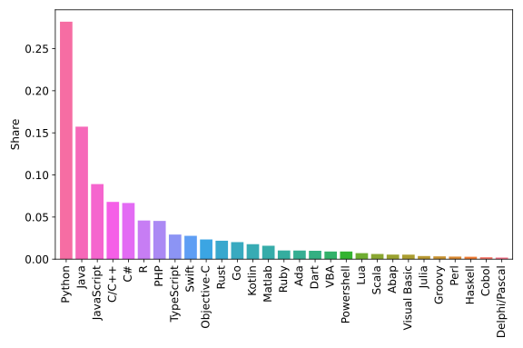
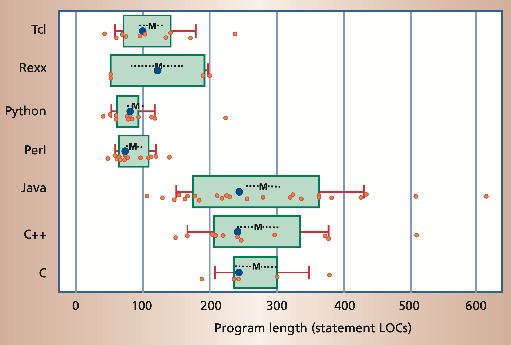
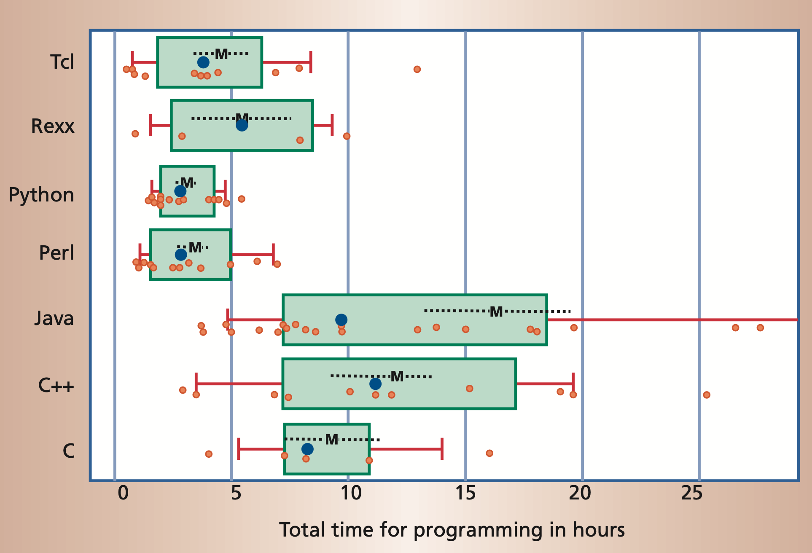

## Motivation

### Warum sollte ich als Chemiker:in programmieren lernen?

Im 21. Jahrhundert wird Programmieren zu einer immer wichtigeren Fähigkeit. Dies gilt
nicht nur für die Informatik, sondern auch für die Chemie, Physik, Biologie und viele
andere Wissenschaften. Die Kenntnis von Programmiersprachen kann einem helfen, eine
Vielzahl von Problemen effizienter zu lösen und repetitive Aufgaben zu automatisieren.
Darüber hinaus können Programmiersprachen verwendet werden, um Daten zu visualisieren
und zu analysieren, was ein wichtiger Bestandteil wissenschaftlicher Arbeit ist.

### Warum Python?

Python ist eine der am weitesten verbreiteten Programmiersprachen und besonders
anfängerfreundlich. Die folgende Abbildung zeigt die Beliebtheit einiger 
Programmiersprachen gemäß des <i>**P**opularit**Y** of **P**rogramming **L**anguage</i>
([PYPL](https://pypl.github.io/PYPL.html)) Indexes (Stand Jan. 2024).


*Beliebtheit von Programmiersprachen. Entnommen aus dem
[PYPL Index](https://pypl.github.io/PYPL.html).*

Ein Grund dafür ist, dass Python oft deutlich weniger Code als kompilierte Sprachen
wie Java oder C/C++ benötigt, um die gleichen Algorithmen zu implementieren.


*Programmlänge, gemessen in der Anzahl der nicht-kommentierten Codezeilen (LOC).*

Darüber hinaus ist es oft möglich, die gleiche Aufgabe mit einer 
Skriptsprache wie Python in deutlich kürzerer Zeit zu lösen als mit einer
kompilierten Sprache.


*Entwicklungszeit, um eine bestimmte Programmieraufgabe zu lösen, 
gemessen in Stunden.*

Auf der anderen Seite argumentieren einige Leute, dass Python eine langsame 
Sprache ist. Dies ist bis zu einem gewissen Grad wahr. Im folgenden 
betrachten wir ein Grund, warum Python als langsam angesehen wird, aber
auch, warum Python trotzdem sehr performant sein kann.


#### Python ist (auch) eine interpretierte Sprache

Python selbst ist ein C-Programm, das den Quellcode zuerst in sogenannten
[*Bytecode*](https://de.wikipedia.org/wiki/Bytecode) kompiliert und diesen
dann interpretiert und ausführt. Dies steht im Gegensatz zu kompilierten
Sprachen wie C, C++, Rust, etc., bei denen der Quellcode in Maschinencode
kompiliert wird. Der Compiler kann viele Optimierungen am Code vornehmen,
was zu einer kürzeren Laufzeit führt.

~~~admonish example title="Beispiel" collapsible=true
Dieses Verhalten kann anhand eines einfachen Beispiels gezeigt werden:
Eine naive Implementierung, die alle ungeraden Zahlen bis 100 Millionen
aufsummiert. Dies könnte wie folgt aussehen:

```python
s = 0
for i in range(100_000_000):
    if i % 2 == 1:
        s += i
```

Dieser Code benötigt auf dem Computer des Autors etwa 8 Sekunden.
Nun wird der gleiche Algorithmus in einer kompilierten Sprache 
(in diesem Fall *Rust*) implementiert, um den Einfluss des Compilers
zu zeigen.

```rust,no_run,no_playground
let mut s: usize = 0;
for i in 0..100_000_000 {
    if i % 2 == 1 {
        s += i;
    }
}
```

Dieser Code hat tatsächlich überhaupt keine Laufzeit und wird sofort 
ausgewertet. Der Compiler ist schlau genug zu verstehen, dass alles zur 
Compilezeit berechnet werden kann und ersetzt einfach den Wert für die 
Variable `s`. Dies zeigt nun, dass kompilierte Sprachen von Methoden 
profitieren können, über die interpretierte Sprachen aufgrund ihres 
Ansatzes einfach nicht verfügen. Allerdings haben wir bereits gesehen, 
dass kompilierte Sprachen in der Regel mehr Codezeilen und mehr Arbeit 
erfordern. Außerdem gibt es bei kompilierten Sprachen in der Regel viele 
weitere Konzepte zu lernen als bei interpretierten Sprachen.
~~~

#### Python kann sehr performant sein

Während dieser Veranstaltung werden wir oft Python-Bibliotheken wie NumPy 
oder SciPy für mathematische Algorithmen und insbesondere lineare Algebra 
verwenden. Diese Pakete bringen zwei wesentliche Vorteile. Einerseits 
ermöglichen sie die sehr einfache Verwendung komplizierter Algorithmen und
andererseits sind diese Pakete in kompilierten Sprachen wie C oder Fortran
geschrieben. Auf diese Weise können wir von den Leistungsvorteilen profitieren,
ohne eine potenziell kompliziertere Sprache lernen zu müssen.

