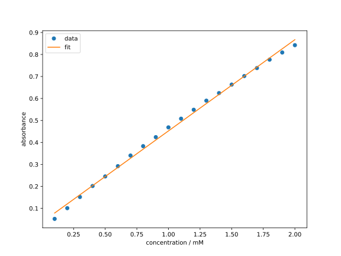
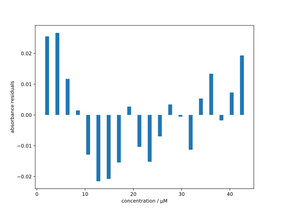

## Lineare Regression

Eines der einfachsten Modell der Regressionsanalyse ist das lineare
Modell, wobei der Abschätzer $\hat{f}(\beta; x_i)$ durch eine lineare
Funktion der Form
$$
  \hat{f}(\beta; x_i) = \beta_0 + \beta_1 x_i
  {{numeq}}{eq:linear_model}
$$
mit den skalaren Parametern $\beta_0$ und $\beta_1$ gegeben ist.
Die Regressionsanalyse mit dem linearen Modell wird als lineare
Regression bezeichnet.

### Theoretische Grundlagen

Setzen wir nun das lineare Modell nach Gl. {{eqref: eq:linear_model}}
in die Verlustfunktion der kleinsten Quadrate 
gemäß Gl. {{eqref: eq:least_squares_loss}} ein, erhalten wir
$$
  L(\beta; x, y) 
    = \sum_{i=1}^N\, (y_i - \beta_0 - \beta_1 x_i)^2 \,.
  {{numeq}}{eq:least_squares_loss_linear}
$$

Da unser Ziel darin besteht, die Parameter $\beta$ zu finden, welche die
Verlustfunktion minimieren (vgl. Gl. {{eqref: eq:least_squares_opt}}),
müssen zumindest die notwendigen Bedingungen dafür erfüllt
werden, d.h. die partiellen Ableitungen von $L$ nach $\beta_0$ und
$\beta_1$ müssen verschwinden:

$$
  \frac{\partial L}{\partial \beta_0} \stackrel{!}{=} 0 
  \quad \text{und} \quad
  \frac{\partial L}{\partial \beta_1} \stackrel{!}{=} 0 \,.
$$

Nach einer etwas länglichen aber einfachen 

```admonish derivation title="Herleitung" collapsible=true
Als erstes berechnen wir die partiellen Ableitungen von $L$ 
nach $\beta_0$ und $\beta_1$. Da das Differenzieren linear ist,
können wir die Summe in Gl. {{eqref: eq:least_squares_loss_linear}}
über die einzelnen Terme aufteilen:
$$
  \begin{align}
    \frac{\partial L}{\partial \beta_0} &= \frac{\partial}{\partial \beta_0} \sum_{i=1}^N\, (y_i - \beta_0 - \beta_1 x_i)^2 \\
    &= \sum_{i=1}^N\, \frac{\partial}{\partial \beta_0} (y_i - \beta_0 - \beta_1 x_i)^2 \\
    &= \sum_{i=1}^N\, -2 (y_i - \beta_0 - \beta_1 x_i) \,.
  \end{align}
$$
Genau so verfahren wir mit der Ableitung nach $\beta_1$ und erhalten
$$
  \frac{\partial L}{\partial \beta_1} = \sum_{i=1}^N\, -2 x_i (y_i - \beta_0 - \beta_1 x_i) \,.
$$

Setzen wir nun die Ableitungen gleich null, erhalten wir die
notwendigen Bedingungen für ein Minimum:
$$
  \begin{align}
    0 &= \sum_{i=1}^N\, -2 (y_i - \beta_0 - \beta_1 x_i) \\
    0 &= \sum_{i=1}^N\, -2 x_i (y_i - \beta_0 - \beta_1 x_i) \,.
  \end{align}
$$
Der Faktor $(-2)$ spielt keine Rolle, da der Ausdruck gleich null
gesetzt wird. Daher können wir ihn im Folgenden weglassen.

Durch einfaches Umstellen können wir die obigen Gleichungen als ein 
lineares Gleichungssystem in $\beta_0$ und $\beta_1$ schreiben:
$$
  \begin{align}
    \sum_{i=1}^N\, \beta_0 + \sum_{i=1}^N\, \beta_1 x_i &= \sum_{i=1}^N\, y_i \\
    \sum_{i=1}^N\, \beta_0 x_i + \sum_{i=1}^N\, \beta_1 x_i^2 &= \sum_{i=1}^N\, x_i y_i \,.
  \end{align}
$$
Da die Parameter $\beta_0$ und $\beta_1$ unabhängig von den Datenindizes
$i$ sind, können wir sie aus den Summen herausziehen und erhalten
$$
  \begin{align}
    \beta_0 N + \beta_1 \sum_{i=1}^N\, x_i &= \sum_{i=1}^N\, y_i \\
    \beta_0 \sum_{i=1}^N\, x_i + \beta_1 \sum_{i=1}^N\, x_i^2 &= \sum_{i=1}^N\, x_i y_i \,,
  \end{align}
$$
wobei wir $\sum_{i=1}^N\, 1 = N$ genutzt haben. 
Dieses Gleichungssystem ist äquivalent zu
der Matrixgleichung in Gl. {{eqref: eq:least_squares_linear_params}}.
```

erhalten wir die Matrixgleichung für die Parameter $\beta_0$ und $\beta_1$:
$$
  \underbrace{
  \begin{pmatrix}
    \displaystyle N & \displaystyle \sum_{i=1}^N\, x_i \\[1.5em]
    \displaystyle \sum_{i=1}^N\, x_i & \displaystyle \sum_{i=1}^N\, x_i^2
  \end{pmatrix}}_{\displaystyle \bm{A}}
  \,
  \underbrace{
  \begin{pmatrix}
    \displaystyle \beta_0 \\[1.5em]
    \displaystyle \beta_1
  \end{pmatrix}
  \vphantom{
    \begin{pmatrix}
      \displaystyle \sum_{i=1}^N\, y_i \\[1.5em]
      \displaystyle \sum_{i=1}^N\, x_i y_i
    \end{pmatrix}
  }
  }_{\displaystyle \vec{x}}
  =
  \underbrace{
  \begin{pmatrix}
    \displaystyle \sum_{i=1}^N\, y_i \\[1.5em]
    \displaystyle \sum_{i=1}^N\, x_i y_i
  \end{pmatrix}}_ {\displaystyle \vec{b}} \,.
  {{numeq}}{eq:least_squares_linear_params}
$$
Die Lösung dieses Gleichungssystems liefert uns die optimalen
Parameter $\beta_0$ und $\beta_1$ für das lineare Modell.

Die (zumindest formale) Lösung des Gleichungssystems 
{{eqref: eq:least_squares_linear_params}} ist
$\vec{x} = \bm{A}^{-1} \vec{b}$, mit der Inversen der Matrix
$\bm{A}$. Eine Matrix ist genau dann invertierbar, wenn ihre
Determinante ungleich null ist. Die Determinante der Systemmatrix
$\bm{A}$ ist
$$
  \begin{align}
    \det(\bm{A}) &= N \sum_{i=1}^N\, x_i^2 - \left(\sum_{i=1}^N\, x_i\right)^2 \\
    &= N^2 \left[ 
      \frac{1}{N} \sum_{i=1}^N\, x_i^2 - \left(\frac{1}{N} \sum_{i=1}^N\, x_i\right)^2
    \right] \\
    &= N^2 \left[ 
      \frac{1}{N} \sum_{i=1}^N\, x_i^2 - \bar{x}^2
    \right] \\
    &= N^2 \left[ \frac{1}{N} \sum_{i=1}^N\, (x_i - \bar{x})^2 \right] \,,
  \end{align}
$$
wobei wir die Abkürzung $\bar{x} = \frac{1}{N} \sum_{i=1}^N\, x_i$ für den 
Mittelwert der $x_i$ eingeführt haben. Hätten wir nur einen einzigen 
Datenpunkt, wäre der Mittelwert gleich dem einzigen Datenpunkt und die 
Determinante der Systemmatrix gleich null. Das bedeutet, dass die 
Matrix $\bm{A}$ nicht invertierbar ist und wir keine eindeutige Lösung für 
das lineare Modell erhalten. Erst ab zwei verschiedenen Datenpunkten ist 
das Gleichungssystem {{eqref: eq:least_squares_linear_params}} eindeutig
lösbar.

Nun wollen wir mit Hilfe der Gl. {{eqref: eq:least_squares_linear_params}}
die lineare Regression für ein einfaches Beispiel implementieren.

### Implementierung
Betrachten wir die folgenden Messdaten[^1] der Lambert-Beer-Beziehung 
für Methylenblau in Wasser bei verschiedenen Konzentrationen $c$ und den 
zugehörigen Absorbanzen $A$, gemessen bei $610\ \mathrm{nm}$
mit einer Schichtdicke $d$ von 1 cm:

| $c$ / &micro;M | $A$      | $c$ / &micro;M | $A$      |
|:--------------:|:--------:|:--------------:|:--------:|
| 2.125          | 0.0572   | 23.38          | 0.8242   |
| 4.250          | 0.1391   | 25.50          | 0.9130   |
| 6.375          | 0.2049   | 27.63          | 1.0043   |
| 8.500          | 0.2754   | 29.75          | 1.0809   |
| 10.63          | 0.3420   | 31.88          | 1.1511   |
| 12.75          | 0.4139   | 34.00          | 1.2483   |
| 14.88          | 0.4956   | 36.13          | 1.3373   |
| 17.00          | 0.5815   | 38.25          | 1.4027   |
| 19.13          | 0.6806   | 40.38          | 1.4927   |
| 21.25          | 0.7481   | 42.50          | 1.5853   |

Bevor wir fortfahren können, müssen wir die Daten irgendwie
in Python importieren. Der einfachste Weg für so einen kleinen Datensatz
ist die manuelle Eingabe. 
```python
{{#include ../codes/01-regression/linreg_lambert_beer.py:data_list}}
```
Hier haben wir die Daten in den Variablen `concentrations` und `absorbances`
der Typ *List* (Liste) definiert. Das erkennt man an der Verwendung der eckigen
Klammern `[]` und dem Komma `,` zwischen den einzelnen Werten. Mit dem 
Gleichheitszeichen `=` weisen wir den Variablen die Werte zu.

Obwohl Python standardmäßig schon einige mathematische Funktionen für 
Listen bereitstellt, hat das Paket `numpy` noch mehr sehr nützliche 
Operationen für solchen Datenstrukturen. Daher importieren wir `numpy`
und konvertieren die Listen in den Datentyp *numpy-array*.
```python
{{#include ../codes/01-regression/linreg_lambert_beer.py:data_array}}
```
Da `numpy` etwas länger zu schreiben ist, verwenden wir den Alias `np`,
definiert durch `import numpy as np`. Ab sofort können wir Inhalte 
dieses Pakets mit `np` ansprechen. In den folgenden Zeilen verwenden
wir die Funktion `np.array` um die Listen in Arrays zu konvertieren.
Hier wird es deutlich, dass das Gleichheitszeichen `=` beim Programmieren
eine andere Bedeutung hat als in der Mathematik. Während in der Mathematik
das Gleichheitszeichen eine Äquivalenz zwischen zwei Seiten ausdrückt,
stellt dieses in der Programmierung eine Zuweisung dar. Deshalb ist es 
hier möglich, die gleiche Variablename für die Arrays zu verwenden, da
die rechte Seite des Gleichheitszeichens zuerst ausgewertet wird und dann
der Wert der rechten Seite der Variablen auf der linken Seite zugewiesen
wird.

Als nächstes wollen wir die Elemente von $\bm{A}$ und $\vec{b}$ in
Gl. {{eqref: eq:least_squares_linear_params}} berechnen. Dafür stellen wir 
erstmal sicher, dass unsere Datenarrays gleich lang sind. Danach können wir
die Elemente mit Hilfe der `np.sum`-Funktion berechnen.

```python
{{#include ../codes/01-regression/linreg_lambert_beer.py:create_system_array_elements}}
```
Hier haben wir die 
[built-in Funktion](https://docs.python.org/3/library/functions.html)
`len` verwendet, um die Länge der Arrays zu bestimmen. Die Funktion
`np.sum` berechnet die Summe aller Elemente in einem Array. Mit dem
Stern `*` ist die Multiplikation gemeint. Die Verwendung von `*` zwischen
zwei Arrays führt zu einer elementweisen Multiplikation. Der 
Doppelstern `**` bedeutet in Python die Potenzierung. Hier wird also
das Array `concentrations` elementweise quadriert.

```admonish info title="Info für Fortgeschrittene" collapsible=true
Die Operatoren `*` und `**` können auch als unäre Operatoren, also 
Operatoren für nur ein Argument, im Gegensatz zu binären Operatoren 
wie die Multiplikation, die zwei Argumente benötigt, verwendet werden.
Als unärer Operator haben sie dann eine andere Bedeutung. Die Interessierten,
die schon etwas Erfahrung in der Programmierung haben, können sich die
details z.B. [hier](https://book.pythontips.com/en/latest/args_and_kwargs.html)
nachlesen.
```

Nun können wir die Systemmatrix $\bm{A}$ und den Vektor $\vec{b}$
zusammenstellen:
```python
{{#include ../codes/01-regression/linreg_lambert_beer.py:create_system_arrays}}
```

Beachte Sie, dass für die Erstellung einer Matrix (bzw. eines sog. *2D-Arrays*)
eine Liste von Listen verwendet wird. Die innere Liste entspricht einer
Zeile der Matrix. Die äußere Liste enthält die Zeilen der Matrix. Jetzt können
wir endlich das Gleichungssystem {{eqref: eq:least_squares_linear_params}}
lösen, um die optimalen Parameter $\beta_0$ und $\beta_1$ zu erhalten:
```python
{{#include ../codes/01-regression/linreg_lambert_beer.py:solve_system}}
```
Die Funktion 
[`np.linalg.solve`](https://numpy.org/doc/stable/reference/generated/numpy.linalg.solve.html)
löst (numerisch) ein lineares Gleichungssystem. Mit der `print`-Funktion 
geben wir die Lösung anschließend aus.

```admonish note title="Hinweis"
Eine analytische Lösung des Gleichungssystems 
{{eqref: eq:least_squares_linear_params}} ist möglich, da die Systemmatrix
$\bm{A}$ nur $2 \times 2$ groß ist und damit analytisch invertierbar. 
```

Wenn man schon weiß, welche Werte $\beta_0$ und $\beta_1$ haben sollen und 
nur den Algorithmus testen möchte, kann man die Verifikation z.B. wie folgt
durchführen:
```python
{{#include ../codes/01-regression/linreg_lambert_beer.py:beta_verification}}
```
Hier haben wir zuerst den Array `beta` mit eckigen Klammern `[]` *indexiert*.
Beachten Sie, dass die Indizierung in Python bei 0 beginnt. Das bedeutet, dass
$\beta_0$ dem 0-ten Eintrag und $\beta_1$ den ersten Eintrag des Arrays `beta`
entspricht. Anschließend haben wir die Werte von $\beta_0$ und $\beta_1$
mit Referenzwerten verglichen. 
```admonish note title="Hinweis"
Es wurden nicht die exakten Werte mit `==` verglichen, da einerseits 
`float`-Zahlen ([Gleitkommazahlen](https://de.wikipedia.org/wiki/Gleitkommazahl))
nicht exakt dargestellt werden können und andererseits die numerische
Lösung des Gleichungssystems nicht exakt sein muss. Deshalb haben wir
die Funktion 
[`np.isclose`](https://numpy.org/doc/stable/reference/generated/numpy.isclose.html)
verwendet, die die Werte mit einer (in diesem Fall voreingestellten) 
Toleranz vergleicht.
```

Das Lambert-Beer-Gesetz besagt, dass die Absorption $A$ linear von der
Konzentration $c$ abhängt mit der Proportionalitätskonstante 
$\varepsilon d$, also
$$
  A = \varepsilon d c \,.
$$
Das molare Extinktionskoeffizient $\varepsilon$ kann also aus dem
linearen Parameter $\beta_1$ berechnet werden als
$$
  \varepsilon = \beta_1 / d = 0.038\ \mathrm{{\mu M}^{-1}\cdot cm^{-1}} 
    = 38000\ \mathrm{M^{-1}\cdot cm^{-1}} \,.
$$

Jetzt haben wir die optimalen Parameter $\beta_0$ und $\beta_1$ für den
obigen Datensatz berechnet. Wie soll man wissen, wie gut die lineare
Regression ist? Dafür gibt es verschiedene mathematische Gütekriterien,
die wir hier aber erstmal nicht betrachten. Stattdessen wollen wir die
optimalen Parameter grafisch darstellen und die Qualität der Regression
visuell beurteilen.

### Visualisierung
Zur Visualisierung der optimalen linearen Regression verwenden wir das
Python-Paket `matplotlib`. Hier importieren wir das Untermodul `pyplot`
mit dem Alias `plt`:
```python
{{#include ../codes/01-regression/linreg_lambert_beer.py:import_mpl}}
```

Für die graphische Darstellung mit `matplotlib` benötigen wir immer
die Objekte `Figure` und `Axes`. Diese können wir mit der Funktion
[`plt.subplots`](https://matplotlib.org/stable/api/_as_gen/matplotlib.pyplot.subplots.html)
erstellen:
```python
{{#include ../codes/01-regression/linreg_lambert_beer.py:make_axes}}
```
Wir haben hier als Argument `figsize=(8, 6)` übergeben, welches die Größe
der Abbildung in Zoll angibt. Die Größe der Abbildung ist aber nicht
in Stein gemeißelt und kann je nach Bedarf angepasst werden.

Nun wollen wir die Messdaten als Punkte und die lineare Regression als
Linie in das Diagramm eintragen. Dafür verwenden wir die Funktion
[`ax.plot`](https://matplotlib.org/stable/api/_as_gen/matplotlib.axes.Axes.plot.html):
```python
{{#include ../codes/01-regression/linreg_lambert_beer.py:plot_data}}
```
Für die Messdaten haben wir das Argument `o` verwendet, damit diese als
Punkte dargestellt werden. Andere 
[Marker](https://matplotlib.org/stable/api/markers_api.html)
wie z.B. `s` für Quadrate oder `x` für Kreuze können auch verwendet werden.
Ohne Angabe dieses Arguments werden die Daten als Linie dargestellt.
Bei beiden Aufrufen von `ax.plot` haben wir die Argumente `label` verwendet.
Diese dienen dazu, die Linien in der Legende zu benennen. 

Für die Vollständigkeit wollen wir auch die Achsen noch beschriften und 
eine Legende hinzufügen:
```python
{{#include ../codes/01-regression/linreg_lambert_beer.py:customize_ax}}
```

Die Funktionen `ax.set_xlabel` und `ax.set_ylabel` akzeptieren einen
*str* (String, Zeichenkette) als Argument, der als Achsenbeschriftung
dient. Die Funktion `ax.legend` fügt eine Legende hinzu. Ruft man sie
ohne Argumente auf, wird die Legende aus den `label`-Argumenten der
`ax.plot`-Funktionen automatisch generiert.

Nachdem alle Elemente des Diagramms eingefügt wurden, können wir die
Abbildung mit der Funktion `plt.show` anzeigen lassen:
```python
{{#include ../codes/01-regression/linreg_lambert_beer.py:show_plot}}
```

Wenn das Programm erfolgreich ausgeführt wird, sollte ein Diagramm
wie das Folgende erscheinen:


Dieses Diagramm zeigt uns die Ergebnisse der linearen Regression, auch wenn 
man über die ästhetische Gestaltung des Diagramms streiten kann. Im Laufe
dieses Kurses werden wir noch mehr Funktionalitäten von `matplotlib` 
kennenlernen, die uns helfen, Elemente des Diagramms dem persönlichen
Geschmack entsprechend zu gestalten.

Auf den ersten Blick scheint die Regressionsgerade sehr gut zu den Messdaten
zu passen. Um den Unterschied zwischen den Messdaten und der Regressionsgerade
deutlicher zu machen, können wir die Residuen, also die Differenz zwischen
den Messdaten und der Regressionsgerade, in einem weiteren Diagramm darstellen.
```python
{{#include ../codes/01-regression/linreg_lambert_beer.py:plot_residuals}}
```
Nach dem Berechnen und Speichern der Residuen in der Variablen `residuals`
wurden ein weiteres `Figure`- sowie `Axes`-Objekt erstellt. Die Residuen
wurden in ein Balkendiagramm dargestellt, welches mit der Methode `ax2.bar`
erstellt werden kann. Das Diagramm sieht dann wie folgt aus:


Jetzt kann man erkennen, dass bei niedrigen und hohen Konzentrationen die
Abweichung positiv ist, während sie bei mittleren Konzentrationen negativ ist.
Das könnte auf eine leichte positive Krümmung der Daten hinweisen, die mit
dem linearen Modell nicht erfasst wird. Eine Zuordnung dieses Verhaltens
zu einer systematischen oder zufälligen Abweichung
bedarf allerdings in der Regel einer tieferen Analyse. Tatächlich liegt hier 
in den Daten eine leichte Nichtlinearität vor, welches die 
[Abweichung vom Lambert-Beer-Gesetz](https://chem.libretexts.org/Bookshelves/Analytical_Chemistry/Instrumental_Analysis_(LibreTexts)/13%3A_Introduction_to_Ultraviolet_Visible_Absorption_Spectrometry/13.02%3A_Beer%27s_Law)
v.a. bei hohen Konzentrationen demonstriert. Wer sich für die genaue Erklärung dieser
Abweichung von Methylenblau in Wasser interessiert, kann sich z.B. die
Publikation
[A. Fernández-Pérez, T. Valdés-Solís, G. Marbán, *Dyes and Pigments* **2019**, *161*, 448&ndash;456](https://www.sciencedirect.com/science/article/pii/S014372081831845X)
durchlesen.
Ob die lineare Regression in diesem Fall sinnvoll ist, hängt von der
gewünschten Genauigkeit der Modellierung ab.

~~~admonish tip title="Tipp für den Programmierstil"
Hier haben wir die `import` Befehle in den jeweiligen Abschnitten platziert, 
um die Abhängigkeiten der verschiedenen Teile des Skripts zu verdeutlichen.
Der resultierende Code kann ohne Fehler interpretiert werden.
Allerdings ist es in Python üblich, die Importe am Anfang des Skripts zu
platzieren, also 
```python
import numpy as np
import matplotlib.pyplot as plt

# Rest des Skripts
```
~~~

---
[^1]: Die Autoren bedanken sich bei Dr. Hans-Christian Schmitt für die Bereitstellung der Daten.

### Übung

#### Aufgabe 1.1: Lineare Regression

{{#include ../psets/01.md:aufgabe_1}}

