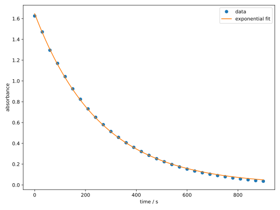
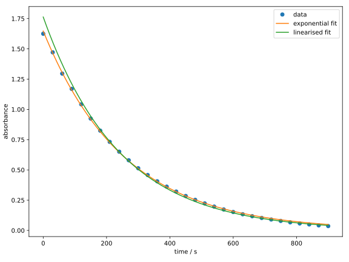
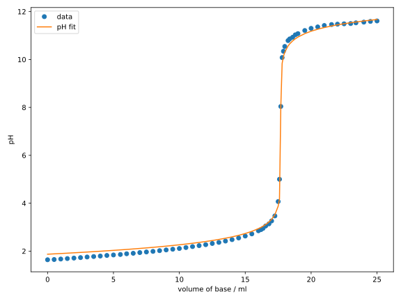
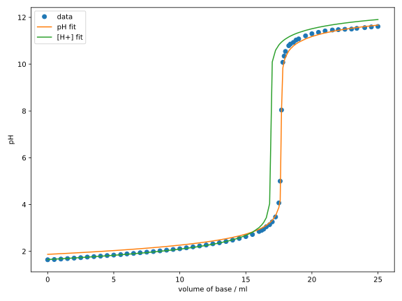

## Nichtlineare Regression

Wir haben in den vorherigen Abschnitten die lineare Regression kennengelernt,
die uns erlaubt, lineare Zusammenhänge zwischen Variablen zu modellieren.
Zwar sind viele physikalische Zusammenhänge linear, oder können als solche 
formuliert werden, aber es gibt auch viele nichtlineare Zusammenhänge, 
die wir modellieren wollen. Im Rahmen der Methode der kleinsten Quadrate 
ersetzen wir dazu einfach das Modell $\hat{f(\beta; x)}$ in 
Gl. {{eqref: eq:least_squares_opt}} durch eine nichtlineare Funktion. 
Allerdings ist in diesem Fall ist eine analytische Lösung wie 
Gl. {{eqref: eq:least_squares_linear_params}}
nicht immer möglich, weshalb numerische Optimierungsverfahren verwendet werden 
müssen.

### Anwendung

#### Reaktionskinetik
Sie haben im Physikalisch-Chemischen Praktikum sicherlich den Versuch
"Bestimmung der Geschwindigkeitskonstante und der Aktivierungsenergie 
der Mangan(III)-Trioxalat-Zersetzungsreaktion", auch "Mn-Zerfall" genannt,
durchgeführt. Dort haben Sie die Absorbanz $A$ in Abhängigkeit der Zeit $t$ gemessen und
durch fitten der Messdaten die Geschwindigkeitskonstante $k$ bestimmt. Die zugrungeliegende
Beziehung ist exponentiell:
$$
  A(t) = A_0\, \eu^{-k t}
$$
mit dem Parametern $A_0$ und $k$, d.h. $\beta = (A_0, k)^\intercal$.

Hier gilt also $A(t) = \hat{f}(\beta; t)$ und wir können mit Hilfe der
Verlustfunktion der kleinsten Quadrate das Regressionsproblem als das folgende
Optimierungsproblem formulieren:
$$
  \beta^{* } = \argmin{\beta\in\mathbb{R}^2} \sum_{i=1}^N\, (A_i - A_0\, \eu^{-k t_i})^2
  {{numeq}}{eq:least_squares_exp_opt}
$$

Wir importieren als erstes wieder die benötigten Module und Bibliotheken:
```python
{{#include ../codes/01-regression/nonlinreg_mn.py:import}}
```

Anschließend müssen wir die Daten in Form von Arrays bereitstellen. Weil wir hier 
doch relativ viele Datenpunkte haben, wird das manuelle Eintippen
ziemlich mühsam. Deshalb verwenden wir die Funktion 
[`np.loadtxt`](https://numpy.org/doc/stable/reference/generated/numpy.loadtxt.html),
um die Daten aus einer Textdatei zu lesen.
Die Textdatei `mn_decay.txt` (<a href="../codes/01-regression/mn_decay.txt" download>hier</a> herunterladen) enthält zwei Spalten, welche die Werte für Zeit $t$ und
Absorbanz $A$ enthalten. Die ersten Zeilen der Datei sehen wie folgt aus:
```txt
{{#include ../codes/01-regression/mn_decay.txt::10}}
```

Zum Einlesen der Daten benötigt die Funktion `np.loadtxt` den Dateinamen:
```python
{{#include ../codes/01-regression/nonlinreg_mn.py:read_data}}
```
In diesem Fall liegt die Textdatei im gleichen Verzeichnis wie das ausführende Skript. 
Wenn Sie die Textdatei in einem anderen Verzeichnis haben, müssen Sie den Pfad
entsprechend anpassen. Das optionale Argument `unpack=True` sorgt dafür, dass die 
Spalten der Datei einzeln ausgegeben und als Arrays `time` und `absorbance` gespeichert
werden. Würden wir `unpack=False` setzen, welches auch der Defaultwert ist,
würde die Funktion ein 2D-Array zurückgeben, in dem die Spalten zusammengefasst sind.
Die erste Zeile dieser Datei beginnt mit einem Kommentarzeichen `#`, was
`np.loadtxt` dazu veranlasst, diese Zeile zu ignorieren. 

```admonish note title="Hinweis"
Mit dem optionalen Argument `comments` können wir das Zeichen, welches für Kommentare
verwendet wird, ändern. 
```

Nun können wir das Modell definieren:
```python
{{#include ../codes/01-regression/nonlinreg_mn.py:exp_model}}
```
Obwohl `t` ein Array und `k` ein Skalar ist, funktioniert die Multiplikation
`-k * t` elementweise. In diesem Fall wird auch `k` als ein Array interpretiert, was als
[Broadcasting](https://numpy.org/doc/stable/user/basics.broadcasting.html)
bezeichnet wird. Die Funktion `np.exp` berechnet den elementweisen Exponential
des Arrays. Das Ergebnis ist demnach wieder ein Array, welches wir mit dem Skalar `a0`
multiplizieren.

Anschließend definieren wir die Objektivfunktion in 
Gl. {{eqref: eq:least_squares_exp_opt}}:
```python
{{#include ../codes/01-regression/nonlinreg_mn.py:objective_function}}
```

Wir verwenden nun die `minimize`-Funktion, um dieses 
Optimierungsproblem zu lösen:
```python
{{#include ../codes/01-regression/nonlinreg_mn.py:optimise}}
```
Hier haben wir das Nelder-Mead-Verfahren mit den Startparametern
$A_0^0 = 1$ und $k^0 = 0.01$ angewandt. Zum Ausgeben des Ergebnisses mit dem 
`print`-Befehl haben wir vor der Zeichenkette jeweils ein `f` gesetzt. 
Das signalisiert, dass die Zeichenkette ein sog. 
[f-string](https://realpython.com/python-f-strings/#doing-string-interpolation-with-f-strings-in-python)
ist, in welchen wir Variablen mit geschweiften Klammern `{}` einbetten können.
Tatsächlich können f-Strings noch einiges mehr, was wir in Zukunft
noch sehen werden.
Die optimierten Parameter sollten die folgenden Werte haben:
```python
{{#include ../codes/01-regression/nonlinreg_mn.py:verification}}
```

Zum Schluss können wir die Ergebnisse plotten:
```python
{{#include ../codes/01-regression/nonlinreg_mn.py:plot}}
```
Sie sollten die meisten Funktionen im obigen Codeblock aus 
Kap. [1.2](02-linear_regression.md) kennen. Ein Unterschied ist die 
Verwendung der Funktion
[np.linspace](https://numpy.org/doc/stable/reference/generated/numpy.linspace.html),
welche Zeiten zwischen den Messpunkten generiert, sodass wir
das Regressionsmodell für eine Interpolation verwenden können.
Diese Funktion akzeptiert drei Argumente: den Startwert, den Endwert und
die Anzahl der zu generierenden Punkte. Dann produziert sie ein Array
mit gleichmäßig verteilten Werten zwischen dem Start- und Endwert.

Ein weitere neue Funktion ist
`fig.tight_layout()`, die eine automatische Anpassung des Layouts des Plots
vornimmt. Wir erkennen aus dem folgendem Diagramm, dass die exponentielle Funktion die Daten
sehr gut beschreibt.


Einige von Ihnen würden vielleicht fragen, warum wir nicht die Funktion
linearisiert haben, um die lineare Regression zu verwenden, was eine
berechtigte Frage ist. Tatsächlich ist es möglich, die Funktion zu linearisieren, indem
wir beide Seiten der Gleichung logarithmieren:
$$
  \ln(A(t)) = \ln(A_0) - k t
$$
Eine lineare Regression mittels dieser Gleichung liefert allerdings nicht die
gleichen Ergebnisse, wie Sie im folgenden Diagramm sehen können:


Als freiwillige Übung können Sie versuchen, das obige Diagramm reproduzieren. 
Es ist unschwer zu erkennen, dass der linearisierte Fit schlechter zu den
Daten passt. Das liegt daran, dass die lineare Regression die Fehler in der
Absorbanz durch das Logarithmieren nicht gleichmäßig behandelt. Die dadurch
erhaltenen Parameter
```python
{{#include ../codes/01-regression/nonlinreg_mn.py:verification_lin}}
```
sind durchaus unterschiedlich zu den vorherigen. 
Deshalb ist es oft notwendig, nichtlineare Regressionen an den urprünglichen
Daten durchzuführen, anstatt lineare Modelle mit linearisierten Daten zu
verwenden.

#### Titrationskurve

Im Analytikpraktikum haben Sie sicherlich ebenfalls eine Titration einer starken Base gegen
eine starke Säure mit einem pH-Meter durchgeführt. Damals mussten Sie die
Werte wahrscheinlich auf einem Millimeterpapier auftragen und anhand der Position des 
pH-Sprungs den Äquivalenzpunkt bestimmen. Das ist einerseits mühsam und
andererseits ungenau, da nur die wenigen Messdaten in der Nähe des steilen Anstiegs
berücksichtigt werden. 

Da die pH-Kurve eine Funktion in Abhängigkeit der zugegebenen Menge an
Base ist, können wir sie mithilfe der nichtlinearen Regression modellieren
und den Äquivalenzpunkt mit deutlich höherer Genauigkeit bestimmen. 

Die $\mathrm{H^+}$-Konzentration während der Titration einer starken
Base gegen eine starke Säure ist (unter gewissen Näherungen) gegeben durch:
$$
  [\mathrm{H^+}] = \frac{\Delta + \sqrt{\Delta^2 + 4K_w}}{2}\,,
  {{numeq}}{eq:titration_sasb_hplus}
$$
wobei $\Delta = [\mathrm{A^-}] - [\mathrm{B^+}]$ die Konzentrationsdifferenz
zwischen den Gegenionen der Säure $\mathrm{A^-}$ und der Base $\mathrm{B^+}$
ist. $K_w$ ist das Ionenprodukt des Wassers.

Da starke Säuren und Basen vollständig dissoziieren, lassen sich die
Konzentrationen ihrer Gegenionen wie folgt ausdrücken:
$$
  \begin{align}
    [\mathrm{A^-}] &= \frac{n_\mathrm{A}}{V} 
      = \frac{c_\mathrm{A}^0 V^0}{V^0 + V_\mathrm{B}} \\
    [\mathrm{B^+}] &= \frac{n_\mathrm{B}}{V}
      = \frac{c_\mathrm{B}^0 V_\mathrm{B}}{V^0 + V_\mathrm{B}}\,,
  \end{align}
$$
wobei $c_\mathrm{A}^0$ und $c_\mathrm{B}^0$ die Konzentrationen der zu 
analysierenden Säure und der zugegebenen Base sind, $V^0$ das Anfangsvolumen
der Probelösung und $V_\mathrm{B}$ das Volumen der zugegebenen Base ist.

Der pH-Wert lässt sich aus der $\mathrm{H^+}$-Konzentration berechnen:
$$
  \mathrm{pH} = -\lg \left( \frac{[\mathrm{H^+}]}{1\ \mathrm{M}} \right)\,.
  {{numeq}}{eq:titration_sasb_ph}
$$

Fasst man die Gleichungen {{eqref: eq:titration_sasb_hplus}} und
{{eqref: eq:titration_sasb_ph}} in einer Funktion zusammenfassen, so erhalten
wir das Modell $f(\beta; V_\mathrm{B})$, wobei 
$\beta = (c_\mathrm{A}^0, V^0)^\intercal$.

Wir implmentieren zunächst das Modell und die Objektivfunktion:
```python
{{#include ../codes/01-regression/nonlinreg_titration.py:titration_model}}
```
```python
{{#include ../codes/01-regression/nonlinreg_titration.py:objective_function}}
```
Obwohl die Funktion des pH-Werts relativ kompliziert ist, können wir durch
die Definition von Zwischenvariablen, wie in 
Gl. {{eqref: eq:titration_sasb_hplus}}, die Implementierung der Funktion in Python
deutlich vereinfachen. Die Objektivfunktion ist fast identisch zu der des 
Mn-Zerfalls, wobei der wesentliche Unterschied die Ersetzung unseres Modells darstellt.

Genau so wie im vorherigen Beispiel lesen wir die Daten aus einer Textdatei ein:
```python
{{#include ../codes/01-regression/nonlinreg_titration.py:read_data}}
```
Zusätzlich haben wir hier die Konzentration der Maßlösung `C0_B` definiert.
Gemäß der allgemeinen Konvention sollen alle Konstanten in Python in Großbuchstaben
geschrieben werden. Anschließend können wir die nichtlineare Regression
durchführen und die Ergebnisse plotten:
```python
{{#include ../codes/01-regression/nonlinreg_titration.py:optimise}}
```
```python
{{#include ../codes/01-regression/nonlinreg_titration.py:plot}}
```
Aus den gefitteten Parametern wurde eine Stoffmenge des Analyts von 
$n_\mathrm{A}^0 = 1.7698\ \mathrm{mmol}$ bestimmt. Das entsprechende Diagramm sollte wie folgt aussehen:

Obwohl der Fit am Anfang und am Ende der Kurve nicht perfekt ist,
ist die Übereinstimmung in der Nähe des Äquivalenzpunkts sehr gut.

Vielleicht haben Sie sich gefragt, warum die optimierten Parameter $c_\mathrm{A}^0$
und $V^0$ hier nicht explizit aufgeführt sind, sondern lediglich ihr Produkt. 
```admonish warning title="Warnung: korrelierte Parameter"
Die Modellparameter $\beta$ können korreliert sein, d.h., die Änderung 
zweier oder mehrerer Parameter führt zu einer ähnlichen Änderung der
Objektivfunktion. Dieser Umstand kann auf sog. *overfitting* der Daten durch das Modell hinweisen. 
In diesem Fall ist es ratsam zu prüfen, ob das Modell nicht auch mit weniger Parametern auskommt.

In unserem Fall sind die Parameter $c_\mathrm{A}^0$ und $V^0$ korreliert, 
da es die Stoffmenge des Analyts $n_\mathrm{A}^0$ ist, die eine wesentliche Auswirkung
auf die Titrationskurve hat. Das Anfangsvolumen $V^0$ dagegen
spielt nur eine untergeordnete Rolle, weshalb das Produkt $c_\mathrm{A}^0 V^0$ näherungsweise als ein 
Parameter dient. Nichtsdestotrotz ist $V^0$ hier ein wichtiger Parameter, da
das es auf der gleichen Größenordnung wie $V_\mathrm{B}$ liegt und 
die Verdünnung daher nicht vernachlässigt werden kann. Da man aber für  
die Titrationsanalyse nur das Produkt $c_\mathrm{A}^0 V^0$ kennen muss, 
stört uns die Korrelation der Parameter in diesem Fall nicht.
```

```admonish tip title="Tipp"
Ändern Sie die Startparameter und beobachten Sie, wie sich die
optimierten Parameter ändern, aber ihr Produkt nahezu konstant bleibt.
```

Als letztes betonen wir nochmal, dass es oft wichtig ist,
die Regression an den Originaldaten durchzuführen und keine
transformierten Daten zu verwenden. Im Fall der Säure-Base-Titration könnte man z.B. auf 
die Idee kommen, $[\mathrm{H^+}]$ anstatt des pH-Werts zu fitten. Aus den gleichen
Gründen wie zuvor ist das allerdings nicht sinnvoll: Da der gleiche Fehler auf der pH-Skala zu größeren
Fehlern bei höheren $\mathrm{H^+}$-Konzentrationen und kleineren Fehlern
bei niedrigeren $\mathrm{H^+}$-Konzentrationen führt, werden
die Datenpunkte bei höheren $\mathrm{H^+}$-Konzentrationen besser
angepasst. Das führt zu einer Verzerrung der Ergebnisse, wie im folgenden
Diagramm zu sehen ist:

Als freiwillige Übung können Sie versuchen, das obige Diagramm reproduzieren. 
Man erkennt, dass die Regression an $[\mathrm{H^+}]$
die früheren Datenpunkte bevorzugt und dadurch den Äquivalenzpunkt
völlig falsch bestimmt wird. 

---

### Übung

#### Aufgabe 1.3
<!--
{{#include ../psets/01.md:aufgabe_3}}
-->

