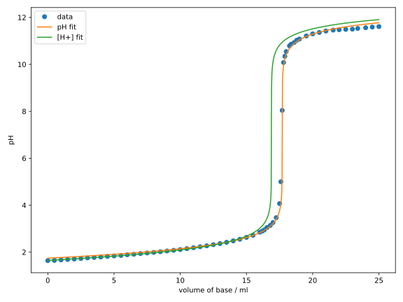

## Nichtlineare Regression

Nun sind wir in der Lage, auch nichtlineare Zusammenhänge zu modellieren. 
Die nichtlineare Regression ist nicht viel anders als die lineare Regression. 
Im Rahmen der kleinsten Quadrate setzen wir einfach das Modell
$\hat{f(\beta; x)}$ in Gl. {{eqref: eq:least_squares_opt}} ein. Nur in 
diesem Fall ist eine analytische Lösung wie 
Gl. {{eqref: eq:least_squares_linear_params}}
nicht mehr möglich, weshalb numerische Optimierungsverfahren verwendet werden 
müssen.

### Anwendung

#### Reaktionskinetik
Wir erinnern uns an den Versuch im Physikalisch-Chmischen Praktikum:
"Bestimmung der Geschwindigkeitskonstante und der Aktivierungsenergie 
der Mangan(III)-Trioxalat-Zersetzungsreaktion", auch "Mn-Zerfall" genannt.
Dort haben wir die Absorbanz $A$ in Abhängigkeit der Zeit $t$ gemessen und
dadurch die Geschwindigkeitskonstante $k$ bestimmt. Die zugrunge liegende
Beziehung ist exponentiell:
$$
  A(t) = A_0\, \eu^{-k t}
$$
mit dem Parametern $A_0$ und $k$, d.h. $\beta = (A_0, k)^\intercal$.

Hier gilt also $A(t) = \hat{f}(\beta; t)$ und wir können mit Hilfe der
Verlustfunktion der kleinsten Quadrate das Regressionsproblem als das folgende
Optimierungsproblem formulieren:
$$
  \beta^{* } = \argmin{\beta\in\mathbb{R}^2} \sum_{i=1}^N\, (A_i - A_0\, \eu^{-k t_i})^2
  {{numeq}}{eq:least_squares_exp_opt}
$$

Wir importieren als erstes wieder die benötigten Libraries:
```python
{{#include ../codes/01-regression/nonlinreg_mn.py:import}}
```

Danach müssen wir die Daten in Form von Arrays bereitstellen. Weil wir dieses 
Mal doch relativ viele Datenpunkte haben, wird das manuelle Eintippen
ziemlich mühsam. Deshalb verwenden wir die Funktion 
[`np.loadtxt`](https://numpy.org/doc/stable/reference/generated/numpy.loadtxt.html),
um die Daten aus einer Textdatei zu lesen.
Die Textdatei `mn_decay.txt` enthält zwei Spalten, die die Zeit $t$ und die
Absorbanz $A$ dokumentieren. Der Anfang der Datei sieht so aus:
```txt
{{#include ../codes/01-regression/mn_decay.txt::10}}
```
Sie können die Datei 
<a href="../codes/01-regression/mn_decay.txt" download>hier</a>
herunterladen.

Das Einlesen der Datei ist durch Eingabe des Dateipfades bereits erledigt:
```python
{{#include ../codes/01-regression/nonlinreg_mn.py:read_data}}
```
Hier liegt die Textdatei im gleichen Verzeichnis wie das Skript. Wenn 
Sie die Textdatei in einem anderen Verzeichnis haben, müssen Sie den Pfad
entsprechend anpassen. Das optionale Argument `unpack=True` sorgt dafür, da
wir hier die Daten in Spaltenform haben, dass die Daten in zwei Arrays
konvertiert und simultan in die Variablen `time` und `absorbance` gespeichert
werden können. Wären die Daten in zwei Zeilen in der Textdatei gespeichert,
müssten wir `unpack=False` setzen, welches auch der Defaultwert ist.

Die erste Zeile dieser Datei beginnt mit einem Kommentarzeichen `#`, was
`np.loadtxt` dazu veranlasst, die erste Zeile zu ignorieren. Mit dem 
optionalen Argument `comments` können wir das Kommentarzeichen ändern.

Nun können wir das Modell definieren:
```python
{{#include ../codes/01-regression/nonlinreg_mn.py:exp_model}}
```
Obwohl `t` ein Array und `k` ein Skalar ist, funktioniert die Multiplikation
`-k * t` auch, weil `t` als Array interpretiert wird. Dieses Konzept wird als
[Broadcasting](https://numpy.org/doc/stable/user/basics.broadcasting.html)
bezeichnet. Die Funktion `np.exp` berechnet den Exponential von jedem Element 
des Produktarrays, welches wiederum mit dem Skalar `a0` multipliziert wird.

Danach definieren wir die Objektivfunktion in 
Gl. {{eqref: eq:least_squares_exp_opt}}:
```python
{{#include ../codes/01-regression/nonlinreg_mn.py:objective_function}}
```

Nun können wir die `miniimize`-Funktion verwenden, um dieses 
Optimierungsproblem zu lösen:
```python
{{#include ../codes/01-regression/nonlinreg_mn.py:optimise}}
```
Hier haben wir das Nelder-Mead-Verfahren verwendet mit den Startparametern
$A_0^0 = 1$ und $k^0 = 0.01$. Bei Ausgeben des Ergebnisses haben wir
vor den Zeichenketten ein `f` gesetzt. Das signalisiert, dass die Zeichenkette
ein sog. 
[f-string](https://realpython.com/python-f-strings/#doing-string-interpolation-with-f-strings-in-python)
ist, in der wir Variablen mit geschweiften Klammern `{}` einbetten können.
Tatsächlich können f-Strings noch einiges mehr, was wir in der Zukunft
noch sehen werden.
Die optimierten Parameter sollen die folgenden Werte haben:
```python
{{#include ../codes/01-regression/nonlinreg_mn.py:verification}}
```

Zum Schluss können wir die Ergebnisse plotten:
```python
{{#include ../codes/01-regression/nonlinreg_mn.py:plot}}
```
Sie sollten die meisten Funktionen im obigen Codeblock aus 
Kap. [1.2](02-linear_regression.md) kennen. Die einzige neue Funktion ist
`fig.tight_layout()`, die eine automatische Anpassung des Layouts des Plots
vornimmt. Ein Diagramm wie folgt sollte erscheinen:

Wir erkennen aus dem Diagramm, dass die exponentielle Funktion die Daten
sehr gut beschreibt. 

Einige von Ihnen würden vielleicht fragen, warum wir nicht die Funktion
linearisiert haben, um die lineare Regression zu verwenden. Das ist eine
gute Frage. Tatsächlich ist es möglich, die Funktion zu linearisieren, indem
wir beide Seiten der Gleichung logarithmieren:
$$
  \ln(A(t)) = \ln(A_0) - k t
$$
Eine lineare Regression dieser Gleichung liefert allerdings nicht die
gleichen Ergebnisse, wie Sie im folgenden Diagramm sehen können:


Als freiwillige Übung können Sie versuchen, das obige Diagramm reproduzieren. 
Es ist unschwer zu erkennen, dass der linearisierte Fit schlechter zu den
Daten passt. Das liegt daran, dass die lineare Regression die Fehler in der
Absorbanz durch das Logarithmieren nicht gleichmäßig behandelt. Die dadurch
erhaltenen Parameter
```python
{{#include ../codes/01-regression/nonlinreg_mn.py:verification_lin}}
```
sind durchaus etwas unterschiedlich zu den vorherigen. 
Deshalb ist es oft wichtig, nichtlineare Regressionen an den urprünglichen
Daten durchzuführen, anstatt lineare Modelle mit linearisierten Daten zu
verwenden.

#### Titrationskurve

Im Analytikpraktikum haben Sie eine Titration von einer Starken Base gegen
eine starke Säure mit einem pH-Meter durchgeführt. Damals mussten Sie die
Werte auf einem Millimeterpapier auftragen und anhand der Position des 
pH-Sprungs den Äquivalenzpunkt bestimmen. Das ist einerseits mühsam und
andererseits ungenau, da nur die Messdaten in der Nähe des Sprungs
berücksichtigt werden. 

Da die pH-Kurve eine Funktion in Abhängigkeit der zugegebenen Menge an
Base ist, können wir sie mithilfe der nichtlinearen Regression modellieren
und den Äquivalenzpunkt viel genauer bestimmen. 

Die $\mathrm{H^+}$-Konzentration während der Titration von einer starken
Base gegen eine starke Säure ist gegeben durch:
$$
  [\mathrm{H^+}] = \frac{\Delta + \sqrt{\Delta^2 + 4K_w}}{2}\,,
  {{numeq}}{eq:titration_sasb_hplus}
$$
wobei $\Delta = [\mathrm{A^-}] - [\mathrm{B^+}]$ die Konzentrationsdifferenz
zwischen den Gegenionen der Säure $\mathrm{A^-}$ und der Base $\mathrm{B^+}$
ist. $K_w$ ist die Ionenprodukt des Wassers.

Da starke Säuren und Basen vollständig dissoziieren, lassen sich die
Konzentrationen ihrer Gegenionen wie folgt ausdrücken:
$$
  \begin{align}
    [\mathrm{A^-}] &= \frac{n_\mathrm{A}}{V} 
      = \frac{c_\mathrm{A}^0 V^0}{V^0 + V_\mathrm{B}} \\
    [\mathrm{B^+}] &= \frac{n_\mathrm{B}}{V}
      = \frac{c_\mathrm{B}^0 V_\mathrm{B}}{V^0 + V_\mathrm{B}}\,,
  \end{align}
$$
wobei $c_\mathrm{A}^0$ und $c_\mathrm{B}^0$ die Konzentrationen der zu 
analysierenden Säure und der zugegebenen Base sind, $V^0$ das Anfangsvolumen
der Probelösung und $V_\mathrm{B}$ das Volumen der zugegebenen Base ist.

Der pH-Wert lässt sich aus der $\mathrm{H^+}$-Konzentration berechnen:
$$
  \mathrm{pH} = -\lg \left( \frac{[\mathrm{H^+}]}{1\ \mathrm{M}} \right)\,.
  {{numeq}}{eq:titration_sasb_ph}
$$

Fasst man die Gleichungen {{eqref: eq:titration_sasb_hplus}} und
{{eqref: eq:titration_sasb_ph}} in eine Funktion zusammenfassen, so erhalten
wir das Modell $f(\beta; V_\mathrm{B})$, wobei 
$\beta = (c_\mathrm{A}^0, V^0)^\intercal$.

Wir implmeentieren nun das Modell und die Objektivfunktion:
```python
{{#include ../codes/01-regression/nonlinreg_titration.py:titration_model}}
```
```python
{{#include ../codes/01-regression/nonlinreg_titration.py:objective_function}}
```
Obwohl die Funktion des pH-Werts relativ kompliziert ist, können wir durch
die Definition von Zwischenvariablen, sowie in 
Gl. {{eqref: eq:titration_sasb_hplus}}, die Funktion in Python einfach
implementieren. Die Objektivfunktion ist fast identisch zu der des 
Mn-Zerfalls. Der wesentliche Unterschied ist die Ersetzung des Modells.

Genau so wie beim Mn-Zerfall lesen wir die Daten aus einer Textdatei ein:
```python
{{#include ../codes/01-regression/nonlinreg_titration.py:read_data}}
```
Zusätzlich haben wir hier die Konzentration der Maßlösung `C0_B` definiert.
Nach Konvention sollen alle Konstanten in Python in Großbuchstaben
geschrieben werden. Anschließend können wir die nichtlineare Regression
durchführen und die Ergebnisse plotten:
```python
{{#include ../codes/01-regression/nonlinreg_titration.py:optimise}}
```
```python
{{#include ../codes/01-regression/nonlinreg_titration.py:plot}}
```
Eine Stoffmenge des Analyts von $n_\mathrm{A}^0 = 1.7698\ \mathrm{mmol}$ 
wurde durch die Regression bestimmt. Das Diagramm sollte wie folgt aussehen:


Obwohl der Fit am Anfang und am Ende der Kurve nicht perfekt ist,
ist die Anpassung in der Nähe des Äquivalenzpunkts sehr gut, weshalb
es möglich ist, den Äquivalenzpunkt sehr genau zu bestimmen.

Vielleicht haben Sie bemerkt, dass die optimierten Parameter $c_\mathrm{A}^0$
und $V^0$ hier nicht aufgeführt sind, sondern lediglich ihr Produkt. 
```admonish warning title="Warnung: korrelierte Parameter"
Die Modellparameter $\beta$ können korreliert sein, d.h., die Änderung 
zweier oder mehrerer Parameter führt zu einer ähnlichen Änderung der
Objektivfunktion. Sollten Parameter stark korreliert sein, weist es oft 
auf *overfitting* hin. In diesem Fall ist es ratsam zu prüfen, ob das Modell
nicht doch mit weniger Parametern auskommt.

In unserem Fall sind die Parameter $c_\mathrm{A}^0$ und $V^0$ korreliert, 
da die Stoffmenge des Analyts $n_\mathrm{A}^0$ die wesentliche Auswirkung
auf die Titrationskurve hat. Das Anfangsvolumen $V^0$ dagegen
spielt nur eine untergeordnete Rolle. 
Deshalb fungiert das Produkt $c_\mathrm{A}^0 V^0$ näherungsweise als ein 
Parameter. Nichtsdestotrotz ist $V^0$ hier ein wichtiger Parameter, da
das es auf der gleichen Größenordnung wie $V_\mathrm{B}$ und deshalb 
die Verdünnung nicht vernachlässigt werden kann. Zum Glück braucht man bei 
der Titrationsanalyse nur das Produkt $c_\mathrm{A}^0 V^0$ zu kennen, 
weshalb uns die Korrelation der Parameter in diesem Fall nicht stört.
```

```admonish tip title="Tipp"
Spielen Sie mit den Startparametern herum und beobachten Sie, wie sich die
optimierten Parameter ändern, aber ihr Produkt nahezu konstant bleibt.
```

Als letztes wird es nochmal betont, dass es manchmal wirklich wichtig ist,
die Regression an Originaldaten durchzuführen, und nicht an irgendwie
transformierten Daten. Im Fall der Säure-Base-Titration könnte man z.B. auf 
die Idee kommen, $[\mathrm{H^+}]$ anstatt des pH-Werts zu fitten. Das ist
aber nicht sinnvoll. Da der gleiche Fehler auf der pH-Skala zu größeren
Fehlern bei höheren $\mathrm{H^+}$-Konzentrationen und kleineren Fehlern
bei niedrigeren $\mathrm{H^+}$-Konzentrationen führt, "lohnt" es sich
mehr, die Datenpunkte bei höheren $\mathrm{H^+}$-Konzentrationen besser
anzupassen. Das führt zu einer Verzerrung der Ergebnisse, wie im folgenden
Diagramm zu sehen ist:

Als freiwillige Übung können Sie versuchen, das obige Diagramm reproduzieren. 
Man erkennt sehr schnell, dass die Regression an $[\mathrm{H^+}]$
die früheren Datenpunkte bevorzugt und dadurch den Äquivalenzpunkt
völlig falsch bestimmt. 

### Übung

Lores ipsum...


