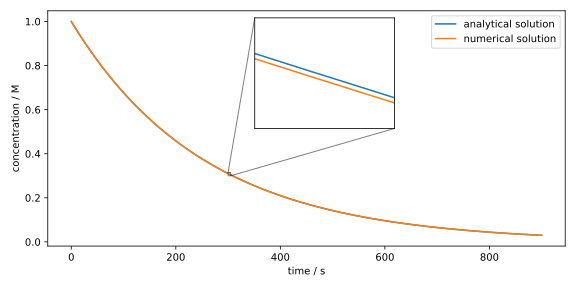
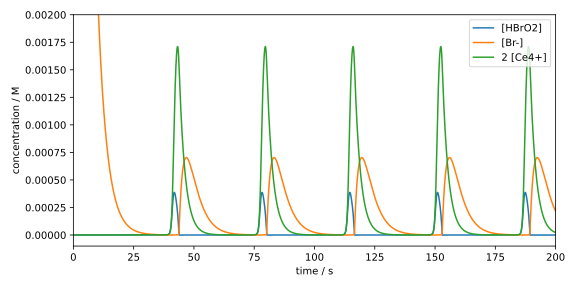

## The Euler Method

Let's look at some methods for solving initial value problems (IVPs). We start with a problem of the form:
$$
\begin{cases}
  y'(x) = f(x, y(x))\\ 
  y(x_0) = y_0
\end{cases}\,,
{{numeq}}{eq:ivp_first_order}
$$
where $f(x, y(x))$ is a given function of the independent variable $x$ and the unknown function $y(x)$. Equation {{eqref: eq:ivp_first_order}} represents a first-order IVP, consisting of a first-order differential equation (as in Equation {{eqref: eq:ode_first_order}}) and an initial condition.

```admonish info title="Example"
Let's illustrate Equation {{eqref: eq:ivp_first_order}} with a concrete example:
$$
\begin{cases}
  y'(x) = x * y(x)\\ 
  y(0) = 2
\end{cases}\,,
$$

Try solving this IVP analytically using separation of variables and integration!
```

While analytical solutions are elegant, computers can't easily find particular solutions to IVPs analytically. In fact, some complex IVPs don't even have analytical solutions. Therefore, in the following sections, we'll explore how to find the particular solution $y(x)$ numerically.

Following the pattern of many numerical methods, our first step involves discretizing the function $y(x)$. This means selecting a discrete set of points $x_i$ from the domain and approximating the function's values $y(x_i)$ only at these points. The most straightforward choice of points is a uniform grid, where a starting point $x_0$ and a step size $h$ define subsequent points as $x_n = x_0 + n h$ for $n = 0, 1, 2, \ldots$. The goal in the following sections will be to calculate, or approximate, the function values of $y(x)$ at these points $x_1, x_2, \ldots$.

### Theoretical Foundations

The function value of $y$ at the point $x_{n+1} = x_n + h$ can (under certain conditions on $y(x)$) be approximated using a Taylor expansion around the point $x_n$:
$$
  y(x_{n+1}) = y(x_n) 
  + h y'(x_n) 
  + \frac{h^2}{2} y''(x_n) 
  + \frac{h^3}{6} y'''(x_n)
  + \cdots\,.
$$

```admonish info title="For the Mathematically Curious" collapsible=true
The condition is that $y(x)$ must be analytic at the point $x_n$, meaning there exists a power series
$$
  \sum_{k=0}^\infty a_k (x - x_n)^k
$$
that converges for all $\|x - x_n\| < R$, where $R \in \mathbb{R}^+$ is the radius of convergence of the power series. Additionally, the radius of convergence must be larger than the step size $h$, i.e., $h < R$.
```

We can approximate the function $y(x)$ using its first-order Taylor polynomial:
$$
  y(x_{n+1}) = y(x_n) + h y'(x_n) + \mathcal{O}(h^2)
$$
where the error $\mathcal{O}(h^2)$ is proportional to $h^2$. Assuming the error term is negligible, we can write:
$$
  y(x_{n+1}) \approx y(x_n) + h y'(x_n)\,.
  {{numeq}}{eq:ode_taylor_first_order}
$$
Equation {{eqref: eq:ode_taylor_first_order}} shows that knowledge of the function value $y$ and its derivative $y'$ at point $x_n$ enables calculation of the function value at the next point $x_{n+1}$. Using the differential equation from Eq. {{eqref: eq:ivp_first_order}}, the derivative $y'(x_n)$ can be replaced with $f(x_n, y(x_n))$, leading to
$$
  y(x_{n+1}) = y(x_n) + h f(x_n, y(x_n))
$$
To emphasize the discrete nature of the Euler method's output, let's denote $y_n = y(x_n)$ and $y_{n+1} = y(x_{n+1})$, resulting in
$$
  y_{n+1} = y_n + h f(x_n, y_n)
  {{numeq}}{eq:euler_method}
$$
Equation {{eqref: eq:euler_method}} defines the *explicit Euler method* for numerically solving a first-order IVP. The initial condition provides $y(x_0)$, allowing step-by-step calculation of all subsequent $y(x_{n})$ using Eq. {{eqref: eq:euler_method}}.

### Implementation

Let's bring these concepts to life by implementing the Euler method and applying it to some exciting examples from chemistry!

#### Manganese Decay

For our first example, we revisit the manganese decay example. Here we have a first-order reaction described by the differential equation
$$
  \dot{c}(t) = -k c(t)
  {{numeq}}{eq:mn_decay}
$$
where $c(t)$ represents the concentration of the manganese complex at time $t$. Note that we often write $\dot{c}(t)$ instead of $c'(t)$ to emphasize that we're taking the derivative with respect to time.

Starting with our required libraries
```python
{{#include ../codes/02-differential_equations/euler_mn.py:imports}}
```
the `dydx` function calculates $f(x_n, y(x_n))$:
```python
{{#include ../codes/02-differential_equations/euler_mn.py:dydx}}
```
This function takes the arguments `x` ($t_n$) and `y` ($c(t_n)$) and returns the derivative $\dot{c}(t_n) = -k c(t_n)$. Here we've used the fitted rate constant $k$ from Section [1.4](../01-regression/04-nonlinear_regression.md#reaktionskinetik). Following Eq. {{eqref: eq:euler_method}}, the `euler_step` function calculates the function value $y(x_{n+1})$:

```python
{{#include ../codes/02-differential_equations/euler_mn.py:euler_step}}
```

The complete Euler method implementation follows:

```python
{{#include ../codes/02-differential_equations/euler_mn.py:euler_method}}
```

This function takes the initial conditions `x0` and `y0`, the step size `h`, the derivative function `dydx`, and the number of steps `n`. We first create the grid `x` using the [`np.arange`](https://numpy.org/doc/stable/reference/generated/numpy.arange.html) function and initialize the array `y` with zeros to store our solution. Then we set the first entry `y[0]` of this array to the initial value `y0`. Next, we use a for loop over the number of steps, calling the `euler_step` function in each iteration to calculate the function value at the next point, storing it in `y[i + 1]`. Finally, we return both the grid `x` and the solution `y`.

Let's apply the Euler method to Eq. {{eqref: eq:mn_decay}}:
```python
{{#include ../codes/02-differential_equations/euler_mn.py:solve_ode}}
```
We set the initial conditions `C0 = 1.0` and `T0 = 0.0`, the step size `STEP = 1.0`, and the maximum time `MAXTIME = 900.0`. The number of steps `nsteps` is calculated by `int(MAXTIME / STEP)`. The `int` function rounds down the result of the division and converts it to an integer. Then we call the `euler_method` function and store the result in `x` and `y`.

Finally, we can compare our numerical result with the analytical solution. Note that the analytical solution of Eq. {{eqref: eq:mn_decay}} is easily calculated as $c(t) = c_0 \exp(-k t)$.

```python
{{#include ../codes/02-differential_equations/euler_mn.py:plot}}
```

This produces the following plot: 



Only by zooming in on the concentration profile can we see the difference between the analytical and numerical solutions, which we achieved here using the `ax.inset_axes` command (the exact workings of this command are not important at this point). The Euler method with $h = 1$ thus provides a very good approximation.

#### Belousov-Zhabotinsky Reaction

Now let's consider a reaction with significantly more complex kinetics. The [Belousov-Zhabotinsky reaction](https://en.wikipedia.org/wiki/Belousov%E2%80%93Zhabotinsky_reaction) is a classic example of an oscillating reaction, where a redox system ($\mathrm{Ce^{3+}/Ce^{4+}}$ in the original reaction) alternates between its oxidized and reduced forms.

In the following video, you can observe the reaction, though it uses the [Ferroin](https://en.wikipedia.org/wiki/Ferroin) redox system, which shows a stronger color change.

<iframe width="750" height="422" src="https://www.youtube.com/embed/kw9wF-GNjqs?start=141&end=154" title="Everything about the Belousov Zhabotinsky reaction" frameborder="0" allow="accelerometer; autoplay; clipboard-write; encrypted-media; gyroscope; picture-in-picture; web-share" allowfullscreen></iframe>
<!--
<div onclick="this.nextElementSibling.style.display='block'; this.style.display='none'">
   
</div>
<div style="display:none">
<iframe width="750" height="422" src="https://www.youtube.com/embed/kw9wF-GNjqs?start=141&end=154" title="Everything about the Belousov Zhabotinsky reaction" frameborder="0" allow="accelerometer; autoplay; clipboard-write; encrypted-media; gyroscope; picture-in-picture; web-share" allowfullscreen></iframe>
</div>
-->

The detailed mechanism of this reaction is very complex, which is why we'll only consider a simplified version, the so-called [Oregonator model](https://en.wikipedia.org/wiki/Oregonator). A commonly used Oregonator model consists of five coupled reactions with six species:<sup>[</sup>[^field1986]<sup>, </sup>[^schneider1996]<sup>]</sup>

$$
\begin{align}
  \mathrm{A} + \mathrm{Y} &\xrightarrow{k_1} \mathrm{X} + \mathrm{P} \\
  \mathrm{X} + \mathrm{Y} &\xrightarrow{k_2} 2\ \mathrm{P} \\
  \mathrm{A} + \mathrm{X} &\xrightarrow{k_3} 2\ \mathrm{X} + \mathrm{Z} \\
  2\ \mathrm{X} &\xrightarrow{k_4} \mathrm{A} + \mathrm{P} \\
  \mathrm{B} + \mathrm{Z} &\xrightarrow{k_5} \mathrm{Y}\,,
\end{align}
$$
where
$\mathrm{A} = \mathrm{BrO_ 3^-}$, 
$\mathrm{B} = \mathrm{Bromomalonic acid}$, 
$\mathrm{X} = \mathrm{HBrO_ 2}$, 
$\mathrm{Y} = \mathrm{Br^-}$, 
$\mathrm{Z} = \mathrm{2\ Ce^{4+}}$ 
and $\mathrm{P} = \mathrm{HOBr}$. 

You might notice that the above reaction equations are not balanced. The reason for this is that the concentrations of some species can be considered constant either due to their high concentration ($\mathrm{H^+}$, malonic acid, etc.) or their rapid reactions ($\mathrm{BrO_ 2^\cdot}$). In particular, it is assumed that the concentrations $[\mathrm{A}]$ and $[\mathrm{B}]$ are constant. Therefore, we are only interested in the time evolution of the concentrations $[\mathrm{X}]$, $[\mathrm{Y}]$, and $[\mathrm{Z}]$.

These are described by the following system of ODEs:
$$
  \begin{align}
    [X]'(t) &= k_1 c_A^0 [Y] - k_2 [X] [Y] + k_3 c_A^0 [X] - 2 k_4 [X]^2 \\
    [Y]'(t) &= -k_1 c_A^0 [Y] - k_2 [X] [Y] + k_5 c_B^0 [Z] \\
    [Z]'(t) &= k_3 c_A^0 [X] - k_5 c_B^0 [Z]
  \end{align}
    {{numeq}}{eq:oregonator}
$$

An important difference from the Mn decay is that we now have a system of ODEs. Fortunately, Eq. {{eqref: eq:euler_method}} is equally valid for ODE systems as it is for single ODEs, provided we treat $y(x)$ as a vector-valued function, i.e., $y(x) \equalhat ([X](t), [Y](t), [Z](t))^\intercal$.

After importing the required libraries

```python
{{#include ../codes/02-differential_equations/euler_bz.py:imports}}
```

we can implement the `dydx` function for the Oregonator model:

```python
{{#include ../codes/02-differential_equations/euler_bz.py:dydx}}
```

Note that the data type of the argument `y` is now not a `float`, but an `np.ndarray` with three entries. The functions `euler_step` and `euler_method` are implemented analogously to the functions for the Mn decay.

```python
{{#include ../codes/02-differential_equations/euler_bz.py:euler_step}}
```

```python
{{#include ../codes/02-differential_equations/euler_bz.py:euler_method}}
```

Another difference is that the variable `y` in the function `euler_method` is initialized as a 2D array, where the first dimension indicates the number of components (here: `ndim = 3`) and the second dimension contains the number of steps. The grid `x` remains a 1D array, since time applies equally to all components. 

Now let's solve the ODE system in Eq. {{eqref: eq:oregonator}} using the Euler method:
```python
{{#include ../codes/02-differential_equations/euler_bz.py:solve_ode_bad}}
```
Here we have chosen the initial conditions `C0 = np.array([0.0, 0.001, 0.0])`, which means that initially only the species $\mathrm{Br^-}$ is present with a concentration of $0.001\ \mathrm{M}$. The species $\mathrm{HBrO_ 2}$ and $\mathrm{Ce^{4+}}$ are not present.

While this code block will execute, we receive a series of warnings, such as:

```
RuntimeWarning: overflow encountered in scalar multiply
```

If you plot the result, you'll notice that the components in `y` become very large in magnitude, leading to an [arithmetic overflow](https://en.wikipedia.org/wiki/Arithmetic_overflow).

```admonish warning title="Numerical Stability"
We have often discussed that numerical methods are not exact. They typically involve a discretization of the problem, which leads to an error. This error becomes larger as the step size $h$, i.e., the distance between discrete points, increases. If the numerical method is iterative, meaning the next step is calculated from the previous one, this error can also grow.
```

This can be a sign that we have chosen the step size $h$ too large and the Euler method becomes unstable. In this case, we actually need to reduce the step size $h$ to `h = 0.0005` to obtain a stable numerical solution:

```python
{{#include ../codes/02-differential_equations/euler_bz.py:solve_ode}}
```

It should be noted that this naturally increases the number of steps; here it was $200/0.0005 = 400,000$ steps. For initial conditions $c_Y^0 > 0.001$, the ODEs would be even more difficult to solve and we would need to use an even smaller step size.  

Now let's plot the result:

```python
{{#include ../codes/02-differential_equations/euler_bz.py:plot}}
```

Here we have restricted the axes using the functions `ax.set_xlim` and `ax.set_ylim`. Additionally, we passed the argument `loc='upper right'` to the function `ax.legend` to move the legend to the upper right. The default argument is `loc='best'`, which automatically determines the "best" position for the legend.  

We obtain the following diagram:



Here we can see the periodic, pulse-like behavior of $[\mathrm{Z}]$, which corresponds to the concentration of Fe(III) in the video above ($[\mathrm{Ce^{4+}}]$ in the original reaction) and appears there as a blue coloration.

```admonish info title="Error Estimation"
How do we know if the step size $h$ is small enough? A rule of thumb states that after completing a calculation with a given $h$, one should perform the calculation again with a halved step size $h/2$. If the result remains the same as with $h$, then $h$ is small enough.
```

From the above example, we can see that the Euler method has difficulties with more complex systems, as it strongly depends on the chosen step size $h$ and might require a large number of steps. In the next section, we will therefore explore methods that can provide stable solutions even with larger step sizes. Recall that the Euler method only considers the constant and linear terms of the Taylor expansion (cf. Eq. {{eqref: eq:ode_taylor_first_order}}). It is therefore natural to also consider higher orders, which leads to a family of methods known as *Runge-Kutta methods*.

[^field1986]: R. J. Field, H.-D. Försterling, *J. Phys. Chem.* **1986**, *90*, 5400&ndash;5407.
[^schneider1996]: F. W. Schneider, A. F. Münster, in *Nichelineare Dynamik in der Chemie*, Spektrum Akademischer Verlag, Heidelberg, **1996**, pp. 67&ndash;72.

---

**Self-Study Questions**

1. Try to understand the principle of the Euler method using pen and paper: Draw a sine function, choose a random starting point, and approximate the function using the Euler method with a constant step size $h$. Compare the result with the exact solution.

2. Show that the solution of Eq. {{eqref: eq:mn_decay}} is given by $c(t) = c_0 \exp(-k t)$.

3. Modify the Python code for the Manganese Decay example to use different step sizes, such as $h=5.0$ and $h=0.1$. Observe and describe how the numerical solution's accuracy changes compared to the analytical solution as $h$ varies.

4. Consider Eq. {{eqref: eq:ode_taylor_first_order}}, which shows the Taylor expansion used to derive the Euler method. Identify the first term neglected in this approximation and explain how its magnitude generally depends on the step size $h$.

**Challenge Questions**

1. Using the Taylor expansion $y(x_{n+1}) = y(x_n) + h y'(x_n) + \frac{h^2}{2} y''( \xi_n)$ for some $\xi_n \in (x_n, x_{n+1})$, determine the local truncation error for the Euler method. If $y''(x)$ is bounded, how does this error depend on the step size $h$?

2. Investigate the concept of "stiffness" by modifying the rate constants in the provided Oregonator model code (e.g., make one rate constant significantly larger than others). Observe how this affects the maximum step size $h$ that can be used before the solution becomes unstable.

3. Based on the Taylor expansion in Eq. {{eqref: eq:ode_taylor_first_order}}, suggest how you could incorporate the $\frac{h^2}{2} y''(x_n)$ term to define a new, potentially more accurate, numerical method for solving $y'(x) = f(x, y(x))$. What additional information or computation would this new method require per step compared to the Euler method?

