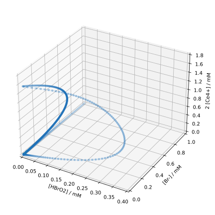

## Runge-Kutta Methods

The Runge-Kutta methods are a family of methods for the numerical
solution of initial value problems for ordinary differential equations,
named after Carl Runge and Martin Wilhelm Kutta.
These methods iteratively compute the solution at the next time step
from a linear combination of the function value and the slopes at
various points. When one refers to **the** Runge-Kutta method,
it usually means the
[classical Runge-Kutta method](https://en.wikipedia.org/wiki/Runge–Kutta_methods#The_Runge–Kutta_method),
which is just a special case of the Runge-Kutta methods.

### Theoretical Foundations

We again consider the initial value problem (IVP) in Eq. 
{{eqref: eq:ivp_first_order}}.
Just like with the Euler method, we first choose a uniform grid
$\{x_n\}_{n=0,\cdots,N}$ with $x_n = x_0 + n\cdot h$ and $h$ as the step size,
as well as an initial condition $y_0 = y(x_0)$.
Then we expand $y(x_{n+1})$ in a Taylor series around $y(x_n)$:
$$
  y(x_{n+1}) = y(x_n) 
  + h y'(x_n) 
  + \frac{h^2}{2} y''(x_n) 
  + \frac{h^3}{6} y'''(x_n)
  + \frac{h^4}{24} y^{(4)}(x_n)
  + \cdots\,.
  {{numeq}}{eq:ode_taylor_series}
$$
One speaks of a Runge-Kutta method of *(consistency) order* $p$,
when the Taylor polynomial up to the $p$-th degree is considered in the method.

A general Runge-Kutta method for the IVP in Eq. {{eqref: eq:ivp_first_order}} 
is then given by
$$
  y_{n+1} = y_n + h \sum_{i=1}^s b_i k_i\,,
  {{numeq}}{eq:runge_kutta_general}
$$
where
$$
  k_i = f (x_n + h c_i, y_n + h \sum_{j=1}^{s} a_{ij} k_j )\,.
$$
Here, $s$ denotes the *stage* of the method. The coefficients $a_{ij}$,
$b_i$, and $c_i$ are characteristic parameters of the method.
We will only consider *explicit* Runge-Kutta methods, where
the coefficients $c_1 = 0$ and $a_{ij} = 0$ for $j \geq i$ hold.

Since the general form is quite unwieldy, we first consider a
two-stage method of second order.

#### Runge-Kutta Method of Second Order (RK2)

According to Eq. {{eqref: eq:runge_kutta_general}}, we can formulate an explicit
two-stage Runge-Kutta method of second order as
$$
\begin{align*}
  y_{n+1} &= y_n + h(b_1 k_1 + b_2 k_2) \\
  k_1 &= f(x_n, y_n) \\
  k_2 &= f(x_n + h c_2, y_n + h a_{21} k_1)\,.
\end{align*}
{{numeq}}{eq:runge_kutta_2_stage}
$$

For the consistency order $p=2$, we need a Taylor polynomial of second degree,
which includes the second derivative of $y$. However, since the analytical
form of $y$ is unknown, we do not have direct access to its second derivative.
We can, however, express $y''$ using the chain rule:
$$
  \frac{\du^2 y}{\du x^2} = \frac{\du}{\du x} y' = \frac{\du f(x, y(x))}{\du x}
    = \frac{\partial f}{\partial x} + \frac{\partial f}{\partial y} y'
    = \frac{\partial f}{\partial x} + f \frac{\partial f}{\partial y} \,.
$$ 
This gives us the second-degree Taylor polynomial:
$$
  y(x_{n+1}) = y(x_n) + h f(x_n, y_n) + \frac{h^2}{2} \left[
    \frac{\partial f}{\partial x} + f \frac{\partial f}{\partial y}
  \right](x_n, y_n) + \mathcal{O}(h^3)\,.
  {{numeq}}{eq:ode_taylor_polynomial_2nd_order}
$$

Afterwards, we expand $k_2$ in Eq. {{eqref: eq:runge_kutta_2_stage}}
linearly around $(x_n, y_n)^\intercal$:
$$
  k_2 = f(x_n, y_n) + h c_2 \frac{\partial f}{\partial x}(x_n, y_n)
    + h a_{21} k_1 \frac{\partial f}{\partial y}(x_n, y_n) + \mathcal{O}(h^2)\,.
$$
Substituting this into Eq. {{eqref: eq:runge_kutta_2_stage}}, we obtain
$$
  y_{n+1} = y_n + h(b_1 + b_2) f(x_n, y_n) + h^2 b_2 \left[
    c_2 \frac{\partial f}{\partial x}(x_n, y_n) + a_{21} \left(
      f \frac{\partial f}{\partial y}
    \right)(x_n, y_n)
  \right] + \mathcal{O}(h^3)\,.\\
  {{numeq}}{eq:runge_kutta_2_stage_2nd_order}
$$

For the method to have a consistency order of $p=2$, the coefficients
before the functions $f$ and their derivatives in Eqs.
{{eqref: eq:ode_taylor_polynomial_2nd_order}} and
{{eqref: eq:runge_kutta_2_stage_2nd_order}} must match, as these must hold for arbitrary
functions $f$. This leads to the conditions
$$
  \begin{align*}
    b_1 + b_2 &= 1 \\
    b_2 c_2 &= \frac{1}{2} \\
    b_2 a_{21} &= \frac{1}{2}\,.
  \end{align*}
  {{numeq}}{eq:runge_kutta_2_stage_conditions}
$$

This is an underdetermined system of equations with three equations
and four unknowns. Therefore, we can choose one of the coefficients freely
and obtain a family of consistent second-order Runge-Kutta methods with two stages.

If we choose $b_1 = b_2 = \frac{1}{2}$, $c_2 = 1$, and $a_{21} = 1$, we obtain
the so-called [Heun method](https://en.wikipedia.org/wiki/Heun's_method).
If we instead choose $b_1 = 0$, $b_2 = 1$, $c_2 = \frac{1}{2}$, and
$a_{21} = \frac{1}{2}$, we obtain the so-called
[midpoint method](https://en.wikipedia.org/wiki/Midpoint_method).
In addition to these two common methods, one can of course choose other
combinations of the coefficients as long as the conditions in
Eq. {{eqref: eq:runge_kutta_2_stage_conditions}} are satisfied.
A general parameterisation of the coefficients is given by
$$
  \begin{align*}
    a_{21} &= \alpha \\
    b_1 &= 1 - \frac{1}{2 \alpha} \\
    b_2 &= \frac{1}{2 \alpha} \\
    c_2 &= \alpha \,.
  \end{align*}
$$

The specification of the individual coefficients in this way is not very
clear, especially considering that there are methods with more than two stages.
Therefore, we shall introduce a more compact notation, the so-called *Butcher tableau*.

#### Butcher Tableau
The Butcher tableau is a compact representation of the coefficients
$a_{ij}$, $b_i$, and $c_i$ of a Runge-Kutta method. The tableau for a
general $s$-stage method is given by
$$
  \begin{array}{c|c}
    \vec{c} & \bm{A} \\ \hline
            & \vec{b}^\intercal
  \end{array}
  =
  \begin{array}{c|cccc}
    c_1 & a_{11} & a_{12} & \cdots & a_{1s} \\
    c_2 & a_{21} & a_{22} & \cdots & a_{2s} \\
    \vdots & \vdots & \vdots & \ddots & \vdots \\
    c_s & a_{s1} & a_{s2} & \cdots & a_{ss} \\ \hline
        & b_1 & b_2 & \cdots & b_s \\
  \end{array}\,,
  {{numeq}}{eq:butcher_tableau}
$$
where the coefficients with one index ($b_i$ and $c_i$) are represented
as vectors, while the coefficients with two indices ($a_{ij}$) are represented
as a matrix.

The Heun method can then be represented as
$$
  \begin{array}{c|cc}
    0 & 0 & 0 \\
    1 & 1 & 0 \\ \hline
      & 1/2 & 1/2
  \end{array}
$$
and the midpoint method as
$$
  \begin{array}{c|c}
    0 & 0 & 0 \\
    1/2 & 1/2 & 0 \\ \hline
        & 0 & 1
  \end{array}\,.
$$
The general parametrisation of a second-order two-stage method then reads
$$
  \begin{array}{c|cc}
    0 & 0 & 0 \\
    \alpha & \alpha & 0 \\ \hline
      & 1 - \frac{1}{2\alpha} & \frac{1}{2\alpha}
  \end{array}\,.
$$

```admonish note title="Note"
If desired, the Euler method can be viewed as a one-stage Runge-Kutta method
of first order, which can be represented as
$$
  \begin{array}{c|c}
    0 & 0 \\ \hline
      & 1
  \end{array}\,.
$$
Verify this by substituting the coefficients into Eq. {{eqref: eq:runge_kutta_general}},
which should lead to Eq. {{eqref: eq:euler_method}}.
```

As a final remark, the condition $a_{ij} = 0$ for $j \geq i$ in explicit
Runge-Kutta methods means that the matrix $\bm{A}$ is a strict lower triangular matrix.

#### Classical Runge-Kutta Method (RK4)
The most commonly used Runge-Kutta method is the classical
Runge-Kutta method. This is a four-stage method of fourth order,
which has the form
$$
  \begin{align*}
    y_{n+1} &= y_n + h(b_1 k_1 + b_2 k_2 + b_3 k_3 + b_4 k_4) \\
    k_1 &= f(x_n, y_n) \\
    k_2 &= f(x_n + h c_2, y_n + h a_{21} k_1) \\
    k_3 &= f(x_n + h c_3, y_n + h(a_{31} k_1 + a_{32} k_2)) \\
    k_4 &= f(x_n + h c_4, y_n + h(a_{41} k_1 + a_{42} k_2 + a_{43} k_3)) \,.
  \end{align*}
  {{numeq}}{eq:runge_kutta_4_stage}
$$

The conditions for the coefficients can be derived in the same way as for
the RK2 method; however, the calculations are significantly more tedious,
which is why we will not perform them here.

The coefficients for the classical Runge-Kutta method are
$$
  \begin{array}{c|cccc}
    0 & 0 & 0 & 0 & 0 \\
    1/2 & 1/2 & 0 & 0 & 0 \\
    1/2 & 0 & 1/2 & 0 & 0 \\
    1 & 0 & 0 & 1 & 0 \\ \hline
      & 1/6 & 1/3 & 1/3 & 1/6
  \end{array}\,.
$$
Another method presented in the same paper<sup>[</sup>[^kutta1901]<sup>]</sup>
as the classical RK4 method, but far less known, uses the coefficients
$$
  \begin{array}{c|cccc}
    0 & 0 & 0 & 0 & 0 \\
    1/3 & 1/3 & 0 & 0 & 0 \\
    2/3 & -1/3 & 1 & 0 & 0 \\
    1 & 1 & -1 & 1 & 0 \\ \hline
      & 1/8 & 3/8 & 3/8 & 1/8
  \end{array}\,.
$$

You may wonder why the classical RK4 method is so popular,
even though there are methods with higher order.
This is due to the following consideration:
```admonish warning title="Order &ne; Stage!"
The consistency order $p$ and the stage $s$ of the method are two
different things, although we have only considered methods with
$s = p$ so far. In fact, it holds for the minimum
stage number $s_{\mathrm{min}}$ to achieve a consistency order $p$
for explicit Runge-Kutta methods that
$s_{\mathrm{min}} \geq p$.
```

One can even show that for $p \geq 5$, the strict inequality
$s_{\mathrm{min}} > p$ holds.<sup>[</sup>[^butcher1987]<sup>]</sup>
In other words, improving the accuracy from $p = 4$
to $p = 5$ using explicit Runge-Kutta methods
is associated with an increase in the stage number by at least 2.
This explains why the classical RK4 method is so popular.
The relationship between $p$ and $s_{\mathrm{min}}$ for some orders
of explicit Runge-Kutta methods
is summarised in the following table:<sup>[</sup>[^butcher1987]<sup>]</sup>
|                    |    |    |    |    |    |    |    |    |
|--------------------|---:|---:|---:|---:|---:|---:|---:|---:|
| $p$                |  1 |  2 |  3 |  4 |  5 |  6 |  7 |  8 |
| $s_{\mathrm{min}}$ |  1 |  2 |  3 |  4 |  6 |  7 |  9 | 11 |

The numbers $s_{\mathrm{min}}$ are also known as *Butcher barriers*.

[^kutta1901]: M. W. Kutta, *Z. Math. Phys.* **1901**, *46*, 435&ndash;453.
[^butcher1987]: J. C. Butcher, in *The Numerical Analysis of Ordinary Differential Equations*, John Wiley & Sons, Chichester, **1987**, pp. 185&ndash;194.

### Implementation
We will again use the dynamics of the Belousov-Zhabotinsky reaction as an example.
Just like in Section [2.2](02-euler_method.md#belousov-zhabotinsky-reaction),
we first import the necessary libraries:
```python
{{#include ../codes/02-differential_equations/rk4_bz.py:imports}}
```
and copy the implementation of the function `dydx`:
```python
{{#include ../codes/02-differential_equations/rk4_bz.py:dydx}}
```

#### RK4 Method
Next, we implement the function `rk4_step`, which computes the function value
$y_{n+1}$ using the RK4 method according to
Eq. {{eqref: eq:runge_kutta_4_stage}}:
```python
{{#include ../codes/02-differential_equations/rk4_bz.py:rk4_step}}
```
Although this function may seem complicated at first glance, most of the lines
are only used to define the coefficients of the RK4 method, where the 
lesser-known parameterisation is used.
After that, the four stages $k_i$ are computed, and finally the solution
$y_{n+1}$ is returned according to Eq. {{eqref: eq:runge_kutta_4_stage}}.

As the next step, we implement the function `rk4_method`:
```python
{{#include ../codes/02-differential_equations/rk4_bz.py:rk4_method}}
```
This function is actually identical to the `euler_method` function from
Section [2.2](02-euler_method.md#manganese-decay), except that we call
`rk4_step` instead of `euler_step`. One could also write a general function
`rk_method`, which accepts `rk_step` as an argument, allowing both `euler_step`
and `rk4_step` to be used.

Finally, we solve the IVP using the RK4 method:
```python
{{#include ../codes/02-differential_equations/rk4_bz.py:solve_ode}}
```
Unfortunately, a step size of `h = 0.001` is still required to obtain
a stable solution. We then plot the solution again:
```python
{{#include ../codes/02-differential_equations/rk4_bz.py:plot}}
```
The visual result should be identical to that of the Euler method:


A possible reason why the RK4 method can only use a slightly larger step size
than the Euler method is that the IVP is
[stiff](https://en.wikipedia.org/wiki/Stiff_equation),
meaning that explicit methods have significant difficulties in finding a stable
solution.

To solve the IVP with fewer steps, we can use e.g. adaptive step size methods,
which automatically reduce the step size at difficult points. Alternatively, we can
use implicit methods, which are more stable than explicit methods.
However, we will not delve into the details of these methods here,
but rather discuss how and when to use them.
Therefore, in the following section, we will use the function `solve_ivp`
from the `scipy` library, which provides a variety of methods for solving
IVPs.

#### Solving IVPs with `scipy.integrate.solve_ivp`
The function
[`scipy.integrate.solve_ivp`](https://docs.scipy.org/doc/scipy/reference/generated/scipy.integrate.solve_ivp.html)
provides a universal interface for a variety of methods for solving
IVPs. We import this function as well as other necessary libraries as usual:
```python
{{#include ../codes/02-differential_equations/scipy_bz.py:imports}}
```
We again use the function `dydx` from the Oregonator model.
Then we define the initial conditions and the parameters for the
ODE solver, just as we did before:
```python
{{#include ../codes/02-differential_equations/scipy_bz.py:solve_setup}}
```
A difference here is that we have replaced the constant `STEP` with `MAXSTEP`
since the algorithm of `solve_ivp` adapts the step size itself and we can only 
set its upper bound.

After that, we call the function `solve_ivp` with the method `RK45`:
```python
{{#include ../codes/02-differential_equations/scipy_bz.py:solve_rk45}} 
```
As a result, we obtain an object with various useful attributes.
The grid ${x_n}_{n=0,\cdots,N}$ is stored in the attribute `t` and the
solution $y_n$ in the attribute `y`. We calculate the number of steps
from the length of the grid minus 1 (initial condition).

`RK45` is an adaptive Runge-Kutta method with a consistency order
of 5, which is why the step size $h$ is not constant. However, we can
calculate the smallest step size by first calculating the difference
between all grid points with
[np.diff](https://numpy.org/doc/stable/reference/generated/numpy.diff.html)
and then determining the minimum of that with
[np.min](https://numpy.org/doc/stable/reference/generated/numpy.min.html).
The minimum step size indicates the precision with which the method has
computed the solution at the most difficult points and provides a good
comparison to methods with constant step size.

In this case, only about 30,000 steps are required to obtain a stable
solution of the IVP. This is significantly fewer than the 200,000 steps
that our implementation of the classical RK4 method required. The minimum 
step size is about 0.0012, which is only slightly larger than the step size 
used in the RK4 method.
```python
{{#include ../codes/02-differential_equations/scipy_bz.py:verification_rk45}}
```
The increase in order from 4 to 5 did not helped the solution method much;
the adaptive step size control, however, did.

```admonish tip title="Tip"
Test the function `solve_ivp` with the arguments `method='DOP853'`
and `max_step=0.02`. DOP8(5,3) is an adaptive Runge-Kutta method
with a consistency order of 8. You will find that the minimum step size is
about 0.002, which is still very small despite the high order.
This confirms the statement that the IVP is stiff.
```

Now we try an implicit method, e.g. with `method='Radau'`
(and again `MAXSTEP=0.1`):
```python
{{#include ../codes/02-differential_equations/scipy_bz.py:solve_radau}}
```
You should obtain approximately the following values for `nsteps` and `minstep`:
```python
{{#include ../codes/02-differential_equations/scipy_bz.py:verification_radau}}
```

A significant difference is evident here: The Radau method requires
only slightly more than 2000 steps, and the minimum step size is about 0.015.
This shows that implicit methods significantly improve the stability of the solution,
which is another characteristic of stiff ODEs.

We could plot the solution of the IVP of the Belousov-Zhabotinsky reaction 
again, but it would not yield any new insights. Instead, we will focus on two
further visualization methods for solutions of IVPs: configuration space 
and phase space trajectories.

#### Configuration Space and Phase Space

The [*configuration space*](https://en.wikipedia.org/wiki/Configuration_space_(physics))
is the space of the degrees of freedom of a system. For the Oregonator model,
these are the concentrations of the three species, i.e. 
$[\mathrm{X}]$, $[\mathrm{Y}]$, and $[\mathrm{Z}]$. The solution of the ODE system
at time $t_n$ is thus given by the point
$([\mathrm{X}](t_n), [\mathrm{Y}](t_n), [\mathrm{Z}](t_n))^\intercal$
in the configuration space. The time evolution of the system can then be 
described by a series of points in the configuration space.
The set of these points is then referred to as the 
*configuration space trajectory*.

Since the information about which point in the configuration space is 
traversed at which time is lost, we want to define that the time interval 
between two points in the trajectory remains constant.
This way, we can at least get a rough idea of the time evolution of the system,
as points with larger distances in the configuration space are traversed
*faster*. We can achieve this by passing the argument `dense_output=True`
to the function `solve_ivp`. This will make the attribute `sol` 
of the return value `res` an
[`scipy.integrate.OdeSolution`](https://docs.scipy.org/doc/scipy/reference/generated/scipy.integrate.OdeSolution.html)-object,
which can be treated like a function.
```python
{{#include ../codes/02-differential_equations/scipy_bz.py:solve_dense}}
```
Here, we define a uniform grid using
[`np.linspace`](https://numpy.org/doc/stable/reference/generated/numpy.linspace.html),
where we choose 5000 evenly distributed points between `T0` and `TMAX`.
The solution of the IVP at these points is then obtained by calling
the function `res.sol` with the grid as an argument.

```admonish note title="Note"
Alternatively, a list of time points can be passed to `solve_ivp` using the
`t_eval` argument, at which the solution should be computed.
```

Now we can plot the configuration space trajectory of the solution with the
evenly spaced points:
```python
{{#include ../codes/02-differential_equations/scipy_bz.py:configuration_space_plot}}
```
Since the configuration space is three-dimensional, we need to pass the argument
`subplot_kw={'projection': '3d'}` when calling the function
`plt.subplots`. We use the `scatter` method instead of `plot` to display
the points individually. The size of the points can be adjusted with the argument
`s`, and the transparency with `alpha`, where we have chosen `alpha=0.1`
(i.e., 10%).
The method
[`tight_layout`](https://matplotlib.org/stable/api/_as_gen/matplotlib.pyplot.tight_layout.html)
unfortunately has difficulties with 3D plots, which is why we have manually
adjusted the desired area of the plot with the argument `rect=[0, 0, 0.95, 1.00]`.
The result should look like this:
<p align="center">
  
</p>

Through the setting `alpha=0.1`, we can now see how often different 
parts of the configuration space are visited.
At the beginning of the reaction, only $\mathrm{Br^-}$ is present (back corner).
Afterwards, its concentration decreases while the concentrations of 
the other species remain close to zero for a while.
Since this event only occurs once, the points are only faintly visible.
After that, the oscillation of the system begins. Here, too, one can see
from the color intensity that the change in $[\mathrm{HBrO_2}]$ (right arc)
occurs faster than that of $[\mathrm{Br^-}]$ (left arc).

The configuration space alone, however, is not sufficient for a complete
description of the system. For example, we do not know whether a given
$\mathrm{Ce^{4+}}$ concentration is currently increasing or decreasing, i.e., in which
direction the system is moving along the closed curve.
To determine this, we additionally need the "velocities"
or "momenta" of the coordinates. A space that contains both the coordinates 
and the velocities is called the
[*phase space*](https://en.wikipedia.org/wiki/Phase_space).

The phase space of the Oregonator model is six-dimensional, as it consists of
the three concentrations $[\mathrm{X}]$, $[\mathrm{Y}]$, and $[\mathrm{Z}]$,
as well as their time derivatives $\frac{\du [\mathrm{X}]}{\du t}$,
$\frac{\du [\mathrm{Y}]}{\du t}$, and $\frac{\du [\mathrm{Z}]}{\du t}$.
This dimensionality is beyond the limits of human imagination. 
Therefore, we will plot a two-dimensional slice through the phase space,
where we only show the concentration $[\mathrm{Ce^{4+}}]$ and its 
time derivative. Again, we use the evenly spaced solution and calculate 
the derivative using the function `dydx`:
```python
{{#include ../codes/02-differential_equations/scipy_bz.py:phase_space_plot}}
```
Here, we plot the derivative `dzdt` against the concentration `c_z`,
also using the `scatter` method and the argument `alpha=0.1`.
The diagram should look like this:
<p align="center">
  
</p>

The (phase space) trajectory starts at the origin, then moves clockwise,
meaning that both the concentration and its derivative initially increase.
Then, the point of maximum increase is reached, while the concentration 
continues to rise. At a later point, the derivative becomes negative and 
the concentration decreases slightly.

The last part of the trajectory is particularly interesting:
The concentration decreases steadily, while the derivative goes from 
strongly negative to zero. This area in the phase space resembles a 
straight line, which corresponds to first-order kinetics.
In this area, it holds that $\frac{\du [\mathrm{Z}]}{\du t} \propto [\mathrm{Z}]$,
which is the rate law for exponential decay. 

The most intense coloring in this plot is around the origin, which means that 
most of the time, the concentration of $\mathrm{Ce^{4+}}$ and its derivative 
are very small.

```admonish tip title="Tip"
Zoom into the interactive phase space plot to better see the details
of the trajectory. Use the diagram of the time evolution of the concentration
as a comparison and try to recognize the features in the phase space trajectory.
```

