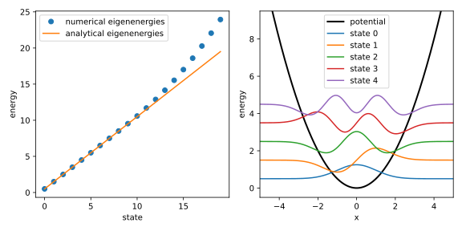

## Finite-Differenzen-Verfahren

Die 
[finite-Differenzen-Methode](https://de.wikipedia.org/wiki/Finite-Differenzen-Methode)
ist eine weitere Klasse an numerischen Verfahren neben Runge-Kutta-Verfahren,
die zur Lösung von gewöhnlichen Differentialgleichungen eingesetzt werden 
kann. Auch hier wird die Funktion $y(x)$ in diskrete Punkte unterteilt,
allerdings liegt der Fokus bei diesem Verfahren nicht auf der Berechnung
von Funktionswerten, sondern auf die Approximation der Ableitungsoperatoren.

### Theoretische Grundlagen

Bei der Implementierung des Gradientenverfahrens haben wir bereits 
in Gl. {{eqref: eq:finite_difference_symmetric}} eine Formel für die
finite Differenz verwendet. Diese Formel stellt ein Spezialfall der
allgemeinen finite Differenz dar und die fiel damals vom Himmel.
Hier bemühen wir uns ein allgemeines Rezept für die Herleitung solcher 
Formeln zu finden.

#### Finite-Differenzen-Approximationen

Gehen wir nun davon aus, dass wir die Ableitung einer Funktion $y(x)$
am Punkt $x$ aus den Funktionswerten in der Umgebung von $x$, wie z.B.
$y(x-h)$, $y(x)$ und $y(x+h)$ {nährungsweise} berechnen wollen, also
$$
  y'(x) \approx c_{-1} y(x-h) + c_0 y(x) + c_1 y(x+h)
$$
mit zu bestimmenden Koeffizienten $c_{-1}$, $c_0$ und $c_1$.
Dann entwickeln wir die rechte Seite in eine Taylor-Reihe um $x$:
$$
  \begin{align}
  y'(x) \approx \ 
      & c_{-1} y(x) &&+ c_{-1} y'(x) (-h) &&+ \frac{1}{2} c_{-1} y''(x) (-h)^2 + \ldots \\
    +\ & c_0 y(x) \\
    +\ & c_1 y(x) &&+ c_1 y'(x) h &&+ \frac{1}{2} c_1 y''(x) h^2 + \ldots
  \end{align}
$$
Die Idee ist, falls die linke Seite gleich der rechten Seite sein soll,
müssen die Koeffizienten vor den Funktionswerten sowie den Ableitungen
der Funktionen gleich sein. Da wir hier drei unbekannte Koeffizienten
haben, benötigen wir drei Gleichungen, also Koeffizienten vor $y(x)$,
$y'(x)$ und $y''(x)$. Deshalb wurde die Taylor-Reihe bis zur zweiten
Ordnung entwickelt. Gleichen wir die Koeffizienten ab, erhalten wir 
das folgende lineare Gleichungssystem:
$$
  \begin{align}
    c_{-1} + c_0 + c_1 &= 0 \\
    -c_{-1} h + c_1 h &= 1 \\
    \frac{1}{2} c_{-1} h^2 + \frac{1}{2} c_1 h^2 &= 0
  \end{align}
$$
Man könnte dieses Gleichungssystem mit dem Gauß-Algorithmus lösen,
aber bei so wenigen Gleichungen und Unbekannten geht es auch so. Egal mit 
welcher Methode, kann als Ergebnis die Koeffizienten $c_{-1} = -1/(2h)$,
$c_0 = 0$ und $c_1 = 1/(2h)$ erhalten werden. Das ergibt die Formel
$$
  y'(x) \approx \frac{y(x+h) - y(x-h)}{2h}\,,
  {{numeq}}{eq:finite_difference_symmetric_second_order}
$$
was identisch zu Gl. {{eqref: eq:finite_difference_symmetric}} ist.

Diese Finite-Differenzen-Formel wird als symmetrische Differenz zweiter
Ordnung bezeichnet, weil sie die Ableitung der Funktion $y(x)$ an der
Stelle $x$ symmetrisch aus den Funktionswerten $y(x-h)$ und $y(x+h)$
berechnet wird und bei der Entwicklung der Taylor-Reihe bis zur zweiten
Ordnung verwendet wird.

Mit den Stützpunkten $x$ und $x+h$ bzw. $x$ und $x-h$ kann man auf 
gleiche Weise die forwärtsdifferenzen
$$
  y'(x) \approx \frac{y(x+h) - y(x)}{h}
  {{numeq}}{eq:finite_difference_forward_first_order}
$$
und die rückwärtsdifferenzen
$$
  y'(x) \approx \frac{y(x) - y(x-h)}{h}
  {{numeq}}{eq:finite_difference_backward_first_order}
$$
herleiten. Die zwei Formeln haben allerdings nur die Ordnung eins.

Gemäß dieses Verfahrens können wir auch die Ableitungen höherer Ordnung
mithilfe der Funktionswerte an bliebigen Grid bis zur beliebigen Ordnung
approximieren. 

#### Matrixdarstellung des Differentialoperators

Wenn wir eine Funktion $y(x)$ auf einem Gitter $x_i$ mit $i=1,\ldots,N$
diskretisieren, können wir die Funktion als einen Vektor mit
$\vec{y} = (y_1, \ldots, y_N)^\intercal$ (näherungsweise) darstellen. 
Wollen wir den Funktionswert an einem beliebigen Gridpunkt $x_i$ berechnen, 
können wir das als Skalarprodukt des Vektors $\vec{y}$ mit einem
Basisvektor $\hat{e}^i$ darstellen, wobei $\hat{e}^i$ ein Vektor mit
$1$ an der Stelle $i$ und $0$ an allen anderen Stellen ist. Das ergibt
$$
  \langle \hat{e}^i, \vec{y} \rangle 
    = \sum_{j=1}^N \hat{e}^i_ j y_ j 
    = \sum_{j=1}^N \delta_{ij} y_ j
    = y_i
$$
mit dem Kroenecker-Delta $\delta_{ij}$. Schreiben wir die 
Vektorkomponenten aus, erhalten wir
$$
  \begin{pmatrix}
    0_1 & \cdots & 0_{i-1} & 1_i & 0_{i+1} & \cdots & 0_N
  \end{pmatrix}
  \cdot
  \begin{pmatrix}
    y_1 \\ \vdots \\ y_{i-1} \\ y_i \\ y_{i+1} \\ \vdots \\ y_N
  \end{pmatrix}
  = y_i\,,
$$
wobei die Indizes der Einträge in $e^i$ explizit geschrieben wurden.

Auf diese Weise können wir z.B. $\left(y(x_{i+1}) - y(x_{i-1})\right)$ als
$\langle \hat{e}^{i+1} - \hat{e}^{i-1}, \vec{y} \rangle$ darstellen,
mit dem Hilfsvektor 
$$
  \hat{e}^{i+1} - \hat{e}^{i-1} = 
  \begin{pmatrix}
    0_1 & \cdots & 0_{i-2} & 1_{i-1} & 0_i & -1_{i+1} & 0_{i+2} & \cdots & 0_N
  \end{pmatrix}\,.
$$

Die Ableitung an der Stelle $x_i$ kann also als 
$\frac{1}{2h} \langle \hat{e}^{i+1} - \hat{e}^{i-1}, \vec{y} \rangle$
geschrieben werden. Da wir die Ableitung an allen Gridpunkten berechnen wollen,
setzen wir das Muster von $\hat{e}^{i+1} - \hat{e}^{i-1}$ fort und erhalten
eine Matrixgleichung
$$
  \vec{y}' = \bm{D} \vec{y}
$$
mit
$$
  \vec{y}' = (y'(x_1), \ldots, y'(x_N))^\intercal, \quad
  \vec{y} = (y(x_1), \ldots, y(x_N))^\intercal
$$
und
$$
  \bm{D} = \frac{1}{2h}
  \begin{pmatrix}
    0 & 1 & 0 & 0 & \cdots & 0 & 0 \\
    -1 & 0 & 1 & 0 & \cdots & 0 & 0 \\
    0 & -1 & 0 & 1 & \cdots & 0 & 0 \\
    \vdots & \vdots & \vdots & \vdots & \ddots & \vdots & \vdots \\
    0 & 0 & 0 & 0 & \cdots & -1 & 0 \\
  \end{pmatrix}\,.
  {{numeq}}{eq:finite_difference_symmetric_second_order_matrix}
$$

Die *Darstellung des Differentialoperators* mit symmetrischen 
Finite-Differenzen zweiter Ordnung $\bm{D}$ ist also eine 
[*Tridiagonalmatrix*](https://de.wikipedia.org/wiki/Tridiagonalmatrix)
mit $0$ auf der Hauptdiagonale und $\pm 1$ auf den Nebendiagonalen.

Wie sieht es mit der Darstellung der zweiten oder höheren Ableitungen aus?
Natürlich könnte man eine Differentialgleichung höherer Ordnung als ein
System von Differentialgleichungen erster Ordnung auffassen und die 
Finite-Differenzen-Methode für vektorwertige Funktionen anpassen. Aber 
hier können wir die Matrix auf einem direkten Weg konstruieren.

Zuerst schauen wir an, wie man es nicht machen sollte. Die Form des Operators
für die zweite Ableitung $\frac{\du^2}{\du x^2}$ sieht verlockend nach dem
"Quadrieren" des Ableitungsoperators $\frac{\du}{\du x}$ aus. Sollten wir
tatsächlich die Matrix $\bm{D}$ quadrieren, bekommen wir auch etwas, was
auf dem ersten Blick nichts falsches tut:
$$
  \bm{D}^2 y = \bm{D} \bm{D} y = \bm{D} y' = y''\,.
$$

Diese Gleichung wäre auch korrekt, wenn $\bm{D} y$ wirklich die Ableitung
von $y$ wäre. Aber das ist nicht der Fall, weil wir eine endliche Auflösung
durch die Diskretisierung haben. Die Matrix $\bm{D}^2$ würde eine schlechtere
Approximation der zweiten Ableitung liefern, als die, die wir mit der 
folgenden Methode erhalten. Genaueres dazu werden Sie in der Übung sehen.

```admonish warning
Benutzen Sie im Allgemeinen **nicht** die Matrix $\bm{D}^n$ als die 
Darstellung der $n$-ten Ableitung!
```

Jetzt schauen wir wie es richtig gemacht wird. Auch hier fasst man die zweite
Ableitung als die Ableitung der ersten Ableitung auf:
$$
  \begin{align}
    y''(x) = \frac{\du}{\du x} y'(x) 
      &\approx \frac{1}{h} \left( y'(x) - y'(x-h) \right) \\
      &= \frac{1}{h} \left( \frac{y(x+h) - y(x)}{h} - \frac{y(x) - y(x-h)}{h} \right) \\
      &= \frac{1}{h^2} \left( y(x+h) - 2y(x) + y(x-h) \right)\,,
  \end{align}
$$
wobei wir für $\frac{\du}{\du x} y'(x)$ die rückwärtsdifferenzen
{{eqref: eq:finite_difference_backward_first_order}} und
für $\frac{\du}{\du x} y(x)$ die vorwärtsdifferenzen
{{eqref: eq:finite_difference_forward_first_order}} benutzt haben.
Diese Herleitung lässt sich leicht auf die $n$-te Ableitung
verallgemeinern.

Mit dieser Formel können wir die Matrixdarstellung des Operators für die
zweite Ableitung, hier als $\bm{D}^{(2)}$ notiert, konstruieren:
$$
  \bm{D}^{(2)} = \frac{1}{4h^2}
  \begin{pmatrix}
    -2 & 1 & 0 & 0 & \cdots & 0 & 0 \\
    1 & -2 & 1 & 0 & \cdots & 0 & 0 \\
    0 & 1 & -2 & 1 & \cdots & 0 & 0 \\
    \vdots & \vdots & \vdots & \vdots & \ddots & \vdots & \vdots \\
    0 & 0 & 0 & 0 & \cdots & 1 & -2 \\
  \end{pmatrix}\,.
  {{numeq}}{eq:second_finite_difference_symmetric_second_order_matrix}
$$
Diese Matrix ist wieder eine Tridiagonalmatrix, aber mit $-2$ auf der
Hauptdiagonale und $1$ auf den Nebendiagonalen.

#### Finite-Differenzen-Verfahren

In einer Differentialgleichung tauchen neben der gesuchten Funktion $y(x)$ und
ihren Ableitungen auch Funktionen von $x$ auf. Wir benötigen also eine
Darstellung für solche Funktionen. Eine Besonderheit hierbei ist, dass es
es zwei Darstellungsvarianten gibt, welche man gemäß des Kontexts wählen
muss. 

Fungiert eine Funktion von $x$ als eine Inhomogenität $u(x)$
(vgl. Gl. {{eqref: eq:lode_general}}), also als ein alleinstehender Term ohne 
$y(x)$ oder ihre Ableitungen, wird sie genau so wie bei $y(x)$ diskretisiert 
und als ein Vektor $\vec{u} = (u(x_1), \ldots, u(x_N))^\intercal$ dargestellt. 
Wird die Funktion aber mit $y(x)$ oder ihren Ableitungen multipliziert, 
dient sie als eine Koeffizientenfunktion $a_i(x)$ 
(vgl. Gl. {{eqref: eq:lode_general}}), 
und muss als eine Matrix darstellt werden. Da die Multiplikation zweier
Funktionen punktweise erfolgt, nimmt die Darstellungsmatrix $\bm{A}_ i$ 
eine Diagonalmatrixform an, wobei die Diagonalelemente die diskretisierten
Funktionswerte von $a_i(x)$ sind, also
$\bm{A}_ i = \text{diag}(a_i(x_1), \ldots, a_i(x_N))$.

Nun kennen wir die (approximative) Darstellung aller Elemente einer 
DGL und können eine beliebige **lineare** Differentialgleichung
(vgl. Gl. {{eqref: eq:lode_general}}) in eine Matrixgleichung umwandeln:
$$
  \underbrace{
    A_n \bm{D}^{(n)} \vec{y} + A_{n-1} \bm{D}^{(n-1)} \vec{y} + \ldots + A_1 \bm{D} \vec{y} + A_0 \vec{y}
  }_ {\bm{L} \vec{y}} = \bm{B}_ 0 \vec{u}\,,
$$
mit $\bm{B}_ 0 = (b_0(x_1), \ldots, b_0(x_N))^\intercal$ als die 
Matrixdarstellung der Koeffizientenfunktion $b_0(x)$.
In der obigen Gleichung haben wir alle lineare Operatoren zu einem Operator
$$
  \bm{L} = A_n \bm{D}^{(n)} + A_{n-1} \bm{D}^{(n-1)} + \ldots + A_1 \bm{D} + A_0
$$
zusammengefasst. Die Lösung des linearen Gleichungssystems 
$\bm{L} \vec{y} = \bm{B}_ 0 \vec{u}$ liefert die diskretisierte Funktion
$\vec{y}$.

```admonish note title="Anmerkung zu nichtlinearen DGLs"
Tatsächlich lassen sich auch nichtlineare DGLs mit 
Finiten-Differenzen-Operatoren umschreiben. Das resultierte Gleichungssystem
ist allerdings ein nichtlineares Gleichungssystem, welches nicht direkt mit
Methoden der linearen Algebra gelöst werden kann. 
```

Zwischen dem Lösen des linearen Gleichungssystems und dem Lösen einer 
Differentialgleichung gibt es aber einen entscheidenden Unterschied: 
Der Anfangswert. Während bei der Lösung der DGLs eine Anfangs- oder
Randbedingung benötigt wird, um eine spezielle Lösung zu erhalten, 
gibt es bei einem linearen Gleichungssystem keine solche Bedingungen. 
Wie sollen wir dann die Anfangsbedingungen der DGL bei der diskretisierten 
Version berücksichtigen?

Betrachten wir nun die Matrixdarstellung des Differentialoperators $\bm{D}$
in Gl. {{eqref: eq:finite_difference_symmetric_second_order_matrix}}, 
insbesondere die erste Zeile $(0, 1, 0, \ldots, 0)$. Diese Zeile besagt
$$
  y'(x_1) = \frac{1}{2h} y(x_2).
$$
Aber nach Gl. {{eqref: eq:finite_difference_symmetric_second_order}} sollte
doch
$$
  y'(x_1) = \frac{1}{2h} \left( y(x_2) - y(x_0) \right)
$$
gelten. Damit beide Gleichungen richtig sind, muss $y(x_0) = 0$ gelten. 
Die letzte Zeile von $\bm{D}$ liefert wiederum die Bedingung $y(x_{N+1}) = 0$.

Also durch die Konstruktion der Finite-Differenzen-Operatoren werden die 
Randbedingungen implizit festgelegt. Das Finiten-Differenzen-Verfahren ist 
deshalb eher geeignet für Randwertprobleme als für Anfangswertprobleme.

```admonish note title="Anmerkung zu anderen Randbedingungen"
Neben der 
[*Dirichlet-Randbedingung*](https://de.wikipedia.org/wiki/Dirichlet-Randbedingung)
in unserem Fall, also dass die Funktionswerte außerhalb des Grids 
verschwinden, können noch andere Randbedingungen, wie z.B. 
[*periodische Randbedingungen*](https://de.wikipedia.org/wiki/Periodische_Randbedingung)
oder 
[*Neumann-Randbedingungen*](https://de.wikipedia.org/wiki/Neumann-Randbedingung)
mit dem Finite-Differenzen-Verfahren behandelt werden.

In dieser Vorlesung behandeln wir aber nur Finite-Differenzen-Operatoren
mit Dirichlet-Randbedingungen.
```

### Implementierung

Wir wollen nun das Finite-Differenzen-Verfahren am Beispiel der 
Schrödingergleichung für den harmonischen Oszillator implementieren.

Die Schrödingergleichung lautet in atomaren Einheiten
$$
  -\frac{1}{2} \frac{\du^2}{\du x^2} \psi(x) + \frac{1}{2} k x^2 \psi(x) = E \psi(x)
$$
mit Randbedingungen $\lim_{x \to \pm \infty} \psi(x) = 0$.

Es eignet sich also die Darstellungsmatrix $\bm{D}^{(2)}$ in 
Gl. {{eqref: eq:second_finite_difference_symmetric_second_order_matrix}} für die
Implementierung. Um diese zu generieren, können wir 
nach dem Importieren
```python
{{#include ../codes/02-differential_equations/fdm_harm_osc.py:imports}}
```
eine Funktion wie folgt definieren:
```python
{{#include ../codes/02-differential_equations/fdm_harm_osc.py:generate_d2_naive}}
```
Während diese einfache Implementierung korrekt ist, ist sie nicht sehr 
effizient, v.a. wenn die Anzahl der Gridpunkte $N$ groß ist.
Eine effizientere Implementierung kann mithilfe der Funktion
[`np.diag_indices`](https://numpy.org/doc/stable/reference/generated/numpy.diag_indices.html)
erzielt werden:
```python
{{#include ../codes/02-differential_equations/fdm_harm_osc.py:generate_d2}}
```
Hier haben wir zuerst die Indizes der Hauptdiagonale mit `np.diag_indices`
erhalten und die entsprechenden Elemente des Arrays `d2` auf $-2$ gesetzt.
Danach haben wir durch Verschieben der Indizes um $\pm 1$ die Nebendiagonalen
erhalten und die entsprechenden Elemente auf $1$ gesetzt. Durch Verzicht auf
Schleifen in Python wird die Berechnung der Matrix deutlich beschleunigt.

```admonish note title="Anmerkung zu Python-Loops"
Wie wir schon in der Einführung erwähnt haben, ist Python eine eher langsame
Sprache im Vergleich zu kompilierten Sprachen. Deshalb sollte man, wenn die
Effizienz eine Rolle spielt, Python-Loops vermeiden und stattdessen
Funktionen aus der Bibliothek `numpy` benutzen.
```

Danach können wir den Hamiltonoperator für den harmonischen Oszillator
konstruieren:
```python
{{#include ../codes/02-differential_equations/fdm_harm_osc.py:build_hamiltonian}}
```
Hier haben wir zuerst die $D^{(2)}$-Matrix mit der Funktion `generate_d2`
erzeugt und dann die Koeffizientenfunktion $\frac{1}{2} k x^2$ als eine
Diagonalmatrix mit `np.diag` erstellt. Die Summe 
$-\frac{1}{2} D^{(2)} + \frac{1}{2} k x^2$ ergibt den Hamiltonoperator
bzw. den linearen Operator $\bm{L}$ (`l_mat`).

Damit lautet die Schrödingergleichung in diskreter Form
$$
  \bm{L} \vec{\psi} = E \vec{\psi}\,.
$$
Man erkennt jetzt leicht, dass es sich um eine Eigenwertgleichung handelt.
Deshalb können wir die Funktion 
[`np.linalg.eigh`](https://numpy.org/doc/stable/reference/generated/numpy.linalg.eigh.html)
benutzen, um die Eigenwerte und Eigenvektoren des Hamiltonoperators zu
berechnen. 

Wir setzen nun $k = 1$ und wählen ein Grid von -5 bis 5 mit 512 Punkten:
```python
{{#include ../codes/02-differential_equations/fdm_harm_osc.py:define_parameters}}
```

Danach wird der Hamiltonoperator konstruiert und die Eigenwerte und
Eigenvektoren berechnet:
```python
{{#include ../codes/02-differential_equations/fdm_harm_osc.py:main}}
```
Da die Funktion `np.linalg.eigh` eine symmetrische Matrix erwartet, haben
wir mit `assert` und
[`np.allclose`](https://numpy.org/doc/stable/reference/generated/numpy.allclose.html)
überprüft, ob die Matrix `hamiltonian` identisch zu ihrer Transponierten ist.

Wir nehmen nun die Energien und die zugehörigen Wellenfunktionen aus den
ersten 20 Eigenvektoren und Eigenwerten. 
```python
{{#include ../codes/02-differential_equations/fdm_harm_osc.py:solve_harmonic_oscillator}}
```
Allerdings sollten die Wellenfunktionen gemäß 
$$
  \int_{-\infty}^{\infty} |\psi(x)|^2 \du x = 1
$$
normiert sein, was in der diskreten Form
$$
  \sum_{i=1}^{N} |\psi(x_i)|^2 \Delta x = 1
$$
bedeutet. Die Eigenvektoren aus `np.linalg.eigh` sind aber nach
$$
  \sum_{i=1}^{N} |v_i|^2 = 1
$$
normiert. Deshalb teilen wir die Eigenvektoren durch $\sqrt{\Delta x}$,
um die normierten Wellenfunktionen zu erhalten.

Zuletzt wollen wir unsere Ergebnisse wieder visualisieren. Dieses Mal wollen
wir sowohl die Eigenenergien als auch die Wellenfunktionen plotten, und zwar
in einem Plot. Das können wir erzielen, in dem wir entsprechende Argumente
der Funktion `plt.subplots` übergeben:
```python
{{#include ../codes/02-differential_equations/fdm_harm_osc.py:plot_results_subplots}}
```
Hier bedeuten die Argumente `1, 2`, dass wir den Plotbereich in 1 Zeile und
2 Spalten aufteilen. Die Achsen werden dann in der Variable `axs` gespeichert.

Danach plotten wir die numerischen sowie die analytischen Eigenenergien
des harmonischen Oscillators in der ersten Achse `axs[0]`:
```python
{{#include ../codes/02-differential_equations/fdm_harm_osc.py:plot_eigenenergies}}
```
Anschließend plotten wir in der zweiten Achse `axs[1]` das harmonische
Potential sowie die ersten 5 numerischen Wellenfunktionen:
```python
{{#include ../codes/02-differential_equations/fdm_harm_osc.py:plot_eigenfunctions}}
```
Beim Plotten des Potentials haben wir das Argument `lw=2` benutzt, um die
Linienbreite zu erhöhen. 

Zuletzt formatieren wir den Plot und zeigen ihn an:
```python
{{#include ../codes/02-differential_equations/fdm_harm_osc.py:show_plot}}
```

Das Diagramm sollte wie folgt aussehen:

Man erkennt, dass die numerischen Eigenenergien von den ersten ca. 10
Zuständen sehr gut mit den analytischen Eigenenergien übereinstimmen.
Danach wird die Übereinstimmung schlechter. Die numerischen Wellenfunktionen
sehen zumindest sinnvoll aus.

Sollte man höhere Genauigkeit für die höheren Zustände benötingen, muss 
das Grid sowohl feiner als auch größer gewählt werden, da die 
Wellenfunktionen einerseits mehr Oszillationen haben und andererseits
räumlich ausgedehnter sind.


---

### Übung

#### Aufgabe 2.3
<!--
{{#include ../psets/02.md:aufgabe_3}}
-->
