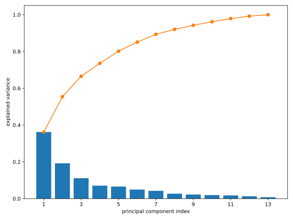
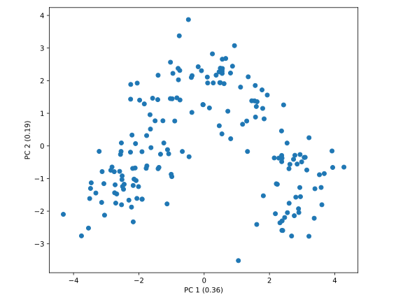
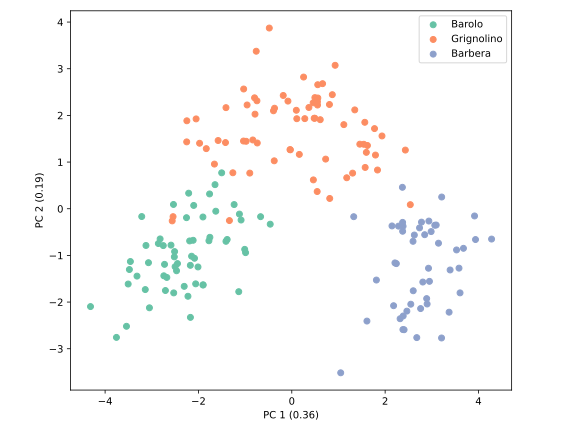

## Hauptkomponentenanalyse

Wir betrachten wieder die Singulärwertzerlegung einer Matrix $\bm{A}$ in der Form
$$
  \bm{A} = \sum_{i=1}^p \sigma_i \vec{u}_ i \vec{v}_ i^\dag
$$
mit Singulärvektoren $\vec{u}_ i$ und $\vec{v}_ i$, sowie Singulärwerten 
$\sigma_i$ (vgl. Gl. {{eqref: eq:singular_value_decomposition}}).
Diese Gleichung suggestiert eine Approximation der Matrix $\bm{A}$ durch 
Abschneiden der Summe nach dem $k$-ten Summanden:
$$
  \bm{A_k} = \sum_{i=1}^k \sigma_i \vec{u}_ i \vec{v}_ i^\dag\,,
$$
wobei wir absteigend sortierte Singulärwerten 
$\sigma_1 \geq \sigma_2 \geq \ldots \geq \sigma_p$ annehmen, und $k < p$.
Man spricht hier von einer Rang-$k$-Approximation der Matrix $\bm{A}$,
da $\bm{A_k}$ aus der Summe von $k$ (linear unabhängigen) Rang-1-Matrizen 
$\vec{u}_ i \vec{v}_ i^\dag$ besteht.
Wie gut ist diese Approximation? Eine Antwort auf diese Frage liefert das
folgende Theorem, welches erstmals von Erhard Schmidt bewiesen wurde:

```admonish note title="Eckart-Young-Theorem"
Sei $\bm{A} \in \C{m}{n}$ eine beliebige Matrix mit der SVD
$\bm{A} = \sum_{i=1}^p \sigma_i \vec{u}_ i \vec{v}_ i^\dag$, wobei 
$p = \min(m,n)$ und $\sigma_1 \geq \sigma_2 \geq \ldots \geq \sigma_p$.
Dann ist die Matrix $\bm{A_k} := \sum_{i=1}^k \sigma_i \vec{u}_ i \vec{v}_ i^\dag$
die **beste** Rang-$k$-Approximation von $\bm{A}$ im Sinne der 
Frobenius-Norm $\|\cdot\|_F$, also
$$
  \|\bm{A} - \bm{A_k}\|_F = \min_{\substack{\bm{B} \in \C{m}{n} \\ \text{rank}(\bm{B}) \leq k}} \|\bm{A} - \bm{B}\|_F\,.
$$

Die Frobenius-Norm einer Matrix $\bm{A} \in \C{m}{n}$ ist definiert als
$$
  \|\bm{A}\|_F = \sqrt{\sum_{i=1}^m \sum_{j=1}^n |a_{ij}|^2}\,.
$$

Der Beweis dieses Theorems erfordert einige Kenntnisse der linearen Algebra,
weswegen wir hier auf den Beweis verzichten. Interessierte können ihn z.B.
[hier](https://en.wikipedia.org/wiki/Low-rank_approximation#Proof_of_Eckart–Young–Mirsky_theorem_(for_Frobenius_norm))
nachlesen.
```


```admonish note title="Eckart-Young-Mirsky-Theorem" collapsible=true
Leon Mirsky konnte die obige Approximationseigenschaft auf beliebig
*unitär invariante Normen* erweitern. 
Eine Norm $\|\cdot\|$ ist *unitär invariant*, wenn für beliebige unitäre
Matrizen $\bm{U}\in \C{m}{m}$ und $\bm{V}\in \C{n}{n}$ die Bedingung
$$
  \|\bm{UAV}\| = \|\bm{A}\|
$$
für alle Matrizen $\bm{A}\in \C{m}{n}$ erfüllt ist.

Einige gebräuchliche unitär invariante Normen seien hier für $\bm{A}\in \C{m}{n}$
mit $p = \min(m,n)$ aufgeführt:
- Die [Frobenius-Norm](https://de.wikipedia.org/wiki/Frobeniusnorm)
  $$
    \|\bm{A}\|_F = \sqrt{\sum_{i=1}^m \sum_{j=1}^n |a_{ij}|^2}
    = \sqrt{\sum_{i=1}^{p} \sigma_i^2}\,,
  $$
- die [Spektralnorm](https://de.wikipedia.org/wiki/Spektralnorm)
  $$
    \|\bm{A}\|_2 = \max_{\|\vec{x}\|_2 = 1} \|\bm{A}\vec{x}\|_2
    = \sigma_1\,,
  $$
- und die [Ky-Fan-Norm](https://en.wikipedia.org/wiki/Matrix_norm#Ky-Fan_norm)
oder auch Spurnorm
  $$
    \|\bm{A}\|_{*} = \sum_{i=1}^{p} \sigma_i\,.
  $$

Alle drei Normen sind Spezialfälle der 
[Schatten-Normen](https://de.wikipedia.org/wiki/Matrixnorm#Schatten-Normen).
```

Das [Eckart-Young-Theorem](https://en.wikipedia.org/wiki/Low-rank_approximation#Basic_low-rank_approximation_problem) besagt also, dass
die SVD nicht nur eine gute Approximation der Matrix $\bm{A}$ liefert,
sondern sogar die **beste** Approximation bis zum Rang $k$ bezüglich der 
Frobenius-Norm ist.

Die SVD liefert uns aber noch mehr als nur eine Approximation der Matrix 
$\bm{A}$. Da die Approximation durch die gewichtete Summe von Rang-1-Matrizen
erfolgt, kann diejenige Rang-1-Matrix korrespondierend zum Größten Singulärwert
$\sigma_1 \vec{u}_ 1 \vec{v}_ 1^\dag$ als die *wichtigste* Komponente, 
die *Hauptkomponente*, der Matrix $\bm{A}$ interpretiert werden.
Der Singulärwert $\sigma_1$ gibt dabei an, wie *wichtig* diese Hauptkomponente
für die Matrix $\bm{A}$ ist. Die weiteren Rang-1-Matrizen 
$\sigma_i \vec{u}_ i \vec{v}_ i^\dag$ mit $i > 1$ können dann als die
nachfolgenden Komponenten interpretiert werden, mit dem jeweiligen
Gewicht $\sigma_i$. Diese Interpretation führt uns zur 
*Hauptkomponentenanalyse* (engl. *Principal Component Analysis*, PCA),
welche in der Praxis häufig zur Dimensionsreduktion von Daten verwendet wird.

### Theoretische Grundlagen

Wir betrachten eine Messung von jeweils $P$ Merkmalen (engl. *features*) an $N$ 
Proben (engl. *samples*), welche durch eine $N \times P$-Matrix 
$\widetilde{\bm{X}}$ repräsentiert wird. Die $i$-te Zeile der Matrix 
$\widetilde{\bm{X}}$ entspricht dabei den $P$ Merkmalen der $i$-ten Probe.

```admonish note title="Die Datenmatrix"
Stellen Sie sich als Beispiel eine Messreihe von $N$ Proben vor (z.B. bei verschiedenen
Konzentrationen), wobei Sie für jede Probe $P$ Merkmale messen (Temperatur, Absorption, 
etc.). Die Datenmatrix $\widetilde{\bm{X}}$ repräsentiert dann Ihre gesamten Messdaten, 
wobei jede Zeile die Merkmale einer Messung enthält.

Wir werden in den folgenden Abschnitten und Kapiteln häufig von dieser Darstellung der 
Daten ausgehen, da sie die Basis für die meisten Methoden der Datenanalyse und des
maschinellen Lernens bildet.
```

Der erste Schritt der PCA ist die Vorverarbeitung der Daten auf eine der folgenden 
zwei Arten: Zentrierung oder Standardisierung. Hierzu
schreiben wir die Datenmatrix $\widetilde{\bm{X}}$ als
$$
  \widetilde{\bm{X}} =
    \begin{pmatrix}
      \text{---}\ \vec{x}_ 1\ \text{---} \\
      \text{---}\ \vec{x}_ 2\ \text{---} \\
      \vdots \\
      \text{---}\ \vec{x}_ N\ \text{---}
    \end{pmatrix}
$$
mit den Messdaten $\vec{x}_ i \in \mathbb{R}^P$. Jeder Datenpunkt ist also 
ein $P$-dimensionaler Vektor, wobei die Features die Basisvektoren darstellen. 
Nun definieren wir den Mittelwert über alle Messungen $\vec{\mu}$ als
$$
  \vec{\mu} = \frac{1}{N} \sum_{i=1}^N \vec{x}_ i\,.
$$
Bei der **Zentrierung** subtrahieren wir von jedem Datenpunkt diesen Mittelwert
$$
  \bm{X} = 
    \begin{pmatrix}
      \text{---}\ (\vec{x}_ 1 - \vec{\mu})\ \text{---} \\
      \text{---}\ (\vec{x}_ 2 - \vec{\mu})\ \text{---} \\
      \vdots \\
      \text{---}\ (\vec{x}_ N - \vec{\mu})\ \text{---}
    \end{pmatrix}\,,
$$ 
um die zentrierte Datenmatrix $\bm{X}$ zu erhalten. Man kann sich leicht davon 
überzeugen, dass die zentrierte Datenmatrix $\bm{X}$ durch
$$
  \bm{X} = \widetilde{\bm{X}} - \frac{1}{N} \mathbf{1}_N \widetilde{\bm{X}} 
  = (\identity_N - \frac{1}{N} \mathbf{1}_N) \widetilde{\bm{X}}
  {{numeq}}{eq:centre_data_matrix}
$$
gegeben ist, wobei $\identity_N$ die $N \times N$-Einheitsmatrix und
$\mathbf{1}_N$ eine $N \times N$-Matrix mit lauter Einsen ist.

Manchmal kommt es vor, dass die Features in unterschiedlichen 
Größenordnungen auftreten, bzw. in unterschiedlichen Einheiten gemessen 
wurden. In diesem Fall ist es sinnvoll, **zusätzlich** zu der Mittelwertsubtraktion
auch eine Normierung der Daten durchzuführen. Die Kombination dieser
zwei Schritte wird als **Standardisierung** bezeichnet.
Nach der Berechnung der Standardabweichung der $j$-ten Features durch
$$
  \sigma_j = \sigma(\{x_{1j}, x_{2j}, \ldots, x_{Nj}\}) = \sqrt{\frac{1}{N} \sum_{i=1}^N (x_{ij} - \mu_j)^2}\,,
$$
kann die standardisierte Datenmatrix $\bm{X}$ durch
$$
  \bm{X} = 
    \begin{pmatrix}
      \text{---}\ (\vec{x}_ 1 - \vec{\mu})\ \text{---} \\
      \text{---}\ (\vec{x}_ 2 - \vec{\mu})\ \text{---} \\
      \vdots \\
      \text{---}\ (\vec{x}_ N - \vec{\mu})\ \text{---}
    \end{pmatrix}
    \begin{pmatrix}
      \sigma_1^{-1} &  &  &  \\
       & \sigma_2^{-1} &  &  \\
       &  & \ddots &  \\
       &  &  & \sigma_P^{-1}
    \end{pmatrix}
$$
berechnet werden. In anderen Worten heißt das, dass die Gesamtheit unserer
Messdaten nun Mittelwert 0 und Standardabweichung 1 haben.
Je nach Art der Daten muss entschieden werden, ob eine Zentrierung
oder Standardisierung durchgeführt werden sollte.

Anschließend berechnen wir die Singulärwertzerlegung der standardisierten
Datenmatrix $\bm{X}$:
$$
  \bm{X} = \bm{U} \bm{\Sigma} \bm{V}^\dag
$$
mit $\bm{U} \in \C{N}{N}$, $\bm{V} \in \C{P}{P}$ und $\bm{\Sigma} \in \R{N}{P}$.
Die Rechts-Singulärvektoren $\vec{v}_ i$ sind die Hauptkomponenten,
die auch als *loadings* bezeichnet werden,
während die Singulärwerte $\sigma_i$ die Gewichtung der jeweiligen
Hauptkomponente angeben. Gebräuchlich ist noch der Varianzanteil
(engl. *explained variance*) $\eta_i$ der $i$-ten Hauptkomponente,
die durch 
$$
  \eta_i = \frac{\sigma_i^2}{\sum_{j} \sigma_j^2}
$$
gegeben ist, wobei die Summe über alle Singulärwerte läuft.

Da die Rechts-Singulärvektoren $\vec{v}_ i$ orthonormal sind, können
wir diese als eine Orthonormalbasis des $P$-dimensionalen Raums interpretieren,
die möglicherweise eine natürlichere Repräsentation der Datenpunkte 
darstellt. 

Die Projektion der Datenpunkte auf die Hauptkomponenten kann
durch das Matrixprodukt 
$$
  \bm{X} \bm{V} = \bm{U} \bm{\Sigma} \bm{V}^\dag \bm{V} = \bm{U} \bm{\Sigma}
$$
berechnet werden. Demnach ist die Projektion der Datenpunkte auf die $i$-te Hauptkomponente
durch das Produkt des $i$-ten Links-Singulärvektors $\vec{u}_ i$ mit
dem $i$-ten Singulärwert $\sigma_i$ gegeben. Diese Projektion
$\vec{u}_ i \sigma_i$ wird auch als *score* der $i$-ten Hauptkomponente
bezeichnet.

Zwar ist die Transformation der Datenpunkte in die Basis der Hauptkomponenten
bereits ein nützliches Werkzeug, die Hauptkomponentenanalyse
kann aber auch zur Dimensionsreduktion verwendet werden. Die Idee ist dabei, dass
wir nur die ersten $k$ Hauptkomponenten behalten und die Datenpunkte in den
$k$-dimensionalen Raum dieser Hauptkomponenten projizieren. Dank des 
Eckart-Young-Theorems wissen wir, dass diese Projektion immer die beste
Beschreibung der ursprünglichen Datenpunkte in einem $k$-dimensionalen Raum
liefert. Also können wir die PCA verwenden, um einen hochdimensionalen Datensatz
mit nur wenigen Hauptkomponenten zu approximieren, ohne dabei zu viel Informationen
über die Daten zu verlieren. Wir werden diesen Aspekt im Kontext des
maschinellen Lernens in einem späteren Kapitel erneut betrachten.

### Implementierung

Wir implementieren die PCA am Beispiel des Weindatensatzes. 
Dieser enthält Messungen von 13 physikalischen und chemischen 
Eigenschaften von insgesamt 178 Weinen aus drei verschiedenen Rebsorten:
Barolo, Grignolino und Barbera. Die ersten Einträge des Datensatzes haben
die folgende Form:
```txt
{{#include ../codes/04-evd_and_svd/wine.csv::10}}
```
und der gesamte Datensatz kann
<a href="../codes/04-evd_and_svd/wine.csv" download>hier</a> heruntergeladen
werden. Die Datei `wine.csv` enthält die Daten im sogenannten
*Comma-Separated Values* (CSV) Format, also mit Werten, die durch Kommata
getrennt sind.

Als erstes importieren wir die benötigten Bibliotheken
```python
{{#include ../codes/04-evd_and_svd/pca_wine.py:imports}}
```
und lesen die Daten aus der Datei `wine.csv` ein:
```python
{{#include ../codes/04-evd_and_svd/pca_wine.py:load_data}}
```
Hier haben wir das Argument `delimiter=','` an die Funktion `np.loadtxt`
übergeben, da die Werte in der Datei nicht wie bisher durch Leerzeichen
getrennt sind.
Zudem haben wir die Labels der Rebsorten (nullte Spalte) in der Variable
`categories` als 0-indizierte Integers gespeichert und somit von den
Eigenschaften der Weine, die wir als Floats in der Variable `features`
gespeichert haben, abgetrennt.

Weitere versteckte Informationen, wie die Namen der Rebsorten
und der gemessenen Eigenschaften, sind für die 
Mathematik zwar nicht relevant, können aber für die Interpretation der
Ergebnisse sehr hilfreich sein. Daher speichern wir diese in Listen:
```python
{{#include ../codes/04-evd_and_svd/pca_wine.py:labels}}
```

Da sich in diesem Datensatz die Größenordnung der Eigenschaften sehr
stark unterscheidet, führen wir eine Standardisierung der Daten durch:
```python
{{#include ../codes/04-evd_and_svd/pca_wine.py:standardise}}
```
Anschließend berechnen wir die Singulärwertzerlegung der standardisierten
Datenmatrix:
```python
{{#include ../codes/04-evd_and_svd/pca_wine.py:svd}}
```
Zusätzlich haben wir die Hauptkomponenten, die Projektion der Datenpunkte
auf die Hauptkomponenten, sowie die Varianzanteile bestimmt.
Die Ergebnisse sehen wie folgt aus:
```python
{{#include ../codes/04-evd_and_svd/pca_wine.py:verify_pca}}
```
Wir sehen, dass zu der ersten Hauptkomponente `pcs[:,0]`, die eine Linearkombination
aller Eigenschaften der Weine ist, die 5., 6. und 11. Eigenschaften
(0-indiziert, also "total phenols", "flavanoids" und 
"OD280/OD315") mit den (betragsmäßig) größten Gewichten beitragen. Diese Hauptkomponente erklärt
bereits ca. 36 % der Varianz der Daten. Mit der zweiten Hauptkomponente
zusammen können ca. 55 % der Varianz erklärt werden. Die Varianzanteile
können wir mit dem folgenden Code visualisieren:
```python
{{#include ../codes/04-evd_and_svd/pca_wine.py:plot_variance}}
```
Hier haben wir die Funktion `np.cumsum` verwendet, um die kumulierten
Summen der Varianzanteile zu berechnen. Der resultierende Plot sieht wie folgt aus:


Da wir Datenpunkte in 2D leicht visualisieren können, plotten wir die
Projektion der Datenpunkte auf die ersten beiden Hauptkomponenten:
```python
{{#include ../codes/04-evd_and_svd/pca_wine.py:plot_pca}}
```
Aufgrund der Standardisierung der Datenpunkte auf die Einheitsvarianz 
ist es sinnvoll, die Hauptkomponenten gleichermaßen
skaliert zu plotten. Aus diesem Grund haben wir die Methode `set_aspect('equal')`
auf die Achsenobjekte angewendet. Der resultierende Plot sieht wie folgt aus:


Da die ersten beiden Hauptkomponenten bereits ca. 55 % der Varianz der Daten
erklären, können wir davon ausgehen, dass wichtige Strukturen des Datensatzes
in dieser 2D-Projektion erhalten sind. In diesem Plot erkennen wir aber 
zunächst nur einen Halbkreis an Punkten, sowie ein "Loch" in der Mitte. Um die Struktur der
Datenpunkte in dieser Projektion besser zu verstehen, können wir die Datenpunkte gemäß den Rebsorten,
die wir für die PCA **nicht** verwendet haben, einfärben:
```python
{{#include ../codes/04-evd_and_svd/pca_wine.py:plot_pca_coloured}}
```
Anstatt einen neuen Plot zu erstellen, haben wir die Farben der Datenpunkte
mit der Methode `set_color` des Plot-Objekts geändert. Und um eine Legende
anzeigen zu lassen, haben wir drei leere Scatter-Plots mit passenden Farben
und Labels erstellt. Der resultierende Plot sieht wie folgt aus:


Wir erkennen jetzt deutlich, dass die Datenpunkte, bis auf wenige Ausnahmen,
in der 2D-Projektion entsprechend ihrer Sorten gut voneinander getrennt sind. Wir haben also eine 
Darstellung gefunden, in welcher wir die Rebsorten anhand der physikalischen und
chemischen Eigenschaften der Weine leicht unterscheiden (d.h. klassifizieren) könnten.

In diesem Abschnitt haben wir gesehen, dass die Kooridnaten der
Datenpunkte in der Basis der Features vollständig bekannt sein müssen, 
um die PCA durchzuführen.
Bei Messdaten ist diese Voraussetzung in der Regel erfüllt, 
aber was ist, wenn wir Daten mit sehr vielen Features
vorliegen haben, z.B. Bilder? Ein kleines Bild mit $100 \times 100$ Pixeln hat
bereits 10000 Features, und ein hochauflösendes Bild mit $1000 \times 1000$
Pixeln hat sogar eine Millionen Features. In diesem Fall würde die Durchführung
der PCA auf die Datenpunkte in der Basis der Pixelwerte sehr viel Resourcen
benötigen. Es wäre in diesem Fall effizienter, wenn wir den  *Abstand* zwischen den
Datenpunkten für die PCA verwendet werden könnten, für den wir nur einen Skalar
für jedes Paar von Datenpunkten berechnen müssten. Eine Abstandsmetrik kann auch 
dann hilfreich sein, wenn keine wirklich sinnvollen Koordinaten für die Datenpunkte
vorliegen, wie z.B. bei Texten oder chemischen Verbindungen.

Tatsächlich lassen sich die Hauptkomponenten allein aus solchen Abständen 
bestimmen. Eine Realisierung bietet die Methode der 
*Hauptkoordinatenanalyse* (engl. *Principal Coordinate Analysis*, PCoA).

---

### Übung

#### Aufgabe 3: PCA mit Eigengesichtern

{{#include ../psets/04.md:aufgabe_3}}
