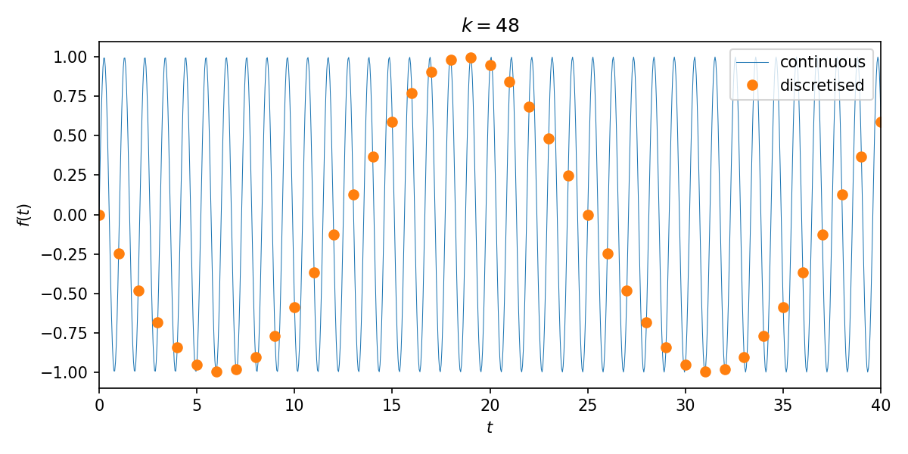
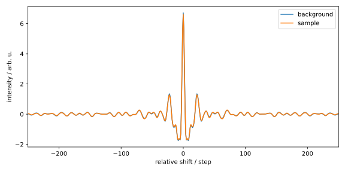
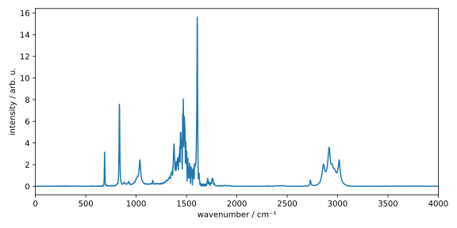

## Diskrete Fourier-Transformation

Wenn wir die Fourier-Transformation in 
Gl. {{eqref: eq:fourier_transform_backward}} (oder auch mit anderer Normierung) 
auf ein Signal am Computer anwenden wollen, gibt es zwei Probleme:
Einerseits ist die Funktion $f(t)$ an (überabzählbar) unendlich vielen 
Stellen definiert und andererseits besteht das Integral von 
$-\infty$ bis $\infty$. Der Computer kann aber nur endlich
viele Werte berechnen und speichern. Deshalb müssen wir die Funktion
diskretisieren und diese nur über ein beschränktes Intervall integrieren.
Dadurch erhalten wir die *diskrete Fourier-Transformation* (DFT).

### Theoretische Grundlagen
Wir wählen zunächst ein gleichmäßiges Zeitgrid 
$\{t_n\}_ {n = 0,\cdots N-1} = \{0, 1, \cdots, N-1\}$ mit Abstand 
$\Delta t = 1$, also $t_n = n$. Möchte man die Funktion an einem anderen
gleichmäßigem Grid evaluieren, kann das durch Verschiebung und Skalierung
der Funktion realisiert werden. Damit wird 
Gl. {{eqref: eq:fourier_transform_backward}} zu
$$
  F^{\mathrm{b}}_ k = \sum_{n=0}^{N-1} f(t_n) \eu^{-\iu \omega_k t_n} \Delta t
  = \sum_{n=0}^{N-1} f_n \eu^{-\iu \omega_k n}\,,
$$
mit $f_n = f(t_n)$, wobei wir die Ersetzung 
$\int \cdot\ \du t \to \sum \cdot\ \Delta t$ vorgenommen haben.

Weil wir die Funktion nur im begrenzten Intervall $[0, N-1]$ kennen, ist die
kleinstmögliche Frequenz (abgesehen von $0$) die Grundfrequenz $\omega_1 = 2\pi/N$.
Damit gilt $\omega_k = 2\pi k/N$ für $k = 0, \cdots, N-1$.
Die *diskrete Fourier-Transformation mit Rückwärtsnormierung* ist demnach durch
$$
  F^{\mathrm{b}}_ k = \sum_{n=0}^{N-1} f_n \eu^{-\iu 2\pi \frac{k}{N} n}
  {{numeq}}{eq:dft_backward}
$$
gegeben. 

Man kann sich leicht davon überzeugen, dass bei der Rücktransformation in diesem
Fall ein Normierungsfaktor von $1/N$ notwendig ist, also
$$
  f_n = \frac{1}{N} \sum_{k=0}^{N-1} F^{\mathrm{b}}_ k \eu^{\iu 2\pi \frac{k}{N} n}\,.
  {{numeq}}{eq:idft_backward}
$$
Gl. {{eqref: eq:idft_backward}} beschreibt die 
*inverse diskrete Fourier-Transformation*. In Analogie zu der 
kontinuierlichen Fourier-Transformation kann man hier auch 
Vorwärtsnormierung und symmetrische Normierung definieren, die wir
hier nicht explizit aufführen werden.
Da wir in diesem Kurs haupsächlich mit der Rückwärtsnormierung arbeiten
werden, einigen wir uns darauf, dass $F_k = F^{\mathrm{b}}_ k$ ist, wenn
nicht explizit anders angegeben.

Obwohl wir auf den ersten Blick vermuten, Kreisfrequenzen bis zu $2\pi \frac{N-1}{N}$
analysieren zu können, bringt die Diskretisierung des ursprünglichen Signals
eine Schwierigkeit mit sich. Um dieses Problem zu verstehen, betrachten wir
das Signal $f(t) = \sin(2\pi \frac{48}{50} t)$, welches eine Kreisfrequenz
$2\pi \frac{48}{50}$ besitzt. Bei $N = 50$ Punkten korrespondiert dies mit $k = 48$:

Obwohl das stetige Signal (blau) eine höhere Frequenz hat, kann diese durch 
die sehr grobe Diskretisierung (orange) nicht dargestellt werden. 
Das diskretisierte Signal suggeriert eine deutlich niedrigere Frequenz, welche
in diesem Fall $2\pi \frac{2}{50}$ ist. 

Tatsächlich können Kreisfrequenzen, die größer sind als die halbe Abtastfrequenz 
(hier also etwa $\pi$), nicht mehr dargestellt werden.
Die folgende Animation zeigt das diskretisierte Signal für $k = 0, \cdots, 49$:

<p>
  
</p>


<input id="val_dft" type="range" min="0" max="49" value="0" step="1" oninput="showVal(this.value)" onchange="showVal(this.value)" style="width: 100%;"/>
<!--
<span id="range">0</span>
-->

<script>
    var basePath = "../assets/figures/03-fourier_analysis/dft_sampling_figures/";
    var val = document.getElementById("val_dft").value;
    // document.getElementById("range").innerHTML=val;
    document.getElementById("dft_anim").src = basePath + String(val).padStart(4, "0") + ".png";
    function showVal(newVal){
    //     document.getElementById("range").innerHTML=newVal;
        document.getElementById("dft_anim").src = basePath + String(newVal).padStart(4, "0") + ".png";
    }
</script>

Es kann gezeigt werden, dass abhängig von der Anzahl der Datenpunkte $N$ folgende
Beziehung gilt:
$$
  \omega = \begin{cases}
    \frac{2\pi}{N\cdot \Delta t} 
      (0, 1, \cdots, \frac{N}{2} - 1, -\frac{N}{2}, \cdots, -1)^\intercal & \text{für } N \text{ gerade} \\
    \frac{2\pi}{N\cdot \Delta t} 
      (0, 1, \cdots, \frac{N-1}{2}, -\frac{N-1}{2}, \cdots, -1)^\intercal & \text{für } N \text{ ungerade}
  \end{cases}
  {{numeq}}{eq:dft_frequencies}
$$

Das bedeutet, dass die obere Hälfte des Spektrums eben nicht die höheren
Kreisfrequenzen repräsentiert, sondern die negativen Frequenzen. 
Der Faktor $1/\Delta t$ in Gl. {{eqref: eq:dft_frequencies}} 
berücksichtigt dabei die Skalierung des Zeitgrids im Fall $\Delta t \neq 1$.

Mit den Gleichungen {{eqref: eq:dft_backward}} und 
{{eqref: eq:dft_frequencies}} können wir die 
diskrete Fourier-Transformation nun implementieren.

### Implementierung
Wir implementieren die diskrete Fourier-Transformation am Beispiel der
Fourier-Transformations-Infrarot-Spektroskopie (FTIR-Spektroskopie).
Ohne im Detail auf die Theorie der FTIR-Spektroskopie einzugehen, 
lässt sich sagen, dass das IR-Spektrum mit dieser Methode nicht durch
die schrittweise Änderung der Wellenlänge des Lichts, welches durch die Probe
geleitet wird, erhalten wird, sondern durch die Fourier-Transformation
eines Interferogramms. Dieses erhält man, indem man Licht durch ein 
Interferometer schickt, wobei das Interferenzmuster der Lichtstrahlen 
gemessen werden, während ein beweglicher Spiegel die Weglänge $x$ der Strahlen verändert.
Für das IR-Spektrum gilt also
$$
  S(\widetilde{\nu}) \propto \mathcal{F}\{I(x)\}(\widetilde{\nu})\,,
$$
wobei $I(x)$ das gemessene Interferogramm und $S(\tilde{\nu})$ das gewünschte
IR-Spektrum ist. Das Symbol $\mathcal{F}$ steht natürlich für die 
(diskrete oder kontinuierliche) Fourier-Transformation. Ein möglicher Vorfaktor
ist hier nicht relevant.

Sie finden hier das Interferogramm der
<a href="../codes/03-fourier_analysis/ir_bg.txt" download>Hintergrundmessung</a> und der
<a href="../codes/03-fourier_analysis/ir_spl.txt" download>Probemessung</a> eines
FTIR-Spektrometers.
Der Anfang der Datei der Hintergrundmessung (`ir_bg.txt`) sieht wie folgt aus:
```
{{#include ../codes/03-fourier_analysis/ir_bg.txt:0:10}}
```
Die Datei enthält zwei Spalten, wobei die erste die Verschiebung, bzw. Anzahl der
Schritte angibt und die zweite der Intensität entspticht. Die Datei der Probemessung
(`ir_spl.txt`) ist analog aufgebaut. Bei dem verwendeten Spektrometer beträgt
die Schrittweite 0.3165&nbsp;&mu;m.

Zunächst importieren wir die benötigten Bibliotheken und definieren die
Schrittweite als Konstante `XSTEP`:
```python
{{#include ../codes/03-fourier_analysis/ftir.py:imports}}
```
Anschließend importieren wir die Messdaten:
```python
{{#include ../codes/03-fourier_analysis/ftir.py:import_data}}
```
Da wir die Hintergrundmessung von der Probemessung abziehen müssen,
sollten wir sicherstellen, dass die Verschiebungen des Interferometers `dx` in beiden
Messungen übereinstimmen, was mit dem `assert`-Befehl überprüft haben.
Wir können die Inteferogramme, sowie deren Differenz anschließend plotten:
```python
{{#include ../codes/03-fourier_analysis/ftir.py:plot_interferograms}}
```
Um die Details zu erkennen, haben wir den Bereich des Plots auf
$-200$ bis $200$ Schritte beschränkt. Die resultierende Diagramme sehen wir hier:


Die Interferogramme der Hintergrund- und Probemessung sehen extrem ähnlich aus
und unterscheiden sich in ihrer Intensität nur minimal. Das Differenzsignal, 
welches das Signal der reinen Probe darstellt, ist auf der recht Seite 
gezeigt und muss im Folgenden Fourier-transformiert werden:
```python
{{#include ../codes/03-fourier_analysis/ftir.py:dft_signal}}
```
Dazu wurde zunächst das Nullarray
`int_nu` mit der Länge der Messdaten erstellt. Beachten Sie dabei, dass wir den
Datentyp `complex` verwenden müssen, da die Fourier-Transformation
komplexe Zahlen zurückgibt. Danach haben wir mit 
[np.arange](https://numpy.org/doc/stable/reference/generated/numpy.arange.html)
das Array $(0, 1, \cdots, N-1)$ erstellt, über welches wir iteriert haben, um gemäß
Gl. {{eqref: eq:dft_backward}} die diskrete Fourier-Transformation zu berechnen.

Danach berechnen wir die "Frequenzen" gemäß Gl. {{eqref: eq:dft_frequencies}}.
Hier sollten wir aber eine kleine Anpassung vornehmen: Da unser Ausgangssignal
in Abhängigkeit der Verschiebung $x$ gemessen wurde und nicht der Zeit $t$, entspricht die 
reziproke Größe der Wellenzahl $\widetilde{\nu} = 1/x$, bzw. der Länge des
Wellenvektors $k = 2\pi/x$. Weil das IR-Spektrum konventionell in Abhängigkeit
der Wellenzahl dargestellt wird, sollten wir den Vorfaktor $2\pi$ in
Gl. {{eqref: eq:dft_frequencies}} durch $1$ ersetzen. Das führt zu der 
folgenden Implementierung:
```python
{{#include ../codes/03-fourier_analysis/ftir.py:dft_freq}}
```
Hier haben wir mit Hilfe der `if`-`else`-Anweisung die Fallunterscheidung zwischen
geradem und ungeradem `nx` berücksichtigt. Dabei wurden den positiven
und negativen Frequenzanteilen separat berechnet. Am Ende haben wir diese
mit der Funktion `np.concatenate` zusammengefügt.

Weil es angenehmer ist, mit monoton aufsteigenden Wellenzahlen zu arbeiten, sortieren
wir im Anschluss der Fourier-Transformation die Wellenzahlen und das Spektrum:
```python
{{#include ../codes/03-fourier_analysis/ftir.py:dft_shift}}
```
Die Funktion
[np.argsort](https://numpy.org/doc/stable/reference/generated/numpy.argsort.html)
gibt dabei die Indizes der sortierten Werte zurück. Mit diesen Indizes können wir
dann andere Arrays gemäß dieser Sortierung ebenfalls sortieren.

Wenn wir uns an die "Herleitung" der DFT erinnern, haben wir dabei angenommen, 
dass die Funktion $f(t)$ an den Stellen $t = 0, 1, \cdots, N-1$ gesampelt wurde.
In unserem Fall startet die Verschiebung aber bei $-8191 \cdot 0.3165$&nbsp;\[&mu;m\]
und das Intervall zwischen den Schritten beträgt 0.3165&nbsp;\[&mu;m\].
Deshalb müssen wir die ursprüngliche Funktion skalieren und verschieben, um
die korrekte Fourier-Transformation zu erhalten. Dabei helfen uns die
folgenden Beziehungen:
$$
  \begin{align}
    \mathcal{F}\{f(t - b)\} &= \eu^{-\iu b \omega} F(\omega)\,,
    {{numeq}}{eq:fourier_properties_shift} \\
    \mathcal{F}\{f(a t)\} &= \frac{1}{|a|} F\left(\frac{\omega}{a}\right)\,,
    {{numeq}}{eq:fourier_properties_scale}
  \end{align}
$$
die leicht nachzuprüfen sind, wobei $F(\omega) = \mathcal{F}\{f(t)\}$. Die Gl. 
{{eqref: eq:fourier_properties_scale}} 
besagt, dass eine Skalierung des Arguments der Funktion $f(t)$ zu einer
Skalierung des Arguments und des Betrags der Fourier-Transformierten führt.
Während diese Beziehung den Vorfaktor $1/\Delta t$ in Gl. {{eqref: eq:dft_frequencies}}
erklärt, können wir sie in unserem Fall ignorieren, da uns
die absolute Skalierung des Spektrums nicht interessiert. 
Die Gl. {{eqref: eq:fourier_properties_shift}} besagt, dass eine Verschiebung
im Zeitraum um $b$ zu einer Multiplikation der Fourier-Transformierten mit
dem Phasenfaktor $\eu^{-\iu b \omega}$ führt. Weil die DFT die 
Ausgangsfunktion ab $0$ auswertet, müssten wir sie um 
$-8191 \cdot 0.3165$&nbsp;\[&mu;m\] verschieben, was in unserer 
Implementierung in `x_grid[0]` gespeichert ist. Das führt zu der folgenden
Manipulation im Fourier-Raum:
```python
{{#include ../codes/03-fourier_analysis/ftir.py:signal_shift}}
```
Hier haben wir den *In-place*-Operator `*=` verwendet, um die Werte von
`int_nu` direkt zu ändern. Es kann gezeigt werden, dass die 
Fourier-Transformierte einer symmetrischen Funktion reell ist, was wir 
hier mit dem `assert`-Befehl überprüfen. Dabei wird das Attribut `imag`
eines komplexen Arrays verwendet, um dessen Imaginärteil zu erhalten.

Eine letzte kosmetische Anpassung ist die Änderung der Einheit von 
`nu` von $\mathrm{m^{-1}}$ zu $\mathrm{cm^{-1}}$:
```python
{{#include ../codes/03-fourier_analysis/ftir.py:nu_conversion}}
```
Hier wurde der In-place-Operator `/=` verwendet, um die Werte von `nu` direkt
durch $100$ zu teilen.

Endlich können wir das IR-Spektrum plotten:
```python
{{#include ../codes/03-fourier_analysis/ftir.py:plot_spectrum}}
```
Dabei haben wir mit Hilfe des Attributs `real` den Realteil des Spektrums erhalten.
Außerdem haben wir den Plotbereich auf $0$ bis $4000\ \mathrm{cm^{-1}}$ beschränkt.
Das Spektrum sieht wie folgt aus:


Wir erkennen deutlich die aromatische C-C-Streckschwingung bei etwa 
$1600\ \mathrm{cm^{-1}}$ sowie aromatische und aliphatische 
C-H-Streckschwingungen um $3000\ \mathrm{cm^{-1}}$. Weiterhin sehen wir
noch Gerüstschwingungen im Fingerprint-Bereich. Es handelt sich hierbei
im Übrigen um ein IR-Spektrum von Mesitylen.

Bei einem so bedeutenden Algorithmus wie der diskrete Fourier-Transformation
bietet NumPy selbstverständlich eine eigene Implementierung. Diese können wir
mit der Funktion
[`np.fft.fft`](https://numpy.org/doc/stable/reference/generated/numpy.fft.fft.html)
wie folgt aufrufen:
```python
{{#include ../codes/03-fourier_analysis/ftir.py:numpy_fft}}
```
Das Umsortieren der Frequenzen und des Spektrums erfolgt automatisch mit der Funktion
[`np.fft.fftshift`](https://numpy.org/doc/stable/reference/generated/numpy.fft.fftshift.html):
```python
{{#include ../codes/03-fourier_analysis/ftir.py:numpy_fftshift}}
```

Es wird Ihnen vielleicht auffallen, dass die NumPy-Implementierung deutlich 
schneller ist als unsere eigene. Das liegt einerseits daran,
dass NumPy in C/C++ geschrieben ist und deshalb grundsätzlich schneller arbeitet als Python. 
Andererseits liegt es daran, dass in NumPy eine effiziente Implementierung der
diskreten Fourier-Transformation, die sog. *Fast Fourier Transformation* (FFT), 
verwendet wird. Unsere Implementierung der DFT hat eine Komplexität von
$\mathcal{O}(N^2)$, d.h., dass die
die Laufzeit quadratisch mit der Anzahl der Punkte $N$ steigt. Die FFT hat dagegen eine Komplexität
von lediglich $\mathcal{O}(N \log N)$.

Dabei sei gesagt, dass die FFT keine Nährung der DFT ist, sondern eine exakte Implementierung. Wir 
können die Skalierungen der Intensitäten und Frequenzen aus der FFT analog
anwenden und die Ergebnisse mit denen unserer eigener Implementierung vergleichen:
```python
{{#include ../codes/03-fourier_analysis/ftir.py:numpy_verification}}
```

---

### Übung

#### Aufgabe 1: IR-Spektrum von Mesitylen aus Molekulardynamik-Simulation

{{#include ../psets/03.md:aufgabe_1}}

#### Aufgabe 2: Eigenschaften der Fourier-Transformation

{{#include ../psets/03.md:aufgabe_2}}

#### Zusatzaufgabe: Matrix- und Vektormultiplikation

{{#include ../psets/03.md:aufgabe_3}}

