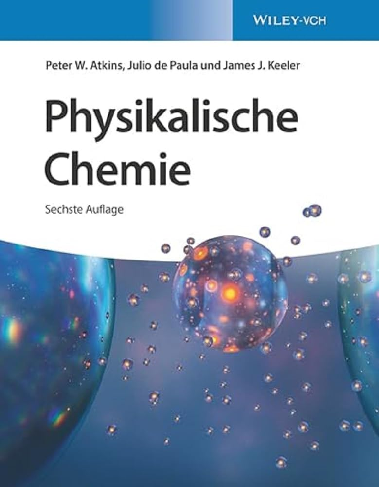
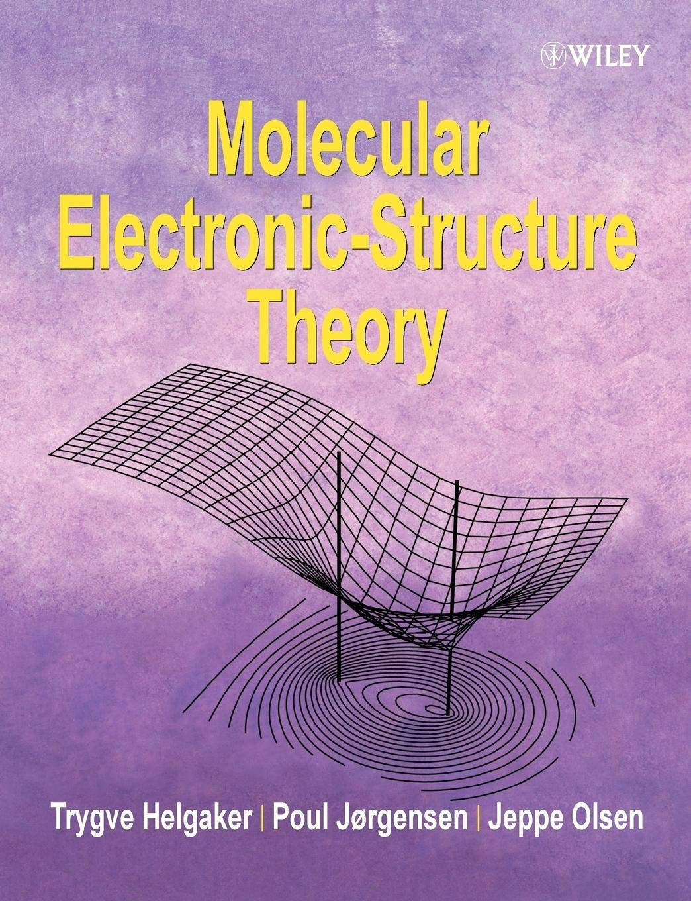
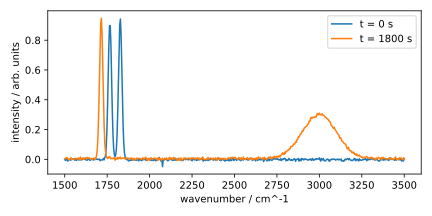
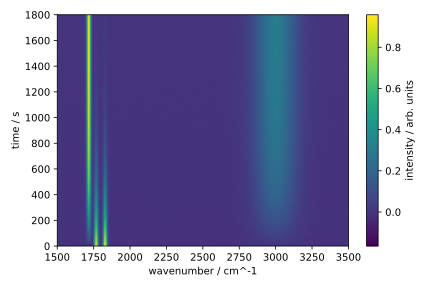
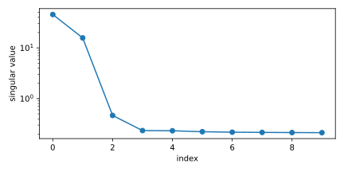
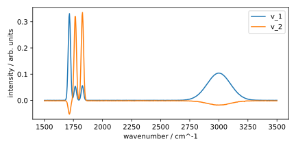

## Low-rank Approximation

Let us take a closer look at the singular value decomposition of a matrix
$\bm{A}$ of the form
$$
  \bm{A} = \sum_{i=1}^p \sigma_i \vec{u}_ i \vec{v}_ i^\dag
$$
with singular vectors $\vec{u}_ i$ and $\vec{v}_ i$, and singular values
$\sigma_i$ (see Eq. {{eqref: eq:singular_value_decomposition}}).
This equation suggests an approximation of the matrix $\bm{A}$ by
truncating the sum after the $k$-th term:
$$
  \bm{A_k} = \sum_{i=1}^k \sigma_i \vec{u}_ i \vec{v}_ i^\dag\,,
$$
where we assume descendingly sorted singular values
$\sigma_1 \geq \sigma_2 \geq \ldots \geq \sigma_p$, and $k < p$.
We speak here of a rank-$k$ approximation of the matrix $\bm{A}$,
since $\bm{A_k}$ consists of the sum of $k$ (linearly independent) rank-1 matrices
$\vec{u}_ i \vec{v}_ i^\dag$.

How good is this approximation? An answer to this question is given by the

```admonish note title="Schmidt Decomposition Theorem"
Let $\bm{A} \in \C{m}{n}$ be an arbitrary matrix with the SVD
$\bm{A} = \sum_{i=1}^p \sigma_i \vec{u}_ i \vec{v}_ i^\dag$, where
$p = \min(m,n)$ and $\sigma_1 \geq \sigma_2 \geq \ldots \geq \sigma_p$.
Then the matrix $\bm{A_k} := \sum_{i=1}^k \sigma_i \vec{u}_ i \vec{v}_ i^\dag$
is the **best** rank-$k$ approximation of $\bm{A}$ in the sense of the
Frobenius norm $\|\cdot\|_F$, i.e.
$$
  \|\bm{A} - \bm{A_k}\|_F = \min_{\substack{\bm{B} \in \C{m}{n} \\ \text{rank}(\bm{B}) \leq k}} \|\bm{A} - \bm{B}\|_F\,.
$$

The Frobenius norm of a matrix $\bm{A} \in \C{m}{n}$ is defined as
$$
  \|\bm{A}\|_F = \sqrt{\sum_{i=1}^m \sum_{j=1}^n |a_{ij}|^2}\,.
$$
The proof of this theorem requires some knowledge of linear algebra,
which is why we will not provide it here. Interested readers can find the proof
e.g. [here](https://en.wikipedia.org/wiki/Low-rank_approximation#Proof_of_Eckart–Young–Mirsky_theorem_(for_Frobenius_norm)).
```

The original theorem proven by Erhard Schmidt in 1907 is more general than
the one stated here[^1]. Its application to (finite-dimensional) matrices
was rediscovered by Eckart and Young in 1936[^2], and
is thus often called the *Eckart-Young theorem*.

A generalisation of the Eckart-Young theorem to some other norms was 
given by Leonid Mirsky in 1960[^3], which is why the theorem is somtimes 
referred to as the *Eckart-Young-Mirsky theorem*.

```admonish note title="Generalisation by Mirsky" collapsible=true
Leonid Mirsky was able to extend the above approximation property
to arbitrary *unitarily invariant norms*.
A norm $\|\cdot\|$ is *unitarily invariant* if for arbitrary unitary
matrices $\bm{U}\in \C{m}{m}$ and $\bm{V}\in \C{n}{n}$ the condition
$$
  \|\bm{UAV}\| = \|\bm{A}\|
$$
holds for all matrices $\bm{A}\in \C{m}{n}$.

Some common unitarily invariant norms for $\bm{A}\in \C{m}{n}$
with $p = \min(m,n)$ are:
- The [Frobenius norm](https://en.wikipedia.org/wiki/Matrix_norm#Frobenius_norm)
  $$
    \|\bm{A}\|_F = \sqrt{\sum_{i=1}^m \sum_{j=1}^n |a_{ij}|^2}
    = \sqrt{\sum_{i=1}^{p} \sigma_i^2}\,,
  $$
- the [spectral norm](https://en.wikipedia.org/wiki/Matrix_norm#Spectral_norm)
  $$
    \|\bm{A}\|_2 = \max_{\|\vec{x}\|_2 = 1} \|\bm{A}\vec{x}\|_2
    = \sigma_1\,,
  $$
- and the [nuclear norm](https://en.wikipedia.org/wiki/Matrix_norm#Schatten_norms)
or trace norm
  $$
    \|\bm{A}\|_{*} = \sum_{i=1}^{p} \sigma_i\,.
  $$
All three norms are special cases of the
[Schatten norms](https://en.wikipedia.org/wiki/Matrix_norm#Schatten_norms).
```

[^1]: E. Schmidt, *Math. Ann.* **1907**, *63*, 433–476.
[^2]: C. Eckart, G. Young, *Psychometrika* **1936**, *1*, 211–218.
[^3]: L. Mirsky, *Q. J. Math.* **1960**, *11*, 50–59.

### Example 1: Book Ratings

Suppose some chemistry students are asked to rate different textbooks
using 1, 2, 3, 4 or 5 stars. A sample with 7 students and 5 textbooks
could look like this:

|  |  |  |  |  |
|:---:|:---:|:---:|:---:|:---:|
|**Atkins**|**Szabo & Ostlund**|**Helgaker**|**Clayden**|**Klein**|
|**1**|**1**|**1**|  0  |  0  |
|**3**|**3**|**3**|  0  |  0  |
|**4**|**4**|**4**|  0  |  0  |
|**5**|**5**|**5**|  0  |  0  |
|  0  |**2**|  0  |**4**|**4**|
|  0  |  0  |  0  |**5**|**5**|
|  0  |**1**|  0  |**2**|**2**|

The number 0 is used to mark books that the rating student did not read.

This dataset can be viewed as a matrix
$$
\bm{A} = 
\begin{pmatrix}
  1 & 1 & 1 & 0 & 0 \\
  3 & 3 & 3 & 0 & 0 \\
  4 & 4 & 4 & 0 & 0 \\
  5 & 5 & 5 & 0 & 0 \\
  0 & 2 & 0 & 4 & 4 \\
  0 & 0 & 0 & 5 & 5 \\
  0 & 1 & 0 & 2 & 2
\end{pmatrix}\,.
$$
We shall now apply SVD to this matrix.

```python
{{#include ../codes/04-evd_and_svd/book_rating.py:imports}}
```
```python
{{#include ../codes/04-evd_and_svd/book_rating.py:svd}}
```

The singular values are 12.48, 9.51, 1.35, 0.00 and 0.00, meaning that 
this matrix only has a rank of 3, although a $7 \times 5$ matrix could
potentially have a rank of 5. 
Therefore, there is an exact rank-3 representation of the original matrix,
and actually, SVD can be used to find this representation.
```python
{{#include ../codes/04-evd_and_svd/book_rating.py:exact_recon}}
```

Furthermore, since the third singular value is "much" smaller
compared to the other two, it might be possible to contruct a
satisfactory rank-2 approximation of this matrix.
```python
{{#include ../codes/04-evd_and_svd/book_rating.py:approx_recon}}
```
The rank-2 approximation thus has a 
**M**ean **A**bsolute **E**rror (MAE) of 0.125, a
**R**oot **M**ean **S**quared **E**rror (RMSE) of 0.227, and a
**Max**imum **A**bsolute **E**rror (MaxAE) of 0.734.
Depending on the application, this might be a good approximation.

We will now try to make sence of the singular vectors.
To this end, the SVD of the data matrix $\bm{A}$ is visualised
in the following figure(s).

<div align="center">
  <div id="carousel">
    
    <div>
      <button id="prev" aria-label="Previous image">&larr;</button>
      <button id="next" aria-label="Next image">&rarr;</button>
    </div>
  </div>
</div>

<script>
  (function() {
    // List your image URLs here:
    var images = [
      '../assets/figures/04-evd_and_svd/book_svd_1.png',
      '../assets/figures/04-evd_and_svd/book_svd_2.png',
      '../assets/figures/04-evd_and_svd/book_svd_3.png',
      '../assets/figures/04-evd_and_svd/book_svd_4.png',
      '../assets/figures/04-evd_and_svd/book_svd_5.png'
    ];

    var idx = 0;
    var imgEl = document.getElementById('carousel-image');
    var prevBtn = document.getElementById('prev');
    var nextBtn = document.getElementById('next');

    function showImage(i) {
      idx = (i + images.length) % images.length;
      imgEl.src = images[idx];
    }

    prevBtn.addEventListener('click', function() {
      showImage(idx - 1);
    });

    nextBtn.addEventListener('click', function() {
      showImage(idx + 1);
    });

    // initialize
    // showImage(0);
    showImage(images.length - 1);
  })();
</script>

Since a full SVD is computed, there are 7 left singular vectors
and 5 right singular vectors. The "excess" left singular vectors
does not have direct connections to the data set, and can therefore
be ignored for the interpretation.
Among the other 5 singular vectors, two of them correspond to a singular value
of 0, and therefore do not contribute to the decomposition either.
The remaining 3 singular vectors that are relevant for the decomposition
are marked with dark pink and dark blue in the figure above. 

We now mark the elements which are large in magnitude in the left and right
singular vectors. In the right singular vectors, we see emphasis on the
first three elements for $\vec{v}_1$, and on the last two elements
for $\vec{v}_2$. By taking a closer look at the textbooks, we see that
$\vec{v}_1$ corresponds to the textbooks *Atkins*, *Szabo & Ostlund* and *Helgaker*,
which are of the topics *physical chemistry* and *quantum chemistry*, 
while $\vec{v}_2$ corresponds to the textbooks *Clayden* and *Klein*, which are
of the topic *organic chemistry*. The third right singular vector
$\vec{v}_3$ has a large element corresponding to the textbook *Szabo & Ostlund*.
One can understand the singular vectors as "concepts". The right singular
vectors describe concepts of the columns, and are thus textbook concepts
in this case.

In the left singular vectors, we see that $\vec{u}_1$ has large elements
for the first four students, while $\vec{u}_2$ has large elements for the
last three students. Knowing the concepts of the right singular vectors,
we know that $\vec{u}_1$ corresponds to students who are interested in
physical and quantum chemistry, while $\vec{u}_2$ corresponds to students
who are interested in organic chemistry.
The third singular vector $\vec{u}_3$ is a bit more difficult to interpret.
With the knowledge of the right singular vector $\vec{v}_3$, which
corresponds to the textbook *Szabo & Ostlund*, we can see that
the positive large elements in $\vec{u}_3$ correspond to the students
who rated this textbook, while the negative large elements correspond to
the students who did not rate this textbook.

This example shows that the SVD can be used to find low-rank approximations 
of a matrix, and that the singular vectors
can be interpreted as concepts of the columns and rows of the matrix.
The importance of these concepts is given by the singular values.

### Example 2: Molecular Spectroscopy

To name a more chemistry-related example, we shall showcase the application
of SVD to analyse a dataset of molecular spectra.
The (synthetic) dataset represents the time-resolved infrared (IR) spectra
of the chemical reaction
$$
  \mathrm{Ac_2 O} + \mathrm{H_2 O} \rightarrow 2 \mathrm{AcOH}\,,
$$
i.e. the hydrolysis of acetic anhydride to acetic acid.
The "measurements" were taken at 361 uniformly spaced time points
between 0 and 1800 seconds, and each IR spectrum was recorded
between 1500 and 3500&nbsp;cm$^{-1}$ with a resolution of 4&nbsp;cm$^{-1}$.
The dataset can be downloaded from 
[here](../codes/04-evd_and_svd/trir.npy).

After importing the necessary libraries, we can load the dataset using
[`np.load`](https://numpy.org/doc/stable/reference/generated/numpy.load.html).
```python
{{#include ../codes/04-evd_and_svd/analyse_trir.py:imports}}
```
```python
{{#include ../codes/04-evd_and_svd/analyse_trir.py:load_dataset}}
```
This dataset is stored in a so-called *binary format*,
which is a more efficient way to store large datasets than a text file.
However, it is not human-readable, and therefore not suitable for
publication. Also, because many programs define their own binary formats,
the dataset is not portable, i.e. it can only be read by programs
that know the format. Text files, on the other hand, are human-readable
and portable, but less efficient for large datasets.

The dataset is a 2D array with shape `(361, 526)`, where the first dimension
corresponds to the time points, and the second dimension corresponds to
the wavenumbers. At first, we plot the IR spectra at the first and last time point
to get an idea of the data.
```python
{{#include ../codes/04-evd_and_svd/analyse_trir.py:plot_slices}}
```
The following figure shows the results of this code snippet.
<div align="center">
  
</div>
The first spectrum at 0 seconds shows the reactant acetic anhydride,
featuring two strong carbonyl bands at 1770&nbsp;cm$^{-1}$ and 
1830&nbsp;cm$^{-1}$, while the last spectrum at 1800 seconds 
shows the product acetic acid with one carbonyl band at 
1720&nbsp;cm$^{-1}$ and one broad O–H band at around 3000&nbsp;cm$^{-1}$.
Both spectra are quite noisy.

Now, we can visualise the entire dataset as a 2D image, where the x-axis 
corresponds to the wavenumbers and the y-axis corresponds to the time points.
The intensity is represented by the colour.
```python
{{#include ../codes/04-evd_and_svd/analyse_trir.py:plot_trir}}
```
We utilised the function
[`plt.imshow`](https://matplotlib.org/stable/api/_as_gen/matplotlib.pyplot.imshow.html)
to plot the dataset as an image, which is a common way to visualise
2D data. The argument `aspect='auto'` ensures that the aspect ratio
is not fixed, allowing the image to fill the entire figure area.
The argument `origin='lower'` ensures that the origin of the y-axis
is at the bottom. If one would like to visualise a matrix, the option
`origin='upper'` is often used. The argument `cmap='viridis'` sets the
[colormap](https://matplotlib.org/stable/users/explain/colors/colormaps.html),
which converts the intensity values to colours.
Because the array `trir` is oblivious to the range of the wavenumbers 
and time points, we set the x-axis and y-axis limits manually
through the arguments `extent`. Here, it is set to the range of the
wavenumbers from 1500 to 3500 cm$^{-1}$, and the time points from
0 to 1800 seconds. To be precise, the `extent` argument
should be set to the range given here extended by half the step size
of the wavenumbers and time points, respectively. But since a lot of
points are plotted, the error is negligible.
A colour bar is added to the right side of the image
to indicate the intensity values, which is done by calling
[`fig.colorbar`](https://matplotlib.org/stable/api/_as_gen/matplotlib.figure.Figure.colorbar.html)
on the figure object `fig2`.
The resulting figure is shown below.
<div align="center">
  
</div>

From the time-resolved IR spectra, we can see that the two carbonyl bands
of acetic anhydride fade away, while the carbonyl band of acetic acid
grows in intensity. The O–H band of acetic acid also grows in intensity.

We can now treat the dataset as a matrix and apply SVD to it.
Afterwards, we plot the 10 largest singular values.
```python
{{#include ../codes/04-evd_and_svd/analyse_trir.py:elbow_plot}}
```
Because the singular values are sorted in descending order, we can simply
plot the first 10 singular values. Since they span several 
orders of magnitude in this example, we use a logarithmic scale
for the y-axis by calling `ax.set_yscale('log')`. 
The resulting figure is shown below.
<div align="center">
  
</div>

We can see that the first two singular values are orders of magnitude larger
than all the others, which suggests that the dataset can be well approximated
by a rank-2 matrix. Actually, if the synthetic dataset were noise-free,
the rank-2 approximation would be exact.

We can now plot the first two right singular vectors.
```python
{{#include ../codes/04-evd_and_svd/analyse_trir.py:plot_singular_vectors}}
```
<div align="center">
  
</div>

This figure might look very familiar. You would be right, it is almost
the same as the first figure we created with the spectra measured
at the first and last time point. Without any knowledge of the chemical
reaction, the SVD extracted something resembling the spectra of the 
reactant and product. 

Although this does not seem to be very helpful in this case, since we can
obtain the reactant and product spectra from the first and last time point
of the dataset. However, the SVD analysis offers at least two advantages.
First, for more complicated reactions with intermediates, directly
reading off the spectra from the time points might not be possible.
In this case, the SVD could help us identify the spectra of the intermediates.
Second, notice that the right singular vectors appear to be noise-free,
which is a result of the SVD filtering out the noise in the dataset.
If the noise is uncorrelated with the signal, the SVD can effectively
separate it into its own singular vectors. For noises that are weaker
than the signal, their singular vectors will have small singular values,
and thus can be removed from the dataset by truncating the SVD.

