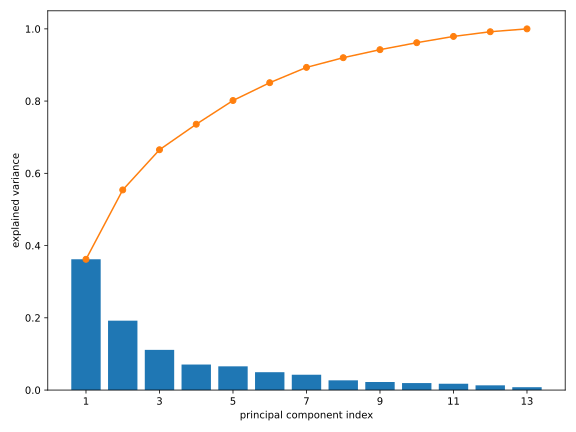
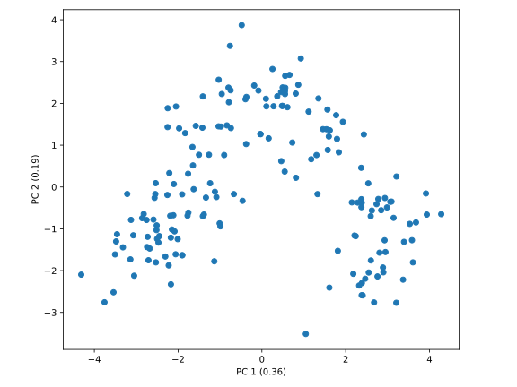
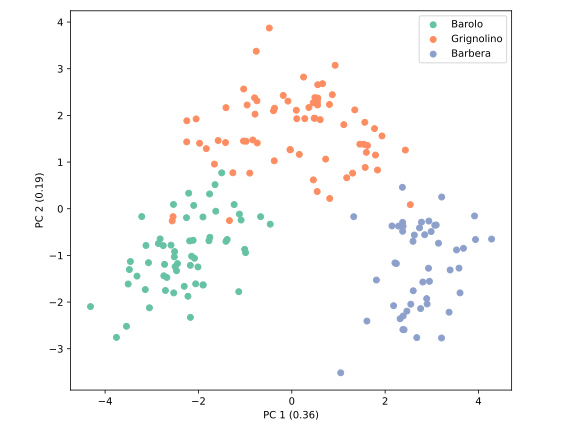

## Hauptkomponentenanalyse

Die Singulärwertzerlegung einer Matrix $\bm{A}$ in der Form
$$
  \bm{A} = \sum_{i=1}^p \sigma_i \vec{u}_ i \vec{v}_ i^\dag
$$
mit Singulärvektoren $\vec{u}_ i$ und $\vec{v}_ i$ sowie Singulärwerten 
$\sigma_i$ 
(vgl. Gl. {{eqref: eq:singular_value_decomposition}})
suggestiert eine Approximation der Matrix $\bm{A}$ durch Abschneiden der Summe
bis zum $k$-ten Summanden:
$$
  \bm{A_k} = \sum_{i=1}^k \sigma_i \vec{u}_ i \vec{v}_ i^\dag\,.
$$
mit $k \leq p$ und absteigend sortierten Singulärwerten 
$\sigma_1 \geq \sigma_2 \geq \ldots \geq \sigma_p$.
Man spricht hier von einer Rang-$k$-Approximation der Matrix $\bm{A}$,
da $\bm{A_k}$ aus der Summe von $k$ (linear unabhängigen) Rang-1-Matrizen besteht.
Wie gut ist denn diese Approximation? Eine Antwort auf diese Frage liefert das
```admonish note title="Eckart-Young-Theorem"
Sei $\bm{A} \in \C{m}{n}$ eine beliebige Matrix mit der SVD
$\bm{A} = \sum_{i=1}^p \sigma_i \vec{u}_ i \vec{v}_ i^\dag$, wobei 
$p = \min(m,n)$ und $\sigma_1 \geq \sigma_2 \geq \ldots \geq \sigma_p$.
Dann ist die Matrix $\bm{A_k} := \sum_{i=1}^k \sigma_i \vec{u}_ i \vec{v}_ i^\dag$
die **beste** Rang-$k$-Approximation von $\bm{A}$ im Sinne der 
Frobenius-Norm $\|\cdot\|_F$, also
$$
  \|\bm{A} - \bm{A_k}\|_F = \min_{\substack{\bm{B} \in \C{m}{n} \\ \text{rank}(\bm{B}) \leq k}} \|\bm{A} - \bm{B}\|_F\,.
$$

Die Frobenius-Norm einer Matrix $\bm{A} \in \C{m}{n}$ ist definiert als
$$
  \|\bm{A}\|_F = \sqrt{\sum_{i=1}^m \sum_{j=1}^n |a_{ij}|^2}\,.
$$

Der Beweis dieses Theorems erfordert einige Kenntnisse der linearen Algebra
und wird sehr schnell sehr technisch, wenn man alles "zu Fuß" zeigt. Deshalb
wird hier auf den Beweis verzichtet, die Interessierten können z.B.
[hier](https://en.wikipedia.org/wiki/Low-rank_approximation#Proof_of_Eckart–Young–Mirsky_theorem_(for_Frobenius_norm)
einen Beweis finden.
```


```admonish note title="Eckart-Young-Mirsky-Theorem" collapsible=true
Leon Mirsky konnte die obige Approximationseigenschaft auf beliebigt
*unitär invariante Norm* erweitern. 
Eine Norm $\|\cdot\|$ ist *unitär invariant*, wenn für beliebige unitäre
Matrizen $\bm{U}\in \C{m}{m}$ und $\bm{V}\in \C{n}{n}$ die Bedingung
$$
  \|\bm{UAV}\| = \|\bm{A}\|
$$
für alle Matrizen $\bm{A}\in \C{m}{n}$ erfüllt ist.

Einige gebräuchliche unitär invariante Normen seien hier für $\bm{A}\in \C{m}{n}$
mit $p = \min(m,n)$ aufgeführt:
- Die [Frobenius-Norm](https://de.wikipedia.org/wiki/Frobeniusnorm)
  $$
    \|\bm{A}\|_F = \sqrt{\sum_{i=1}^m \sum_{j=1}^n |a_{ij}|^2}
    = \sqrt{\sum_{i=1}^{p} \sigma_i^2}\,,
  $$
- Die [Spektralnorm](https://de.wikipedia.org/wiki/Spektralnorm)
  $$
    \|\bm{A}\|_2 = \max_{\|\vec{x}\|_2 = 1} \|\bm{A}\vec{x}\|_2
    = \sigma_1\,,
  $$
  und
- Die [Ky-Fan-Norm](https://en.wikipedia.org/wiki/Matrix_norm#Ky-Fan_norm)
oder auch Spurnorm
  $$
    \|\bm{A}\|_{*} = \sum_{i=1}^{p} \sigma_i\,.
  $$
Alle drei Normen sind Spezialfälle der 
[Schatten-Normen](https://de.wikipedia.org/wiki/Matrixnorm#Schatten-Normen).
```

Das [Eckart-Young-Theorem](https://en.wikipedia.org/wiki/Low-rank_approximation#Basic_low-rank_approximation_problem),
welches zuerst von Erhard Schmidt bewiesen wurde, besagt also, dass
die SVD nicht nur eine gute Approximation der Matrix $\bm{A}$ liefert,
sondern sogar die **beste** Approximation bis zum Rang $k$ bezüglich der 
Frobenius-Norm.

Die SVD liefert uns aber noch mehr als nur eine Approximation der Matrix 
$\bm{A}$. Da die Approximation sukzessive durch Abschneiden der Singulärwerte
erfolgt, kann die Rang-1-Matrix korrespondierend zum Größten Singulärwert
$\sigma_1 \vec{u}_ 1 \vec{v}_ 1^\dag$ als die "wichtigste" Komponente, 
die *Hauptkomponente*, der Matrix $\bm{A}$ interpretiert werden.
Der Singulärwert $\sigma_1$ gibt dabei an, wie wichtig diese Hauptkomponente
für die Matrix $\bm{A}$ ist. Die weiteren Rang-1-Matrizen 
$\sigma_i \vec{u}_ i \vec{v}_ i^\dag$ mit $i > 1$ können als die
nächsten wichtigen Komponenten interpretiert werden, mit dem jeweiligen
Gewicht $\sigma_i$. Diese Interpretation führt uns zur 
*Hauptkomponentenanalyse* (engl. *Principal Component Analysis*, PCA),
welche in der Praxis häufig zur Dimensionsreduktion von Daten verwendet wird.

### Theoretische Grundlagen

#### Principal Component Analysis (PCA)

Wir betrachten eine Messung von $P$ Merkmalen (engl. *features*) an $N$ 
Proben (engl. *samples*), welche durch eine $N \times P$-Matrix 
$\widetilde{\bm{X}}$ repräsentiert wird. Die $i$-te Zeile der Matrix 
$\widetilde{\bm{X}}$ entspricht dabei den $P$ Merkmalen der $i$-ten Probe.

Der erste Schritt der PCA ist die Vorverarbeitung der Daten auf einer
der zwei möglichen Arten: Zentrierung oder Standardisierung. Hierzu
schreiben wir die Datenmatrix $\widetilde{\bm{X}}$ als
$$
  \widetilde{\bm{X}} =
    \begin{pmatrix}
      \text{---}\ \vec{x}_ 1\ \text{---} \\
      \text{---}\ \vec{x}_ 2\ \text{---} \\
      \vdots \\
      \text{---}\ \vec{x}_ N\ \text{---}
    \end{pmatrix}
$$
mit den Messdaten $\vec{x}_ i \in \mathbb{R}^P$. Jeder Datenpunkt ist also 
ein $P$-dimensionaler Vektor, wobei die Features die Basisvektoren darstellen. 
Nun definieren wir die Mittelwerte Messung $\vec{\mu}$ als
$$
  \vec{\mu} = \frac{1}{N} \sum_{i=1}^N \vec{x}_ i\,.
$$
Bei der **Zentrierung** subtrahieren wir von jedem Datenpunkt den Mittelwert:
$$
  \bm{X} = 
    \begin{pmatrix}
      \text{---}\ (\vec{x}_ 1 - \vec{\mu})\ \text{---} \\
      \text{---}\ (\vec{x}_ 2 - \vec{\mu})\ \text{---} \\
      \vdots \\
      \text{---}\ (\vec{x}_ N - \vec{\mu})\ \text{---}
    \end{pmatrix}\,,
$$ 
um die zentrierte Datenmatrix $\bm{X}$ zu erhalten. Man kann sich leicht
überzeugen, dass die zentrierte Datenmatrix $\bm{X}$ sich durch
$$
  \bm{X} = \widetilde{\bm{X}} - \frac{1}{N} \mathbf{1}_N \widetilde{\bm{X}} 
  = (\identity_N - \frac{1}{N} \mathbf{1}_N) \widetilde{\bm{X}}
  {{numeq}}{eq:centre_data_matrix}
$$
berechnen lässt, wobei $\identity_N$ die $N \times N$-Einheitsmatrix und
$\mathbf{1}_N$ eine $N \times N$-Matrix mit lauter Einsen ist.

Manchmal kommt es vor, dass die Features in unterschiedlichen 
Größenordnungen auftreten bzw. in unterschiedlichen Einheiten gemessen 
werden. In diesem Fall ist es sinnvoll, neben der Mittelwertsubtraktion
noch eine Normierung der Daten durchzuführen. Die Kombination dieser
zwie Schritte wird als **Standardisierung** bezeichnet.
Nach der Berechnung der Standardabweichung der $j$-ten Feature durch
$$
  \sigma_j = \sigma(\{x_{1j}, x_{2j}, \ldots, x_{Nj}\}) = \sqrt{\frac{1}{N} \sum_{i=1}^N (x_{ij} - \mu_j)^2}\,.
$$
kann die Standardisierte Datenmatrix $\bm{X}$ durch
$$
  \bm{X} = 
    \begin{pmatrix}
      \text{---}\ (\vec{x}_ 1 - \vec{\mu})\ \text{---} \\
      \text{---}\ (\vec{x}_ 2 - \vec{\mu})\ \text{---} \\
      \vdots \\
      \text{---}\ (\vec{x}_ N - \vec{\mu})\ \text{---}
    \end{pmatrix}
    \begin{pmatrix}
      \sigma_1^{-1} &  &  &  \\
       & \sigma_2^{-1} &  &  \\
       &  & \ddots &  \\
       &  &  & \sigma_P^{-1}
    \end{pmatrix}
$$
berechnet werden. In anderen Worten heißt das, dass wir zusätzlich zu
der zeilenweisen Mittelwertsubtraktion noch 
die $j$-te Spalte durch die Standardabweichung $\sigma_j$ teilen müssen.
Je nach Art der Daten soll entschieden werden, ob eine Zentrierung
oder Standardisierung durchgeführt werden soll.

Anschließend berechnen wir die Singulärwertzerlegung der standardisierten
Datenmatrix $\bm{X}$:
$$
  \bm{X} = \bm{U} \bm{\Sigma} \bm{V}^\dag
$$
mit $\bm{U} \in \C{N}{N}$, $\bm{V} \in \C{P}{P}$ und $\bm{\Sigma} \in \R{N}{P}$.
Die Rechts-Singulärvektoren $\vec{v}_ i$ sind die Hauptkomponenten,
die auch als *loadings* bezeichnet werden,
während die Singulärwerte $\sigma_i$'s die Wichtigkeit der jeweiligen
Hauptkomponente angeben. Gebräuchlich ist noch der Varianzanteil
(engl. *explained variance*) $\eta_i$ der $i$-ten Hauptkomponente,
die durch 
$$
  \eta_i = \frac{\sigma_i^2}{\sum_{j} \sigma_j^2}
$$
gegeben ist, wobei die Summe über alle Singulärwerte läuft.

Weil die Rechts-Singulärvektoren $\vec{v}_ i$ orthonormal sind, können
wir diese als eine Orthonormalbasis des $P$-dimensionalen Raums interpretieren,
die möglicherweise eine natürlichere Repräsentation der Datenpunkte 
darstellt. 

Die Projektion der Datenpunkte auf die Hauptkomponenten berechnet sich
durch das Matrixprodukt 
$$
  \bm{X} \bm{V} = \bm{U} \bm{\Sigma} \bm{V}^\dag \bm{V} = \bm{U} \bm{\Sigma}\,,
$$
also ist die Projektion der Datenpunkte auf die $i$-te Hauptkomponente
durch das Produkt des $i$-ten Links-Singulärvektors $\vec{u}_ i$ mit
dem $i$-ten Singulärwert $\sigma_i$ gegeben. Dies Projektion
$\vec{u}_ i \sigma_i$ wird auch als *score* der $i$-ten Hauptkomponente
bezeichnet.

Zwar ist die Transformation der Datenpunkte in die Basis der Hauptkomponenten
allein schon ein nützliches Werkzeug, aber die Hauptkomponentenanalyse
kann auch zur Dimensionsreduktion verwendet werden. Die Idee ist, dass
wir nur die ersten $k$ Hauptkomponenten behalten und die Datenpunkte in den
$k$-dimensionalen Raum der Hauptkomponenten projizieren. Dank des 
Eckart-Young-Theorems wissen wir, dass diese Projektion immer die beste
Beschreibung der ursprünglichen Datenpunkte in einem $k$-dimensionalen Raum
liefert. Also können wir PCA verwenden, um einen hochdimensionalen Datensatz
mit wenigen Hauptkomponenten zu approximieren, ohne dabei zu viel Information
zu verlieren.

Um die PCA auf einen Datensatz anzuwenden, benötigen wir die Kooridnaten
der Datenpunkte in der Basis der Features. Bei Messdaten ist dies in der Regel
gegeben, aber was ist, wenn wir einen Datensatz mit sehr vielen Features
haben, wie z.B. Bilder? Ein kleines Bild mit $100 \times 100$ Pixeln hat
bereits 10000 Features, und ein hochauflösendes Bild mit $1000 \times 1000$
Pixeln hat sogar 1 Million Features. In diesem Fall würde die Durchführung
der PCA auf den Datenpunkten in der Basis der Pixelwerte sehr viel Resourcen
benötigen. Es wäre in diesem Fall schön, wenn der Abstand zwischen den
Datenpunkten für die PCA verwendet werden könnten, da wir nur einen Skalar
für jedes Paar von Datenpunkten berechnen müssten. Der Abstand kann auch 
hilfreich sein, wenn keine wirklich sinnvolle Koordinaten für die Datenpunkte
vorliegen, wie z.B. bei Texten oder chemischen Verbindungen.

Tatsächlich lassen sich die Hauptkomponenten allein aus den Abständen 
bestimmen. Eine Realisierung bietet die Methode der 
*Hauptkoordinatenanalyse* (engl. *Principal Coordinate Analysis*, PCoA).

#### Principal Coordinate Analysis (PCoA)

Damit wir am Ende die PCA durchführen können, benötigen wir eine 
Koordinatendarstellung der Datenpunkte $\widetilde{\bm{X}}$. Nehmen wir zuerst
an, dass wir eine solche Koordinatendarstellung durch eine magische Kraft
erhalten haben. Dann können wir die an der zentrierten Datenmatrix $\bm{X}$
die SVD durchführen ($\bm{X} = \bm{U} \bm{\Sigma} \bm{V}^\dag$) und erhalten 
die Projektion auf die Hauptkomponenten durch $\bm{U} \bm{\Sigma}$.

Betrachten wir nun die *Gram-Matrix* $\bm{G}$ der zentrierten Datenmatrix 
$\bm{X}$, die durch $\bm{G} = \bm{X} \bm{X}^\dag$ gegeben ist. Setzen wir
die SVD von $\bm{X}$ ein, so erhalten wir
$$
  \bm{G} = \bm{X} \bm{X}^\dag 
  = \bm{U} \bm{\Sigma} \bm{V}^\dag \bm{V} \bm{\Sigma}^\dag \bm{U}^\dag 
  = \bm{U} \underbrace{\bm{\Sigma} \bm{\Sigma}^\dag}_ {:=\bm{\Lambda}} \bm{U}^\dag\,,
$$
ganz nach Gl. {{eqref: eq:svd_and_evd}}. Die Projektion der Datenpunkte 
auf die Hauptkomponenten kann also aus der Eigenwertzerlegung der Gram-Matrix
berechnet werden als $\bm{U} \bm{\Lambda}^{1/2}$.

Setzen wir nun Gl. {{eqref: eq:centre_data_matrix}} in die Definition der
zentrierten Gram-Matrix ein, so erhalten wir
$$
  \begin{align}
    \bm{G} &= \bm{X} \bm{X}^\dag 
    = (\identity_N - \frac{1}{N} \mathbf{1}_ N) \widetilde{\bm{X}} \widetilde{\bm{X}}^\dag (\identity_N - \frac{1}{N} \mathbf{1}_ N) \\
    &= \widetilde{\bm{X}} \widetilde{\bm{X}}^\dag 
      - \frac{\mathbf{1}_ N}{N} \mathbf{1}_ N \widetilde{\bm{X}} \widetilde{\bm{X}}^\dag 
      - \widetilde{\bm{X}} \widetilde{\bm{X}}^\dag \frac{\mathbf{1}_ N}{N}
      + \frac{\mathbf{1}_ N}{N} \widetilde{\bm{X}} \widetilde{\bm{X}}^\dag \frac{\mathbf{1}_ N}{N} \\
    &= \widetilde{\bm{G}} - \frac{\mathbf{1}_ N}{N} \widetilde{\bm{G}} - \widetilde{\bm{G}} \frac{\mathbf{1}_ N}{N} + \frac{\mathbf{1}_ N}{N} \widetilde{\bm{G}} \frac{\mathbf{1}_ N}{N}\,,
  \end{align}
$$
wo wir die Gram-Matrix der unzentrierten Datenmatrix als
$\widetilde{\bm{G}} = \widetilde{\bm{X}} \widetilde{\bm{X}}^\dag$ definiert 
haben. Dieser Prozess wird als *Double Centering* bezeichnet, da wir von der
Matrix $\widetilde{\bm{G}}$ sowohl die Zeilen- als auch die Spaltenmittelwerte
durch $\frac{\mathbf{1}_ N}{N} \widetilde{\bm{G}}$ und 
$\widetilde{\bm{G}} \frac{\mathbf{1}_ N}{N}$ abziehen, und dann den Mittelwert
der gesamten Matrix, der doppelt abgezogen wurde, durch
$\frac{\mathbf{1}_ N}{N} \widetilde{\bm{G}} \frac{\mathbf{1}_ N}{N}$ wieder
hinzufügen. Die Matrix $\bm{G}$ hat also 0 als Spalten- und Zeilenmittelwert.

Das ist zwar schön und gut, dass wir aus den unverarbeiteten Datenkoordinaten
die Hauptkomponenten berechnen können, aber wie müssen erst (ohne Magie)
die Koordinaten erhalten. Wir betrachten nun das was wir haben: die
Abstände zwischen den Datenpunktpaaren. Diese lassen sich in einer
symmetrischen $N \times N$-Matrix $\bm{D}$ mit den Elementen $d_{ij}$ 
speichern, wobei $d_{ij}$ den Abstand zwischen den Datenpunkten $i$ und $j$
angibt. Des Weiteren nehmen wir an, dass die euklidischen Abstände
zwischen den Datenpunkten gegeben sind. Damit gilt
$$
  \begin{align}
  d_{ij}^2 = \|\vec{x}_ i - \vec{x}_ j\|_ 2^2
    &= \|\vec{x}_ i - \vec{\mu}\|_ 2^2 + \|\vec{x}_ j - \vec{\mu}\|_ 2^2 
      - 2 \langle \vec{x}_ i - \vec{\mu}, \vec{x}_ j - \vec{\mu} \rangle \\
    &= \|\vec{x}_ i - \vec{\mu}\|_ 2^2 + \|\vec{x}_ j - \vec{\mu}\|_ 2^2
      -2 G_{ij}\,,
  \end{align}
$$
wobei wir den Kosinussatz verwendet haben. Das Skalarprodukt der zentrierten
Datenpunkte $\vec{x}_ i - \vec{\mu}$ und $\vec{x}_ j - \vec{\mu}$ ist
gerade das Element $G_{ij}$ der zentrierten Gram-Matrix $\bm{G}$.

Wenn wir die Matrix $\bm{D}^{(2)}$ der quadrierten Abstände durch 
$D^{(2)}_{ij} = d_{ij}^2$ definieren, so unterscheidet sich 
$-\frac{1}{2} \bm{D}^{(2)}$ von der zentrierten Gram-Matrix $\bm{G}$ nur
durch einen Zeilen- und einen Spaltenmittelwert. Führt man das Double Centering
auf $\bm{D}^{(2)}$ durch, so erhält man die Matrix $\bm{G}$:
$$
  \bm{G} = -\frac{1}{2}\left(\identity_N - \frac{1}{N} \mathbf{1}_ N\right) \bm{D}^{(2)} \left(\identity_N - \frac{1}{N} \mathbf{1}_ N\right)\,.
$$
Das ist genau die "magische Kraft", die wir benötigen, um die Abstände
in Koordinaten umzuwandeln. Es ergibt sich der folgende Algorithmus:
1. Berechne die Matrix $\bm{D}^{(2)}$ der quadrierten Abstände.
2. Führe das Double Centering auf $\bm{D}^{(2)}$ durch.
3. Berechne die Eigenwertzerlegung von $\bm{G}$ als 
   $\bm{G} = \bm{U} \bm{\Lambda} \bm{U}^\dag$.
4. Berechne projizierten Koordinaten auf die Hauptkomponenten mit
   $\bm{U} \bm{\Lambda}^{1/2}$.
Dieser Algorithmus wird als *Principal Coordinate Analysis* (PCoA) bezeichnet.

Damit ist PCoA äquivalent zur PCA, wenn der Abstand zwischen den Datenpunkten
euklidisch ist. Verwendet man aber eine andere Abstandsmetrik, so liefert 
die PCoA andere Projektionen der Datenpunkte als die PCA. In diesem Fall ist 
die erhaltene Projektion oft eine gute Approximation der opti

Es sei noch angemerkt, dass die PCoA zu einer Familie von Verfahren gehört,
die als
```admonish info title="Multidimensionale Skalierung" collapsible=true
Die
[*Multidimensionale Skalierung*](https://de.wikipedia.org/wiki/Multidimensionale_Skalierung)
(engl. *Multidimensional Scaling*, MDS) versucht,
eine Koordinatendarstellung von Datenpunkten in 
$k$ Dimensionen zu finden, so dass die Abstände zwischen den Datenpunkten
möglichst gut erhalten bleiben. Sei also der Abstand zwischen dem $i$-ten
und $j$-ten Datenpunkt in den ursprünglichen Koordinaten durch $d_{ij}$
und ihre Koordinaten im $k$-dimensionalen Raum durch $\vec{x}_ i$ und
$\vec{x}_ j$ gegeben. Dann wird der *Stress*-Wert
$$
  \text{Stress}(\vec{x}_ 1, \ldots, \vec{x}_ n) = \sqrt{
    \sum_{i\neq j} (d_{ij} - \|\vec{x}_ i - \vec{x}_ j\|)^2
  }
$$
durch die MDS minimiert. Hier wurde die genaue Abstandsmetrik für die 
Berechnung von $d_{ij}$ und die Norm für die Berechnung der Distanz
zwischen den Koordinaten $\vec{x}_ i$ und $\vec{x}_ j$ nicht angegeben,
da die MDS für beliebige Metriken und Normen definiert werden kann. 

Streng genommen ist die PCoA keine MDS, auch wenn die in diesem Kontext als
*Klassische MDS* (CMDS) bezeichnet wird. Es liegt daran, dass die PCoA
den *Strain*-Wert
$$
  \text{Strain}(\vec{x}_ 1, \ldots, \vec{x}_ n) = \sqrt{
     \frac{\sum_{i\neq j} (G_{ij} - \langle \vec{x}_ i, \vec{x}_ j \rangle)^2}
          {\sum_{i\neq j} G_{ij}^2}
  }
$$
minimiert. Diese Funktion ist nicht äuquivalent zum *Stress*-Wert der MDS.
Aber weil die Idee des Strain-Werts sehr ähnlich zum Stress-Wert ist, wird
die PCoA oder die CMDS oft als eine variante der MDS betrachtet.
```
bekannt sind.

### Implementierung

Als erstes implementieren wir die PCA am Beispiel eines Weindatensatzes. 
Dieser enthält die Messungen von 13 physikalischen und chemischen 
Eigenschaften von insgesamt 178 Weinen aus drei verschiedenen Rebsorten:
Barolo, Grignolino und Barbera. Der Datensatz sieht in den ersten Zeilen
wie folgt aus:
```txt
{{#include ../codes/04-evd_and_svd/wine.csv::10}}
```
und kann
<a href="../codes/04-evd_and_svd/wine.csv" download>hier</a> heruntergeladen
werden. Diese Datei `wine.csv` enthält die Daten in der 
*Comma-Separated Values* (CSV) Format, also mit den Werten durch Kommata
getrennt. 

Als erstes importieren wir die benötigten Bibliotheken
```python
{{#include ../codes/04-evd_and_svd/pca_wine.py:imports}}
```
und lesen die Daten aus der Datei `wine.csv` ein:
```python
{{#include ../codes/04-evd_and_svd/pca_wine.py:load_data}}
```
Hier haben wir das Argument `delimiter=','` an die Funktion `np.loadtxt`
übergeben, da die Werte in der Datei durch Kommata 
(und nicht durch Leerzeichen) getrennt sind.
Zudem haben wir die Labels der Rebsorten (nullte Spalte) in der Variable
`categories` als 0-indizierte Integers gespeichert, getrennt von den
Eigenschaften der Weine, die wir als Floats in der Variable `features`
gespeichert haben.

Dieser Datensatz hat noch einige versteckte Informationen, die für die 
Mathematik zwar nicht relevant sind, aber für die Interpretation der
Ergebnisse sehr hilfreich sein können. Diese sind die Namen der Rebsorten
und der gemessenen Eigenschaften. Nun definieren wir diese als Listen
```python
{{#include ../codes/04-evd_and_svd/pca_wine.py:labels}}
```

Weil in diesem Fall sich die Größenordnungen der Eigenschaften sehr
stark unterscheiden, führen wir eine Standardisierung der Daten durch:
```python
{{#include ../codes/04-evd_and_svd/pca_wine.py:standardise}}
```
Anschließend führen wir die Singulärwertzerlegung der standardisierten
Datenmatrix durch:
```python
{{#include ../codes/04-evd_and_svd/pca_wine.py:svd}}
```
Zusätzlich haben wir die Hauptkomponenten, die Projektion der Datenpunkte
auf die Hauptkomponenten sowie die Varianzanteile berechnet.
Die Ergebnisse sehen wie folgt aus:
```python
{{#include ../codes/04-evd_and_svd/pca_wine.py:verify_pca}}
```
Wir können sehen, dass die erste Hauptkomponente eine Linearkombination
der Eigenschaften der Weine ist, wobei die 5., 6. und 11. Eigenschaft
(0-indiziert, also "total phenols", "flavanoids" und 
"OD280/OD315") die größten Gewichte haben. Diese Hauptkomponente erklärt
bereits ca. 36 % der Varianz der Daten. Mit der zweiten Hauptkomponente
zusammen können ca. 55 % der Varianz erklärt werden. Die Varianzanteile
können wir mit dem folgenden Code visualisieren:
```python
{{#include ../codes/04-evd_and_svd/pca_wine.py:plot_variance}}
```
Hier haben wir die Funktion `np.cumsum` verwendet, um die kumulierten
Summen der Varianzanteile zu berechnen. Der Plot sieht wie folgt aus:


Weil wir Datenpunkte in 2D leicht visualisieren können, plotten wir die
Projektion der Datenpunkte auf die ersten beiden Hauptkomponenten:
```python
{{#include ../codes/04-evd_and_svd/pca_wine.py:plot_pca}}
```
Weil wir durch die Standardisierung die Datenpunkte auf die Einheitsvarianz
gebracht haben, ist es sinnvoll, die Hauptkomponenten mit der gleichen
Skalierung zu plotten. Deshalb haben wir die Methode `set_aspect('equal')`
auf die Achsenobjekte angewendet. Der resultierende Plot sieht wie folgt aus:


Da die ersten beiden Hauptkomponenten bereits ca. 55 % der Varianz der Daten
erklären, können wir davon ausgehen, dass wichtige Strukturen des Datensatzes
in dieser 2D-Projektion erhalten sind. In diesem Plot erkennen wir aber 
erstmal nur einen Streifen an Punkten, sowie ein "Loch" in der Mitte, welches 
bedeutet, dass keine Weine in diesem Bereich liegen. Um die Struktur der
Datenpunkte besser zu erkennen, können wir die Datenpunkte nach den Rebsorten,
die wir für die PCA **nicht** verwendet haben, einfärben:
```python
{{#include ../codes/04-evd_and_svd/pca_wine.py:plot_pca_coloured}}
```
Anstatt einen neuen Plot zu erstellen, haben wir die Farben der Datenpunkte
mit der Methode `set_color` des Scatter-Objekts geändert. Um eine Legende
zu erstellen, haben wir Dummy-Scatter-Objekte erstellt mit passenden Farben
und Labels, aber ohne Datenpunkte. Der resultierende Plot sieht wie folgt aus:


Wir erkennen jetzt deutlich, dass alle Rebsorten, bis auf wenige Ausnahmen,
in den 2D-Projektionen gut voneinander getrennt sind. Wir haben also eine 
einfache Methode gefunden, die Rebsorten anhand der physikalischen und
chemischen Eigenschaften zu unterscheiden.

WIP: PCoA


