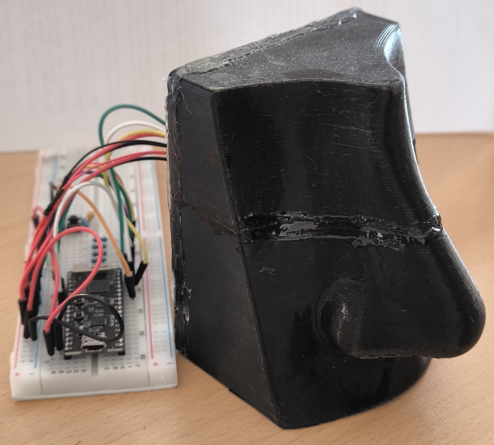
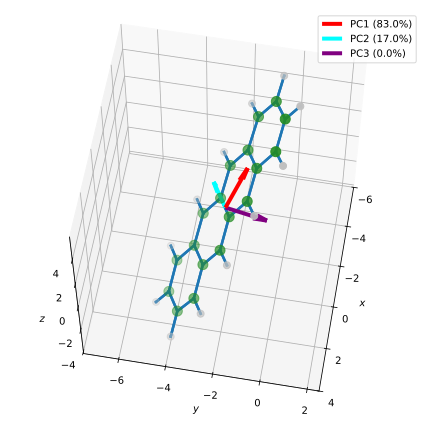
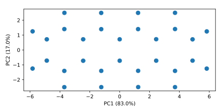

## Principal Component Analysis

In the last section, we learned that SVD can be used to find the best
rank-$k$ approximation of a matrix $\bm{A}$ with respect to the Frobenius norm.
Consider the rank-1 approximation of $\bm{A}$. Since this is just the
rank-1 matrix $\sigma_1 \vec{u}_ 1 \vec{v}_ 1^\dag$ with the largest
singular value $\sigma_1$, one can treat this matrix as the
*most important* component of the matrix $\bm{A}$, often referred to as the
first *principal component*. The subsequent rank-1 matrices
$\sigma_i \vec{u}_ i \vec{v}_ i^\dag$ with $i > 1$ can then be interpreted
as the following components, with the respective weight $\sigma_i$.
This interpretation leads us to the *Principal Component Analysis* (PCA),
which is often used in practice for dimensionality reduction of data.

### Theoretical Foundations

Consider a measurement of $P$ features on $N$ samples, represented by an
$N \times P$ matrix $\widetilde{\bm{X}}$. The $i$-th row of the matrix
$\widetilde{\bm{X}}$ corresponds to the $P$ features of the $i$-th sample.

```admonish note title="The Data Matrix"

We have already encountered this representation of data in the last
section, where we used it to store the traces of the time-resolved
infrared spectroscopy measurements, with the first dimension
being the time and the second dimension being the wave number.
But the first dimension does not have to be time.

Consider a series of measurements of $N$ samples (e.g., at different
time points or concentrations), where you measure $P$ features for each sample
(temperature, absorption, etc.). The data matrix $\widetilde{\bm{X}}$ then
represents your entire measurement data, with each row containing the features
of a measurement.

We will often refer to this representation of data in the following sections
and chapters, as it forms the basis for most methods of data analysis and
machine learning.
```

The first step of PCA is to preprocess the data in one of the following
two ways: centering or standardisation. We write the data matrix
$\widetilde{\bm{X}}$ as
$$
  \widetilde{\bm{X}} =
    \begin{pmatrix}
      \text{---}\ \vec{x}_ 1\ \text{---} \\
      \text{---}\ \vec{x}_ 2\ \text{---} \\
      \vdots \\
      \text{---}\ \vec{x}_ N\ \text{---}
    \end{pmatrix}
$$
with the measurement data $\vec{x}_ i \in \mathbb{R}^P$. Each data point is thus
a $P$-dimensional vector, where the features represent the basis vectors.
Now we define the mean over all measurements $\vec{\mu}$ as
$$
  \vec{\mu} = \frac{1}{N} \sum_{i=1}^N \vec{x}_ i\,.
$$
In **centering**, we subtract this mean from each data point
$$
  \bm{X} = 
    \begin{pmatrix}
      \text{---}\ (\vec{x}_ 1 - \vec{\mu})\ \text{---} \\
      \text{---}\ (\vec{x}_ 2 - \vec{\mu})\ \text{---} \\
      \vdots \\
      \text{---}\ (\vec{x}_ N - \vec{\mu})\ \text{---}
    \end{pmatrix}\,,
$$
to obtain the centered data matrix $\bm{X}$. 
One can easily verify that the centered data matrix $\bm{X}$ is given by
$$
  \bm{X} = \widetilde{\bm{X}} - \frac{1}{N} \mathbf{1}_ N \widetilde{\bm{X}} 
  = (\identity_N - \frac{1}{N} \mathbf{1}_ N) \widetilde{\bm{X}}
  {{numeq}}{eq:centre_data_matrix}
$$
where $\identity_N$ is the $N \times N$ identity matrix and
$\mathbf{1}_ N$ is an $N \times N$ matrix with all entries equal to one.

Sometimes, the features occur in different orders of magnitude or are measured
in different units. In this case, it is useful to perform **normalisation**
in addition to centering. The combination of these two steps is called
**standardisation**.

After calculating the standard deviation of the $j$-th feature by
$$
  \sigma_j = \sigma(\{x_{1j}, x_{2j}, \ldots, x_{Nj}\}) = \sqrt{\frac{1}{N} \sum_{i=1}^N (x_{ij} - \mu_j)^2}\,,
$$
the standardised data matrix $\bm{X}$ can be computed as
$$
  \bm{X} = 
    \begin{pmatrix}
      \text{---}\ (\vec{x}_ 1 - \vec{\mu})\ \text{---} \\
      \text{---}\ (\vec{x}_ 2 - \vec{\mu})\ \text{---} \\
      \vdots \\
      \text{---}\ (\vec{x}_ N - \vec{\mu})\ \text{---}
    \end{pmatrix}
    \begin{pmatrix}
      \sigma_1^{-1} &  &  &  \\
       & \sigma_2^{-1} &  &  \\
       &  & \ddots &  \\
       &  &  & \sigma_P^{-1}
    \end{pmatrix}\,.
$$
In other words, the entire measurement data now has a mean of 0 
and a standard deviation of 1. Depending on the nature of the data, 
it must be decided whether centering or standardisation should be performed.

Next, we compute the singular value decomposition of the centered or 
standardised data matrix $\bm{X}$:
$$
  \bm{X} = \bm{U} \bm{\Sigma} \bm{V}^\dag
$$
with $\bm{U} \in \C{N}{N}$, $\bm{V} \in \C{P}{P}$ and $\bm{\Sigma} \in \R{N}{P}$.
The right singular vectors $\vec{v}_ i$ are the principal components,
also known as *loadings*, while the singular values $\sigma_i$ indicate the
weighting of the respective principal component. A common term is the
*explained variance* $\eta_i$ of the $i$-th principal component,
which is given by
$$
  \eta_i = \frac{\sigma_i^2}{\sum_{j} \sigma_j^2}\,,
  {{numeq}}{eq:explained_variance}
$$
where the sum runs over all singular values.

Because the right singular vectors $\vec{v}_ i$ are orthonormal, we can 
interpret them as an orthonormal basis of the $P$-dimensional space,
which might be a more natural representation of the data points than
the original features.

The projection of the data points onto the principal components can
be computed by the matrix product
$$
  \bm{X} \bm{V} = \bm{U} \bm{\Sigma} \bm{V}^\dag \bm{V} = \bm{U} \bm{\Sigma}\,.
  {{numeq}}{eq:pca_projection}
$$
Thus, the projection of the data points onto the $i$-th principal component
is given by the product of the $i$-th left singular vector $\vec{u}_ i$ with
the $i$-th singular value $\sigma_i$. This projection
$\vec{u}_ i \sigma_i$ is also referred to as the *score* of the 
$i$-th principal component.

Although the transformation of the data points into the basis of the 
principal components is already a useful tool, PCA can also be used 
for dimensionality reduction. The idea is to keep only the first 
$k$ principal components and project the data points into the
$k$-dimensional subspace of these principal components. Thanks to the
Schmidt decomposition theorem, we know that this projection always provides 
the best approximation of the original data points in a $k$-dimensional space.
Thus, we can use PCA to approximate a high-dimensional dataset with only a few
principal components, without losing too much information about the data.

### Example 1: Wine Categorisation

It all began – as great scientific ideas often do – over a dinner conversation 
accompanied by a glass of wine (or perhaps two). My professor, deep in discussion 
with a colleague from food chemistry, pondered how advanced spectroscopy and 
machine learning could elegantly classify wines. Inspired by their sophisticated 
yet rather pricey vision, I asked myself: could we democratise wine-sniffing? 
Could we create an affordable alternative – something a (under-)graduate student’s 
budget could comfortably swallow?

Recalling a playful project aptly named 
“[Second Sense: Build an AI Smart Nose](https://makezine.com/projects/second-sense-build-an-ai-smart-nose/)”
from *Make Magazine*, the idea fermented quickly. 
Thus, armed with little more than curiosity and a budget-friendly gas sensor, 
I set out to distinguish wines without breaking the bank – or the glassware.

This section follows the first steps of this journey, where we explore how to
apply Principal Component Analysis (PCA) to a dataset of wines,
revealing the subtle patterns hidden in the scents of our beloved beverage.

In this section, we will implement PCA on a dataset of wines to explore how
we can classify wines based on seemingly unrelated properties.

<div align="center">
  
</div>
This budget-friendly wine sniffer, of course shaped like a nose,
is based on a gas sensor that can detect the concentration of 
the following gases:

- Nitrogen dioxide (NO<sub>2</sub>)
- Ethanol (EtOH)
- Volatile organic compounds (VOCs)
- Carbon monoxide (CO)

Although NO<sub>2</sub> and CO are not directly related to the wine's
quality, due to the sensors being not very selective, they can detect
the presence of other gases that are present in the wine's aroma.

This dataset comprises measurements of 4 different wines

- Wappenlese Weiss (White) (1)
- Wappenlese Rot (Red) (2)
- Soave (White) (3)
- Bardolino (Red) (4)

and empty glasses (0).
For each wine, around 1000 measurements were taken, with each measurement
consisting of the temperature, the relative humidity, and the
voltage reading of the gas sensor for each of the four gases
(NO<sub>2</sub>, EtOH, VOCs, CO).

The first few lines of the dataset look like this:
```txt
{{#include ../codes/04-evd_and_svd/wine.csv::10}}
```
and the entire dataset can be downloaded from
<a href="../codes/04-evd_and_svd/wine.csv" download>here</a>.
The file `wine.csv` contains the data in the so-called
*Comma-Separated Values* (CSV) format, meaning that the values 
are separated by commas.

First, we import the necessary libraries:
```python
{{#include ../codes/04-evd_and_svd/pca_wine.py:imports}}
```
and read the data from the file `wine.csv`:
```python
{{#include ../codes/04-evd_and_svd/pca_wine.py:load_data}}
```
Here, we passed the argument `delimiter=','` to the function `np.loadtxt`
because the values in the file are not separated by spaces as before, 
but by commas. Also, we supplied the argument `skiprows=1` to skip the header
line of the CSV file, which contains the names of the features.
We also separated the labels of the wines (the first column) into the variable
`categories` as integers, and the gas sensor readings
as floats in the variable `features`. The temperature and relative humidity
are not used for the PCA, but can be useful for further analysis.

The measurements for empty glasses are only used for calibration, so we
do not use them for the PCA. To filter out the empty glasses, we
use the following code:
```python
{{#include ../codes/04-evd_and_svd/pca_wine.py:filter_data}}
```
We created the boolean mask `mask` that is `True` for all rows where the
category is not 0 (i.e., not an empty glass) and then used it to filter
the `features` and `categories` arrays. The resulting arrays
`features` and `categories` now only contain the measurements for the wines.

Information like the names of the wines and the measured properties
are not relevant for the mathematics, but can be very helpful for interpreting
the results. Therefore, we store these in lists:
```python
{{#include ../codes/04-evd_and_svd/pca_wine.py:labels}}
```

Now, we start the PCA by standardising the data:
```python
{{#include ../codes/04-evd_and_svd/pca_wine.py:standardise}}
```

After standardisation, we compute the singular value decomposition
of the standardised data matrix:
```python
{{#include ../codes/04-evd_and_svd/pca_wine.py:svd}}
```
We also computed the principal components, the projection of the data points
onto the principal components using {{eqref: eq:pca_projection}},
and the explained variance of the principal components according to
{{eqref: eq:explained_variance}}.
The results look like this:
```python
{{#include ../codes/04-evd_and_svd/pca_wine.py:verify_pca}}
```

We see that the first principal component `pcs[:,0]`, which is 
a linear combination of all features of the wines, is primarily influenced 
by the first three features (*i.e.* "V_NO2", "V_EtOH", and "V_VOC") 
with the largest (absolute) weights.
This principal component already explains about 62~% of the variance in the data.
Together with the second principal component, about 89~% of the variance 
can be explained.
We can visualise the explained variance using the following code:
```python
{{#include ../codes/04-evd_and_svd/pca_wine.py:plot_variance}}
```
Here, we used the function `np.cumsum` to compute the cumulative sums 
of the explained variance. The resulting plot looks like this:


Because the visualisation of data points works best in 2D, we plot the
projection of the data points onto the first two principal components:
```python
{{#include ../codes/04-evd_and_svd/pca_wine.py:plot_pca}}
```
Due to the standardisation of the data points to unit variance,
it makes sense to plot the principal components with equal scaling.
We applied the method `set_aspect('equal')` to the axes objects 
for this purpose. The resulting plot looks like this:


Because the first two principal components already explain about 
89~% of the variance in the data, we can assume that important structures
of the dataset are preserved in this 2D projection. However, in this plot, we
initially only see some cluster of points, vaguely organised into
three islands. To better understand the structure of the data points 
in this projection, we can colour the data points according to the wine types
that we **did not** use for the PCA:
```python
{{#include ../codes/04-evd_and_svd/pca_wine.py:plot_pca_coloured}}
```
Instead of creating a new plot, we changed the colours of the data points
using the `set_color` method of the plot object. To display a legend,
we created three empty scatter plots with the appropriate colours and labels.
The resulting plot looks like this:


We can now clearly see that the data points are separated according to 
their wine types, albeit with some overlap.
If one would project the data points onto the first three principal components
instead of the first two, one would see an excellent separation of the
data points according to their wine types.
This can be used to classify the wines based on their scents, as measured
by the budget-friendly wine sniffer.

### Example 2: Molecular Alignment

We will now take a look at another application of PCA, now in the field
of quantum chemistry. A common format of storing molecular structures
is the *xyz* format. The first line of the file contains the number of 
atoms, the second line is a comment, and the following lines contain the
atomic symbols and their coordinates in 3D space. For example, the file
`tetracene.xyz`, which can be downloaded from
<a href="../codes/04-evd_and_svd/tetracene.xyz" download>here</a>,
begins with the following lines:
```txt
{{#include ../codes/04-evd_and_svd/tetracene.xyz::10}}
```

Although being very vivid, this representation of the molecular structure
does not respect the translational and rotational symmetries
(and several other symmetries) of the molecule.
Two wildly different xyz-files can represent exactly the same molecule 
at exactly the same position in space.

The optimal structure of the tetracene molecule in its electronic ground state
is planar, meaning that all atoms lie in the same plane. In the sample of 
the xyz-file above, no coordinate is exactly zero, which means that the
molecule is not aligned to the coordinate axes. 
We shall now use PCA to find the plane where the molecule lies,
and then project the molecule onto this plane.

Again, we start by importing the necessary libraries:
```python
{{#include ../codes/04-evd_and_svd/tetracene_plane.py:imports}}
```
Next, we read the xyz-file and extract the coordinates of the atoms:
```python
{{#include ../codes/04-evd_and_svd/tetracene_plane.py:load_xyz}}
```
Afterwards, we center the coordinates of the atoms by subtracting the mean
of the coordinates from each coordinate, followed by SVD:
```python
{{#include ../codes/04-evd_and_svd/tetracene_plane.py:pca}}
```
Normalisation or standardisation is not performed here, as we do not
want to distort the distances between the atoms.

The explained variances are computed according to
{{eqref: eq:explained_variance}}:
```python
{{#include ../codes/04-evd_and_svd/tetracene_plane.py:expl_var}}
```
One clearly sees that the explained variance of the third principal component
is much smaller than that of the first two principal components.

For a better understanding of the principal components, 
they are visualised as arrows in the 3D space, along with the atoms:
<div align="center">
  
</div>
The first principal component (red arrow) is the direction of the largest variance,
in this case the longest axis of the molecule, while the second principal component
(turquoise arrow) is the direction of the second largest variance,
in this case the second longest axis of the molecule. The third principal component
(purple arrow) is the direction of the smallest variance, which is perpendicular to the
plane of the molecule. Since the tetracene molecule has almost no out-of-plane
displacement of the atoms, the explained variance or the singular value of the
third principal component is almost zero.

Finally, we can project the molecule onto the principal components
using {{eqref: eq:pca_projection}}, and plot the first two coordinates
```python
{{#include ../codes/04-evd_and_svd/tetracene_plane.py:plot_projection}}
```
The resulting plot looks like this:
<div align="center">
  
</div>

This is a very simple way to align planar molecules to the coordinate axes.
A more sophisticated algorithm for aligning (also non-planar) molecules is the 
[*Kabsch algorithm*](https://en.wikipedia.org/wiki/Kabsch_algorithm),
which is also based on PCA.

In this section, we have seen how PCA can be used to reduce the dimensionality
of data and to find the most important features of a dataset.
This is one of many methods collectively referred to as
[*dimensionality reduction*](https://en.wikipedia.org/wiki/Dimensionality_reduction),
which is a common task in data analysis and machine learning.

