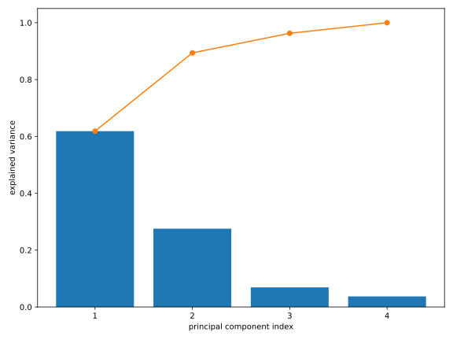
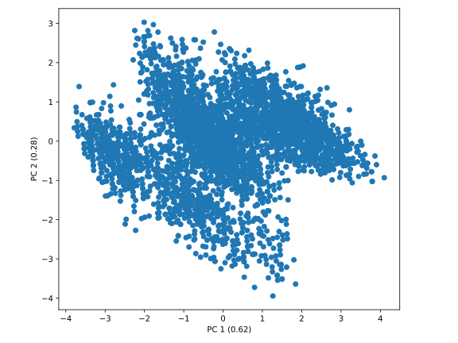
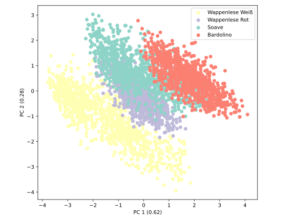

## Principal Component Analysis

In last section, we learned that SVD can be used to find the best
rank-$k$ approximation of a matrix $\bm{A}$ with respect to the Frobenius norm.
Consider the rank-1 approximation of $\bm{A}$. Since this is just the
rank-1 matrix $\sigma_1 \vec{u}_ 1 \vec{v}_ 1^\dag$ with the largest
singular value $\sigma_1$, one can treat this matrix as the
*most important* component of the matrix $\bm{A}$, often referred to as the
first *principal component*. The subsequent rank-1 matrices
$\sigma_i \vec{u}_ i \vec{v}_ i^\dag$ with $i > 1$ can then be interpreted
as the following components, with the respective weight $\sigma_i$.
This interpretation leads us to the *Principal Component Analysis* (PCA),
which is often used in practice for dimensionality reduction of data.

### Theoretical Foundations

Consider a measurement of $P$ features on $N$ samples, represented by an
$N \times P$ matrix $\widetilde{\bm{X}}$. The $i$-th row of the matrix
$\widetilde{\bm{X}}$ corresponds to the $P$ features of the $i$-th sample.

```admonish note title="The Data Matrix"

We have already encountered this representation of data in the last
section, where we used it to store the traces of the time-resolved
infrared spectroscopy measurements, with the first dimension
being the time and the second dimension being the wave number.
But the first dimension does not have to be time.

Consider a series of measurements of $N$ samples (e.g., at different
time points or concentrations), where you measure $P$ features for each sample
(temperature, absorption, etc.). The data matrix $\widetilde{\bm{X}}$ then
represents your entire measurement data, with each row containing the features
of a measurement.

We will often refer to this representation of data in the following sections
and chapters, as it forms the basis for most methods of data analysis and
machine learning.
```

The first step of PCA is to preprocess the data in one of the following
two ways: centering or standardisation. We write the data matrix
$\widetilde{\bm{X}}$ as
$$
  \widetilde{\bm{X}} =
    \begin{pmatrix}
      \text{---}\ \vec{x}_ 1\ \text{---} \\
      \text{---}\ \vec{x}_ 2\ \text{---} \\
      \vdots \\
      \text{---}\ \vec{x}_ N\ \text{---}
    \end{pmatrix}
$$
with the measurement data $\vec{x}_ i \in \mathbb{R}^P$. Each data point is thus
a $P$-dimensional vector, where the features represent the basis vectors.
Now we define the mean over all measurements $\vec{\mu}$ as
$$
  \vec{\mu} = \frac{1}{N} \sum_{i=1}^N \vec{x}_ i\,.
$$
In **centering**, we subtract this mean from each data point
$$
  \bm{X} = 
    \begin{pmatrix}
      \text{---}\ (\vec{x}_ 1 - \vec{\mu})\ \text{---} \\
      \text{---}\ (\vec{x}_ 2 - \vec{\mu})\ \text{---} \\
      \vdots \\
      \text{---}\ (\vec{x}_ N - \vec{\mu})\ \text{---}
    \end{pmatrix}\,,
$$
to obtain the centered data matrix $\bm{X}$. 
One can easily verify that the centered data matrix $\bm{X}$ is given by
$$
  \bm{X} = \widetilde{\bm{X}} - \frac{1}{N} \mathbf{1}_ N \widetilde{\bm{X}} 
  = (\identity_N - \frac{1}{N} \mathbf{1}_ N) \widetilde{\bm{X}}
  {{numeq}}{eq:centre_data_matrix}
$$
where $\identity_N$ is the $N \times N$ identity matrix and
$\mathbf{1}_ N$ is an $N \times N$ matrix with all entries equal to one.

Sometimes, the features occur in different orders of magnitude or are measured
in different units. In this case, it is useful to perform **normalisation**
in addition to centering. The combination of these two steps is called
**standardisation**.

After calculating the standard deviation of the $j$-th feature by
$$
  \sigma_j = \sigma(\{x_{1j}, x_{2j}, \ldots, x_{Nj}\}) = \sqrt{\frac{1}{N} \sum_{i=1}^N (x_{ij} - \mu_j)^2}\,,
$$
the standardised data matrix $\bm{X}$ can be computed as
$$
  \bm{X} = 
    \begin{pmatrix}
      \text{---}\ (\vec{x}_ 1 - \vec{\mu})\ \text{---} \\
      \text{---}\ (\vec{x}_ 2 - \vec{\mu})\ \text{---} \\
      \vdots \\
      \text{---}\ (\vec{x}_ N - \vec{\mu})\ \text{---}
    \end{pmatrix}
    \begin{pmatrix}
      \sigma_1^{-1} &  &  &  \\
       & \sigma_2^{-1} &  &  \\
       &  & \ddots &  \\
       &  &  & \sigma_P^{-1}
    \end{pmatrix}\,.
$$
In other words, the entire measurement data now has a mean of 0 
and a standard deviation of 1. Depending on the nature of the data, 
it must be decided whether centering or standardisation should be performed.

Next, we compute the singular value decomposition of the centered or 
standardised data matrix $\bm{X}$:
$$
  \bm{X} = \bm{U} \bm{\Sigma} \bm{V}^\dag
$$
with $\bm{U} \in \C{N}{N}$, $\bm{V} \in \C{P}{P}$ and $\bm{\Sigma} \in \R{N}{P}$.
The right singular vectors $\vec{v}_ i$ are the principal components,
also known as *loadings*, while the singular values $\sigma_i$ indicate the
weighting of the respective principal component. A common term is the
*explained variance* $\eta_i$ of the $i$-th principal component,
which is given by
$$
  \eta_i = \frac{\sigma_i^2}{\sum_{j} \sigma_j^2}\,,
$$
where the sum runs over all singular values.

Because the right singular vectors $\vec{v}_ i$ are orthonormal, we can 
interpret them as an orthonormal basis of the $P$-dimensional space,
which might be a more natural representation of the data points than
the original features.

The projection of the data points onto the principal components can
be computed by the matrix product
$$
  \bm{X} \bm{V} = \bm{U} \bm{\Sigma} \bm{V}^\dag \bm{V} = \bm{U} \bm{\Sigma}\,.
$$
Thus, the projection of the data points onto the $i$-th principal component
is given by the product of the $i$-th left singular vector $\vec{u}_ i$ with
the $i$-th singular value $\sigma_i$. This projection
$\vec{u}_ i \sigma_i$ is also referred to as the *score* of the 
$i$-th principal component.

Although the transformation of the data points into the basis of the 
principal components is already a useful tool, PCA can also be used 
for dimensionality reduction. The idea is to keep only the first 
$k$ principal components and project the data points into the
$k$-dimensional subspace of these principal components. Thanks to the
Schmidt decomposition theorem, we know that this projection always provides 
the best approximation of the original data points in a $k$-dimensional space.
Thus, we can use PCA to approximate a high-dimensional dataset with only a few
principal components, without losing too much information about the data.

### Implementation: Wine Categorisation

```admonish danger title="Under Construction"
This section is currently under construction. Please check back later.
```

Wir implementieren die PCA am Beispiel des Weindatensatzes. 
Dieser enthält Messungen von 13 physikalischen und chemischen 
Eigenschaften von insgesamt 178 Weinen aus drei verschiedenen Rebsorten:
Barolo, Grignolino und Barbera. Die ersten Einträge des Datensatzes haben
die folgende Form:
```txt
{{#include ../codes/04-evd_and_svd/wine.csv::10}}
```
und der gesamte Datensatz kann
<a href="../codes/04-evd_and_svd/wine.csv" download>hier</a> heruntergeladen
werden. Die Datei `wine.csv` enthält die Daten im sogenannten
*Comma-Separated Values* (CSV) Format, also mit Werten, die durch Kommata
getrennt sind.

Als erstes importieren wir die benötigten Bibliotheken
```python
{{#include ../codes/04-evd_and_svd/pca_wine.py:imports}}
```
und lesen die Daten aus der Datei `wine.csv` ein:
```python
{{#include ../codes/04-evd_and_svd/pca_wine.py:load_data}}
```
Hier haben wir das Argument `delimiter=','` an die Funktion `np.loadtxt`
übergeben, da die Werte in der Datei nicht wie bisher durch Leerzeichen
getrennt sind.
Zudem haben wir die Labels der Rebsorten (nullte Spalte) in der Variable
`categories` als 0-indizierte Integers gespeichert und somit von den
Eigenschaften der Weine, die wir als Floats in der Variable `features`
gespeichert haben, abgetrennt.

Weitere versteckte Informationen, wie die Namen der Rebsorten
und der gemessenen Eigenschaften, sind für die 
Mathematik zwar nicht relevant, können aber für die Interpretation der
Ergebnisse sehr hilfreich sein. Daher speichern wir diese in Listen:
```python
{{#include ../codes/04-evd_and_svd/pca_wine.py:labels}}
```

Da sich in diesem Datensatz die Größenordnung der Eigenschaften sehr
stark unterscheidet, führen wir eine Standardisierung der Daten durch:
```python
{{#include ../codes/04-evd_and_svd/pca_wine.py:standardise}}
```
Anschließend berechnen wir die Singulärwertzerlegung der standardisierten
Datenmatrix:
```python
{{#include ../codes/04-evd_and_svd/pca_wine.py:svd}}
```
Zusätzlich haben wir die Hauptkomponenten, die Projektion der Datenpunkte
auf die Hauptkomponenten, sowie die Varianzanteile bestimmt.
Die Ergebnisse sehen wie folgt aus:
```python
{{#include ../codes/04-evd_and_svd/pca_wine.py:verify_pca}}
```
Wir sehen, dass zu der ersten Hauptkomponente `pcs[:,0]`, die eine Linearkombination
aller Eigenschaften der Weine ist, die 5., 6. und 11. Eigenschaften
(0-indiziert, also "total phenols", "flavanoids" und 
"OD280/OD315") mit den (betragsmäßig) größten Gewichten beitragen. Diese Hauptkomponente erklärt
bereits ca. 36 % der Varianz der Daten. Mit der zweiten Hauptkomponente
zusammen können ca. 55 % der Varianz erklärt werden. Die Varianzanteile
können wir mit dem folgenden Code visualisieren:
```python
{{#include ../codes/04-evd_and_svd/pca_wine.py:plot_variance}}
```
Hier haben wir die Funktion `np.cumsum` verwendet, um die kumulierten
Summen der Varianzanteile zu berechnen. Der resultierende Plot sieht wie folgt aus:


Da wir Datenpunkte in 2D leicht visualisieren können, plotten wir die
Projektion der Datenpunkte auf die ersten beiden Hauptkomponenten:
```python
{{#include ../codes/04-evd_and_svd/pca_wine.py:plot_pca}}
```
Aufgrund der Standardisierung der Datenpunkte auf die Einheitsvarianz 
ist es sinnvoll, die Hauptkomponenten gleichermaßen
skaliert zu plotten. Aus diesem Grund haben wir die Methode `set_aspect('equal')`
auf die Achsenobjekte angewendet. Der resultierende Plot sieht wie folgt aus:


Da die ersten beiden Hauptkomponenten bereits ca. 55 % der Varianz der Daten
erklären, können wir davon ausgehen, dass wichtige Strukturen des Datensatzes
in dieser 2D-Projektion erhalten sind. In diesem Plot erkennen wir aber 
zunächst nur einen Halbkreis an Punkten, sowie ein "Loch" in der Mitte. Um die Struktur der
Datenpunkte in dieser Projektion besser zu verstehen, können wir die Datenpunkte gemäß den Rebsorten,
die wir für die PCA **nicht** verwendet haben, einfärben:
```python
{{#include ../codes/04-evd_and_svd/pca_wine.py:plot_pca_coloured}}
```
Anstatt einen neuen Plot zu erstellen, haben wir die Farben der Datenpunkte
mit der Methode `set_color` des Plot-Objekts geändert. Und um eine Legende
anzeigen zu lassen, haben wir drei leere Scatter-Plots mit passenden Farben
und Labels erstellt. Der resultierende Plot sieht wie folgt aus:


Wir erkennen jetzt deutlich, dass die Datenpunkte, bis auf wenige Ausnahmen,
in der 2D-Projektion entsprechend ihrer Sorten gut voneinander getrennt sind. Wir haben also eine 
Darstellung gefunden, in welcher wir die Rebsorten anhand der physikalischen und
chemischen Eigenschaften der Weine leicht unterscheiden (d.h. klassifizieren) könnten.

In diesem Abschnitt haben wir gesehen, dass die Kooridnaten der
Datenpunkte in der Basis der Features vollständig bekannt sein müssen, 
um die PCA durchzuführen.
Bei Messdaten ist diese Voraussetzung in der Regel erfüllt, 
aber was ist, wenn wir Daten mit sehr vielen Features
vorliegen haben, z.B. Bilder? Ein kleines Bild mit $100 \times 100$ Pixeln hat
bereits 10000 Features, und ein hochauflösendes Bild mit $1000 \times 1000$
Pixeln hat sogar eine Millionen Features. In diesem Fall würde die Durchführung
der PCA auf die Datenpunkte in der Basis der Pixelwerte sehr viel Resourcen
benötigen. Es wäre in diesem Fall effizienter, wenn wir den  *Abstand* zwischen den
Datenpunkten für die PCA verwendet werden könnten, für den wir nur einen Skalar
für jedes Paar von Datenpunkten berechnen müssten. Eine Abstandsmetrik kann auch 
dann hilfreich sein, wenn keine wirklich sinnvollen Koordinaten für die Datenpunkte
vorliegen, wie z.B. bei Texten oder chemischen Verbindungen.

Tatsächlich lassen sich die Hauptkomponenten allein aus solchen Abständen 
bestimmen. Eine Realisierung bietet die Methode der 
*Hauptkoordinatenanalyse* (engl. *Principal Coordinate Analysis*, PCoA).

### Implementation: Molecular Alignment

```admonish danger title="Under Construction"
This section is currently under construction. Please check back later.
```

