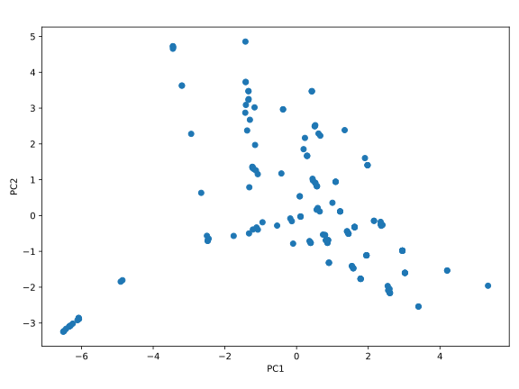

## Hauptkoordinatenanalyse

Wie im letzten Kapitel beschrieben, ist die *Hauptkoordinatenanalyse* 
(engl. *principal Coordinate Analysis*, PCoA) ein Verfahren, welches 
die Hauptkomponenten des Datensatzes aus den Abständen zwischen den
Datenpunkten bestimmt.

### Theoretische Grundlagen

Damit wir am Ende die PCA durchführen können, benötigen wir eine 
Koordinatendarstellung der Datenpunkte $\widetilde{\bm{X}}$. Nehmen wir zuerst
an, dass wir eine solche Koordinatendarstellung durch eine magische Kraft
erhalten haben. Dann können wir die an der zentrierten Datenmatrix $\bm{X}$
die SVD durchführen ($\bm{X} = \bm{U} \bm{\Sigma} \bm{V}^\dag$) und erhalten 
die Projektion auf die Hauptkomponenten durch $\bm{U} \bm{\Sigma}$.

Betrachten wir nun die *Gram-Matrix* $\bm{G}$ der zentrierten Datenmatrix 
$\bm{X}$, die durch $\bm{G} = \bm{X} \bm{X}^\dag$ gegeben ist. Setzen wir
die SVD von $\bm{X}$ ein, so erhalten wir
$$
  \bm{G} = \bm{X} \bm{X}^\dag 
  = \bm{U} \bm{\Sigma} \bm{V}^\dag \bm{V} \bm{\Sigma}^\dag \bm{U}^\dag 
  = \bm{U} \underbrace{\bm{\Sigma} \bm{\Sigma}^\dag}_ {:=\bm{\Lambda}} \bm{U}^\dag\,,
$$
ganz nach Gl. {{eqref: eq:svd_and_evd}}. Die Projektion der Datenpunkte 
auf die Hauptkomponenten kann also aus der Eigenwertzerlegung der Gram-Matrix
berechnet werden als $\bm{U} \bm{\Lambda}^{1/2}$.

Setzen wir nun Gl. {{eqref: eq:centre_data_matrix}} in die Definition der
zentrierten Gram-Matrix ein, so erhalten wir
$$
  \begin{align}
    \bm{G} &= \bm{X} \bm{X}^\dag 
    = (\identity_N - \frac{1}{N} \mathbf{1}_ N) \widetilde{\bm{X}} \widetilde{\bm{X}}^\dag (\identity_N - \frac{1}{N} \mathbf{1}_ N) \\
    &= \widetilde{\bm{X}} \widetilde{\bm{X}}^\dag 
      - \frac{\mathbf{1}_ N}{N} \mathbf{1}_ N \widetilde{\bm{X}} \widetilde{\bm{X}}^\dag 
      - \widetilde{\bm{X}} \widetilde{\bm{X}}^\dag \frac{\mathbf{1}_ N}{N}
      + \frac{\mathbf{1}_ N}{N} \widetilde{\bm{X}} \widetilde{\bm{X}}^\dag \frac{\mathbf{1}_ N}{N} \\
    &= \widetilde{\bm{G}} - \frac{\mathbf{1}_ N}{N} \widetilde{\bm{G}} - \widetilde{\bm{G}} \frac{\mathbf{1}_ N}{N} + \frac{\mathbf{1}_ N}{N} \widetilde{\bm{G}} \frac{\mathbf{1}_ N}{N}\,,
  \end{align}
$$
wo wir die Gram-Matrix der unzentrierten Datenmatrix als
$\widetilde{\bm{G}} = \widetilde{\bm{X}} \widetilde{\bm{X}}^\dag$ definiert 
haben. Dieser Prozess wird als *Double Centering* bezeichnet, da wir von der
Matrix $\widetilde{\bm{G}}$ sowohl die Zeilen- als auch die Spaltenmittelwerte
durch $\frac{\mathbf{1}_ N}{N} \widetilde{\bm{G}}$ und 
$\widetilde{\bm{G}} \frac{\mathbf{1}_ N}{N}$ abziehen, und dann den Mittelwert
der gesamten Matrix, der doppelt abgezogen wurde, durch
$\frac{\mathbf{1}_ N}{N} \widetilde{\bm{G}} \frac{\mathbf{1}_ N}{N}$ wieder
hinzufügen. Die Matrix $\bm{G}$ hat also 0 als Spalten- und Zeilenmittelwert.

Das ist zwar schön und gut, dass wir aus den unverarbeiteten Datenkoordinaten
die Hauptkomponenten berechnen können, aber wie müssen erst (ohne Magie)
die Koordinaten erhalten. Wir betrachten nun das was wir haben: die
Abstände zwischen den Datenpunktpaaren. Diese lassen sich in einer
symmetrischen $N \times N$-Matrix $\bm{D}$ mit den Elementen $d_{ij}$ 
speichern, wobei $d_{ij}$ den Abstand zwischen den Datenpunkten $i$ und $j$
angibt. Des Weiteren nehmen wir an, dass die euklidischen Abstände
zwischen den Datenpunkten gegeben sind. Damit gilt
$$
  \begin{align}
  d_{ij}^2 = \|\vec{x}_ i - \vec{x}_ j\|_ 2^2
    &= \|\vec{x}_ i - \vec{\mu}\|_ 2^2 + \|\vec{x}_ j - \vec{\mu}\|_ 2^2 
      - 2 \langle \vec{x}_ i - \vec{\mu}, \vec{x}_ j - \vec{\mu} \rangle \\
    &= \|\vec{x}_ i - \vec{\mu}\|_ 2^2 + \|\vec{x}_ j - \vec{\mu}\|_ 2^2
      -2 G_{ij}\,,
  \end{align}
$$
wobei wir den Kosinussatz verwendet haben. Das Skalarprodukt der zentrierten
Datenpunkte $\vec{x}_ i - \vec{\mu}$ und $\vec{x}_ j - \vec{\mu}$ ist
gerade das Element $G_{ij}$ der zentrierten Gram-Matrix $\bm{G}$.

Wenn wir die Matrix $\bm{D}^{(2)}$ der quadrierten Abstände durch 
$D^{(2)}_{ij} = d_{ij}^2$ definieren, so unterscheidet sich 
$-\frac{1}{2} \bm{D}^{(2)}$ von der zentrierten Gram-Matrix $\bm{G}$ nur
durch einen Zeilen- und einen Spaltenmittelwert. Führt man das Double Centering
auf $\bm{D}^{(2)}$ durch, so erhält man die Matrix $\bm{G}$:
$$
  \bm{G} = -\frac{1}{2}\left(\identity_N - \frac{1}{N} \mathbf{1}_ N\right) \bm{D}^{(2)} \left(\identity_N - \frac{1}{N} \mathbf{1}_ N\right)\,.
$$
Das ist genau die "magische Kraft", die wir benötigen, um die Abstände
in Koordinaten umzuwandeln. Es ergibt sich der folgende Algorithmus:
1. Berechne die Matrix $\bm{D}^{(2)}$ der quadrierten Abstände.
2. Führe das Double Centering auf $\bm{D}^{(2)}$ durch.
3. Berechne die Eigenwertzerlegung von $\bm{G}$ als 
   $\bm{G} = \bm{U} \bm{\Lambda} \bm{U}^\dag$.
4. Berechne projizierten Koordinaten auf die Hauptkomponenten mit
   $\bm{U} \bm{\Lambda}^{1/2}$.
Dieser Algorithmus wird als *Principal Coordinate Analysis* (PCoA) bezeichnet.

Damit ist PCoA äquivalent zur PCA, wenn der Abstand zwischen den Datenpunkten
euklidisch ist. Verwendet man aber eine andere Abstandsmetrik, so liefert 
die PCoA andere Projektionen der Datenpunkte als die PCA. In diesem Fall ist 
die erhaltene Projektion oft eine gute Approximation der opti

Es sei noch angemerkt, dass die PCoA zu einer Familie von Verfahren gehört,
die als
```admonish info title="Multidimensionale Skalierung" collapsible=true
Die
[*Multidimensionale Skalierung*](https://de.wikipedia.org/wiki/Multidimensionale_Skalierung)
(engl. *Multidimensional Scaling*, MDS) versucht,
eine Koordinatendarstellung von Datenpunkten in 
$k$ Dimensionen zu finden, so dass die Abstände zwischen den Datenpunkten
möglichst gut erhalten bleiben. Sei also der Abstand zwischen dem $i$-ten
und $j$-ten Datenpunkt in den ursprünglichen Koordinaten durch $d_{ij}$
und ihre Koordinaten im $k$-dimensionalen Raum durch $\vec{x}_ i$ und
$\vec{x}_ j$ gegeben. Dann wird der *Stress*-Wert
$$
  \text{Stress}(\vec{x}_ 1, \ldots, \vec{x}_ n) = \sqrt{
    \sum_{i\neq j} (d_{ij} - \|\vec{x}_ i - \vec{x}_ j\|)^2
  }
$$
durch die MDS minimiert. Hier wurde die genaue Abstandsmetrik für die 
Berechnung von $d_{ij}$ und die Norm für die Berechnung der Distanz
zwischen den Koordinaten $\vec{x}_ i$ und $\vec{x}_ j$ nicht angegeben,
da die MDS für beliebige Metriken und Normen definiert werden kann. 

Streng genommen ist die PCoA keine MDS, auch wenn die in diesem Kontext als
*Klassische MDS* (CMDS) bezeichnet wird. Es liegt daran, dass die PCoA
den *Strain*-Wert
$$
  \text{Strain}(\vec{x}_ 1, \ldots, \vec{x}_ n) = \sqrt{
     \frac{\sum_{i\neq j} (G_{ij} - \langle \vec{x}_ i, \vec{x}_ j \rangle)^2}
          {\sum_{i\neq j} G_{ij}^2}
  }
$$
minimiert. Diese Funktion ist nicht äuquivalent zum *Stress*-Wert der MDS.
Aber weil die Idee des Strain-Werts sehr ähnlich zum Stress-Wert ist, wird
die PCoA oder die CMDS oft als eine variante der MDS betrachtet.
```
bekannt sind.

### Implementierung

Für die Implementierung der PCoA nehmen wir ein Beispieldatensatz ohne
Koordinaten, die auf dem ersten Blick sinnvoll erscheinen: der 
GDB-9 Datensatz, bestehend aus 133885 kleinen organischen Molekülen 
aus den Atomen H, C, N, O, F bis zu einer Größe von 9 schweren Atomen.
Damit die Anzahl der Datenpunkte nicht zu groß wird, wählen wir nur
eine Untermenge dieses DAtensatztes aus: alle Moleküle aus den
Atomen H, C, N, O mit maximal 5 schweren Atomen. Das liefert uns einen
Datensatz mit 177 Molekülen, der 
<a href="../codes/04-evd_and_svd/gdb9_subset_5.sdf" download>hier</a>
heruntergeladen werden kann.

Die SDF (Structure Data File) stellt eine Sammlung von Molekülen in Format der
[MDL Molfile](https://en.wikipedia.org/wiki/Chemical_table_file#Molfile)
dar. Ein Beispielmolekül aus der Datei sieht wie folgt aus:
```txt
{{#include ../codes/04-evd_and_svd/gdb9_subset_5.sdf:40:51}}
```

Die Moleküle hier werden durch die Koordinaten ihrer Atome beschrieben. 
Für die Konvinienz sind auch die kovalenten Bindungen zwischen den Atomen
sowie den Bindungstypen gegeben. Im obigen Beispiel sehen wir, dass es 
zwischen Atom 1 (C) und Atom 2 (C) eine Bindung vom Typ 3 (Dreifachbindung)
gibt, und zwischen Atom 1 (C) und Atom 4 (H) sowie Atom 2 (C) und Atom 3 (H)
Bindungen vom Typ 1 (Einfachbindung) existieren. Wir können die Informationen 
der vorhandenen kovalenten Bindungen nutzen, um ein Molekül darzustellen. 

Als erstes importieren wir wieder die benötigten Bibliotheken:
```python
{{#include ../codes/04-evd_and_svd/molecule_pcoa.py:imports}}
```
Das Modul `rdkit` wird benötigt, um die Moleküle aus der SDF-Datei zu lesen
und später darzustellen. Dieses kann mit dem Befehl 
```bash
mamba install -c conda-forge rdkit
```
installiert werden. 

Danach definieren wir die konstante `DATASET` als Pfad zur SDF-Datei und ein
Dictionary `BOND_TYPES` mit den Bindungstypen, die wir berücksichtigen wollen:
```python
{{#include ../codes/04-evd_and_svd/molecule_pcoa.py:constants}}
```
Wir haben hier jeden Bindungstyp durch die Symbole der beiden beteiligten 
Atome (in alphabetischer Reihenfolge) mit einer Zahl kodiert. 
Die Molfile-Spezifikation schreibt folgende Kodierung für die Bindungstypen
vor:

| Kodierung | Bindungstyp |
|:---------:|:-----------:|
|     1     | Einfachbindung |
|     2     | Doppelbindung |
|     3     | Dreifachbindung |
|     4     | Aromatische Bindung |
|     5     | Einfach- oder Doppelbindung |
|     6     | Einfachbindung oder Aromatische Bindung |
|     7     | Doppelbindung oder Aromatische Bindung |
|     8     | beliebige Bindung |

Wir verwenden hier die Kodierungen 2, 3 und 4 wie in der Molfile-Spezifikation,
aber die Kodierung 1 für die Einfachbindung und alles andere, was nicht
2, 3 oder 4 ist aus Einfachheit.

Unser Dictionary in diesem Fall berücksichtigt also alle Bindungstypen 
zwischen schweren Atomen (C, N, O) und ignoriert Bindungen mit 
Wasserstoffatomen. Das Dictionary vergibt für jede Bindung eine Zahl, die
später als Index für ein Array verwendet wird, das die Anzahl der Bindungen
jedes Typs speichert.

Danach definieren wir die Funktion `get_fingerprint`, die die oben 
beschriebene Darstellung eines Moleküls implementiert:
```python
{{#include ../codes/04-evd_and_svd/molecule_pcoa.py:get_fingerprint_function}}
```
Hierbei wird zuerst ein Nullarray `fingerprint` mit der Länge der
Anzahl der Bindungstypen in unserem Dictionary `BOND_TYPES` erstellt. Da
dieses Array die Anzahl der Bindungen von jedem Typ speichern soll, 
wählen wir `np.int32` als Datentyp. Danach iterieren wir über die Bindungen
mit der `GetBonds()`-Methode des Molekülobjektes vom Modul `rdkit`. In jeder
Iteration extrahieren wir die Symbole der beteiligten Atome und setzen unsere
Kodierung der Bindungstyp durch den `if`-Block. Am Ende sortieren wir die
Symbole der Atome alphabetisch und hängen die Kodierung daran. Das liefert
uns eine Zeichenkette vom gleichen Stil wie die im Dictionary `BOND_TYPES`. 
Falls der Bindungstyp im Dictionary vorhanden ist, erhöhen wir den 
entsprechenden Eintrag im Array `fingerprint` um 1. Am Ende geben wir das
Array zurück.

Nun können wir die Moleküle aus dem Datensatz einlesen und ihre 
Repräsentationen mit der Funktion `get_fingerprint` berechnen:
```python
{{#include ../codes/04-evd_and_svd/molecule_pcoa.py:get_fingerprints}}
```
Danach erfolgt die Berechnung der Abstandsmatrix. In diesem Fall ist es 
sinnvoll, die Anzahl der unterschiedlichen Bindungen zwischen den Molekülen
als Abstand zu verwenden. Wir bilden also die Differenz der 
Fingerprint-Arrays und zählen die Absolutwerte der Unterschiede zusammen:
```python
{{#include ../codes/04-evd_and_svd/molecule_pcoa.py:distance_matrix}}
```
Nach dem Initialisieren der Abstandsmatrix `distances` mit Nullen iterieren
wir die Index `i` über die Anzahl der Moleküle und die Index `j` von `i + 1`
bis zur Anzahl der Moleküle. Es wird also nur die strikte obere Dreiecksmatrix
der Abstandsmatrix berechnet. Das ist aber ausreichend, weil die 
Abstandsmatrix symmetrisch ist mit Nullen auf der Diagonalen. Nach der 
Berechnung des Abstandes in jeder Iteration setzen wir sowohl das Element
`distances[i, j]` als auch `distances[j, i]` auf den berechneten Wert.

Jetzt können wir die PCoA gemäß des oben beschriebenen Algorithmus 
durchführen:
```python
{{#include ../codes/04-evd_and_svd/molecule_pcoa.py:pcoa}}
```
Bei der Projektion haben wir hier die letzten beiden Eigenwerten und
Eigenvektoren verwendet, da die Eigenwerte aus `np.linalg.eigh` in
aufsteigender Reihenfolge sortiert sind. 

Für die PCoA können wir wie bei der PCA auch eine Art Varianzanteil
definieren:
$$
  \eta_i = \frac{\lambda_i}{\sum_{j=1}^N \Theta(\lambda_j) \lambda_j}\,.
$$
Die Heaviside-Funktion $\Theta$ liefert eine 1, wenn ihr Argument größer
gleich Null ist, und 0 sonst. Deshalb wird in der obigen Formel nur über 
die positiven Eigenwerte summiert. In diesem Fall wird über 50 % der
Varianz durch die ersten beiden Hauptkomponenten erklärt:
```python
{{#include ../codes/04-evd_and_svd/molecule_pcoa.py:explained_variance}}
```

Wir können die projizierten Datenpunkte nun visualisieren:
```python
{{#include ../codes/04-evd_and_svd/molecule_pcoa.py:plot}}
```
Das Diagramm sollte wie folgt aussehen:


Weil die PCoA den Abstand zwischen den Datenpunkten möglichst gut erhält, 
kann man in der Projektion näherungsweise den Abstand zwischen den Molekülen
als Unähnlichkeitsmaß interpretieren. Das bedeutet, dass Moleküle, die
nahe beieinander liegen, ähnliche Strukturen haben sollten. Im obigen 
Diagramm erkennen wir zwar, dass einige Punkte am Rand vereinzelt auftreten 
und einige Punkte in der Mitte häufen, aber die Struktur der Moleküle
ist nicht dargestellt. Mit etwas mehr Aufwand lässt sich einen interaktiven
Plot erstellen, der die zugehörige Struktur des Punktes, auf welchem die
Maus gerade steht, anzeigt. Wichtig ist hierbei, dass das `scatter`-Objekt
als eine Variable gespeichert wird, damit wir für die Interaktivität ihre
Information verwenden können. Sie müssen diesen Teil des Codes nicht
im Detail verstehen, aber es lohnt sich, ihn auszuprobieren:
```python
{{#include ../codes/04-evd_and_svd/molecule_pcoa.py:interactive_plot}}
```

Die Interpretation der resultierenden Abbildung ist dem Lesenden überlassen.

