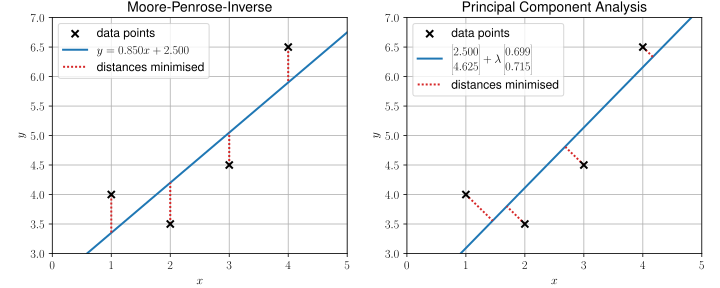

## System of Linear Equations

Lots of problems in natural sciences, engineering, and beyond can be described
by systems of linear equations. Such systems can be compactly represented in
matrix notation as
$$
  \bm{A} \vec{x} = \vec{b}
$$
with the coefficient matrix $\bm{A} \in \R{m}{n}$, the vector of unknowns
$\vec{x} \in \mathbb{R}^n$, and the right-hand side vector 
$\vec{b} \in \mathbb{R}^m$, which is also referred to as the inhomogeneity. 
The number of equations $m$ corresponds to the number of rows of $\bm{A}$, 
while the number of unknowns $n$ corresponds to the number of columns 
of $\bm{A}$.

The standard method for solving systems of linear equations is the 
Gaussian elimination algorithm. However, the usual implementation 
only works for systems with a unique solution. For underdetermined systems 
with infinitely many solutions, the Gaussian elimination algorithm is 
numerically unstable, and for overdetermined systems without solutions, 
it does not provide useful information.

The formal solution of a unique system with $m = n$ is
$\vec{x} = \bm{A}^{-1} \vec{b}$, where $\bm{A}^{-1}$ denotes 
the inverse of $\bm{A}$. With exact arithmetic, this solution is identical 
to the one obtained from the Gaussian elimination algorithm. However, 
for singular or non-square matrices, the inverse is not defined, and thus 
this solution is not applicable. It would be nice to have an operation that
has some properties of the inverse but is defined for all matrices.
Such operations are called pseudoinverses, and a well-known representative 
is the
[*Moore-Penrose pseudoinverse*](https://en.wikipedia.org/wiki/Pseudoinverse#Moore%E2%80%93Penrose_inverse),
which we will explore in the following.

### Theoretical Foundations

If an invertible matrix $\bm{A}$ is also diagonalisable with the eigenvalue
decomposition $\bm{A} = \bm{U} \bm{\Lambda} \bm{U}^{-1}$, then its inverse can be
computed as $\bm{A}^{-1} = \bm{U} \bm{\Lambda}^{-1} \bm{U}^{-1}$, where
$\bm{\Lambda}^{-1}$ is the diagonal matrix of the inverted eigenvalues. The
correctness of this formula can be easily shown by
$$
  \bm{A} \bm{A}^{-1} = \bm{U} \bm{\Lambda} \bm{U}^{-1} \bm{U} \bm{\Lambda}^{-1} \bm{U}^{-1} = \identity
$$
and
$$
  \bm{A}^{-1} \bm{A} = \bm{U} \bm{\Lambda}^{-1} \bm{U}^{-1} \bm{U} \bm{\Lambda} \bm{U}^{-1} = \identity\,.
$$
Since the singular value decomposition is a generalisation of the eigenvalue
decomposition for arbitrary matrices, we can consider a generalisation of the
inverse based on the singular value decomposition.

We define the *Moore-Penrose pseudoinverse* (MP pseudoinverse)
$\bm{A}^+$ of a matrix $\bm{A} \in \R{m}{n}$ as
$$
  \bm{A}^+ = \bm{V} \bm{\Sigma}^+ \bm{U}^T
  {{numeq}}{eq:mp_pseudoinverse}
$$
with the pseudoinverse diagonal matrix $\bm{\Sigma}^+$, which is obtained by
transposing and inverting the non-zero singular values of $\bm{\Sigma}$.
It can be shown that the MP pseudoinverse satisfies the so-called
```admonish note title="Moore-Penrose Conditions"
$$
  \begin{alignat}{2}
    \text{1.}\ \ &\mathbf{A} \mathbf{A}^+ \mathbf{A} &&= \mathbf{A} {{numeq}}{eq:mp_conditions_general_inverse} \\
    \text{2.}\ \ &\mathbf{A}^+ \mathbf{A} \mathbf{A}^+ &&= \mathbf{A}^+ {{numeq}}{eq:mp_conditions_weak_inverse} \\
    \text{3.}\ \ &\left(\mathbf{A} \mathbf{A}^+\right)^\intercal &&= \mathbf{A} \mathbf{A}^+ {{numeq}}{eq:mp_conditions_symmetry_aapt} \\
    \text{4.}\ \ &\left(\mathbf{A}^+ \mathbf{A}\right)^\intercal &&= \mathbf{A}^+ \mathbf{A} {{numeq}}{eq:mp_conditions_symmetry_apat}
  \end{alignat}
$$
```
Conversely, these conditions uniquely define the MP pseudoinverse.
If the matrix $\bm{A}$ is invertible, then the MP pseudoinverse is identical to
the inverse, i.e., $\bm{A}^+ = \bm{A}^{-1}$.

Consider now an overdetermined system of equations $\bm{A} \vec{x} = \vec{b}$ 
with $\bm{A}\in \R{m}{n}$, $m > n$ and $\vec{b} \in \mathbb{R}^m$, which
generally does not have a solution. Then the theorem holds
$$
  x_0 := \bm{A}^+ \vec{b} = \argmin{x\in \mathbb{R}^n} \| \bm{A} \vec{x} - \vec{b} \|_2\,,
$$
*i.e.*, $x_0$ provides the solution that minimises the quadratic error
between both sides of the system of equations.

~~~admonish proof title="Proof" collapsible=true
We start with the difference vector $\bm{A} \vec{x} - \vec{b}$
for an arbitrary $\vec{x} \in \mathbb{R}^n$ and add 0:
$$
  \bm{A} \vec{x} - \vec{b} = \bm{A} \vec{x} - \bm{A} \vec{x}_0 + \bm{A} \vec{x}_0 - \vec{b} = \bm{A} (\vec{x} - \vec{x}_0) + (\bm{A} \vec{x}_0 - \vec{b})
$$
and calculate its Euclidean norm:
$$
  \begin{align}
    \|\bm{A}x - b\|_2^2 &= \left(\bm{A}(x - x_0) + \left(\bm{A}x_0 - b\right)\right)^\intercal \left(\bm{A}(x - x_0) + \left(\bm{A}x_0 - b\right)\right) \\
    &= \left(\bm{A}(x - x_0)\right)^\intercal \left(\bm{A}(x - x_0)\right) + \left(\bm{A}x_0 - b\right)^\intercal \left(\bm{A}x_0 - b\right) \\
    &\hphantom{=} + \left(\bm{A}(x - x_0)\right)^\intercal \left(\bm{A}x_0 - b\right) + \left(\bm{A}x_0 - b\right)^\intercal \left(\bm{A}(x - x_0)\right) \\
    &=: \|\bm{A}(x - x_0)\|_2^2 + \|\bm{A}x_0 - b\|_2^2 + p_1 + p_2\,,
  \end{align}
$$
where $p_1$ and $p_2$ are the scalar products between the two vectors
$\bm{A}(x - x_0)$ and $(\bm{A}x_0 - b)$. These can be calculated by substituting
$x_0 = \bm{A}^+ b$:
$$
  \begin{align}
    p_1 &= \left(\bm{A}(x - x_0)\right)^\intercal \left(\bm{A}x_0 - b\right) = \left(\left(x - \bm{A}^+b\right)^\intercal \bm{A}^\intercal\right) \left(\bm{A}\bm{A}^+b - b\right) \\
    &= x^\intercal\bm{A}^\intercal\bm{A}\bm{A}^+b 
    - x^\intercal\bm{A}^\intercal b 
    - b^\intercal\left(\bm{A}^+\right)^\intercal\bm{A}^\intercal \bm{A}\bm{A}^+b 
    + b^\intercal\left(\bm{A}^+\right)^\intercal\bm{A}^\intercal b \\
    &= x^\intercal\bm{A}^\intercal\left(\bm{A}\bm{A}^+\right)^\intercal b 
    - x^\intercal\bm{A}^\intercal b 
    - b^\intercal\left(\bm{A}^+\right)^\intercal \bm{A}^\intercal \left(\bm{A}\bm{A}^+\right)^\intercal b 
    + b^\intercal\left(\bm{A}^+\right)^\intercal\bm{A}^\intercal b \\
    &= x^\intercal\left(\bm{A}\bm{A}^+\bm{A}\right)^\intercal b 
    - x^\intercal\bm{A}^\intercal b 
    - b^\intercal \left(\bm{A}^+\right)^\intercal \left(\bm{A}\bm{A}^+\bm{A}\right)^\intercal b 
    + b^\intercal\left(\bm{A}^+\right)^\intercal\bm{A}^\intercal b \\
    &= x^\intercal\bm{A}^\intercal b 
    - x^\intercal\bm{A}^\intercal b 
    - b^\intercal \left(\bm{A}^+\right)^\intercal \bm{A}^\intercal b 
    + b^\intercal\left(\bm{A}^+\right)^\intercal \bm{A}^\intercal b \\
    &= 0\,,
  \end{align}
$$
where we inserted Eq. {{eqref: eq:mp_conditions_symmetry_apat}} for the 3rd line
and Eq. {{eqref: eq:mp_conditions_general_inverse}} for the 5th line.

From the symmetry of the scalar product, we conclude $p_2 = 0$. The original
expression simplifies to
$$
  \begin{align}
    \|\mathbf{A}x - b\|_2^2 &= \|\mathbf{A}(x - x_0)\|_2^2 + \|\mathbf{A}x_0 - b\|_2^2 + 0 \\
    &= \|\mathbf{A}(x - x_0)\|_2^2 + \|\mathbf{A}x_0 - b\|_2^2 \geq \|\mathbf{A}x_0 - b\|_2^2
  \end{align}\,.
$$
In other words, the Euclidean norm of the difference vector for any
$\vec{x} \in \mathbb{R}^n$ is always greater than $\|\bm{A} \vec{x_0} - \vec{b}\|$.
Thus, $x_0 = \bm{A}^+ \vec{b}$ minimises the quadratic error of both sides
of the system of equations.
~~~

For an underdetermined system of equations $\bm{A} \vec{x} = \vec{b}$
with $\bm{A}\in \R{m}{n}$, $m < n$ and $\vec{b} \in \mathbb{R}^m$,
which has infinitely many solutions, the theorem holds
$$
  x_0 := \bm{A}^+ \vec{b} = \argmin{\bm{A}\vec{x}=\vec{b}} \| x \|_2\,,
$$
*i.e.*, $x_0$ provides the solution with the smallest Euclidean norm.

### Example 1: Overdetermined Linear System

We implement the MP pseudoinverse using an example of an overdetermined
system of equations:
$$
\bm{A} = \begin{pmatrix}
  1 & 1 \\
  2 & 1 \\
  3 & 1 \\
  4 & 1 \\
\end{pmatrix}
\quad \text{und} \quad
\vec{b} = \begin{pmatrix}
  4.0 \\
  3.5 \\
  5.0 \\
  6.5 \\
\end{pmatrix}\,.
$$

After importing NumPy
```python
{{#include ../codes/04-evd_and_svd/pinv_lineq.py:imports}}
```
we define the function `pinv`:
```python
{{#include ../codes/04-evd_and_svd/pinv_lineq.py:pinv_function}}
```
We perform the SVD of the input matrix and initialise the inverted matrix
of singular values `s_inv` with the dimension of the transposition of `s`.
Then we iterate over $p = \min(m,n)$ and invert the singular values that
are not equal to zero. Since floating-point numbers are not exact,
we set a threshold `rcond`. Singular values smaller than this threshold
are treated as zero, and only larger singular values are inverted.
Finally, the function returns the MP pseudoinverse according to Eq. 
{{eqref: eq:mp_pseudoinverse}}.

Now we can define the given system of equations:
```python
{{#include ../codes/04-evd_and_svd/pinv_lineq.py:define_lineq}}
```
and solve it using the MP pseudoinverse:
```python
{{#include ../codes/04-evd_and_svd/pinv_lineq.py:solve_lineq}}
```
We obtain the following results:
```python
{{#include ../codes/04-evd_and_svd/pinv_lineq.py:verify_results}}
```

Some entries of the matrix $\bm{A}$ may seem a bit conspicuous, such as 
the second column, which contains only ones. We can now write out 
this matrix equation
$$
  \begin{align}
    x_1 + x_2 &= 4.0 \\
    2x_1 + x_2 &= 3.5 \\
    3x_1 + x_2 &= 5.0 \\
    4x_1 + x_2 &= 6.5
  \end{align}
$$
or with more familiar variable names
$$
  \begin{align}
    m + t &= 4.0 \\
    2m + t &= 3.5 \\
    3m + t &= 5.0 \\
    4m + t &= 6.5 \,.
  \end{align}
$$
It is now easy to see that this system of equations represents the problem
of finding a line that passes through the 4 points 
$(1.0, 4.0)$, $(2.0, 3.5)$, $(3.0, 5.0)$, and $(4.0, 6.5)$.
With a little imagination, it becomes clear that such a line does not
exist. The solution provided by the MP pseudoinverse is therefore the line
that minimises the quadratic error between the points and the line.
If this idea sounds familiar, it is no coincidence. This is precisely the
linear regression using the method of least squares, which we have already
learned in
Chapter [1.2](../01-regression/02-linear_regression.md).

The MP pseudoinverse provides us with another way to calculate the parameters
of (multi-)linear regression: For the data points
$\{(\text{---}\ \vec{x}_ i \text{---}, y_i)\}_ {i=1,\cdots,N}$
with $\vec{x}_ i \in \mathbb{R}^n$, $y_i \in \mathbb{R}$
and the model
$$
y = \sum_{j=1}^n w_j x_j + b = \vec{w}^\intercal \vec{x} + b\,,
$$
the optimal parameters $\vec{w} \in \mathbb{R}^n$ and $b \in \mathbb{R}$
are given by the least-squares solution of the system of equations
$$
  \underbrace{\begin{pmatrix}
    \text{---}\ \vec{x}_ 1 \text{---} & 1 \\
    \vdots & \vdots \\
    \text{---}\ \vec{x}_ N \text{---} & 1 \\
  \end{pmatrix}}_ {\bm{A}\in \R{N}{(n+1)}}
  \underbrace{\begin{pmatrix}
    \vert \\
    \vec{w} \\
    \vert \\
    b
  \end{pmatrix}}_ {\vec{\beta} \in \mathbb{R}^{n+1}}
  = \underbrace{\begin{pmatrix}
    y_1 \\
    \vdots \\
    y_N
  \end{pmatrix}}_ {\vec{y} \in \mathbb{R}^N}\,,
$$
or in matrix notation
$$
\vec{\beta} = \bm{A}^+ \vec{y}\,.
{{numeq}}{eq:multilinear_regression_pinv}
$$

As a final note, the (multi-)linear regression problem is different from the
principal component analysis (PCA) problem, which we discussed in 
the previous chapter. Although both problems are solved by finding the
"best" (hyper-)plane in a least-squares sense, the minimised error is different.
The following figure illustrates the difference between these two problems:



### Example 2: Underdetermined Linear System

```admonish note title="Computational Details" collapsible=true
The geometries used in this section are optimised at the
&omega;B97X-D3/def2-TZVP level of theory as implemented in
the ORCA 6.0.1 quantum chemistry package.
The dipole moments and CHELPG are calculated at the
&omega;B97XD/def2-TZVP level of theory using the
Gaussian 16 package.
```

In quantum mechanics, the electronic charge is described by a continuous
charge density $\rho(\vec{r})$ in space. Albeit being correct, this
description is not as intuitive as the classical view, where the charge
is localised at every atomic nucleus. To bridge the gap between these two
pictures, lots of schemes have been developed that approximate the
continuous charge density by a discrete set of point charges.

```admonish warning title="Atomic Charges"
Because the charge in quantum mechanics is continuous in nature, 
no discrete set of point charges can perfectly reproduce the
continuous charge density. 
Therefore, you should be aware that every scheme can have
some shortcomings, and might lead to nonsensical results under
some circumstances.
```

For the sake of demonstration, we will use a simple scheme that
reproduces the monopole and dipole moments of the continuous charge
density. 
Suppose we have atoms at positions
$\vec{R}_1, \vec{R}_2, \ldots, \vec{R}_N$ with charges
$q_1, q_2, \ldots, q_N$, then the equations
$$
\begin{align*}
    \sum_{i=1}^N q_i &= Q \\
    \sum_{i=1}^N \vec{R}_i q_i &= \vec{\mu}
    {{numeq}}{eq:monopole_dipole_equations}
\end{align*}
$$
should be satisfied, where $Q$ is the total charge and $\vec{\mu}$ is the
total dipole moment.
There are in total 4 equations, but $N$ unknowns, namely the
charges $q_i$. Thus for $N > 4$, the system of equations is definitely
underdetermined. 
In the following, we will use the MP pseudoinverse to find a solution that
minimises the Euclidean norm of the charges, *i.e.*, we want to find
$$
  q_0 := \bm{A}^+ \vec{b} = \argmin{\bm{A} \vec{q} = \vec{b}} \| \vec{q} \|_2\,,
$$

First, we use the water molecule as an example, with the following coordinates
<table>
  <thead>
    <tr>
      <th style="text-align:center;"> </th>
      <th style="text-align:center;">$x$</th>
      <th style="text-align:center;">$y$</th>
      <th style="text-align:center;">$z$</th>
    </tr>
  </thead>
  <tbody>
    <tr>
      <td>O</td>
      <td style="text-align:right;">0.00000000</td>
      <td style="text-align:right;">0.00000000</td>
      <td style="text-align:right;">0.00000000</td>
    </tr>
    <tr>
      <td>H</td>
      <td style="text-align:right;">0.00000000</td>
      <td style="text-align:right;">-0.76221179</td>
      <td style="text-align:right;">-0.58030122</td>
    </tr>
    <tr>
      <td>H</td>
      <td style="text-align:right;">0.00000000</td>
      <td style="text-align:right;">0.76221179</td>
      <td style="text-align:right;">-0.58030122</td>
  </tbody>
</table>

The dipole moment of the water molecule is 0.43433093&nbsp;e&ThinSpace;Å.

Due to symmetry, the dipole moment of the water molecule at the coordinates
given above can only point in the $z$-direction, so we can reduce our 
system of equations to
$$
\begin{align*}
    q_1 + q_2 + q_3 &= 0 \\
    0 \cdot q_1 + (-0.58030122) \cdot q_2 + (-0.58030122) \cdot q_3 &= -0.43433093
\end{align*}
$$
or, in matrix notation,
$$
\begin{pmatrix}
  1 & 1 & 1 \\
  0 & -0.58030122 & -0.58030122
\end{pmatrix}
\begin{pmatrix}
  q_1 \\
  q_2 \\
  q_3
\end{pmatrix}
=
\begin{pmatrix}
  0 \\
  -0.43433093
\end{pmatrix}\,.
$$

We can now implement this in Python:
```python
{{#include ../codes/04-evd_and_svd/pinv_dipole.py:imports}}
```
```python
{{#include ../codes/04-evd_and_svd/pinv_dipole.py:water_linear_system}}
```
Then, we solve this underdetermined system using the MP pseudoinverse:
```python
{{#include ../codes/04-evd_and_svd/pinv_dipole.py:water_solution}}
```
This time, we used the
[`np.linalg.pinv`](https://numpy.org/doc/stable/reference/generated/numpy.linalg.pinv.html)
function to compute the MP pseudoinverse, which is already implemented in NumPy.
We set the `rcond` parameter to `1e-12`, as in our own implementation.

Comparing the results with 
[CHELPG](https://en.wikipedia.org/wiki/CHELPG),
a popular scheme for approximating the continuous charge density,
which delivers the charges 
$q_1 = -0.748458,\ q_2 = 0.374229,\ q_3 = 0.374229$,
we see that the MP pseudoinverse delivers a very similar result.

The MP pseudoinverse works so well in this case, since we actually neglected 
the equation concerning the $y$-component of the dipole moment:
$$
0 \cdot q_1 + (-0.76221179) \cdot q_2 + 0.76221179 \cdot q_3 = 0\,,
$$
which makes $q_2 = q_3$, and this is implicitly enforced by 
minimising the Euclidean norm of the charges.
Therefore, we "accidentally" solved the $3 \times 3$ system of equations
and obtained the *unique* charges that reproduce the monopole and dipole moments.

We now take a look at a slightly larger molecule, CH<sub>3</sub>Cl, at
the following coordinates:
```
{{#include ../codes/04-evd_and_svd/ch3cl.xyz}}
```
with the dipole moment of 
$\vec{\mu} = (0.0\quad 0.0\quad -0.40671888)^\intercal$&nbsp;e&ThinSpace;Å.

The xyz-file can be downloaded from 
<a href="../codes/04-evd_and_svd/ch3cl.xyz" download>here</a>,

This time, we read the coordinates from the xyz-file:
```python
{{#include ../codes/04-evd_and_svd/pinv_dipole.py:load_ch3cl_xyz}}
```
and build the linear system containing all four equations 
from Eq.&nbsp;{{eqref: eq:monopole_dipole_equations}}:
```python
{{#include ../codes/04-evd_and_svd/pinv_dipole.py:ch3cl_linear_system}}
```
With 4 equations and 5 unknowns, the system is in any case underdetermined.

Just like in the case of the water molecule, we can solve this system
using the MP pseudoinverse:
```python
{{#include ../codes/04-evd_and_svd/pinv_dipole.py:ch3cl_solution}}
```
This time CHELPG delivers the following charges:
$$
q_1 = -0.198090,\ q_2 = -0.159161,\ 
q_3 = 0.119084,\ q_4 = 0.119084,\ q_5 = 0.119084\,,
$$
which is quite different from the results of the MP pseudoinverse.

However, if we condense the charges into heavy atoms, we obtain
$$
  q_{\mathrm{C}} = 0.207641,\ q_{\mathrm{Cl}} = -0.207641
$$
for MP pseudoinverse and
$$
  q_{\mathrm{C}} = 0.159161,\ q_{\mathrm{Cl}} = -0.159161
$$
for CHELPG, which are quite similar.

This example shows the application of the MP pseudoinverse 
for solving underdetermined systems of equations in quantum chemistry.
Admittedly, the results are not great, and, to the best of the author's
knowledge, the charge scheme presented here is not used in practice.

The use of underdetermined systems of equations in the field of chemistry
is in fact quite rare, since most of the time, one tries to collect as much
information as possible, instead of relying on the mercy of the
minimum norm solution. In the case of atomic charges, if the number of atoms
is larger than 4, one would try to also include the quadrupole moment
and higher multipole moments, which would lead to more equations.

In contrary, underdetermined systems of equations are quite common in
machine learning, where the collection of high-quality data is often
difficult or expensive. In such cases, creating a model with
billions or even trillions of parameters is not uncommon, leading to
an underdetermined system of equations. 
To ensure that a sensible solution is found among the infinite number of
possible solutions, a technique called
[*regularisation*](https://en.wikipedia.org/wiki/Regularization_(mathematics)) is often used.
The idea of regularisation is very similar to the minimum Euclidean norm solution
of the MP pseudoinverse, but instead of minimising the Euclidean norm of the
parameters, a different norm is used.
Without regularisation, such gigantic models cannot be trained in a sensible way.

