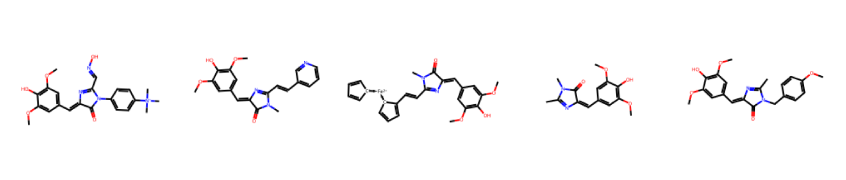
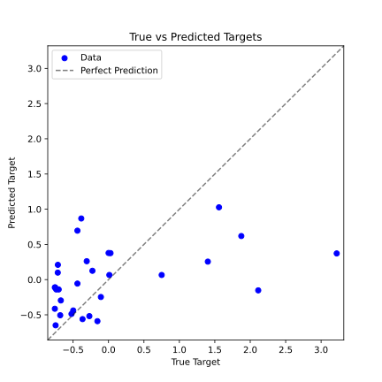
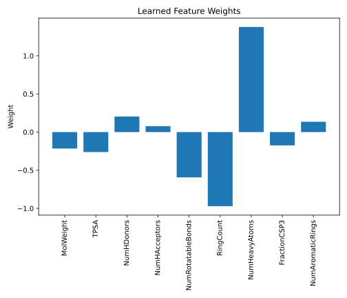

## Regression

You might be wondering why we are revisiting regression. The reason is that linear regression is a fundamental supervised machine learning algorithm used to model the relationship between a set of input features and a continuous output. This section will build upon what you've learned, so don't worry, we'll keep it concise.

### Linear Regression with Multidimensional Data

In the first chapter, we used linear regression to model a relationship between a single input and a single output. In the real world, however, data is rarely described by a single value. Instead, data is often of higher *dimensionality* and is characterized by multiple *features*.

```admonish note title="Note"
In this context, we'll use the term *dimensionality* to refer to the number of features describing a single data point. Think of it as the number of independent variables needed to characterize that point. For example, a 1000x1000 pixel image has a dimensionality of 1,000,000, since changing even one pixel alters the entire image.
```

Let's frame the problem mathematically. We have a dataset $\mathcal{D} = \{(\vec{x}_i, y_i)\}_{i=1, \dots, N}$, where each $\vec{x}_i \in \mathbb{R}^d$ is a $d$-dimensional input vector (our feature vector), and $y_i \in \mathbb{R}$ is the corresponding continuous output (target). Our goal is to find a function $\hat{f}_{\vec{w}}: \mathbb{R}^d \to \mathbb{R}$ with parameters $\vec{w}$ that approximates this relationship, such that $\hat{f}_{\vec{w}}(\vec{x}_i) \approx y_i$ for all data points.

For data with one feature ($d=1$), you'll recall we needed two parameters: $\hat{f}_{w_0, w_1}(x) = w_0 + w_1 x$. For $d$-dimensional data, we need $d+1$ parameters—one for each feature and one bias term:

$$
\hat{f}_{\vec{w}}(\vec{x}) = w_0 + w_1 x_1 + w_2 x_2 + \dots + w_d x_d = w_0 + \sum_{j=1}^{d} w_j x_j
$$

To simplify this, we can augment our input vector $\vec{x}$ by adding a constant value of 1 as its first element, making it $\vec{x}' = (1, x_1, \dots, x_d)$. We can then combine our weights into a single vector $\vec{w} = (w_0, w_1, \dots, w_d)$. Now, the model becomes a simple dot product:

$$
\hat{f}_{\vec{w}}(\vec{x}') = \vec{w} \cdot \vec{x}'
$$

We can extend this to the entire dataset by organizing our inputs into a matrix $\bm{X} \in \mathbb{R}^{N \times (d+1)}$, where each row is an augmented input vector $\vec{x}_i'$. The predictions for all data points can then be computed in a single matrix-vector product:

$$
\hat{\bm{y}} = \bm{X} \vec{w}
$$

where $\hat{\bm{y}} = (\hat{f}_{\vec{w}}(\vec{x}'_1), \dots, \hat{f}_{\vec{w}}(\vec{x}'_N))^T \in \mathbb{R}^N$. The data matrix $\bm{X}$ looks like this:

$$
\bm{X} = \begin{pmatrix}
1 & x_{1,1} & \dots & x_{1,d} \\
1 & x_{2,1} & \dots & x_{2,d} \\
\vdots & \vdots & \ddots & \vdots \\
1 & x_{N,1} & \dots & x_{N,d}
\end{pmatrix}
$$

This compact notation is standard in machine learning and will be used throughout the rest of this chapter.

### Main Components of a Machine Learning Problem

With the above formulation, we have defined the first major component of a supervised machine learning problem: **the model**. Before we can apply it, we need two more components:

The **loss function**, which measures the error between our model's predictions and the true outputs. For linear regression, this is typically the Mean Squared Error (MSE):

$$
\mathcal{L}(\hat{\bm{y}}, \bm{y}) = \frac{1}{2} \sum_{i=1}^N (\hat{f}_{\vec{w}}(\vec{x}_i) - y_i)^2
$$

The **optimization method**, which is the algorithm used to find the model parameters $\hat{\vec{w}} = (w_0, w_1, \dots, w_d)$ that minimize the loss function. While we can always use an iterative method like Gradient Descent, linear regression benefits from having a closed-form analytical solution:

$$
\hat{\vec{w}} = (\bm{X}^T \bm{X})^{-1} \bm{X}^T \bm{y} \,.
{{numeq}}{eq:linear_regression_weights}
$$

where $\bm{y}$ is the vector of true outputs.

```admonish note title="Proof" collapsible=true
The loss function for least squares is given by:

$$
\begin{aligned}
\mathcal{L} &= \frac{1}{2} \sum_{i=1}^N (\hat{f}_{\vec{w}}(\vec{x}_i) - y_i)^2 \\
&= \frac{1}{2} \left\| \bm{X} \vec{w} - \vec{y} \right\|^2_2
\end{aligned}
$$

The gradient of the loss function with respect to $\vec{w}$ is:

$$
\begin{aligned}
\nabla_{\vec{w}} \mathcal{L} &= \nabla_{\vec{w}} \left( \frac{1}{2} (\bm{X}\vec{w} - \vec{y})^T (\bm{X}\vec{w} - \vec{y}) \right) \\
&= \bm{X}^T (\bm{X} \vec{w} - \vec{y})
\end{aligned}
$$

Setting the gradient to zero to find the minimum, we get:

$$
\begin{aligned}
\bm{X}^T (\bm{X} \hat{\vec{w}} - \vec{y}) &= 0 \\
\bm{X}^T \bm{X} \hat{\vec{w}} &= \bm{X}^T \vec{y}
\end{aligned}
$$

Multiplying from the left by $(\bm{X}^T \bm{X})^{-1}$ gives the solution:

$$
\hat{\vec{w}} = (\bm{X}^T \bm{X})^{-1} \bm{X}^T \vec{y}
$$

Linear algebra tells us that the matrix $\bm{X}^T \bm{X}$ is invertible if the columns of $\bm{X}$ are linearly independent. For the common case where $N > d$, this means we have *independent features*.

If the matrix is not invertible (i.e., it is singular), we can use the Moore-Penrose pseudoinverse, defined via the Singular Value Decomposition of $\bm{X}^T \bm{X} = \bm{V} \bm{\Sigma} \bm{V}^T$:

$$
(\bm{X}^T \bm{X})^+ = \bm{V} 
\begin{pmatrix}
1/\sigma_1^2 & & & \\
& \ddots & & \\
& & 1/\sigma_k^2 & \\
& & & 0
\end{pmatrix}
\bm{V}^T
$$

where $k$ is the rank of the matrix. This gives the optimal solution with the minimum possible norm.
```

### Object-Oriented Programming

Before diving into the implementation, let's introduce a programming paradigm that allows us to implement an ML model as an abstract object with specific functionalities. This approach, known as **Object-Oriented Programming** (OOP), differs from the procedural style we have used so far.

The fundamental blueprint for an object, which defines its properties and methods, is called a **class**. An object created from a class is known as an **instance**. An object's properties are its **attributes**, and its **methods** are functions that can access and modify these attributes. Let's clarify these concepts with a simple example.

~~~admonish example title="Example: Atom"
In chemistry, an atom is an excellent example of an object that can be represented by a class. To describe an atom, we need attributes such as its symbol, mass, and charge. Its methods could include calculating its mass or modifying its charge. A specific atom, like a hydrogen atom, would be an instance of this `Atom` class.

We can define the `Atom` class in Python as follows:

```python
{{#include ../codes/05-machine_learning/atom.py:atom_init}}
```

The `__init__` method is a special **constructor** that runs when a new class instance is created. It initializes the object's attributes. Here, the attributes are the atom's `symbol` and `charge`, which are passed as arguments during instantiation. The `self` parameter is mandatory; it refers to the instance itself, allowing methods to access its attributes and other methods. This will become clearer as we define more methods.

```python
{{#include ../codes/05-machine_learning/atom.py:atom_methods}}
```

The `get_atomic_number` method returns the atom's atomic number. It uses `self` to access the instance's `symbol` attribute. Note that the `atomic_numbers` dictionary is a local variable within the method, not an instance attribute, because it is not defined with `self`. We also define `set_charge`, which modifies the `charge` attribute. Besides `self`, it requires the new charge as an argument. The `get_electron_config` method uses the atomic number to determine and return the electron configuration as a string.

Finally, we can define the `__str__` method, which is automatically called when an instance is passed to the `print()` function, providing a user-friendly string representation of the object:

```python
{{#include ../codes/05-machine_learning/atom.py:atom_print}}
```

Now, let's create an instance of a carbon atom and use its methods:

```python
{{#include ../codes/05-machine_learning/atom.py:atom_example}}
```

In addition to using methods, we can directly access and modify an instance's attributes:

```python
{{#include ../codes/05-machine_learning/atom.py:atom_example_2}}
```

You have likely already used classes and instances without realizing it. Common Python data types like lists (`list.append(element)`), dictionaries (`dict.keys()`), and NumPy arrays (`arr.shape`) are all implemented as classes.
~~~

### Implementing Linear Regression

Now that we understand the basics of OOP, we can implement our linear regression model as a Python class. To do this, we need to consider the essential attributes and methods for our model. For linear regression, the only attribute we need is the weight vector $\vec{w}$. Although the weights are unknown before training, it is good practice to initialize them in the constructor—for example, to `None`.

The most important method for any machine learning model is `fit`, which takes the data matrix $\bm{X}$ and the target vector $\bm{y}$ as input and then calculates the model's weights using Equation {{eqref: eq:linear_regression_weights}}. The `predict` method then uses these learned weights to make predictions on new data. Our complete implementation is shown below:

```python
{{#include ../codes/05-machine_learning/regression.py:regression_class}}
```

With our model defined, we need data to train it. We will use a real-world dataset from a study on the fluorescence properties of various ligands for RNA aptamers.[^1] The data is available as a `.csv` file, which you can download from [here](../codes/05-machine_learning/aptamer_data.csv). The [`pandas`](https://pandas.pydata.org/) library is an excellent tool for this, offering convenient ways to handle structured data.

```admonish note title="Installing pandas"
If you haven't already, you can install the `pandas` library using `mamba install -c conda-forge pandas`.
```

```python
{{#include ../codes/05-machine_learning/regression.py:load_data_from_csv}}
```

The data is loaded into a `pandas` DataFrame, a two-dimensional table with labeled rows and columns. The `head()` method displays the first few rows, giving us a quick overview of the data.

| Index | MolWeight | TPSA | NumHDonors | ... | FractionCSP3 | NumAromaticRings | fl_int |
|-------|-----------|------|------------|-----|--------------|------------------|---------|
| 0 | -1.963085 | -0.64118 | -0.447214 | ... | 0.711087 | -1.333333 | -0.227077 |
| 1 | -1.698002 | -0.64118 | -0.447214 | ... | 1.253471 | -1.333333 | -0.107639 |
| 2 | -1.432920 | -0.64118 | -0.447214 | ... | 1.728057 | -1.333333 | -0.438808 |
| 3 | -1.167838 | -0.64118 | -0.447214 | ... | 2.146810 | -1.333333 | -0.438808 |
| 4 | -0.410690 | -0.64118 | -0.447214 | ... | 3.151816 | -1.333333 | -0.156500 |

From this overview, you can see that each ligand (molecule) is described by a set of features, such as molecular weight, number of rotatable bonds, and number of aromatic rings. Our goal is to predict the `fl_int` column, which contains the fluorescence intensity of the ligand. Note that the values may seem arbitrary because we have already preprocessed the data by standardizing each column to have a zero mean and unit variance. This is a common step in machine learning to ensure all features contribute equally during training.

A few exemplary molecules from the dataset are shown below.



Since our model is built on `numpy`, we need to convert our `pandas` DataFrame into `numpy` arrays. We can achieve this using the `.values` attribute. For the input matrix $\bm{X}$, we will use all columns *except* the target column. Additionally, we must add a column of ones to $\bm{X}$ to account for the bias term, which we can do using `np.hstack`.

```python
{{#include ../codes/05-machine_learning/regression.py:process_data}}
```

Now we can create an instance of our `LinearRegression` model, fit it to the data, and use it to predict the fluorescence intensities.

```python
{{#include ../codes/05-machine_learning/regression.py:fit_model}}
```

```admonish tip title="Cross-Validation"
You might have realized that evaluating a model on the same data it was trained on is not a reliable measure of its performance. In practice, we split our data into a **training set** (for fitting the model) and a **test set** (for evaluating its performance on unseen data). We will explore this concept, known as **cross-validation**, in a later section.
```

### Visualizing the Results

Let's visualize our model's performance by plotting the predicted fluorescence intensities against the true values.

```python
{{#include ../codes/05-machine_learning/regression.py:plot_predictions}}
```

The plot shows significant deviations between the predicted and true values. This is not entirely surprising, given the limited number of features used to predict a complex property like fluorescence intensity. We will explore how to improve feature engineering in the following chapters.



To quantify the model's performance, we can calculate a metric like the Mean Absolute Error (MAE).

```python
{{#include ../codes/05-machine_learning/regression.py:calculate_mae}}
```

Although the model's accuracy is limited, we can still gain insights by examining how it makes its predictions. In a linear regression model, the learned weights directly correspond to the importance of each feature. Plotting these weights can reveal which features the model considers most influential.

```python
{{#include ../codes/05-machine_learning/regression.py:plot_model_weights}}
```




---

[^1]: Christian Steinmetzger, Irene Bessi, Ann-Kathrin Lenz, Claudia Höbartner, Structure–fluorescence activation relationships of a large Stokes shift fluorogenic RNA aptamer, Nucleic Acids Research, Volume 47, Issue 22, 16 December 2019, Pages 11538–11550, https://doi.org/10.1093/nar/gkz1084