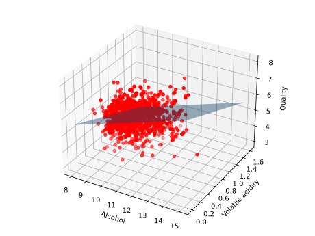

## Überwachtes Lernen

Liegen uns Datenpaare $\{(\vec{x}_i, y_i)\}_{i=1,2,\dots,N}$ vor, wobei $\vec{x}_i \in \mathbb{R}^n$ 
die Eingabe und $y_i \in \mathbb{R}$ die Ausgabe darstellt, so ist es unser Ziel, eine approximative
Abbildung $\hat{f}_{\theta} : \mathbb{R}^n \to \mathbb{R}$ zu finden, die die Eingabe auf die Ausgabe abbildet, 
d.h. $\hat{f}_{\theta}(\vec{x}_i) \approx y_i$ für alle $i$. Man bezeichnet $y_i$ auch als *Labels* oder 
*Targets*. Unser Modell $\hat{f}$ ist in 
der Regel parametrisiert, d.h. es gibt eine Menge von Parametern $\theta$, die die Abbildung definieren. 
Demnach wollen wir die Parameter $\theta$ so wählen, dass der Fehler zwischen der
tatsächlichen Ausgabe $y_i$ und der approximierten Ausgabe $\hat{f}_{\theta}(\vec{x}_i)$ minimiert wird.
Dieses Lernen wird als **überwachtes Lernen** bezeichnet, da wir $y_i$ für jede Eingabe 
$\vec{x}_i$ kennen und somit den Fehler direkt berechnen können.

Gemäß der obigen Überlegungen können wir festhalten, dass jedes ML-Modell, welches auf überwachtem Lernen basiert,
die folgenden Komponenten enthält:

1. **Modell**: Die Funktion $\hat{f}_{\theta}$, die die Eingabe auf die Ausgabe abbildet.
2. **Verlustfunktion**: Die Funktion, die den Fehler zwischen der tatsächlichen Ausgabe und der approximierten 
Ausgabe misst.
3. **Optimierungsverfahren**: Der Algorithmus, der die Parameter $\theta$ des Modells so anpasst, dass der Fehler 
minimiert wird.

Dieses Setting lässt sich tatsächlich auch auf das unüberwachte Lernen übertragen, wobei die Verlustfunktion
durch eine allgemeine Objektivfunktion ersetzt wird, die es zu maximieren oder minimieren gilt.

### Regression

Für den Fall, dass die Labels $y_i$ kontinuierlich sind, also z.B. reelle Zahlen $y_i \in \mathbb{R}$ annnehmen, 
spricht man von **Regression**. Den einfachsten Fall, die **lineare Regression** mit $x_i \in \mathbb{R}$,
haben Sie bereits ausführlich in Kapitel [(1.2)](../01-regression/02-linear_regression.md) kennengelernt und 
diskutiert. Wir werden daher nur kurz darauf eingehen und die lineare Regression in den Kontext des überwachten 
Lernens einordnen.

Zunächst möchten wir anmerken, dass wir bisher lediglich Inputs $x_i$ betrachtet haben, die nur eine Dimension 
besitzen, also $x_i \in \mathbb{R}$ für $i = 1,2,\dots,N$. Diese stellten beispielsweise die Konzentrationen von 
Methylenblau, welche auf die Absorbanz abgebildet wurden, dar. In der Praxis haben wir jedoch oft mit 
mehrdimensionalen Inputs $\vec{x}_i \in \mathbb{R}^n$ zu tun, welche $n$ *Features* besitzen. In den vorherigen
Abschnitten haben wir zur Darstellung dieser Daten die Datenmatrix $\bm{X}$ kennengelernt, welche die Inputs 
$\vec{x}_i$ in den Zeilen
und die Features in den Spalten speichert. Die lineare Regression für mehrdimensionale Inputs lautet dann:

$$
\hat{f}(\vec{x}_i) = w_1 x_{i1} + w_2 x_{i2} + \dots + w_n x_{in} + b = \sum_{j=1}^n w_j x_{ij} + b\,,
$$

was wir als Skalarprodukt zwischen dem Vektor $\vec{w} = (w_1, w_2, \dots, w_n)^T$ und dem Inputvektor $\vec{x}_i$
schreiben können:

$$
\hat{f}_{\theta}(\vec{x}_i) = \left\langle \vec{w}, \vec{x}_i \right\rangle + b =\vec{w}^T \vec{x}_i + b\,.
$$

Unter Berücksichtigung aller Datenpunkte durch die Matrix $\bm{X}$ ergeben sich die Vorhersagen 
$\hat{\vec{y}}$ aller $N$ Inputs durch eine Matrix-Vektor-Multiplikation:

$$
\hat{\vec{y}} = \bm{X} \vec{w} + b\,.
$$

Da wir die Vorhersage des Modells als gewichtete Summe der Features berechnen, bezeichnet man die 
Parameter $\theta = (\vec{w}, b)$ des Modells auch als Gewichte (engl. *weights*) $\vec{w}$ und Bias $b$. 
Das $j$-te Gewicht $w_j$ gibt dabei an, wie stark das $j$-te Feature $x_{ij}$ in die Vorhersage eingeht.
Als Verlustfunktion wählt man in der Regel die Summe der quadratischen Fehler, welche Sie bereits kennen.

```admonish note title="Hinweis"
Um die Modellparameter $\theta = (\vec{w}, b)$ zusammenzufassen, kann $b$ auch als ein zusätzliches Gewicht 
$w_0$ eingeführt werden, sodass $\vec{w} = (w_0, w_1, w_2, \dots, w_n)^T$. Dazu muss der Inputvektor um
einen konstanten Wert $1$ erweitert werden, sodass $\vec{x}_i = (1, x_{i1}, x_{i2}, \dots, x_{in})^T$. 
Überprüfen Sie, dass die lineare Regression in diesem Fall äquivalent zur obigen Formulierung ist.
```

Gemäß der oben diskutierten Komponenten eines ML-Modells fehlt uns nun nur noch die Angabe eines 
Optimierungsverfahrens, 
um die Modellparameter $\theta$ so zu wählen, dass der Fehler zwischen den Vorhersagen $\hat{\vec{y}}$ und den
tatsächlichen Labels $\vec{y}$ minimiert wird. In der ersten Übung haben Sie gesehen, dass dieses Problem 
für $x_i \in \mathbb{R}$ eine analytische Lösung besitzt. Auch für den multi-dimensionalen Fall existiert eine 
analytische Lösung,

$$
\hat{\theta} = (\bm{X}^T \bm{X})^{-1} \bm{X}^T \vec{y}\,,
$$

was Sie leicht durch Berechnen und Nullsetzen des Gradienten der Verlustfunktion nach $\theta$ 
(hier $\vec{w}$) überprüfen können. 

```admonish note title="Beweis" collapsible=true
Die Verlustfunktion der kleinsten Quadrate lautet

$$
\begin{aligned}
\mathcal{L} &= \frac{1}{2} \sum_{i=1}^N (\hat{f}_{\theta}(\vec{x}_i) - y_i)^2 \\
&= \frac{1}{2} \left\| \bm{X} \vec{w} - \vec{y} \right\|^2\,,
\end{aligned}
$$

wobei wir $b$ in $\vec{w}$ integriert haben. Der Gradient der Verlustfunktion nach $\vec{w}$ ist

$$
\begin{aligned}
\nabla_{\vec{w}} \mathcal{L} &= \nabla_{\vec{w}} \left( \frac{1}{2} \left\| \bm{X} \vec{w} - \vec{y} \right\|^2 \right) \\
&= \bm{X}^T (\bm{X} \vec{w} - \vec{y})\,.
\end{aligned}
$$

Setzen wir den Gradienten null, erhalten wir

$$
\begin{aligned}
\bm{X}^T (\bm{X} \hat{\vec{w}} - \vec{y}) &= 0 \\
\bm{X}^T \bm{X} \hat{\vec{w}} &= \bm{X}^T \vec{y}\,.
\end{aligned}
$$

Multiplizieren wir die Gleichung von links mit $(\bm{X}^T \bm{X})^{-1}$, so erhalten wir die Lösung

$$
\hat{\vec{w}} = (\bm{X}^T \bm{X})^{-1} \bm{X}^T \vec{y}\,.
$$

Die lineare Algebra besagt, dass die Matrix $\bm{X}^T \bm{X}$ invertierbar ist, wenn die Spalten von
$\bm{X}$ linear unabhängig sind. Für den Fall $N > n$ ist dies sehr wahrscheinlich, und wir sprechen von
*unabhängigen Features*.

Ist die Matrix nicht invertierbar, so liefert uns die Moore-Penrose-Pseudoinverse, 

$$
(\bm{X}^T \bm{X})^+ = \bm{V} 
\left(\begin{array}{cccc}
\frac{1}{\sigma_1^2} & & & \\
& \ddots & & \\
& & \frac{1}{\sigma_k^2} & \\
& & & 0_{n-k, n-k}
\end{array}\right)
\bm{V}^T\,,
$$

die optimale Lösung mit minimaler Norm. 
```

### Regression am Wine Quality Dataset

Um den Datensatz, den wir im Folgenden verwenden werden, zu erkunden, nutzen wir eine der bekanntesten 
Bibliotheken für die Datenanalyse und -manipulation in Python: [`pandas`](https://pandas.pydata.org). 
Abgeleitet vom Begriff *Panel Data* und basiert auf `numpy` führt `pandas` eine nützliche Datenstruktur aus der 
Programmiersprache R in Python ein: Das `DataFrame`, welches als eine Tabelle mit Zeilen und Spalten
interpretiert werden kann. 

Nachdem Sie `pandas` mit 
    
```bash 
mamba install -c conda-forge pandas
```

installiert haben, können Sie das Modul importieren:

```python
{{#include ../codes/05-machine_learning/wine_regression.py:imports}}
```

Mit nur einem einzigen Befehl importieren wir den Wine Quality Datensatz aus dem Internet und speichern ihn in
einem `DataFrame`-Objekt:

```python
{{#include ../codes/05-machine_learning/wine_regression.py:load_data}}
```

Mit der Methode `shape` können Sie die Dimensionen des Datensatzes abfragen (also die Anzahl der Datenpunkte und
Features), und mit `head()` können Sie sich die ersten Zeilen des Datensatzes anzeigen lassen. Dabei sollte 
Ihnen die folgende Tabelle angezeigt werden:

|    |   fixed acidity |   volatile acidity |   citric acid |   residual sugar |   chlorides |   free sulfur dioxide |   total sulfur dioxide |   density |   pH |   sulphates |   alcohol |   quality |
|---:|----------------:|-------------------:|--------------:|-----------------:|------------:|----------------------:|-----------------------:|----------:|-----:|------------:|----------:|----------:|
|  0 |             7.4 |               0.7  |          0    |              1.9 |       0.076 |                    11 |                     34 |    0.9978 | 3.51 |        0.56 |       9.4 |         5 |
|  1 |             7.8 |               0.88 |          0    |              2.6 |       0.098 |                    25 |                     67 |    0.9968 | 3.2  |        0.68 |       9.8 |         5 |
|  2 |             7.8 |               0.76 |          0.04 |              2.3 |       0.092 |                    15 |                     54 |    0.997  | 3.26 |        0.65 |       9.8 |         5 |
|  3 |            11.2 |               0.28 |          0.56 |              1.9 |       0.075 |                    17 |                     60 |    0.998  | 3.16 |        0.58 |       9.8 |         6 |
|  4 |             7.4 |               0.7  |          0    |              1.9 |       0.076 |                    11 |                     34 |    0.9978 | 3.51 |        0.56 |       9.4 |         5 |

Der [Wine Quality Datensatz](https://archive.ics.uci.edu/dataset/186/wine+quality) enthält Daten von ca. 1600 
Rot- und Weißweinen aus dem Norden Portugals. Die *Features* beschreiben verschiedene physikalische und chemische
Eigenschaften der Weine, wie beispielsweise den Alkoholgehalt, den pH-Wert oder den Zitronensäuregehalt.
Zudem besitzt jeder Wein eine Qualitätsbewertung zwischen 0 und 10, die als *Label* oder *Target* in der
Regression oder Klassifikation verwendet werden kann.

Dazu extrahieren wir zunächst die Datenmatrix $\bm{X}$ und den Vektor der Labels $\vec{y}$ aus dem
`DataFrame`, wobei Sie einzelne Spalten des `DataFrame` mit dem Namen der Spalte als Index abrufen können:

```python
{{#include ../codes/05-machine_learning/wine_regression.py:preprocess_data}}
```

Außerdem fügen wir eine Spalte mit Einsen hinzu, um den Bias $b$ in die Gewichtsmatrix $\bm{X}$ zu 
integrieren. Dazu definieren wir mit `np.ones` einen Vektor der Länge $N$ mit Einsen und fügen ihn 
mit `np.hstack` als erste Spalte in die Datenmatrix ein.

Wir führen nun die lineare Regression an alles Features wie oben beschrieben durch. Da die Features des 
Datensatzes aber auf unterschiedlichen Skalen liegen, versuchen wir
durch Regularisierung die Modellparameter, insbesondere den Bias, möglichst klein zu halten. Glücklicherweise 
gibt es auch für die *Ridge Regression* eine analytische Lösung,

$$
\hat{\vec{w}} = (\bm{X}^T \bm{X} + \lambda \bm{I})^{-1} \bm{X}^T \vec{y}\,,
$$

die analog zur linearen Regression berechnet werden kann.

```python
{{#include ../codes/05-machine_learning/wine_regression.py:linear_regression}}
```

Für die 12 Features des Datensatzes, sowie den Bias, enthält das Array `theta` also die optimalen Gewichte.
Wir visualisieren die Vorhersagen des Modells und die tatsächlichen Labels anhand zwei ausgewählter Features
in einem 3D-Plot:

```python
{{#include ../codes/05-machine_learning/wine_regression.py:plot_results}}
```

Wie für 2D-Plots, müssen Sie zum Plotten von Datenpunkten in 3D mit `matplotlib` die entsprechenden Datenpaare 
$(x_i, y_i, z_i)$ in Form von drei 1D-Arrays übergeben. Die einzelnen Spalten aus dem Datensatz liegen bereits in 
dieser Form vor, sodass diese direkt mit `scatter` geplottet werden können. Die Vorhersagen des Modells 
gemäß der linearen Regression stellt jedoch eine kontinuierliche Fläche dar, d.h. wir benötigen ein Grid mit 
gleichmäßig verteilten Punkten, für welche wir die Vorhersagen berechnen und darstellen. Dies geschieht
mit der Funktion [`np.meshgrid`](https://numpy.org/doc/stable/reference/generated/numpy.meshgrid.html), 
die Ihnen ein 2D-Array mit den Koordinaten der Punkte im Grid zurückgibt, für welche wir die Vorhersagen
berechnen. Das Plotten der Fläche erfolgt dann mit `plot_surface` und sollte das folgende Bild ergeben:



Durch Klicken und Ziehen können Sie den Plot drehen und die Vorhersagen des Modells aus verschiedenen
Blickwinkeln betrachten. Sie sehen, dass die Vorhersagen des Modells die tatsächlichen Targets nicht wirklich 
gut abbilden, was der hohen Dimensionalität des Problems, aber auch der Regularisierung geschuldet sein kann.

### Klassifikation

Was Sie sicherlich auch in dem Plot beobachtet haben, ist, dass die Labels des Datensatzes diskrete
Werte zwischen 3 und 8 annehmen. Im obigen Beispiel haben wir diese Labels als kontinuierliche Werte
interpretiert, um die Regression durchzuführen. In der Praxis ist es jedoch oft sinnvoller, solche 
Probleme als *Klassifikation* zu betrachten, bei denen die Labels diskrete Klassen repräsentieren.
Labels, die zwar diskret, aber geordnet sind, wie im obigen Beispiel, bezeichnet man übrigens als *ordinal*.

Das abstrakte Ziel der Klassifikation besteht darin, eine Funktion 
$\hat{f}_{\theta} : \mathbb{R}^n \to \{1,2,\dots,K\}$ zu finden, die die Eingabe auf eine von $K$ Klassen 
abbildet. Wir werden uns im Folgenden auf den einfachsten Fall der Klassifikation beschränken, die *binäre 
Klassifikation*, bei denen die Daten zwei möglichen Klassen zugeordnet werden können. Ein Beispiel für ein 
solches Problem ist die Vorhersage, ob ein Molekül synthetisierbar ist oder nicht.

```admonish note title="Binäre Klassifikation mit K > 2 Klassen"
Für den Fall, dass die Daten mehr als zwei Klassen aufweisen, kann binäre Klassifikation ebenfalls 
angewendet werden. Dazu gibt es zwei gängige Verfahren:

1. **One-vs-All**: Hierbei wird für jede Klasse ein binäres Modell trainiert, das die Daten dieser Klasse 
   von den anderen Klassen unterscheidet. Die Vorhersage erfolgt dann durch das Modell, das die höchste 
   Wahrscheinlichkeit für die gegebene Eingabe liefert.

2. **One-vs-One**: Hierbei wird für jede mögliche Kombination von zwei Klassen ein binäres Modell trainiert,
    das die Daten dieser beiden Klassen voneinander unterscheidet. Die Vorhersage erfolgt dann durch das Modell,
    das die meisten Stimmen für die gegebene Eingabe erhält.

```


### Objektorientierte Programmierung

Nachdem wir das Ziel der binären Klassifikation definiert haben, möchten wir uns einer Art des Programmierens 
zuwenden, die es uns erlaubt, ein solches ML-Modell als ein abstraktes Objekt zu implementieren, das bestimmte 
Funktionaltäten besitzt. Diese Art des Programmierens nennen wir *Objektorientierte Programmierung* (OOP), und
sie unterscheidet sich von der Art und Weise, wie wir bisher in diesem Kurs programmiert haben.

Das abstrakte Grundgerüst eines Objekts, welches den *Bauplan* mit den Eigenschaften und Methoden dieses Objekts
definiert, wird als *Klasse* bezeichnet. Ein Objekt, das auf Basis dieser Klasse erstellt wird, nennen wir
*Instanz* dieser Klasse. Die Eigenschaften eines Objekts werden als *Attribute* bezeichnet, und die 
*Methoden* sind Funktionen, die auf diese Attribute zugreifen und diese verändern können. Diese doch sehr 
abstrakten Konzepte werden durch ein einfaches Beispiel klarer:

~~~admonish example title="Beispiel: Atom"
In der Chemie ist das Atom ein gutes Beispiel für ein Objekt, welches durch eine Klasse repräsentiert werden 
kann. Um ein Atom zu beschreiben, benötigen wir Attribute wie die Ordnungszahl oder ein Symbol, die Masse oder
auch die Ladung. Methoden könnten sein, die Masse des Atoms zu berechnen oder die Ladung zu verändern. Ein 
konkretes Atom, wie das Wasserstoffatom, wäre dann eine Instanz dieser Klasse.

Wir definieren die Klasse `Atom` in Python wie folgt:

```python
{{#include ../codes/05-machine_learning/atom.py:atom_init}}
```

Die Methode `__init__` ist ein sogenannter *Konstruktor*, der beim Erstellen einer Instanz der Klasse
ausgeführt wird und dabei die Attribute des Atoms initialisiert. Diese Attribute sind in unserem Fall das Symbol
und die Ladung des Atoms, welche als Argumente beim Erstellen der Instanz übergeben werden. Zusätzlich ist als
Argument `self` notwendig, welches auf die Instanz selbst verweist. Durch die Verwendung von `self` können 
Methoden und Attribute, die zu einer bestimmten Instanz gehören, referenziert und manipuliert werden. Dieses 
Konzept wird in den folgenden Methoden deutlicher:

```python
{{#include ../codes/05-machine_learning/atom.py:atom_methods}}
```

Die Methode `get_atomic_number` soll die Ordnungszahl des Atoms zurückgeben. Auch hier geben wir `self` als 
Argument an, um auf das Atribut `symbol` der Instanz zuzugreifen. Da das Dictionary `atomic_numbers` nicht mit 
`self` initialisiert wird, handelt es sich nicht um ein Attribut der Instanz, sondern um eine lokale Variable der 
Klasse. Zudem definieren wir die Methode `set_charge`, die die Ladung des Atoms `charge` (ein Klassenattribut) verändert und keine Ausgabe hat. Neben `self` benötigt diese Methode natürlich auch ein entprechendes Argument.
Wir definieren eine weitere Methode `get_electron_configuration`, die auf die Ordnungszahl des Atoms zugreift, 
um die Elektronenkonfiguration zu bestimmen und als String auszugeben.

Zuletzt können wir mit `__str__` eine Methode definieren, die ausgeführt wird, wenn die Instanz des Atoms mit 
dem `print`-Befehl aufgerufen wird:

```python
{{#include ../codes/05-machine_learning/atom.py:atom_print}}
```

Wir initialisieren nun eine Instanz des Kohlenstoffatoms und rufen die Methoden auf:

```python
{{#include ../codes/05-machine_learning/atom.py:atom_example}}
```

Neben den Methoden, die wir in der Klasse definiert haben, können wir die Klassenattribute auch direkt
aufrufen (und ggf. verändern):

```python
{{#include ../codes/05-machine_learning/atom.py:atom_example_2}}
```

~~~

### Rosenblatt-Perzeptron

WIP
