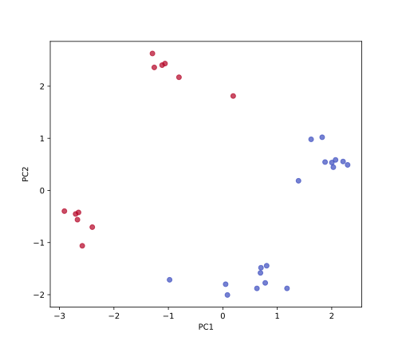
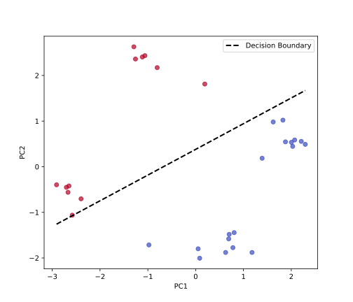
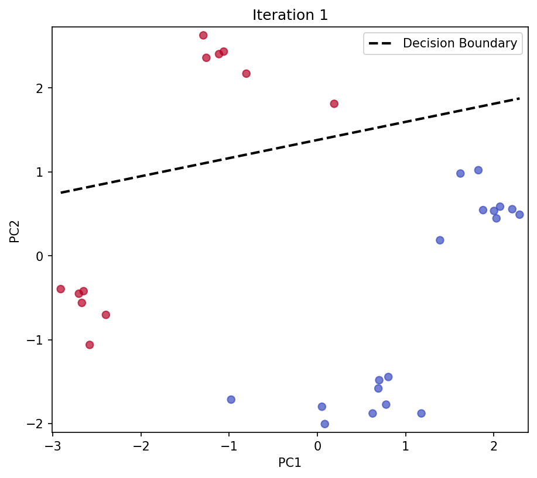

## Classification

From the previous section, we have seen that finding a line (or hyperplane) through your data, consisting of features and targets, already is the simplest form of supervised learning. However, regression should only be applied when the targets are continuous, such as the intensity of a fluorescence signal. For discrete targets that originate from a finite set of labels, we use *classification*, which we will discuss in this chapter.

Formally, the abstract goal of classification is to find a function $\hat{f}_{\vec{w}} : \mathbb{R}^d \to \{1,2,\dots,K\}$ that maps the input $\vec{x} \in \mathbb{R}^d$ to one of $K$ classes, such that most of the $N$ data points are assigned to the correct class $y_i \in \{1,2,\dots,K\}$. We will focus on the simplest case, binary classification, where the data can be assigned to two possible classes $y_i \in \{-1,+1\}$. Examples of such problems include predicting whether a given image contains a cat or a dog, or whether a given molecule is toxic or not.

### Rosenblatt's Perceptron

Let us tackle this problem using the same conceptual framework from the previous section: identifying a **model**, a **loss function**, and an **optimization algorithm**. 

We define the model as a linear function of the input features:

$$
\hat{f}_{\vec{w}}(\vec{x}) = \text{sign}(\left\langle \vec{w}, \vec{x} \right\rangle + b)\,,
$$

which we can simplify to 

$$
\hat{f}_{\vec{w}}(\vec{x}) = \text{sign}(\left\langle \vec{w}, \vec{x} \right\rangle)\,,
$$

by including the bias $b$ as the last element of the weight vector $\vec{w}$ and adding 1 to the feature vector $\vec{x}$. The $\text{sign}(z)$ function returns 1 if $z > 0$, and -1 otherwise. Therefore, the model assigns class 1 to all data points $\vec{x}$ for which $\left\langle \vec{w}, \vec{x} \right\rangle > 0$ and class -1 to all data points for which $\left\langle \vec{w}, \vec{x} \right\rangle \leq 0$.

Next, we need to define a loss function that quantifies how well the model performs. A natural choice is the *perceptron loss*:

$$
\mathcal{L} = \sum_{i=1}^N \max(0, - y_i \left\langle \vec{w}, \vec{x}_i \right\rangle)\,,
$$

where $\max(0,z)$ returns $0$ if $z \leq 0$ and $z$ otherwise. Let us understand why this loss function is effective. Consider the case where we have an input $\vec{x}_i$ that is misclassified. This can happen in two ways:

1. $\left\langle \vec{w}, \vec{x}_i \right\rangle > 0$ and $y_i = -1$ (we predict positive but the true label is negative).
2. $\left\langle \vec{w}, \vec{x}_i \right\rangle \leq 0$ and $y_i = 1$ (we predict negative but the true label is positive).

In both cases, the $i$-th term of the loss function is greater than 0. Conversely, if the data point is correctly classified, the loss function for this data point is 0, which is exactly what we want. 

```admonish note title="Note"
Consequently, we can only achieve a minimal loss of 0 if the data points are *linearly separable*, i.e., if there exists a hyperplane that completely separates the two classes.
```

Finally, we need to define an optimization algorithm that finds the weights $\vec{w}$ that minimize the loss function. The simplest algorithm is *gradient descent*, which we have already seen in the first section. However, we must be careful here, as the loss function is not differentiable when $\left\langle \vec{w}, \vec{x}_i \right\rangle = 0$. We can, however, compute *subgradients* of the non-zero parts of the loss function:

$$
\nabla_{\vec{w}} \left( -y_i \left\langle \vec{w}, \vec{x}_i \right\rangle \right) = -y_i \vec{x}_i\,,
$$

which gives rise to the following update rule:

$$
\vec{w} \leftarrow \vec{w} + \eta y_i \vec{x}_i\,,
$$

where $\eta$ is the learning rate. In practice, we iterate over all misclassified data points (where the loss is greater than 0) and update the weights according to the update rule. We can easily check if a data point $\vec{x}_i$ is misclassified by comparing the prediction $\hat{f}_{\vec{w}}(\vec{x}_i)$ with the true label $y_i$. 

### Inspecting the Data

Before we implement the algorithm, we need to load the data that we want to classify. We will use data from the same study as in the previous section, which you can <a href="../codes/05-machine_learning/aptamer_classification_data.csv" download>download here</a>. We use the [`pandas`](https://pandas.pydata.org/) library to import and inspect the data.

```python
{{#include ../codes/05-machine_learning/classification.py:load_data_from_csv}}
```

| Index | PC1 | PC2 | lambda_abs_continuous | lambda_abs_class |
|-------|-----|-----|----------------------|------------------|
| 0 | 0.0515 | -1.7994 | 400.0 | -1 |
| 1 | 0.7790 | -1.7741 | 400.0 | -1 |
| 2 | 0.7006 | -1.4832 | 400.0 | -1 |
| 3 | 0.8047 | -1.4448 | 400.0 | -1 |
| 4 | 0.6912 | -1.5818 | 400.0 | -1 |

You might be surprised to learn that this dataset represents the same set of molecules as in the previous section. However, now each molecule (row) is not characterized by a set of physical properties (columns), like molecular weight, number of rotatable bonds, and number of aromatic rings, but has been projected onto two abstract features, `PC1` and `PC2`. You have seen in the chapter on [Principal Component Analysis](../04-evd_and_svd/04-principal_component_analysis.md) what the background of this projection is, and we will revisit it in more detail in the next chapter. The last column, `lambda_abs_class`, is the binary label that denotes whether the molecule absorbs light in the visible spectrum ($\lambda_{\text{abs}} > 415$ nm), and is the target variable that we want to predict. 

To use the data from the dataframe for our machine learning model, we transform the features and labels into NumPy arrays:

```python
{{#include ../codes/05-machine_learning/classification.py:process_data}}
```

From visualizing the data in the two-dimensional feature space, and coloring the data points according to the class label (by setting the `c` parameter of the `scatter` function to the labels `y`), we can see that the data is indeed linearly separable. We can therefore expect to be able to train a Rosenblatt Perceptron that successfully separates molecules that absorb light in the visible spectrum from those that do not.

```python
{{#include ../codes/05-machine_learning/classification.py:plot_data}}
```



### Implementing Rosenblatt's Perceptron

Now we implement the Rosenblatt Perceptron algorithm. We start by defining the class and its constructor:

```python
{{#include ../codes/05-machine_learning/classification.py:classification_class_init}}
```

The `RosenblattPerceptron` class constructor includes three key class attributes. The learning rate controls how much we adjust the weights in each update step, where a smaller value leads to more gradual learning. The number of iterations determines how many times we cycle through the entire dataset during training. The weights are initially set to `None` and will store the learned parameters of our linear classifier.

Next, we implement the training method:

```python
{{#include ../codes/05-machine_learning/classification.py:classification_class_fit}}
```

The `fit` method implements the core perceptron learning algorithm. We begin by initializing the weights to zero for all features (including the bias term). The algorithm then uses an outer loop to iterate through the dataset multiple times (epochs) to allow convergence. Within each epoch, an inner loop examines each data point to check if it's misclassified. For each point, we compute the loss using the formula $-y_i \langle \vec{w}, \vec{x}_i \rangle$. If the loss is non-negative (indicating misclassification), we update the weights using the perceptron update rule: $\vec{w} \leftarrow \vec{w} + \eta y_i \vec{x}_i$.

The prediction method applies the learned model to make classifications:

```python
{{#include ../codes/05-machine_learning/classification.py:classification_class_predict}}
```

The `predict` method operates by first calculating the dot product between the input features and learned weights. The `np.sign()` function then converts positive values to +1 and negative values to -1, giving us our binary classification.

Now we can train our model and make predictions:

```python
{{#include ../codes/05-machine_learning/classification.py:fit_model}}
```

This code first instantiates the model by creating a new perceptron with default parameters. We then train the model by calling the `fit` method to learn the optimal weights from our training data. Finally, we use the trained model to predict classes for all data points.

To evaluate our model's performance, we calculate the accuracy:

```python
{{#include ../codes/05-machine_learning/classification.py:calculate_accuracy}}
```

The accuracy calculation uses element-wise comparison (`y_pred == y`) to create a boolean array, where `True` indicates correct predictions and `False` indicates incorrect ones. The mean of this boolean array gives us the fraction of correct predictions, which we print as the accuracy percentage of correctly classified examples.

Finally, we visualize the decision boundary learned by our perceptron:

```python
{{#include ../codes/05-machine_learning/classification.py:plot_decision_boundary}}
```

This visualization code creates the same scatter plot as before, colored by true class labels. The decision boundary is defined as the line where $\vec{w} \cdot \vec{x} = 0$, and we solve for the second coordinate using the equation $x_2 = -(w_0 x_1 + w_2) / w_1$. Remember that the first weight $w_0$ is the bias term, and the corresponding feature is always 1. We generate a range of `x1` values and compute the corresponding `x2` values on the decision boundary. The dashed line shows where our perceptron separates the two classes, and we include a legend to clearly identify the decision boundary.

<!-- 
 -->

<p>
  
</p>

The resulting plot shows how the perceptron has learned to separate the two classes with a linear decision boundary. 

---

**Self-Study Questions:**
1. What is the difference between regression and classification?
2. Sketch a 2D dataset that is not linearly separable. 
   Explain why the perceptron algorithm cannot achieve a loss of 0 
   on this dataset.
3. Why is it important to include a bias term in the perceptron model?
   Sketch a 2D dataset where a loss of 0 can be achieved with a bias term,
   but not without it.
4. The decision boundary in the figure above can be rotated
   counter-clockwise by a small angle without changing the accuracy of the model.
   How does the loss function change during this rotation?

**Challenge Questions:**
1. Suppose we now work in a one-dimensional features space.
   Why is it not practical to apply regression using the 
   Heaviside step function
   $$
     \Theta_{\theta}(x) = \begin{cases}
       1 & \text{if } x > \theta \\
       0 & \text{otherwise}
     \end{cases}
   $$
   in combination with gradient descent to solve 
   a binary classification problem?
   Inform yourself about the
   [logistic regression](https://en.wikipedia.org/wiki/Logistic_regression)
   and explain why it is a better choice than the Heaviside step function.
2. The decision boundary in the figure above does not seem very robust,
   since it is very close to one of the red data points.
   Sketch a more robust decision boundary and explain
   why Rosenblatt's Perceptron does not produce such a boundary.
3. Which measure could you add to the perceptron algorithm to
   achieve a more robust decision boundary?

