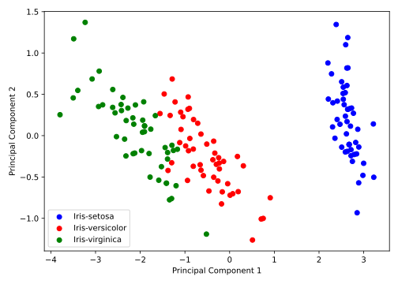

## Unüberwachtes Lernen

Bisher haben wir stets Daten betrachtet, die aus Datenpaaren $(\vec{x}_i, y_i)$ für 
$i = 1, \ldots, N$ bestanden, wobei $\vec{x}_i \in \mathbb{R}^n$ ein Featurevektor 
und $y_i \in \mathbb{R}$ ein quantitatives (Regression) oder qualitatives (Klassifikation)
Label oder Target war. Beim so genannten *unüberwachten Lernen* hingegen fehlt diese 
zweite Information und wir haben lediglich Datenpunkte $\{(\vec{x}_i)\}_{i=1, \dots, N}$
zur Verfügung. Dabei interessieren uns insbesondere die *Dimensionsreduktion* oder das 
*Clustering* der Datenpunkte.

### Dimensionsreduktion

Unter Dimensionsreduktion verstehen wir die Transformation der Daten in einen Raum
niedrigerer Dimension mit möglichst geringem Informationsverlust. Dazu könnten wir 
uns z.B. am Beispiel des Wine Quality Datensatzes fragen, ob wir zur Beschreibung der 
Daten anstatt allen 11 Features auch weniger verwenden können. Zudem sind 
manche der Features möglicherweise stark korreliert und somit überflüssig. Mit der 
Hauptkomponentenanalyse (PCA) haben Sie in Kapitel 
[(4.3)](../04-evd_and_svd/03-principal_component_analysis.md) bereits die 
wichtigste Methode zur Dimensionsreduktion kennengelernt, welche die Daten 
durch die Hauptkomponenten der größten Varianz beschreibt. Mit der 
Hauptkoordinatenanalyse (PCoA) aus Kapitel 
[(4.4)](../04-evd_and_svd/04-principal_coordinate_analysis.md) kennen Sie zudem 
eine Methode zur Dimensionsreduktion, die auf Ähnlichkeiten zwischen den Datenpunkten
basiert. Wir werden daher nur kurz auf die Implementierung der PCA eingehen, die 
wir hier als Klasse definieren wollen.

```admonish note title="Hinweis"
Häufig werden Methoden des überwachten und unüberwachten Lernens kombiniert oder 
nacheinander angewendet. So kann z.B. ein hochdimensionaler Datensatz zunächst
mit PCA auf wenige Dimensionen reduziert werden, bevor ein Klassifikator darauf
trainiert wird oder Clustering durchgeführt wird.
```

#### PCA Imlementierung

Wir haben bereits diskutiert, dass die Hauptkomponenten der Datenmatrix $\bm{X}$ durch 
die rechtsseitigen Singulärvektoren $\bm{V}$ der Singulärwertzerlegung 

$$
\bm{X} = \bm{U} \bm{\Sigma} \bm{V}^T
$$

gegeben sind. Unter der Annahme, dass unsere Features linear unabhängig sind, können wir 
ausnutzen, dass $\bm{V}$ den Eigenvektoren der so genannten (empirischen) Kovarianzmatrix 
$\bm{C} = \bm{X}^T \bm{X}$ der (zentrierten) Datenmatrix $\bm{X}$ entsprechen:

$$
\bm{C} = \bm{X}^T \bm{X} = (\bm{U} \bm{\Sigma} \bm{V})^T \bm{U} \bm{\Sigma} \bm{V}^T = \bm{V} \bm{\Sigma} \bm{U}^T \bm{U} \bm{\Sigma} \bm{V}^T = \bm{V} \bm{\Sigma}^2 \bm{V}^T\,,
$$

wobei Sie die letze Gleichung an die Eigenwertzerlegung $\bm{C} = \bm{Q} \bm{\Lambda} \bm{Q}^T$ 
erinnern sollte. Die PCA wird also durch die folgenden Schritte beschrieben:

1. Normalisieren (bzw. Standardisieren) der Datenmatrix $\bm{X}$.
2. Berechnen der Eigenvektoren und Eigenwerte von $\bm{X}^T \bm{X}$.
3. Behalten der $d$ Eigenvektoren mit den größten Eigenwerten, gegeben als $\bm{P}_d$.
4. Transformieren der Datenmatrix $\bm{X}$ in den Raum der Hauptkomponenten durch $\bm{Z}_d = \bm{X} \bm{P}_d$.

Wir werden die PCA nun als Klasse implementieren, wobei wir die Berechnung der Hauptkomponenten
als Methode `fit` und die Transformation der Daten als Methode `transform` bzw. `fit_transform`
implementieren wollen. In der `__init__` Methode initialisieren wir zunächst die Dimension
der Projektion:

```python
{{#include ../codes/05-machine_learning/pca.py:pca_init}}
```

Dann bestimmen wir die Hauptkomponenten durch Eigenwertzerlegung der Kovarianzmatrix:

```python
{{#include ../codes/05-machine_learning/pca.py:pca_fit}}
```

Anschließend können wir die Daten transformieren. Da wir die Berechnung der Hauptkomponenten
und die Transformation der Daten voneinander unabängig halten wollen, implementieren wir
diese als separate Methoden. In `fit_transform` werden dann beide Methoden aufgerufen:

```python
{{#include ../codes/05-machine_learning/pca.py:pca_transform}}
```

Wir wenden die PCA auf den Iris Datensatz an, der Informationen über die Länge und Breite
von Kelch- und Blütenblättern von drei verschiedenen Schwertlilien-Arten (also Blumen) enthält:

```python
{{#include ../codes/05-machine_learning/pca.py:pca_example}}
```

Dabei erhalten wir die folgende Abbildung:



### Clustering

Unter Clustering verstehen wir die Gruppierung von Datenpunkten in Cluster, wobei
die Datenpunkte innerhalb eines Clusters möglichst ähnlich und zwischen den Clustern
möglichst verschieden sein sollen. Dazu betrachten wir im Folgenden den so genannten
*k*-Means Algorithmus, der auch als *Lloyd's Algorithmus* bekannt ist.

#### $k$-Means Clustering

Gegeben seien wie zuvor $N$ Datenpunkte $\mathcal{D} := \{\vec{x}_i\}_{i=1, \dots, N}$, 
welche wir in eine vorgegebene Anzahl $K$ von Clustern 
gruppieren möchten. Wir beginnen zunächst mit einer Wunschliste der Eigenschaften, die 
wir von einem Clustering-Algorithmus erwarten:

1. Eine allgemeine **Zuweisungsregel**, die jedem Datenpunkt einen Cluster zuordnet, d.h.
   $\vec{x}_i \mapsto k \in \{1, \ldots, K\}$ für $i = 1, \ldots, N$.
2. Eine **Rekonstruktionsregel**, die für jedes Cluster $k \in \{1, \ldots, K\}$ ein 
   repräsentatives Element $\vec{m}_k$ bestimmt, d.h. $k \mapsto \vec{m}_k \in \mathbb{R}^n$
   für $k \in \{1, \ldots, K\}$.

Dabei bezeichnen wir $\vec{m}_k$ auch als Mittelwert des Clusters $k$. Um den $k$-Means
Algorithmus zu formulieren, fixieren wir zunächst die Anzahl der Cluster $K$ und definieren 
zwei Größen, $\mathbf{C} := (C_1, \ldots, C_K)$ und 
$\mathbf{M} := (\vec{m}_1, \ldots, \vec{m}_K)$. Die Cluster-variable $\mathbf{C}$ enthält 
die Teilmengen $C_k \subseteq \mathcal{D}$ der Datenpunkte, die dem Cluster $k$ zugeordnet
sind, während $\mathbf{M}$ die Mittelwerte der Cluster enthält. Die Vereinigung der Cluster
muss dabei die gesamte Datenmenge $\mathcal{D}$ ergeben, d.h. $\bigcup_{k=1}^K C_k = \mathcal{D}$
und $C_i \cap C_j = \emptyset$ für $i \neq j$, d.h. ein Datenpunkt kann nicht gleichzeitig
mehreren Clustern zugeordnet sein. Der $k$-Means Algorithmus ist ein iteratives Verfahren,
welches die Cluster-Variable $\mathbf{C}$ und die Mittelwerte $\mathbf{M}$ abwechselnd 
akualisiert. Für ein initiales Clustering $\mathbf{C}$ wird dabei zunächst der Mittelwert jedes
Clusters als der Mittelwert der Datenpunkte in diesem Cluster berechnet:

$$
\vec{m}_k \leftarrow \frac{1}{|C_k|} \sum_{\vec{x}_i \in C_k} \vec{x}_i\,,
$$

wobei $|C_k|$ die Anzahl der Datenpunkte im Cluster $k$ bezeichnet. Dies entspricht der 
Rekonstruktionsregel. Anschließend werden 
die berechneten Mittelwerte $\mathbf{m}$ festgehalten und die $k$-te Gruppe als diejenige
Menge von Datenpunkten definiert, die dem Mittelwert $\vec{m}_k$ näher ist als jedem anderen
Mittelwert $\vec{m}_j$ für $j \neq k$. Formal ausgedrückt bedeutet das:

$$
C_k \leftarrow \{\vec{x}_i \in \mathcal{D} \mid \|\vec{x}_i - \vec{m}_k\| \leq \|\vec{x}_i - \vec{m}_j\| \text{ für alle } j \neq k\}\,,
$$

was der Zuweisungsregel entspricht. Diese beiden
Schritte werden dann iterativ für eine vorgegebene Anzahl von Iterationen wiederholt, 
oder bis sich die Cluster nicht mehr ändern. Für Daten in $\mathbb{R}^2$ ist in der 
folgenden Abbildung ein Beispiel für den $k$-Means Algorithmus dargestellt:

<figure>
    <center>
    
    <figcaption>Illustration des $k$-Means Algorithmus für $K = 2$ Cluster. Quelle: Christopher M. Bishop, Pattern Recognition and Machine Learning.</figcaption>
    </center>
</figure>

Eine andere Blickweise auf die durch den $k$-Means Algorithmus zugeteilten Cluster
stellen übrigens die so genannten *Voronoi-Zellen* dar, die als 

$$
V_k := \{\vec{x} \in \mathbb{R}^n \mid \|\vec{x} - \vec{m}_k\| \leq \|\vec{x} - \vec{m}_j\| \text{ für alle } j \neq k\}
$$

definiert sind und in Voronoi-Diagrammen dargestellt werden können:

<figure>
    <center>
    
    <figcaption>Voronoi-Zellen, wobei die Punkte die Mittelwerte der Cluster darstellen und die Linien die Grenzen der Zellen. Quelle: Kevin P. Murphy, Machine Learning - A Probabilistic Perspective.</figcaption>
    </center>
</figure>

Wir implementieren auch den $k$-Means Algorithmus als Klasse. In der `__init__` Methode
initialisieren wir die Anzahl der Cluster und die maximale Anzahl an Iterationen. Zudem 
setzen wir die Variablen `self.centroids` und `self.labels`, die im Laufe des Algorithmus
abwechselnd aktualisiert werden:

```python
{{#include ../codes/05-machine_learning/k_means.py:kmeans_init}}
```

Dann implementieren wir die Methode `fit`, die den Algorithmus wie oben beschrieben
ausführt. Nachdem wir zufällig ausgewählte Datenpunkte als Mittelwerte `self.centroids` 
der $K$ Cluster initialisiert haben, berechnen wir in einer Schleife die Zuweisungen und Mittelwerte
der Cluster:

```python
{{#include ../codes/05-machine_learning/k_means.py:kmeans_fit}}
```

Hier haben wir angenommen, dass wir die Methoden `assign_labels` und `compute_centroids`
noch implementieren werden. Dabei sei noch einmal darauf hingewiesen, dass wir auf 
die Variablen `self.centroids` und `self.labels` innerhalb der Methoden der Klasse zugreifen können,
da diese als Klassenattribute definiert sind. Die Methode `assign_labels` berechnet zunächst die 
Distanzen aller Datenpunkte zu allen Mittelwerten. Dazu erweitern wir die Datenmatrix `X` um eine
zusätzliche Dimension, also `X.shape = (n_points, 1, n_features)`, um die Abstandsvektoren zu den
Mittelwerten `self.centroids`, die die Form `(n_clusters, n_features)` haben, zu berechnen. Die 
Subtraktion der beiden Arrays führt also zu einem Array der Form `(n_points, n_clusters, n_features)`.
Die Distanz erhalten wir dann durch die Berechnung der euklidischen Norm entlang der letzten Achse
(`axis=2`). Der Array `distances` speichert also für alle Datenpunkte die Distanzen zu den $K$
Mittelwerten. Die Zuweisung erfolgt demnach durch die Auswahl des Clusters mit dem kleinsten Abstand
für jeden Datenpunkt, was mit der `numpy` Funktion `argmin` realisiert werden kann:

```python
{{#include ../codes/05-machine_learning/k_means.py:kmeans_assign_labels}}
```

Die Berechnung der Mittelwerte ist vergleichsweise einfach, da wir ledigleich für jedes Cluster 
$i = 1, \ldots, K$ die Mittelwerte der Datenpunkte des $i$-ten Clusters berechnen müssen und in 
einem Array speichern müssen. Dazu nutzen wir List-Comprehension:

```python
{{#include ../codes/05-machine_learning/k_means.py:kmeans_compute_centroids}}
```

Um dem Konzept der allgemeinen ML-Klasse treu zu bleiben, implementieren wir auch die Methode
`predict`, die die Zuweisungen für ggf. neue Datenpunkte berechnet. 

Wir testen unsere Implementierung des $k$-Means Algorithmus anhand der Projektion des Iris Datensatzes
auf die zwei Hauptkomponenten, die wir zuvor mit der PCA berechnet haben:

```python
{{#include ../codes/05-machine_learning/k_means.py:kmeans_example}}
```

Dabei erhalten wir die folgende Abbildung, wobei wir die vorhergesagten Cluster durch die Farben
der Punkte darstellen:


Ohne Beachtung der korrekten Farben erkennen wir durch Vergleich der tatsächlichen Labels von oben,
dass die drei Cluster mit hinreichender Genauigkeit den korrekten Schwertlilien-Arten zugeordnet
werden konnten. Dabei sei nochmal angemerkt, dass es sich bei Clustering um eine Methode des 
unüberwachten Lernens handelt, d.h. wir haben keine Information über die tatsächlichen Labels
der Datenpunkte verwendet.