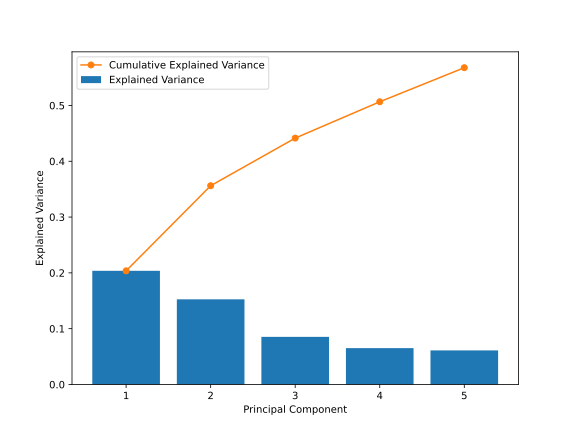
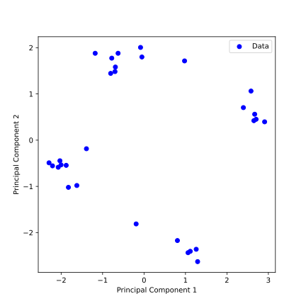

## Dimensionality Reduction

So far, we have always considered data points as pairs $(\vec{x}_i, y_i)$ for $i = 1, \ldots, N$, where $\vec{x}_i \in \mathbb{R}^d$ is a feature vector and $y_i$ is a quantitative (regression) or qualitative (classification) label or target. In **unsupervised learning**, this second piece of information is missing and we only have data points $\{(\vec{x}_i)\}_{i=1, \dots, N}$ at our disposal. Here, we are particularly interested in *dimensionality reduction* and *clustering* of the data points.

Dimensionality reduction is the process of transforming high-dimensional data into a lower-dimensional space while preserving as much of the original information as possible. Recall that we use the term *dimensionality* to refer to the number of features in the data. Therefore, our goal is to find a new set of fewer features that capture as much of the original information as possible. This is particularly useful when dealing with high-dimensional data, such as images or text, where the number of features can be very large.

### Principal Component Analysis (PCA)

In one of the previous chapters, you learned that by performing a singular value decomposition (SVD) of the data matrix $\bm{X} \in \mathbb{R}^{N \times d}$, we find the set of rank-1 matrices that best approximate the data matrix. In this context, you also learned that the right singular vectors of the SVD are the so-called *principal components* of the data, and the corresponding singular values denote the contribution of the corresponding principal component to the data, also called *explained variance*. By projecting the data onto the first $k$ principal components, we can therefore reduce the dimensionality of the data from $d$ to $k$ while preserving as much of the original information as possible. This is the idea of *principal component analysis* (PCA).

Before implementing PCA as a ML model, we summarize the main steps of the algorithm:

1. **Center the data matrix** $\bm{X}$ by subtracting the mean of each feature. If the features are not on the same scale, you might want to standardize the data by dividing by the standard deviation.
2. **Compute the right singular vectors** $\bm{V}$ of the SVD of the standardized data matrix $\bm{X}$. We can use the fact that the right singular vectors of the SVD are the eigenvectors of the *covariance matrix* $\bm{C} = \bm{X}^T \bm{X}$:
$$
\bm{C} = \bm{X}^T \bm{X} = (\bm{U} \bm{\Sigma} \bm{V}^T)^T \bm{U} \bm{\Sigma} \bm{V}^T = \bm{V} \bm{\Sigma}^T \bm{U}^T \bm{U} \bm{\Sigma} \bm{V}^T = \bm{V} \bm{\Sigma}^2 \bm{V}^T\,,
$$
where you should recognize the last equation from the eigenvalue decomposition.
3. **Sort the eigenvectors** by the corresponding eigenvalues in descending order and keep the first $k$ eigenvectors with the largest eigenvalues, given as matrix $\bm{V}_k$.
4. **Transform the data matrix** $\bm{X}$ into the space of the principal components by $\bm{Z}_k = \bm{X} \bm{V}_k$.

### Implementation of PCA

We will now implement PCA using object-oriented programming. First, we define the `__init__` method to set the class attributes: the number of principal components to keep, the components themselves, and the explained variance (squared singular values). These attributes will be useful for further analysis.

```python
{{#include ../codes/05-machine_learning/pca.py:pca_init}}
```

As with the previous ML models, we implement a `fit` method to compute the low-dimensional representation of the data according to the steps above. To compute the covariance matrix, we use the numpy function `np.cov`, but we could also write `X.T @ X` instead. After computing the eigenvectors and eigenvalues, we sort them by the corresponding eigenvalues in descending order using the [`np.argsort`](https://numpy.org/doc/stable/reference/generated/numpy.argsort.html) function. This function returns the indices of the sorted eigenvalues, which we can then use to sort the eigenvectors (columns of the eigenvector matrix) and corresponding eigenvalues. In the final step, we store the first $k$ eigenvectors as the principal components and compute the explained variance.

```python
{{#include ../codes/05-machine_learning/pca.py:pca_fit}}
```

Because we are doing unsupervised learning, we do not need a `predict` method. However, we implement a `transform` method to project the data onto the principal components computed in the `fit` method. We again center the data and then use the `np.dot` function to compute the projection. Since we typically want to perform the projection in the same step as the fitting, we also implement a `fit_transform` method that calls both `fit` and `transform`. Separating the fitting and projection is useful when we want to apply the transformation to new, unseen data.

```python
{{#include ../codes/05-machine_learning/pca.py:pca_transform}}
```

### PCA on the Aptamer Dataset

We want to apply PCA to the aptamer dataset to find a low-dimensional representation of the molecules. Instead of the hand-crafted features used in the regression chapter, we will introduce a widely used vector representation of molecules.

```admonish info title="Morgan fingerprints and cheminformatics"
A Morgan fingerprint is a vector representation of a molecule that encodes the molecular structure—the connectivity of the atoms—into a data-friendly format, typically a binary vector of fixed length. It is widely used in drug discovery to screen large libraries of molecules, compare molecules, find similar molecules, and train machine learning models. The interdisciplinary field of computer science and chemistry that deals with molecular representation and the application of machine learning to these representations is called **cheminformatics**.

How do Morgan fingerprints work? 

1. **Central Atom**: The idea is to consider each atom in the molecule as a potential central atom, or seed atom. 

2. **Radius**: For each central atom, we define a *radius* $r$, which is the number of bonds from this atom that are considered to capture the surrounding neighborhood. A larger radius captures more information about the molecule, but also leads to more complex fingerprints.

3. **Substructures**: For each radius, we define a set of substructures that are part of the fingerprint. These substructures could be, for example, specific functional groups, rings, or fragments within the radius of the central atom.

4. **Bit Vector**: The presence of each substructure is encoded in a binary vector where each bit corresponds to a possible substructure. Each position in the bit vector is set to 1 if the substructure is present in the molecule, and to 0 otherwise.

**How to compute the Morgan fingerprint?**

In cheminformatics, the Morgan fingerprint is typically computed using the [RDKit](https://www.rdkit.org/) library, one of the most powerful and widely used libraries in Python for handling large numbers of molecules. It is object-oriented, meaning each molecule is represented as an object, and can be generated from a [SMILES string](https://en.wikipedia.org/wiki/Simplified_molecular-input_line-entry_system). The following code shows how to compute the Morgan fingerprint for a molecule using RDKit:

~~~python
{{#include ../codes/05-machine_learning/pca.py:rdkit_fingerprints}}
~~~
```

You can download the aptamer dataset from <a href="../codes/05-machine_learning/aptamer_fingerprints_data.csv" download>here</a>, and import the data using the `pandas` library:

```python
{{#include ../codes/05-machine_learning/pca.py:load_data_from_csv}}
```

| Index | fp_0 | fp_1 | fp_2 | fp_3 | fp_4 | fp_5 | ... | fp_2043 | fp_2044 | fp_2045 | fp_2046 | fp_2047 | lambda_abs_class |
|-------|------|------|------|------|------|------|-----|----------|----------|----------|----------|----------|-----------------|
| 0 | 0 | 0 | 0 | 0 | 0 | 0 | ... | 0 | 1 | 0 | 0 | 0 | -1 |
| 1 | 0 | 0 | 0 | 0 | 0 | 0 | ... | 0 | 0 | 0 | 0 | 0 | -1 |
| 2 | 0 | 1 | 0 | 0 | 0 | 0 | ... | 0 | 0 | 0 | 0 | 0 | -1 |
| 3 | 0 | 0 | 0 | 0 | 0 | 0 | ... | 0 | 0 | 0 | 0 | 0 | -1 |
| 4 | 0 | 0 | 0 | 0 | 0 | 0 | ... | 0 | 0 | 0 | 0 | 0 | -1 |

As you can see, the data is represented as a binary vector of length 2048, where each bit corresponds to the presence of a substructure in the molecule. Most of the bits are 0, indicating that the molecule does not contain the corresponding substructure. This is not surprising, as the molecules under consideration are all relatively small and simple.

We do not need the last column, `lambda_abs_class`, for now as we are doing unsupervised learning, so we drop it from the data. Note that we also do not need to add a column of ones to the data, as we are not using weights or biases in the traditional sense:

```python
{{#include ../codes/05-machine_learning/pca.py:process_data}}
```

We can now apply PCA to the data using the `fit_transform` method:

```python
{{#include ../codes/05-machine_learning/pca.py:pca_fit_transform}}
```

We can see that the data is reduced to two dimensions, as we have set the number of principal components to 2. Before plotting the data, let us examine the explained variance of the principal components. Note that from 2048 features, we theoretically have 2048 principal components, but since we used only 2, let us plot the explained variance for the first 5 principal components:

```python
{{#include ../codes/05-machine_learning/pca.py:pca_explained_variance}}
```



We see that with two principal components, we can explain approximately 35% of the variance in the data. With four principal components, we could already explain more than 50% of the variance. This means that by projecting the data onto the first two principal components, we lose a significant amount of information. However, this allows us to visualize the data in two dimensions, which is much easier to interpret. Let us plot the data in this two-dimensional space:

```python
{{#include ../codes/05-machine_learning/pca.py:plot_pca}}
```



```admonish note title="Combining unsupervised and supervised learning"
As you can see, this projection of the data onto the first two principal components is exactly the representation of the data that we used when training a classifier. This is a classic example of how unsupervised learning can be combined with supervised learning, for example, to find a low-dimensional representation of the data that is useful for classification or regression.
```