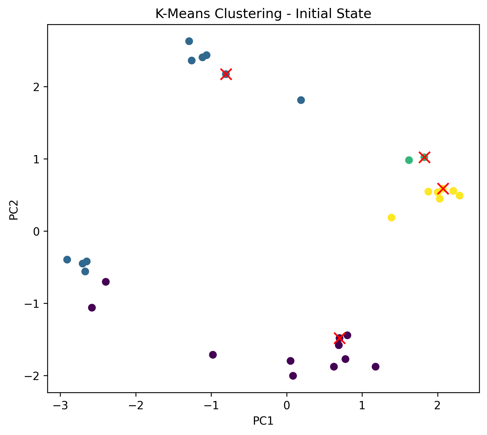

## Clustering

Clustering is another widely used method of unsupervised learning. This means that our datapoints $\mathcal{D} := \{\vec{x}_i\}_{i=1, \dots, N}$ have no labels. Our goal is to group them into $K$ clusters, where data points within a cluster are *as similar as possible* and data points between clusters are *as different as possible*. 

Before we start, let's list some properties we expect from a clustering algorithm:

1. A general **assignment rule**, which assigns each data point to a cluster, i.e., $\vec{x}_i \mapsto k \in \{1, \ldots, K\}$ for $i = 1, \ldots, N$.
2. A **reconstruction rule**, which for each cluster $k \in \{1, \ldots, K\}$ determines a representative element $\vec{m}_k$, i.e., $k \mapsto \vec{m}_k \in \mathbb{R}^n$ for $k \in \{1, \ldots, K\}$.

### $k$-Means Clustering

As the name suggests, the $k$-means algorithm defines the representative element as the geometric mean of the data points in the cluster. To formulate the $k$-means algorithm, we first fix the number of clusters $K$ and define two quantities: $\mathbf{C} := (C_1, \ldots, C_K)$, which contains the subsets $C_k \subseteq \mathcal{D}$ of the data points assigned to cluster $k$, and $\mathbf{M} := (\vec{m}_1, \ldots, \vec{m}_K)$, which contains the mean values of the clusters.

```admonish note title="Note"
The union of the clusters must cover the entire dataset $\mathcal{D}$, i.e., $\bigcup_{k=1}^K C_k = \mathcal{D}$ and $C_i \cap C_j = \emptyset$ for $i \neq j$, meaning a data point cannot be assigned to multiple clusters simultaneously.
```

The $k$-means algorithm iteratively alternates between updating the cluster variable $\mathbf{C}$ and the mean values $\mathbf{M}$. For an initial clustering $\mathbf{C}$, we first **compute the mean value of each cluster as the average of the data points in that cluster**:

$$
\vec{m}_k \leftarrow \frac{1}{|C_k|} \sum_{\vec{x}_i \in C_k} \vec{x}_i\,,
$$

where $|C_k|$ denotes the number of data points in cluster $k$. This corresponds to the reconstruction rule. Next, we **assign each data point to the cluster whose mean value is closest to the data point**. Formally, this is expressed as:

$$
C_k \leftarrow \{\vec{x}_i \in \mathcal{D} \mid \|\vec{x}_i - \vec{m}_k\| \leq \|\vec{x}_i - \vec{m}_j\| \text{ for all } j \neq k\}\,.
$$

This corresponds to the assignment rule. These two steps are repeated iteratively for a given number of iterations, or until the clusters no longer change. 

```admonish info title="Voronoi cells"

An alternative view of the clusters assigned by the $k$-means algorithm are the so-called *Voronoi cells*, which are defined as:

$$
V_k := \{\vec{x} \in \mathbb{R}^n \mid \|\vec{x} - \vec{m}_k\| \leq \|\vec{x} - \vec{m}_j\| \text{ for all } j \neq k\}
$$

and can be visualized in [Voronoi diagrams](https://en.wikipedia.org/wiki/Voronoi_diagram).
```

### Implementation

We implement the $k$-means algorithm as a class. In the `__init__` method, we set the number of clusters and the maximum number of iterations. Additionally, we initialize the class attributes `self.centroids` and `self.labels`, which will be updated alternately during the algorithm. `self.centroids` will be a 2D array holding the centroid of each cluster in each row. `self.labels` will be a 1D array holding the cluster label ($0, \ldots, K-1$) for each data point.

```python
{{#include ../codes/05-machine_learning/k_means.py:kmeans_init}}
```

Next, we implement the `fit` method, which executes the algorithm as described above. Here, we use [`np.random.choice`](https://numpy.org/doc/stable/reference/random/generated/numpy.random.choice.html) to randomly select indices of data points to serve as the initial centroids. The function `np.random.choice` selects `self.n_clusters` unique indices from the range of available data points, given by `X.shape[0]`. The parameter `replace=False` ensures that the same data point is not selected more than once. By indexing the data matrix `X` with these indices, we obtain the initial centroids. After that, we update the centroids and labels in a loop as described above for `self.num_iter` iterations.

```python
{{#include ../codes/05-machine_learning/k_means.py:kmeans_fit}}
```

Here, we assume that we will implement the methods `assign_labels` and `compute_centroids` separately.

Within the `assign_labels` method, we first compute the distances between all data points and all centroids. This is done by subtracting the centroids from the data points and then computing the Euclidean norm of the resulting vectors. However, because the shape of the data matrix `X` is `(n_points, n_features)`, while the shape of the centroids is `(n_clusters, n_features)`, we need to expand the data matrix to match the shape of the centroids. This is done by adding an additional dimension to the data matrix, representing the different clusters. The new shape of the data matrix is then `(n_points, 1, n_features)`. The subtraction of the centroids from the data points then results in an array of shape `(n_points, n_clusters, n_features)`. The Euclidean norm of the resulting vectors is computed across all features, i.e., `axis=2`. The resulting array `distances` holds the distances between all data points and all centroids. The assignment of data points to clusters is then done by selecting the cluster with the smallest distance for each data point, which can be achieved using the `np.argmin` function along the second axis, i.e., `axis=1`.
 

```python
{{#include ../codes/05-machine_learning/k_means.py:kmeans_assign_labels}}
```

The calculation of the centroids is relatively straightforward, since we only need to compute the mean values of the data points for each cluster $i = 1, \ldots, K$ and store them in an array. Remember that we can get the data points assigned to a cluster by indexing the data matrix `X` with the cluster labels, i.e., `X[labels == i]`. We use list comprehension for this:

```python
{{#include ../codes/05-machine_learning/k_means.py:kmeans_compute_centroids}}
```

To stay true to the concept of the general ML class, we also implement the `predict` method, which computes the assignments for new data points.

### Clustering of Aptamers

We can now test our implementation of the $k$-means algorithm on the aptamer dataset. We will use the representation of the aptamers in the principal component space, which we computed earlier with PCA. With some imagination, we can see that the aptamers are clustered into four groups, which we want to identify using the $k$-means algorithm.

Loading the data from the CSV file and converting it to a numpy array is straightforward:

```python
{{#include ../codes/05-machine_learning/k_means.py:load_data_from_csv}}
```

We can now create an instance of the `KMeans` class and fit it to the data:

```python
{{#include ../codes/05-machine_learning/k_means.py:kmeans_fit_and_predict}}
```

Plotting the result is also straightforward. We simply color the data points according to their cluster labels. Additionally, we access the class attribute `centroids` to plot the centroids as red crosses:

```python
{{#include ../codes/05-machine_learning/k_means.py:plot_kmeans_result}}
```

By inspecting the plot, we can see that the $k$-means algorithm correctly identifies the four clusters of aptamers in most cases. Because centroids are initialized randomly, the result may vary slightly between runs. In the animation below, we can see the evolution of the clusters over the iterations of the $k$-means algorithm.

<figure>
  <center>
  
  </center>
</figure>

---

**Self-Study Questions:**

1. Decrease and increase the number of clusters $K$ 
   and observe how the clustering changes.

2. What is the difference between classification and clustering?

The cluster energy $E$ is defined by
$$
  E(\mathbf{C}, \mathbf{M}) = \sum_{k=1}^K \sum_{\vec{x}_i \in C_k} \|\vec{x}_i - \vec{m}_k\|^2\,.

3. For which $K$ does the cluster energy $E$ reach a minimum?
   Is this the optimal number of clusters?

**Challenge Questions:**
Suppose we start with a small number of clusters. After every iteration, we merge two clusters
or split one cluster into two at random. Come up with a scheme that you think could
help us find the "optimal" number of clusters $K$.

