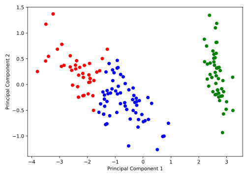

## Clustering

Clustering is another widely used method of unsupervised learning. This means that our datapoints $\mathcal{D} := \{\vec{x}_i\}_{i=1, \dots, N}$ are without any labels. Our goal is to group them into $K$ clusters, where data points within a cluster are *as similar as possible* and data points between clusters are *as different as possible*. 

Before we start, let's list some properties we expect from a clustering algorithm:

1. A general **assignment rule**, which assigns each data point to a cluster, i.e. $\vec{x}_i \mapsto k \in \{1, \ldots, K\}$ for $i = 1, \ldots, N$.
2. A **reconstruction rule**, which for each cluster $k \in \{1, \ldots, K\}$ determines a representative element $\vec{m}_k$, i.e. $k \mapsto \vec{m}_k \in \mathbb{R}^n$ for $k \in \{1, \ldots, K\}$.

### $k$-Means Clustering

As the name suggests, the $k$-means algorithm is based on the idea of defining this representative element as the geometrical mean of the data points in the cluster. To formulate the $k$-means algorithm, we first fix the number of clusters $K$ and define two quantities, $\mathbf{C} := (C_1, \ldots, C_K)$, which contains the subsets $C_k \subseteq \mathcal{D}$ of the data points that are assigned to cluster $k$, and $\mathbf{M} := (\vec{m}_1, \ldots, \vec{m}_K)$, which contains the mean values of the clusters.

```admonish note title="Note"
The union of the clusters must cover the entire data set $\mathcal{D}$, i.e. $\bigcup_{k=1}^K C_k = \mathcal{D}$ and $C_i \cap C_j = \emptyset$ for $i \neq j$, i.e. a data point cannot be assigned to multiple clusters at the same time.
```

The $k$-means algorithm then iteratively alternates between updating the cluster variable $\mathbf{C}$ and the mean values $\mathbf{M}$. For an initial clustering $\mathbf{C}$, we first **compute the mean value of each cluster as the mean value of the data points in that cluster**:

$$
\vec{m}_k \leftarrow \frac{1}{|C_k|} \sum_{\vec{x}_i \in C_k} \vec{x}_i\,,
$$

where $|C_k|$ denotes the number of data points in cluster $k$. This corresponds to the reconstruction rule. Next, we **assign each data point to the cluster whose mean value is closest to the data point**. Formally, this is expressed as:

$$
C_k \leftarrow \{\vec{x}_i \in \mathcal{D} \mid \|\vec{x}_i - \vec{m}_k\| \leq \|\vec{x}_i - \vec{m}_j\| \text{ for all } j \neq k\}\,.
$$

This corresponds to the assignment rule. These two steps are then repeated iteratively for a given number of iterations, or until the clusters no longer change. 

```admonish info title="Voronoi cells"

An alternative view on the clusters assigned by the $k$-means algorithm are the so-called *Voronoi cells*, which are defined as:

$$
V_k := \{\vec{x} \in \mathbb{R}^n \mid \|\vec{x} - \vec{m}_k\| \leq \|\vec{x} - \vec{m}_j\| \text{ for all } j \neq k\}
$$

and can be visualized in [Voronoi diagrams](https://en.wikipedia.org/wiki/Voronoi_diagram).
```

<!-- ### Implementation

Wir implementieren auch den $k$-Means Algorithmus als Klasse. In der `__init__` Methode
initialisieren wir die Anzahl der Cluster und die maximale Anzahl an Iterationen. Zudem 
setzen wir die Variablen `self.centroids` und `self.labels`, die im Laufe des Algorithmus
abwechselnd aktualisiert werden:

```python
{{#include ../codes/05-machine_learning/k_means.py:kmeans_init}}
```

Dann implementieren wir die Methode `fit`, die den Algorithmus wie oben beschrieben
ausführt. Nachdem wir zufällig ausgewählte Datenpunkte als Mittelwerte `self.centroids` 
der $K$ Cluster initialisiert haben, berechnen wir in einer Schleife die Zuweisungen und Mittelwerte
der Cluster:

```python
{{#include ../codes/05-machine_learning/k_means.py:kmeans_fit}}
```

Hier haben wir angenommen, dass wir die Methoden `assign_labels` und `compute_centroids`
noch implementieren werden. Dabei sei noch einmal darauf hingewiesen, dass wir auf 
die Variablen `self.centroids` und `self.labels` innerhalb der Methoden der Klasse zugreifen können,
da diese als Klassenattribute definiert sind. Die Methode `assign_labels` berechnet zunächst die 
Distanzen aller Datenpunkte zu allen Mittelwerten. Dazu erweitern wir die Datenmatrix `X` um eine
zusätzliche Dimension, also `X.shape = (n_points, 1, n_features)`, um die Abstandsvektoren zu den
Mittelwerten `self.centroids`, die die Form `(n_clusters, n_features)` haben, zu berechnen. Die 
Subtraktion der beiden Arrays führt also zu einem Array der Form `(n_points, n_clusters, n_features)`.
Die Distanz erhalten wir dann durch die Berechnung der euklidischen Norm entlang der letzten Achse
(`axis=2`). Der Array `distances` speichert also für alle Datenpunkte die Distanzen zu den $K$
Mittelwerten. Die Zuweisung erfolgt demnach durch die Auswahl des Clusters mit dem kleinsten Abstand
für jeden Datenpunkt, was mit der `numpy` Funktion `argmin` realisiert werden kann:

```python
{{#include ../codes/05-machine_learning/k_means.py:kmeans_assign_labels}}
```

Die Berechnung der Mittelwerte ist vergleichsweise einfach, da wir ledigleich für jedes Cluster 
$i = 1, \ldots, K$ die Mittelwerte der Datenpunkte des $i$-ten Clusters berechnen müssen und in 
einem Array speichern müssen. Dazu nutzen wir List-Comprehension:

```python
{{#include ../codes/05-machine_learning/k_means.py:kmeans_compute_centroids}}
```

Um dem Konzept der allgemeinen ML-Klasse treu zu bleiben, implementieren wir auch die Methode
`predict`, die die Zuweisungen für ggf. neue Datenpunkte berechnet. 

Wir testen unsere Implementierung des $k$-Means Algorithmus anhand der Projektion des Iris Datensatzes
auf die zwei Hauptkomponenten, die wir zuvor mit der PCA berechnet haben:

```python
{{#include ../codes/05-machine_learning/k_means.py:kmeans_example}}
```

Dabei erhalten wir die folgende Abbildung, wobei wir die vorhergesagten Cluster durch die Farben
der Punkte darstellen:



Ohne Beachtung der korrekten Farben erkennen wir durch Vergleich der tatsächlichen Labels von oben,
dass die drei Cluster mit hinreichender Genauigkeit den korrekten Schwertlilien-Arten zugeordnet
werden konnten. Dabei sei nochmal angemerkt, dass es sich bei Clustering um eine Methode des 
unüberwachten Lernens handelt, d.h. wir haben keine Information über die tatsächlichen Labels
der Datenpunkte verwendet.

--- -->