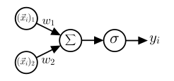

## Single-Layer-Perzeptron

Wir betrachten zunächst das einfachste neuronale Netzwerk, das sogenannte 
*Single-Layer-Perzeptron* (SLP). Den Begriff des Perzeptrons kennen Sie bereits aus 
dem vorherigen Abschnitt über binäre Klassifikation und bezeichnet ein Modell, das
einen beliebigen Eingabevektor auf eine binäre Ausgabe abbildet.

Um die Idee eines *neuronalen Netzwerks* zu verstehen, bzw. eines einzelnen 
*künstlichen Neurons*, müssen wir jedoch zunächst zurück auf die 
(Sie haben es wahrscheinlich schon befürchtet) lineare Regression blicken, genauer gesagt 
auf die Klassifikation mittels linearer Regression. Wir hatten bereits gesehen, 
dass sich die lineare Regression für die binäre Klassifikation aufgrund von zwei 
Problemen nicht eignet:

1. Die Ausgabe der linearen Regression ist kontinuierlich, d.h. sie kann beliebige 
   Wert zwischen $-\infty$ und $+\infty$ annehmen, während wir für die binäre
   Klassifikation nur zwei Werte benötigen (z.B. 0 und 1).
2. In der Klassifikation sind die Labels in der Regel nicht geordnet, d.h. es gibt 
   keine natürliche Ordnung zwischen den Klassen.

Wohingegen wir das erste Problem dadurch lösen konnten, dass wir die Ausgabe denjenigen 
Labels der Klassen zugewiesen haben, die der Ausgabe am nächsten liegen, zeigt das 
zweite Problem, dass Klassifikation und Regression grundlegend verschieden sind. Nach 
Vertauschen der Labels würde sich bei nur zwei Klassen das Vorzeichen der Ausgabe 
ändern, was wir durch Umkehrung der Entschiedungsgrenze kompensieren könnten. Bei mehr 
als zwei Klassen würde eine Vertauschung der Labels jedoch zu einer Änderung der 
Ausgleichsgeraden führen, was zeigt, dass wir die lineare Regression nicht für 
die Klassifikation mit mehr als zwei Klassen verwenden können.

### Logistische Regression

Wir nehmen an, dass $y_i \in \{0, 1\}$ und $\vec{x}_i \in \mathbb{R}^n$ für $i = 1, \ldots, N$.
Die Klassenlabels $y_i$ sind also entweder 0 oder 1, d.h. wir haben eine binäre Klassifikation.
Anstatt nun wie zuvor, die kontinuierliche Vorhersage des Models 
$\left\langle \vec{w}, \vec{x}_i \right\rangle + b$ eindeutig einem Label zuzuweisen, können wir 
die Ausgabe als eine Wahrscheinlichkeit $P(\hat{y}_i = 1 | \vec{x}_i)$ interpretieren, dass das 
vorhergesagte Label $\hat{y}_i$ des Datenpunkt $\vec{x}_i$ gleich 1 ist. Die Wahrscheinlichkeit, 
dass $\hat{y}_i$ gleich 0 ist, ist dann $P(\hat{y}_i = 0 | \vec{x}_i) = 1 - P(\hat{y}_i = 1 | \vec{x}_i)$. 
Dazu muss aber die Ausgabe des Modells so transformiert werden, sodass sie im Intervall $[0, 1]$ liegt. 
Eine Möglichkeit ist die Verwendung der logistischen Funktion 

$$
    \sigma(z) = \text{sigm}(z) = \frac{1}{1 + \exp(-z)},
$$

die auch als *Sigmoid-Funktion* bekannt ist und die reellen Zahlen auf das Intervall $[0, 1]$ abbildet:


Unser Model lautet dann

$$
    P(\hat{y}_i = 1 | \vec{x}_i) = \sigma (\left\langle \vec{w}, \vec{x}_i \right\rangle + b) ,
    {{numeq}}{eq:logistische_regression}
$$

was als *logistische Regression* (engl. *logistic regression*) bezeichnet wird. Beachten Sie, 
dass trotz des Namens die logistische Regression ein Klassifikationsmodell ist. 

Wie finden wir nun die optimalen Parameter $\vec{w}$ und $b$, sodass die Vorhersage des Modells 
für alle Datenpunkte $\vec{x}_i$ möglichst gut mit den tatsächlichen Labels $y_i$ übereinstimmt? 
Dazu benötigen wir eine Objektivfunktion, die uns sagt, wie gut unser Modell die Daten
beschreibt. Die Interpretation der Ausgabe als Wahscheinlichkeit legt nahe, dass wir 
versuchen sollten, die Wahrscheinlichkeit $P(\hat{y}_i = y_i | \vec{x}_i)$ zu maximieren 
(bzw. $\approx 1$). Über alle Datenpunkte können wir also das Produkt der Wahrscheinlichkeiten

$$
    L(\theta) := \prod_{i=1}^N P(\hat{y}_i = y_i | \vec{x}_i)
$$

maximieren, welches als die sogennante *Likelihood* bezeichnet wird. $L(\theta)$ gibt also an, 
wie wahrscheinlich es ist, die tatsächlichen Datenpunkte $(\vec{x}_i, y_i)$ durch unser 
Modell zu erhalten, welches durch die Parameter $\theta = (\vec{w}, b)$ beschrieben wird. Der 
Ansatz, die Likelihood zu maximieren, wird als *Maximum-Likelihood-Estimation* (MLE) bezeichnet und
ist eines der wichtigsten Prinzipien in der Statistik.

Da unsere Labels entweder 0 oder 1 sind, können wir die Likelihood auch als Produkt der
Wahrscheinlichkeiten schreiben, dass $\hat{y}_i = 1$ für die Datenpunkte mit $y_i = 1$ und
$\hat{y}_i = 0$ für die Datenpunkte mit $y_i = 0$ ist:

$$
\begin{align}
    L(\theta) &= \prod_{i=1}^N P(\hat{y}_i = y_i | \vec{x}_i) \\
              &= \prod_{i=1}^N P(\hat{y}_i = 1 | \vec{x}_i)^{y_i} (1 - P(\hat{y}_i = 1 | \vec{x}_i))^{1 - y_i} \\
\end{align}
$$

Diese Funktion zu maximieren bedeutet, dass wir die Ableitung nach den Parametern $\theta$
berechnen müssen. Da die Likelihood ein Produkt ist, ist es einfacher, den Logarithmus 
der Likelihood zu maximieren, da der Logarithmus eines Produkts die Summe der Logarithmen
der Faktoren ist. Um zudem etwas analoges zu einer Verlustfunktion zu erhalten, minimieren
wir stattdessen den negativen Logarithmus der Likelihood:

$$
\begin{align}
    \mathcal{L}_\theta &= - \log L(\theta) \\
                        &= - \sum_{i=1}^N \left[ y_i \log P(\hat{y}_i = 1 | \vec{x}_i) + (1 - y_i) \log (1 - P(\hat{y}_i = 1 | \vec{x}_i)) \right] \\
                        &= - \sum_{i=1}^N \left[ y_i \log \sigma(\left\langle \vec{w}, \vec{x}_i \right\rangle + b) + (1 - y_i) \log (1 - \sigma(\left\langle \vec{w}, \vec{x}_i \right\rangle + b)) \right] .
\end{align}
$$

Sie können sich als Übungsaufgabe davon überzeugen, dass die Gradienten der Verlustfunktion 
nach den Parametern $\vec{w}$ und $b$ gegeben sind durch

$$
\begin{align}
    \frac{\partial \mathcal{L}}{\partial \vec{w}} &= - \sum_{i=1}^N \left[ y_i - \sigma(\left\langle \vec{w}, \vec{x}_i \right\rangle + b) \right] \vec{x}_i \\
    \frac{\partial \mathcal{L}}{\partial b} &= - \sum_{i=1}^N \left[ y_i - \sigma(\left\langle \vec{w}, \vec{x}_i \right\rangle + b) \right] .
\end{align}
$$

Da leider keine geschlossene Lösung für die Parameter $\hat{\theta}$ existiert, welche die 
Gleichung $\nabla \mathcal{L}_\theta = 0$ löst, wenden wir wieder das 
stochastische Gradientenverfahren an, um die Parameter iterativ zu optimieren.

### Implementierung der logistischen Regression

Die Implementierung der logistischen Regression ist einfach umzusetzen, da sie sich 
nur geringfügig von den bisherigen Modellen unterscheidet. 

```python
{{#include ../codes/06-neural_networks/logistic_regression.py:logistic_regression}}
```

Wir wenden die logistische Regression auf die Daten der Eigenfaces an, welche wir bereits
für das Rosenblatt-Perzeptron verwendet haben. Um die Vorhersage des Modells anschaulich 
darzustellen, verwenden wir allerdings nur eine Dimension der Daten:

```python
{{#include ../codes/06-neural_networks/logistic_regression.py:eigenfaces_logistic_regression}}
```

Wir erhalten den folgenden Plot, wobei wir als Referenz auch die naive lineare Regression
hinzugefügt haben:


Für die logistische Regression anhand der zwei Dimensionen, in welcher die Daten 
linear separierbar sind, erhalten wir übrigens die folgende Abbildung. Das Modell klassifiziert 
die Daten im Gegensaatz zur linearen Regression korrekt:


Es ist dabei anzumerken, dass die sigmoide Vorhersage des Modells, also die Wahrscheinlichkeit 
$P(\hat{y}_i = 1 | \vec{x}_i)$, für linear separierbare Datenpunkte gegen die sogenannte 
*Heaviside-Funktion* konvergiert

$$
    \Theta(z) = \begin{cases}
        1 & \text{für } z > 0 \\
        0 & \text{für } z \leq 0
    \end{cases},
$$

die eine einfache Stufenfunktion dastellt.

Auch wenn die logistische Regression deutlich besserere Ergebnisse liefert als die
lineare Regression, müssen wir zur entgültigen Klassifizierung von neuen Datenpunkten 
eine Entscheidungsgrenze festlegen, z.B. $P(\hat{y}_i = 1 | \vec{x}_i) > 0.5$. 
Damit haben wir jedoch wieder das Problem, dass wir nur lineare Entscheidungsgrenzen
erhalten, die nicht immer die beste Trennung der Datenpunkte ermöglichen. Dies wird 
anhand des sogennanten [*XOR*-Problems](https://en.wikipedia.org/wiki/Exclusive_or) deutlich, 
was Ende der 60er Jahre zu einem Stillstand in der Entwicklung von neuronalen Netzwerken 
geführt hat.

Um zu verstehen, wie wir das Modell {{eqref: eq:logistische_regression}} erweitern können, 
betrachten wir zunächst die Vorhersage 
der logistischen Regression in einem sogenannten *Rechengraphen* (engl. *computational graph*):

<figure>
    <center>
    
    <figcaption>Rechengraph der logistischen Regression.</figcaption>
    </center>
</figure>

Dabei repräsentieren die Knoten $(\vec{x}_i)_j$ die Eingabedaten, welche entlang der Kanten
mit den Gewichten $\vec{w}_j$ multipliziert werden. Die Knoten $\sum$ und $\sigma$ 
stellen dann die Rechenoperation der Summation und der Sigmoid-Aktivierungsfunktion der eingehehenden Daten dar,
wobei wir die Addition des Bias $b$ implizit angenommen haben. Basierend auf der Ausgabe 
kann dann das Label oder Target $y_i$ bestimmt werden. In Anlehnung an die biologischen Neuronen, bezeichnet 
man diese Rechenoperation als *künstliches Neuron*. Damit stellt die logistische Regression bereits ein
einfaches *künstliches neuronales Netzwerk* dar, das aus einem einzigen Neuron besteht.

```admonish warning title="Neuronen in der Biologie"
*Neuronen*, oder auch *Nervenzellen*, sind die Grundbausteine des Nervensystems und bilden die
Grundlage für die Informationsverarbeitung im Gehirn. Ein Neuron ist im wesentlichen eine 
elektrisch erregbare Zelle, die in der folgenden Abbildung schematisch dargestellt ist:

<figure>
    <center>
    
    <figcaption>Schematische Darstellung eines Neurons. Quelle: "Anatomy and Physiology", SEER Program.</figcaption>
    </center>
</figure>

Sie besteht aus einem Zellkörper, den Dendriten, die die eingehenden Signale empfangen, und
dem Axon, das die Signale weiterleitet. Durch Akkumulieren der Signale an den Dendriten
wird ein elektrisches Potential aufgebaut. Wenn das Potential zusammen mit dem eigenen 
Restpotential einen Schwellwert überschreitet, wird ein elektrischer Impuls, das sogenannte 
Aktionspotential, entlang des Axons weitergeleitet. Am Ende des Axons wird der Impuls auf andere Neuronen 
übertragen, wobei die Synapsen die Verbindungen zwischen den Neuronen darstellen. Dieses 
Prinizip wird häufig als *Alles-oder-Nichts-Prinzip* bezeichnet. Man sagt auch, dass ein Neuron
entweder *feuert* oder nicht. 

Sie können nun selbst die Parallelen zwischen den
biologischen Neuronen und den künstlichen Neuronen ziehen oder auch die Unterschiede
erkennen.
```

### Single-Layer-Perzeptron

Wir können das Modell der logistischen Regression nun erweitern, indem wir mehrere
künstliche Neuronen miteinander verknüpfen. Die Eingabe wird dabei zunächst an zwei 
oder mehrere $d$ Neuronen weitergeleitet, die jeweils eine eigene Gewichtung und Aktivierungsfunktion
besitzen. Die Ausgabe der Neuronen wird dann (in Analogie zu den biologischen Neuronen) 
an ein weiteres Neuron weitergeleitet, welches diese Signale erneut gewichtet und aufsummiert.
Ggf. kann diese gewichtete Summe noch durch einen Bias ergänzt und durch eine weitere Aktivierungsfunktion 
modifiziert werden. Dieses Modell wird als *Single-Layer-Perzeptron* 
(SLP) bezeichnet, da es nur eine eine einzelne Schicht an *versteckten Neuronen* besitzt.

Mit der Notation $\vec{x}_i \in \mathbb{R}^n$, $W \in \mathbb{R}^{d \times n}$, $\vec{b} \in \mathbb{R}^n$ 
und $\vec{a} \in \mathbb{R}^d$ kann die zugrundeliegende Rechenoperation des SLPs als

$$
    \hat{f}(\vec{x}_i) = \sum_{j=1}^n \vec{a}_j \sigma ( \sum_{k=1}^d w_{jk} (\vec{x}_i)_j + \vec{b}_j)
$$

dargestellt werden, wobei $w_{jk}$, $\vec{b}_j$ und $\vec{a}_j$ lernbare Parameter sind, und 
$\sigma$ die Aktivierungsfunktion der Neuronen darstellt. Unter Verwendung der Matrix $W$ und 
der Vektoren $\vec{b}$ und $\vec{a}$ kann dies auch als Skalarprodukt 

$$
    \hat{f}(\vec{x}_i) = \vec{a}^T \sigma(W^T \vec{x}_i + \vec{b})
    {{numeq}}{eq:slp}
$$

geschrieben werden. Der detaillierte Rechengraph des SLP ist in der folgenden Abbildung dargestellt:

<figure>
    <center>
    
    <figcaption>Rechengraph des SLPs mit $d = 2$.</figcaption>
    </center>
</figure>

Auch wenn wir auf den ersten Blick nur minimale Änderungen vorgenommen haben, erlaubt uns
das Einführen einer einzelnen versteckten Schicht (engl. *hidden layer*) bereits
nichtlineare Entscheidungsgrenzen zu modellieren. Tatsächlich können wir mit dem SLP, sofern wir 
eine nichtlineare Aktivierungsfunktion wählen,
**jede beliebige Funktion** approximieren, was als das *universelle Approximationstheorem* bezeichnet wird. 

~~~admonish note title="Universelles Approximationstheorem"
Das universelle Approximationstheorem besagt, dass ein neuronales Netzwerk mit mindestens einer versteckten Schicht
und einer nichtlinearen Aktivierungsfunktion jede beliebige Funktion approximieren kann, sofern genügend Neuronen
in der versteckten Schicht vorhanden sind. Mathematisch ausgedrückt bedeutet dies, dass für jede stetige Funktion
$f: \mathbb{R}^n \rightarrow \mathbb{R}$ und für jedes $\epsilon > 0$ ein neuronales Netzwerk existiert, sodass
der Fehler $|f(\vec{x}) - \hat{f}(\vec{x})| < \epsilon$ für alle $\vec{x} \in \mathbb{R}^n$ gilt.

Der Beweis des Theorems ist simpel, sofern man einige Kenntnisse der Funktionalanalysis besitzt. Da dies 
jedoch den Rahmen dieses Kurses sprengen würde, bieten wir im Folgenden eine interaktive und stark vereinfachte 
Visualisierung des Theorems an. Dabei beschränken wir uns auf die Approximation einer einfachen Funktion 
$f: \mathbb{R} \rightarrow \mathbb{R}$ durch ein SLP mit einer versteckten Schicht, die aus 2 Neuronen besteht. 
Mit den Slidern können Sie die Parameter $w_j$, $b_j$ und $a_j$ der Neuronen verändern und die beste 
Approximation der Funktion durch das SLP finden. Wir möchten Sie dazu ermuntern, auch die Zielfunktion zu 
ändern oder die Anzahl der Neuronen zu erhöhen, um die Approximation zu verbessern.

```python
{{#include ../codes/06-neural_networks/slp_interactive.py:slp_interactive}}
```
~~~

Damit das SLP-Modell, also das neuronale Netzwerk mit einer versteckten Schicht, die Zielfunktion 
approximieren kann, müssen wir die Parameter $\vec{a}$, $W$ und $\vec{b}$ so anpassen, dass der
Fehler zwischen der Vorhersage $\hat{f}(\vec{x}_i)$ und dem tatsächlichen Wert $y_i$ minimiert wird. 
Dies ist das normale Vorgehen im überwachten Lernen, wobei wir die Verlustfunktion 

$$
    \mathcal{L} = \frac{1}{2} \sum_{i=1}^N ( \hat{f}(\vec{x}_i) - y_i )^2
$$

minimieren wollen. Dazu müssen wir die Gradienten der Verlustfunktion nach den Parametern 
$\vec{a}$, $W$ und $\vec{b}$ berechnen, um diese mit Hilfe des Gradientenverfahrens zu optimieren.
Unter Verwendung der Kettenregel, der Definition des SLPs in Gl. {{eqref: eq:slp}} sowie
der Hilfsvariable $res_i = \hat{f}(\vec{x}_i) - y_i$ können die Gradienten wie folgt berechnet werden:

$$
\begin{align}
    \frac{\partial \mathcal{L}}{\partial \vec{a}} &= \sum_{i=1}^N res_i \cdot \sigma(W^T \vec{x}_i + \vec{b}) \\
    \frac{\partial \mathcal{L}}{\partial W} &= \sum_{i=1}^N res_i \cdot (\vec{a} \odot \sigma'(W^T \vec{x}_i + \vec{b}) \vec{x}_i^T)^T \\
    \frac{\partial \mathcal{L}}{\partial \vec{b}} &= \sum_{i=1}^N res_i \cdot (\vec{a} \odot \sigma'(W^T \vec{x}_i + \vec{b})) .
\end{align}
{{numeq}}{eq:slp_gradient}
$$

Dabei bezeichnet $\odot$ das elementweise Produkt der Vektoren und $\sigma'$ die Ableitung der 
Aktivierungsfunktion (hier der Sigmoid-Funktion). Beachten Sie auch, dass wir bei der Berechnung 
der Gradienten die Transponierung der Matrizen und Vektoren berücksichtigen müssen, um die
Dimensionen korrekt zu erhalten.

Neben dem ursprünglichen Gradientenverfahren, welches den Gradienten der gesamten Datenpunkte 
nutzt, kennen wir bereits das stochastische Gradientenverfahren. Dabei wir der Gradient 
nur für einen (zufällig) ausgewählten Datenpunkt berechnet und die Parameter anschließend 
angepasst, was insbesondere bei sehr großen Datensätzen effizienter ist. Eine weitere 
sehr effiziente Methode ist das sogenannte *Mini-Batch-Gradientenverfahren*, was sozusagen 
eine Mischung aus den beiden Verfahren darstellt. Dabei wird der Gradient für eine kleine, 
zufällig ausgewählte 
Teilmenge $\mathcal{I}$ an Datenpunkten berechnet, der sogenannte *Batch*, und die Parameter entsprechend 
angepasst. Die Größe $B$ der Teilmenge (*Batch-Size*) kann dabei variabel gewählt und 
anhand der Verfügbaren Rechenressourcen angepasst werden.

Die Aktualisierung der Parameter $\theta$ erfolgt dann wie folgt:

$$
    \theta \leftarrow \theta - \frac{\tau}{B} \sum_{i \in \mathcal{I}} \frac{\partial \ell_i}{\partial \theta} ,
$$

wobei $\tau$ die Lernrate darstellt und $\ell_i$ die Verlustfunktion für einen Datenpunkt $i$ ist.

### Implementierung des Single-Layer-Perzeptrons

Wir implementieren zunächst die Aktivierungsfunktion und deren Ableitung, die wir für die Berechnung
der Gradienten benötigen. Dazu nutzen wir ebenfalls eine Klasse. Dank der `__call__`-Methode können wir das 
Objekt dann wie eine herkömmliche Funktion verwenden. 

```python
{{#include ../codes/06-neural_networks/single_layer_perceptron.py:sigmoid}}
```

Die `__init__`-Methode der Klasse `SLP` sollte keine Überraschungen bereithalten. Wir initialisieren 
die Parameter des Modells $W$, $\vec{b}$ und $\vec{a}$ zufällig und instanziieren die `Sigmoid`-Klasse. 
Neu ist auch, dass wir die Batch-Size festlegen müssen:

```python
{{#include ../codes/06-neural_networks/single_layer_perceptron.py:slp_feedforward}}
```

Zudem haben wir die Methode `feedforward` gemäß Gl. {{eqref: eq:slp}} 
implementiert, die die Vorhersage des Modells für einen 
Datenpunkt berechnet.

Um das Mini-Batch-Gradientenverfahren durchzuführen, müssen wir die Daten zunächst in zufällige 
Batches aufteilen. Dazu erstellen wir ein Array `indices`, der die Indizes der Datenpunkte 
enthält und mischen diesen zufällig. Innerhalb der Schleife über die Batches, wobei wir 
in Schritten der Batch-Size iterieren, definieren wir dann die Teilmenge der Datenpunkte 
und iterieren wiederum über diese. Da wir die Gradienten für die Datenpunkte in der Teilmenge 
aufsummieren, müssen wir diese zunächst als leere Arrays initialisieren.

```python
{{#include ../codes/06-neural_networks/single_layer_perceptron.py:slp_train}}
```

Die Berechnung der Gradienten erfolgt dann gemäß Gl. {{eqref: eq:slp_gradient}}. Hier haben wir 
uns eine Reihe an Hilfsvariablen definiert, wie z.B. `d_inner`, was 
$\vec{a} \odot \sigma'(W^T \vec{x}_i + \vec{b})$ enspricht und die 
Berechnung der Gradienten vereinfacht. Beachten Sie auch, dass wir die `numpy`-Funktion 
[`np.outer`](https://numpy.org/doc/stable/reference/generated/numpy.outer.html) verwendet haben, 
um das äußere Produkt der Vektoren `d_inner` $\in \mathbb{R}^n$ und `x` $\in \mathbb{R}^d$ zu berechnen.
Da die Gewichte, und somit auch die Gradienten, allerdings die Dimensionen $d \times n$ haben, müssen
wir das äußere Produkt transponieren.

Wir trainieren das SLP-Modell anhand der Daten der zwei 
<a href="../codes/05-machine_learning/circles.csv" download>eigebetteten Kreise</a>, die wir bereits
aus der Übung zu (Kernel)-SVMs kennen. Das Ziel ist also, die Datenpunkte in die beiden Klassen
1 und -1 zu klassifizieren, wobei wir die kontinuierliche Ausgabe des Modells nicht weiter einschränken.
Dazu verwenden wir eine versteckte Schicht mit 50 Neuronen und der Sigmoid-Aktivierungsfunktion:

```python
{{#include ../codes/06-neural_networks/single_layer_perceptron.py:slp_example}}
```

Wir visualisieren die Entscheidungsgrenze des SLPs ($\hat{f}(\vec{x}) = 0$) 
zusammen mit dem Loss des Modells und erhalten den folgenden Plot:

```python
{{#include ../codes/06-neural_networks/single_layer_perceptron.py:slp_plot}}
```


Wie Sie sehen können, ist das SLP in der Lage, eine nichtlineare Entscheidungsgrenze zu modellieren,
die die Datenpunkte korrekt klassifiziert. 

```admonish note title="Hinweis"
Ändern Sie die Batch-Size, die Anzahl der Neuronen oder 
die Lernrate, und beobachten Sie, wie sich die Entscheidungsgrenze und der Loss des Modells verändern.
```