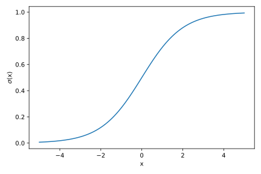
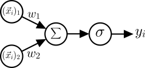
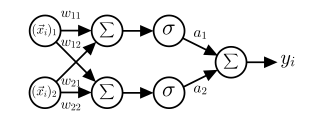
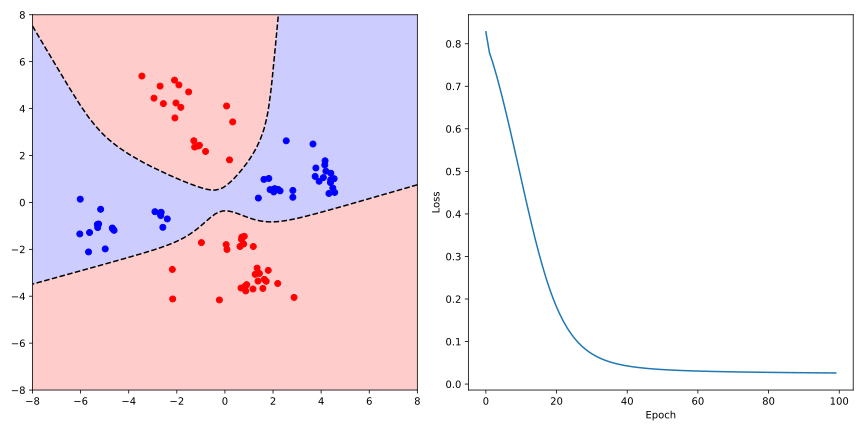

## Single-Layer Perceptron

We begin by considering the simplest neural network, the so-called *Single-Layer Perceptron* (SLP). You are already familiar with the concept of perceptrons from the previous section on binary classification, which refers to a model that maps any input vector to a binary output.

To understand the idea of a *neural network*, or more specifically, a single *artificial neuron*, we must first revisit (as you probably anticipated) linear regression, specifically classification using linear regression. We have already seen that linear regression is unsuitable for binary classification due to two fundamental problems:

1. The output of linear regression is continuous, meaning it can take any value between $-\infty$ and $+\infty$, while for binary classification we only need two values (e.g., -1 and 1).
2. In classification, labels are typically not ordered, meaning there is no natural ordering between classes.

While we could solve the first problem by assigning the output to the class labels closest to the output, the second problem shows that classification and regression are fundamentally different. With only two classes, swapping the labels would change the sign of the output, which we could compensate for by inverting the decision boundary. However, with more than two classes, swapping labels would lead to a change in the regression line, showing that we cannot use linear regression for classification with more than two classes.

### Logistic Regression

Instead of assigning the continuous prediction $\langle \vec{w}, \vec{x}_i \rangle + b$ to a specific label, we can interpret the output as a probability $P(\hat{y}_i = 1 | \vec{x}_i)$ that the predicted label $\hat{y}_i$ of data point $\vec{x}_i$ equals 1. To achieve this, we need to transform the model output to lie in the interval $[0, 1]$. One approach is to use the logistic function:

$$
\sigma(z) = \frac{1}{1 + \exp(-z)},
$$

which is also known as the *sigmoid function* and maps real numbers to the interval $[0, 1]$.



Our model then becomes

$$
P(\hat{y}_i = 1 | \vec{x}_i) = \sigma(\langle \vec{w}, \vec{x}_i \rangle + b),
$$

which is called *logistic regression*. Note that despite the name, logistic regression is a classification model.

```admonish info title="Maximum Likelihood Estimation"
To find the optimal parameters $\vec{w}$ and $b$, we use maximum likelihood estimation. The likelihood function is:

$$
L(\theta) = \prod_{i=1}^N P(\hat{y}_i = y_i | \vec{x}_i) = \prod_{i=1}^N P(\hat{y}_i = 1 | \vec{x}_i)^{y_i} (1 - P(\hat{y}_i = 1 | \vec{x}_i))^{1 - y_i}
$$

To maximize this, we minimize the negative log-likelihood:

$$
\mathcal{L} = -\sum_{i=1}^N \left[ y_i \log \sigma(\langle \vec{w}, \vec{x}_i \rangle + b) + (1 - y_i) \log (1 - \sigma(\langle \vec{w}, \vec{x}_i \rangle + b)) \right]
$$

The gradients of this loss function with respect to the parameters are:

$$
\begin{align}
\frac{\partial \mathcal{L}}{\partial \vec{w}} &= -\sum_{i=1}^N \left[ y_i - \sigma(\langle \vec{w}, \vec{x}_i \rangle + b) \right] \vec{x}_i \\
\frac{\partial \mathcal{L}}{\partial b} &= -\sum_{i=1}^N \left[ y_i - \sigma(\langle \vec{w}, \vec{x}_i \rangle + b) \right]
\end{align}
$$

Since no closed-form solution exists, we use stochastic gradient descent to optimize the parameters iteratively.
```

### Artificial Neurons

While logistic regression provides better results than linear regression, we still face the limitation of only linear decision boundaries. This becomes apparent with the [XOR problem](https://en.wikipedia.org/wiki/Exclusive_or), which led to a stagnation in neural network development in the late 1960s.

To understand how we can extend the logistic regression model, let's consider its prediction in a *computational graph*:

<figure>
    <center>
    
    <figcaption>Computational graph of logistic regression.</figcaption>
    </center>
</figure>

The nodes $(\vec{x}_i)_j$ represent the input data, which are multiplied by weights $\vec{w}_j$ along the edges. The nodes $\sum$ and $\sigma$ represent the summation and sigmoid activation function operations, where we implicitly assume the addition of bias $b$. Based on the output, the label or target $y_i$ can be determined. Following the analogy to biological neurons, this computational operation is called an *artificial neuron*. Thus, logistic regression already represents a simple *artificial neural network* consisting of a single neuron.


### Single-Layer Perceptron

We can extend the logistic regression model by connecting multiple artificial neurons. The input is first forwarded to two or more $d$ neurons, each with their own weighting and activation function. The output of these neurons is then (analogous to biological neurons) forwarded to another neuron, which re-weights and sums these signals. This weighted sum can optionally be supplemented by a bias and modified by another activation function. This model is called a *Single-Layer Perceptron* (SLP) because it has only a single layer of *hidden neurons*.

With the notation $\vec{x}_i \in \mathbb{R}^n$, $W \in \mathbb{R}^{n \times d}$, $\vec{b} \in \mathbb{R}^d$, and $\vec{a} \in \mathbb{R}^d$, the underlying computation of the SLP can be written as:

$$
\hat{f}(\vec{x}_i) = \sum_{j=1}^n \vec{a}_j \sigma(\sum_{k=1}^d w_{kj} (\vec{x}_i)_j + \vec{b}_j)
$$

where $w_{kj}$, $\vec{b}_j$, and $\vec{a}_j$ are learnable parameters, and $\sigma$ represents the activation function of the neurons. Using the matrix $W$ and the vectors $\vec{b}$ and $\vec{a}$, this can also be written as a scalar product:

$$
\hat{f}(\vec{x}_i) = \vec{a}^T \sigma(W^T \vec{x}_i + \vec{b})
{{numeq}}{eq:slp}
$$

The detailed computational graph of the SLP is shown in the following figure:

<figure>
    <center>
    
    <figcaption>Computational graph of SLP with $d = 2$.</figcaption>
    </center>
</figure>

Although we have made only minimal changes at first glance, introducing a single hidden layer already allows us to model nonlinear decision boundaries. In fact, with the SLP, provided we choose a nonlinear activation function, we can approximate **any arbitrary function**, which is known as the *universal approximation theorem*.

For the SLP model to approximate the target function, we need to adjust the parameters $\vec{a}$, $W$, and $\vec{b}$ so that the error between the prediction $\hat{f}(\vec{x}_i)$ and the actual value $y_i$ is minimized. This is the standard approach in supervised learning, where we minimize the loss function:

$$
\mathcal{L} = \frac{1}{2} \sum_{i=1}^N (\hat{f}(\vec{x}_i) - y_i)^2
$$

To do this, we need to calculate the gradients of the loss function with respect to the parameters $\vec{a}$, $W$, and $\vec{b}$ to optimize them using gradient descent. Using the chain rule, the definition of the SLP in Eq. {{eqref: eq:slp}}, and the helper variable $res_i = \hat{f}(\vec{x}_i) - y_i$, the gradients can be calculated as follows:

$$
\begin{align}
\frac{\partial \mathcal{L}}{\partial \vec{a}} &= \sum_{i=1}^N res_i \cdot \sigma(W^T \vec{x}_i + \vec{b}) \\
\frac{\partial \mathcal{L}}{\partial W} &= \sum_{i=1}^N res_i \cdot (\vec{a} \odot \sigma'(W^T \vec{x}_i + \vec{b}) \vec{x}_i^T)^T \\
\frac{\partial \mathcal{L}}{\partial \vec{b}} &= \sum_{i=1}^N res_i \cdot (\vec{a} \odot \sigma'(W^T \vec{x}_i + \vec{b}))
\end{align}
{{numeq}}{eq:slp_gradient}
$$

Here, $\odot$ denotes the element-wise product of vectors and $\sigma'$ the derivative of the activation function (here the sigmoid function). Note that we must consider the transposition of matrices and vectors when calculating gradients to obtain the correct dimensions.

```admonish info title="Stochastic Gradient Descent"
In classical gradient descent, the parameters are updated based on the exact gradient of the loss function. We see, however, that the gradient is a sum of the gradients of the loss function for each data point. This means that we need to compute the gradient for the entire dataset, which can be computationally expensive for large datasets and would result in a very slow learning process. 

Instead, we could follow a similar approach as in the previous section on Perceptrons and SVMs, where we update the parameters for each (randomly selected) data point. This is known as *stochastic gradient descent*. Note that this is a stochastic approximation of the gradient descent, so it is not exact. However, it has shown that this approach can lead to better results, as the stochasticity helps in avoiding local minima.

In practice, we often use a balanced approach between exact and stochastic gradient descent. Here, we compute the gradient by summing the gradients of a small, randomly selected subset of the data, called the *batch*, and update the parameters accordingly. The size $B$ of the subset can be chosen variable and adjusted based on the available computational resources. This is known as *mini-batch gradient descent*.
```


### Implementation of the Single-Layer Perceptron

We first implement the activation function and its derivative, which we need for calculating the gradients. We use a class for this as well. Thanks to the `__call__` method, we can use the object like a conventional function.

```python
{{#include ../codes/06-neural_networks/slp.py:sigmoid}}
```

The `__init__` method of the `SLP` class should hold no surprises. We initialize the model parameters $W$, $\vec{b}$, and $\vec{a}$ randomly and instantiate the `Sigmoid` class. We also implement the `predict` method according to Eq. {{eqref: eq:slp}}, which calculates the model's prediction for a data point:

```python
{{#include ../codes/06-neural_networks/slp.py:slp_init_predict}}
```

To perform stochastic gradient descent, we first shuffle the data by creating an array `indices` containing the indices of the data points and randomly permuting it. Within the training loop, we iterate over all data points and update the parameters after each one (true SGD). 

```python
{{#include ../codes/06-neural_networks/slp.py:slp_fit}}
```

The gradient calculation follows Eq. {{eqref: eq:slp_gradient}}. Here we have defined several helper variables, such as `d_inner`, which corresponds to $\vec{a} \odot \sigma'(W^T \vec{x}_i + \vec{b})$ and simplifies the gradient calculation. Note that we use the numpy function [`np.outer`](https://numpy.org/doc/stable/reference/generated/numpy.outer.html) to calculate the outer product of the vectors `d_inner` $\in \mathbb{R}^n$ and `x$ \in \mathbb{R}^d$. Since the weights, and thus also the gradients, have dimensions $d \times n$, we need to transpose the outer product.

We train the model using a dataset that is inspired by the Aptamer dataset, embedded in two-dimensional PCA space. The four clusters, which we have identified already using the $k$-means algorithm, are now labeled in a way that does not allow for a linear decision boundary, similar to the XOR problem. You can download the data <a href="../codes/06-neural_networks/aptamer_xor_data.csv" download>here</a>.

```python
{{#include ../codes/06-neural_networks/slp.py:load_data}}
```
We then initialize the model and train it:

```python
{{#include ../codes/06-neural_networks/slp.py:train_model}}
```

We visualize the decision boundary of the SLP ($\hat{f}(\vec{x}) = 0$) together with the loss of the model. Here, we have created a meshgrid of the input space and evaluated the model at each point, coloring the points based on the predicted class:

```python
{{#include ../codes/06-neural_networks/slp.py:plot_results}}
```



As you can see, the SLP is able to model a nonlinear decision boundary that correctly classifies the data points.
