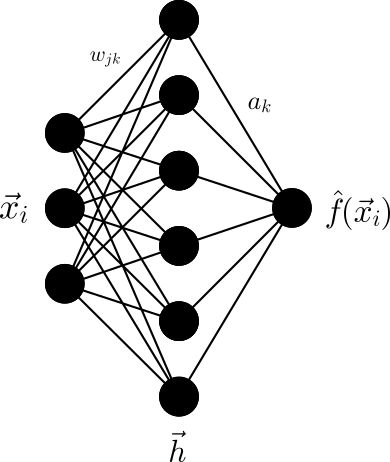
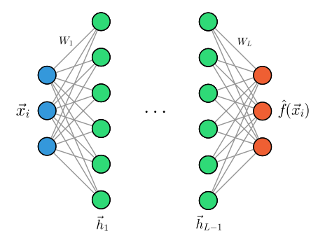

## Multi-Layer Perceptron

The flexibility and expressiveness of a Single-Layer Perceptron (SLP), i.e., a neural network with only one hidden layer, is already remarkable but nevertheless limited. While we can choose the dimensions of the input, output, and hidden layer arbitrarily, we may need to use a very large number of neurons in the hidden layer to approximate a function with arbitrary precision. This leads to high computational cost and poor generalization to unknown data. A simplified schematic representation of an SLP is shown in the figure below. Here, the summation of weighted inputs and the activation function in the hidden layer $\vec{h}$ (green) are combined in a single step.

<figure>
    <center>
    
    <figcaption>Schematic representation of an SLP.</figcaption>
    </center>
</figure>

The use of the term *layer* already suggests that we can extend the architecture of a neural network by connecting multiple layers $\vec{h}_l$ for $l = 1, \dots, L$ of neurons in series. Such a network is called a Multi-Layer Perceptron (MLP) and is shown in the figure below.

<figure>
    <center>
    
    <figcaption>Schematic representation of an MLP.</figcaption>
    </center>
</figure>

An MLP consists of an input layer that receives the input data $\vec{x} \in \mathbb{R}^d$ and $L$ hidden layers $\vec{h}_l$, each consisting of $d_l$ neurons. The individual layers are connected by weights $W_l \in \mathbb{R}^{d_{l-1} \times d_l}$ and biases $\vec{b}_l \in \mathbb{R}^{d_l}$. Since the neurons of adjacent layers are fully connected to each other, this architecture is also called *fully connected* or *dense* networks. Typically, one chooses the same activation function for all hidden layers, but in the following we will consider general activation functions $\sigma_l$. The last layer of the MLP is then the output layer $\hat{f}(\vec{x}_i) = \vec{h}_L$, which provides the prediction of the model. In contrast to the SLP, we assume a vectorial output here, which can represent, for example, the probabilities for different classes in a classification problem.

We summarize the calculation of the output of an MLP for a data point $\vec{x}_i$, which is also called the *forward pass*:
- The input $\vec{x}_i \in \mathbb{R}^n$ is passed to the first hidden layer 
$\vec{h}_1 = \sigma_1(W_1^T \vec{x}_i + \vec{b}_1)$.
- The outputs of the hidden layers are calculated recursively from the outputs of the previous layers:
$$
    \vec{h}_l = \sigma_l ( W_l^T \vec{h}_{l-1} + \vec{b}_l) \quad \text{for } l = 2, \dots, L.
$$
- The output of the entire MLP can therefore be written as a composition of the previous layers:
$$
    \hat{f}(\vec{x}_i) = \vec{h}_L \circ \vec{h}_{L-1} \circ \dots \circ \vec{h}_1(\vec{x}_i).
$$

What does this mean for training an MLP? To find the optimal weights $W_l$ and biases $\vec{b}_l$, we apply stochastic or mini-batch gradient descent. For this, we need to calculate the gradients

$$
\begin{align*}
    \frac{\partial \ell(\hat{f}(\vec{x}_i), \vec{y}_i)}{\partial (W_l)_{jk}} \\
    \frac{\partial \ell(\hat{f}(\vec{x}_i), \vec{y}_i)}{\partial (\vec{b}_l)_j}
\end{align*}
$$

of a (general) loss function $\mathcal{L} := \sum_{i=1}^N \ell(\hat{f}(\vec{x}_i), \vec{y}_i)$ with respect to the weights and biases for all $l = 1, \dots, L$. Due to the composition of layers, we apply the chain rule of differentiation multiple times. Since we start from the *back*, i.e., at the output layer, this procedure is also called *backpropagation*.

We first define the *activation* $\vec{a}_l = W_l^T \vec{h}_{l-1} + \vec{b}_l$ of the $l$-th layer, so that we can write the output of the layer as $\vec{h}_l = \sigma_l(\vec{a}_l)$. Using the chain rule, we obtain

$$
\begin{align*}
    \frac{\partial \ell(\hat{f}(\vec{x}_i), \vec{y}_i)}{\partial (W_l)_{jk}} &= \frac{\partial \ell(\hat{f}(\vec{x}_i), \vec{y}_i)}{\partial (\vec{a}_l)_k} \frac{\partial (\vec{a}_l)_k}{\partial (W_l)_{jk}} \\
    \frac{\partial \ell(\hat{f}(\vec{x}_i), \vec{y}_i)}{\partial (\vec{b}_l)_j} &= \frac{\partial \ell(\hat{f}(\vec{x}_i), \vec{y}_i)}{\partial (\vec{a}_l)_j} \frac{\partial (\vec{a}_l)_j}{(\vec{b}_l)_j} \,.
\end{align*}
{{numeq}}{eq:partial_derivatives}
$$

If we write the activation of a single neuron $j$ in the $l$-th layer as $(\vec{a}_l)_k = \sum_{j=1}^{d_{l-1}} (W_l)_{jk} (\vec{h}_{l-1})_j + (\vec{b}_l)_k$, we obtain for the respective second factors in Eq. {{eqref: eq:partial_derivatives}}:

$$
\begin{align*}
    \frac{\partial (\vec{a}_l)_k}{\partial (W_l)_{jk}} &= (\vec{h}_{l-1})_j \\
    \frac{\partial (\vec{a}_l)_j}{\partial (\vec{b}_l)_j} &= 1 \,.
\end{align*}
$$

It remains to calculate the derivatives of the loss function with respect to the activation of the $l$-th layer. We first consider the last layer $L$. Since $\vec{h}_L = \sigma_L(\vec{a}_L)$, we obtain

$$
    (\delta_L)_j := \frac{\partial \ell(\hat{f}(\vec{x}_i), \vec{y}_i)}{\partial (\vec{a}_L)_j} = \frac{\partial \ell(\hat{f}(\vec{x}_i), \vec{y}_i)}{\partial (\vec{h}_L)_j} \frac{\partial (\vec{h}_L)_j}{\partial (\vec{a}_L)_j} = \frac{\partial \ell(\hat{f}(\vec{x}_i), \vec{y}_i)}{\partial (\vec{h}_L)_j} \sigma_L'((\vec{a}_L)_j) \,.
    {{numeq}}{eq:delta_L}
$$

The result looks complicated at first glance, but it has a simple interpretation. The first factor, the derivative of the loss function with respect to the output of the last layer $\frac{\partial \ell(\hat{f}(\vec{x}_i), \vec{y}_i)}{\partial (\vec{h}_L)_j}$, depends on the chosen loss function. For the *mean squared error* loss function, this is simply $(\hat{f}(\vec{x}_i) - \vec{y}_i)$, or $(\vec{h}_L - \vec{y}_i)$. Also, the second factor, the derivative of the activation function $\sigma_L'((\vec{a}_L)_j)$, can be calculated simply, since we have explicitly chosen the activation function $\sigma_L$ and $\vec{a}_L$ is known from the *forward pass*. For regression problems, one often chooses the identity function as the activation function of the last layer to avoid constraining the output.

Thus, the derivatives of the loss function with respect to the weights and biases of the last layer are

$$
\begin{align*}
    \frac{\partial \ell(\hat{f}(\vec{x}_i), \vec{y}_i)}{\partial (W_L)_{jk}} &= (\delta_L)_k (\vec{h}_{L-1})_j \\
    \frac{\partial \ell(\hat{f}(\vec{x}_i), \vec{y}_i)}{\partial (\vec{b}_L)_j} &= (\delta_L)_j \,.
\end{align*}
{{numeq}}{eq:partial_derivatives_last_layer}
$$

For the hidden layers $l = 1, \dots, L-1$, we first realize that the derivative of the loss function with respect to the activation of the $l$-th layer $\vec{a}_l$ depends on the activation of the $(l+1)$-th layer. Since $(\vec{a}_l)_j$ is also passed to **all** $d_{l+1}$ neurons of the $(l+1)$-th layer, it follows from the chain rule

$$
    (\delta_l)_j := \frac{\partial \ell(\hat{f}(\vec{x}_i), \vec{y}_i)}{\partial (\vec{a}_l)_j} = \sum_{k=1}^{d_{l+1}} \frac{\partial \ell(\hat{f}(\vec{x}_i), \vec{y}_i)}{\partial (\vec{a}_{l+1})_k} \frac{\partial (\vec{a}_{l+1})_k}{\partial (\vec{a}_l)_j} = \sum_{k=1}^{d_{l+1}} (\delta_{l+1})_k \frac{\partial (\vec{a}_{l+1})_k}{\partial (\vec{a}_l)_j} \,.
$$

We recognize that $\delta_{l+1}$ appears here, which in turn has already been calculated in our *backward pass* according to the same formula (up to $\delta_{L}$). The second factor can be calculated explicitly from the definition $(\vec{a}_{l+1})_k = \sum_{j=1}^{d_{l}} (W_{l+1})_{jk} (\vec{h}_{l})_j + (\vec{b}_{l+1})_k$ with $\vec{h}_{l} = \sigma_l(\vec{a}_l)$:

$$
    \frac{\partial (\vec{a}_{l+1})_k}{\partial (\vec{a}_l)_j} = (W_{l+1})_{jk} \sigma_l'((\vec{a}_l)_j) \,.
$$

This leads to the central *recursion formula* for the *backward pass*:

$$
    (\delta_l)_j = \frac{\partial \ell(\hat{f}(\vec{x}_i), \vec{y}_i)}{\partial (\vec{a}_l)_j} = \sigma_l'((\vec{a}_l)_j) \sum_{k=1}^{d_{l+1}} (\delta_{l+1})_k (W_{l+1})_{jk}  \quad \text{for } l = L-1, \dots, 1 \,.
    {{numeq}}{eq:delta_l}
$$

If we now substitute these results into Eq. {{eqref: eq:partial_derivatives}}, we obtain the gradients

$$
\begin{align*}
    \frac{\partial \ell(\hat{f}(\vec{x}_i), \vec{y}_i)}{\partial (W_l)_{jk}} &= (\delta_l)_k (\vec{h}_{l-1})_j \\
    \frac{\partial \ell(\hat{f}(\vec{x}_i), \vec{y}_i)}{\partial (\vec{b}_l)_j} &= (\delta_l)_j \,.
\end{align*}
{{numeq}}{eq:partial_derivatives_all_layers}
$$

What do these equations tell us about the actual calculation of gradients in training an MLP?

Due to the recursion, we must **first calculate the gradients of the last layer and can then obtain the gradients of the previous layers recursively** from the gradients of the subsequent layers. All other components of the calculation, such as $\vec{a}_l$ and $\vec{h}_l$, are already known from the *forward pass*. This means that for the calculation of the gradient of a data point, we first perform a *forward pass* with the current weights and biases and store the activations $\vec{a}_l$ and $\vec{h}_l$.

## PyTorch: A Modern Framework for Deep Learning

While understanding the mathematical foundations of backpropagation is crucial, implementing neural networks from scratch can be tedious and error-prone. Modern deep learning frameworks like **PyTorch** provide powerful tools that automate many aspects of neural network implementation, including:

- **Automatic differentiation**: PyTorch automatically computes gradients using the chain rule
- **GPU acceleration**: Seamless computation on graphics processing units for faster training
- **Optimized operations**: Highly efficient implementations of common neural network operations
- **Rich ecosystem**: Pre-built layers, loss functions, optimizers, and utilities

PyTorch's core concept is the **computational graph**, where operations are represented as nodes and data flows as edges. When you perform operations on tensors (PyTorch's multi-dimensional arrays), PyTorch builds a graph that tracks how to compute gradients automatically.

### Key PyTorch Components

1. **Tensors**: Multi-dimensional arrays that can store gradients
2. **nn.Module**: Base class for neural network layers and models
3. **Optimizers**: Algorithms for updating model parameters (SGD, Adam, etc.)
4. **Loss Functions**: Functions that measure prediction error
5. **DataLoader**: Utilities for efficient data handling and batching

Let's see how our MLP can be implemented much more simply using PyTorch by revisiting the classification problem of the previous section:

### Setting Up PyTorch

First, we import the necessary modules and check our PyTorch installation:

```python
{{#include ../codes/06-neural_networks/pytorch_demo.py:pytorch_intro}}
```

### Data Preparation

PyTorch works with tensors, so we need to convert our data:

```python
{{#include ../codes/06-neural_networks/pytorch_demo.py:data_preparation}}
```

### Model Definition

Defining a neural network in PyTorch is straightforward using `nn.Module`:

```python
{{#include ../codes/06-neural_networks/pytorch_demo.py:model_definition}}
```

The key advantages here are:
- **Automatic parameter management**: PyTorch automatically tracks all parameters that need gradients
- **Clean forward pass**: The `forward` method defines the computation graph
- **GPU support**: Simply call `.to(device)` to move the model to GPU

### Training Setup

Setting up training components is equally simple:

```python
{{#include ../codes/06-neural_networks/pytorch_demo.py:training_setup}}
```

### Training Loop

The training loop demonstrates PyTorch's automatic differentiation:

```python
{{#include ../codes/06-neural_networks/pytorch_demo.py:training_loop}}
```

The magic happens in `loss.backward()` - PyTorch automatically computes all gradients using the computational graph built during the forward pass. This replaces all the manual gradient calculations we derived earlier!

### Evaluation and Visualization

```python
{{#include ../codes/06-neural_networks/pytorch_demo.py:evaluation}}
```

```python
{{#include ../codes/06-neural_networks/pytorch_demo.py:visualization}}
```

```admonish info title="Advanced Features" collapsible=true

PyTorch provides many additional features for building sophisticated models:

~~~python
{{#include ../codes/06-neural_networks/pytorch_demo.py:advanced_features}}
~~~
```

## Application of Deep Neural Networks in Chemical Research