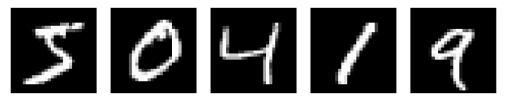

## Multi-Layer-Perzeptron

Die Flexibilität und Expressivität eines Single-Layer-Perzeptrons (SLP), also eines neuronalen Netzwerks mit nur 
einer versteckten Schicht, ist bereits erstaunlich aber dennoch begrenzt. Zwar können wir die Dimensionen der Eingabe, 
der Ausgabe und der versteckten Schicht beliebig wählen, jedoch müssen wir unter Umständen eine sehr große Anzahl an 
Neuronen in der versteckten Schicht verwenden, um eine Funktion beliebig genau approximieren. Dies führt zu einem 
hohen Rechenaufwand und einer schlechten Generalisierung auf unbekannte Daten. Eine vereinfachte schematische 
Darstellung eines SLP ist in der Abbildung unten dargestellt. Dabei ist die Summation der gewichteten Eingaben und die Aktivierungsfunktion in der versteckten Schicht $\vec{h}$ (grün) in einem einzigen Schritt zusammengefasst.

<figure>
    <center>
    
    <figcaption>Schematische Darstellung eines SLP.</figcaption>
    </center>
</figure>

Die Verwendung des Begriffes *Schicht* lässt bereits vermuten, dass wir die Architektur eines neuronalen Netzwerks 
erweitern können, indem wir mehrere Schichten $\vec{h}_l$  für $l = 1, \dots, L$ von Neuronen hintereinander schalten. 
Ein solches Netzwerk wird als Multi-Layer-Perzeptron (MLP) bezeichnet und ist in der Abbildung unten dargestellt. 

<figure>
    <center>
    
    <figcaption>Schematische Darstellung eines MLP.</figcaption>
    </center>
</figure>

Ein MLP besteht aus einer Eingabeschicht, welche die Eingabedaten $\vec{x} \in \mathbb{R}^n$ aufnimmt und $L$ 
versteckten Schichten $\vec{h}_l$, die jeweils aus $d_l$ Neuronen bestehen. Die einzelnen Schichten (*layers*) sind 
durch Gewichte $W_l \in \mathbb{R}^{d_{l-1} \times d_l}$ und Bias $\vec{b}_l \in \mathbb{R}^{d_l}$ 
miteinander verbunden. Da die Neuronen benachbarter Schichten vollständig miteinander verbunden sind, nennt man diese 
Architektur auch *fully connected* oder *dense* Netzwerke. In der Regel wählt man für alle versteckten Schichten die 
gleiche Aktivierungsfunktion, wir werden aber im Folgenden allgemeine Aktivierungsfunktionen $\sigma_l$ 
berücksichtigen. Die letzte Schicht des MLP ist dann die Ausgabeschicht $\hat{f}(\vec{x}_i) = \vec{h}_L$, die die 
Vorhersage des Modells liefert. Im Gegensatz zum SLP nehmen wir hier einen vektoriellen Output an, der z.B. die 
Wahrscheinlichkeiten für verschiedene Klassen in einem Klassifikationsproblem darstellen kann.

Wir fassen die Berechnung der Ausgabe eines MLP für einen Datenpunkt $\vec{x}_i$, was auch 
als *forward pass* bezeichnet wird, zusammen:
- Die Eingabe $\vec{x}_i \in \mathbb{R}^n$ wird in die erste versteckte Schicht 
$\vec{h}_1 = \sigma_1(W_1^T \vec{x}_i + \vec{b}_1)$ übergeben.
- Die Ausgaben der versteckten Schichten werden rekursiv aus den Ausgaben der vorherigen Schichten berechnet:
$$
    \vec{h}_l = \sigma_l ( W_l^T \vec{h}_{l-1} + \vec{b}_l) \quad \text{für } l = 2, \dots, L.
$$
- Die Ausgabe des gesamten MLP kann demnach als Komposition der vorherigen Schichten geschrieben werden:
$$
    \hat{f}(\vec{x}_i) = \vec{h}_L \circ \vec{h}_{L-1} \circ \dots \circ \vec{h}_1(\vec{x}_i).
$$

Was bedeutet das für das Training eines MLP? Um die optimalen Gewichte $W_l$ und Bias $\vec{b}_l$ zu finden, wenden 
wir das stochastische, bzw. mini-batch Gradientenverfahren an. Dazu müssen wir die Gradienten

$$
\begin{align*}
    \frac{\partial \ell(\hat{f}(\vec{x}_i), \vec{y}_i)}{\partial (W_l)_{jk}} \\
    \frac{\partial \ell(\hat{f}(\vec{x}_i), \vec{y}_i)}{\partial (\vec{b}_l)_j}
\end{align*}
$$

einer (allgemeinen) Verlustfunktion $\mathcal{L} := \sum_{i=1}^N \ell(\hat{f}(\vec{x}_i), \vec{y}_i)$ 
nach den Gewichten und Bias für alle $l = 1, \dots, L$ berechnen. 
Aufgrund der Komposition der Schichten wenden wir dazu die Kettenregel der Ableitung mehrfach an. 
Da wir dazu von *hinten*, also bei der Ausgabeschicht, beginnen, wird dieses Verfahren auch *backpropagation*
genannt.

Wir definieren zunächst die *Aktivierung* $\vec{a}_l = W_l^T \vec{h}_{l-1} + \vec{b}_l$ der $l$-ten Schicht, sodass 
wir die Ausgabe der Schicht als $\vec{h}_l = \sigma_l(\vec{a}_l)$ schreiben können. Unter Verwendung der 
Kettenregel erhalten wir 

$$
\begin{align*}
    \frac{\partial \ell(\hat{f}(\vec{x}_i), \vec{y}_i)}{\partial (W_l)_{jk}} &= \frac{\partial \ell(\hat{f}(\vec{x}_i), \vec{y}_i)}{\partial (\vec{a}_l)_k} \frac{\partial (\vec{a}_l)_k}{\partial (W_l)_{jk}} \\
    \frac{\partial \ell(\hat{f}(\vec{x}_i), \vec{y}_i)}{\partial (\vec{b}_l)_j} &= \frac{\partial \ell(\hat{f}(\vec{x}_i), \vec{y}_i)}{\partial (\vec{a}_l)_j} \frac{\partial (\vec{a}_l)_j}{(\vec{b}_l)_j} \,.
\end{align*}
{{numeq}}{eq:partial_derivatives}
$$

Schreiben wir die Aktivierung eines einzelnen Neurons $j$ in der $l$-ten Schicht als 
$(\vec{a}_l)_k = \sum_{j=1}^{d_{l-1}} (W_l)_{jk} (\vec{h}_{l-1})_j + (\vec{b}_l)_k$, 
so erhalten wir für die jeweils zweiten Faktoren in Gl. {{eqref: eq:partial_derivatives}}:

$$
\begin{align*}
    \frac{\partial (\vec{a}_l)_k}{\partial (W_l)_{jk}} &= (\vec{h}_{l-1})_j \\
    \frac{\partial (\vec{a}_l)_j}{\partial (\vec{b}_l)_j} &= 1 \,.
\end{align*}
$$

Es bleiben also die Ableitungen der Verlustfunktion nach der Aktivierung der $l$-ten Schicht zu berechnen.
Wir betrachten zunächst die letzte Schicht $L$. Da $\vec{h}_L = \sigma_L(\vec{a}_L)$, erhalten wir

$$
    (\delta_L)_j := \frac{\partial \ell(\hat{f}(\vec{x}_i), \vec{y}_i)}{\partial (\vec{a}_L)_j} = \frac{\partial \ell(\hat{f}(\vec{x}_i), \vec{y}_i)}{\partial (\vec{h}_L)_j} \frac{\partial (\vec{h}_L)_j}{\partial (\vec{a}_L)_j} = \frac{\partial \ell(\hat{f}(\vec{x}_i), \vec{y}_i)}{\partial (\vec{h}_L)_j} \sigma_L'((\vec{a}_L)_j) \,.
    {{numeq}}{eq:delta_L}
$$

Das Ergebnis sieht auf den ersten Blick kompliziert aus, jedoch hat es eine einfache Interpretation. Der erste Faktor, 
die Ableitung der Verlustfunktion nach der Ausgabe der letzten Schicht 
$\frac{\partial \ell(\hat{f}(\vec{x}_i), \vec{y}_i)}{\partial (\vec{h}_L)_j}$ ist abhängig von der gewählten Verlustfunktion.
Für die *mean squared error* Verlustfunktion ist dies z.B. einfach $(\hat{f}(\vec{x}_i) - \vec{y}_i)$, bzw. 
$(\vec{h}_L - \vec{y}_i)$. Auch 
der zweite Faktor, die Ableitung der Aktivierungsfunktion $\sigma_L'((\vec{a}_L)_j)$, kann einfach berechnet werden, 
da wir die Aktivierungsfunktion $\sigma_L$ explizit gewählt haben und $\vec{a}_L$ aus dem *forward pass* bekannt ist.
Für Regressionsprobleme wählt man übrigens oft die Identitätsfunktion als Aktivierungsfunktion der letzten Schicht, 
um die Ausgabe nicht zu beschränken.

Somit lauten die Ableitungen der Verlustfunktion nach den Gewichten und Bias der letzten Schicht

$$
\begin{align*}
    \frac{\partial \ell(\hat{f}(\vec{x}_i), \vec{y}_i)}{\partial (W_L)_{jk}} &= (\delta_L)_k (\vec{h}_{L-1})_j \\
    \frac{\partial \ell(\hat{f}(\vec{x}_i), \vec{y}_i)}{\partial (\vec{b}_L)_j} &= (\delta_L)_j \,.
\end{align*}
{{numeq}}{eq:partial_derivatives_last_layer}
$$

Für die versteckten Schichten $l = 1, \dots, L-1$ machen wir uns zunächst bewusst, dass die Ableitung der Verlustfunktion 
nach der Aktivierung der $l$-ten Schicht $\vec{a}_l$ von der Aktivierung der $(l+1)$-ten Schicht abhängt. Da 
$(\vec{a}_l)_j$ außerdem an **alle** $d_{l+1}$ Neuronen der $(l+1)$-ten Schicht weitergegeben wird, folgt aus der Kettenregel

$$
    (\delta_l)_j := \frac{\partial \ell(\hat{f}(\vec{x}_i), \vec{y}_i)}{\partial (\vec{a}_l)_j} = \sum_{k=1}^{d_{l+1}} \frac{\partial \ell(\hat{f}(\vec{x}_i), \vec{y}_i)}{\partial (\vec{a}_{l+1})_k} \frac{\partial (\vec{a}_{l+1})_k}{\partial (\vec{a}_l)_j} = \sum_{k=1}^{d_{l+1}} (\delta_{l+1})_k \frac{\partial (\vec{a}_{l+1})_k}{\partial (\vec{a}_l)_j} \,.
$$

Wir erkennen, dass hier nun $\delta_{l+1}$ auftaucht, was wiederum in unserem *backward pass* bereits 
gemäß der gleichen Formel (bis $\delta_{L}$) berechnet wurde. Der zweite Faktor kann aus der Definition 
$(\vec{a}_{l+1})_k = \sum_{j=1}^{d_{l}} (W_{l+1})_{jk} (\vec{h}_{l})_j + (\vec{b}_{l+1})_k$ mit 
$\vec{h}_{l} = \sigma_l(\vec{a}_l)$ explizit berechnet werden:

$$
    \frac{\partial (\vec{a}_{l+1})_k}{\partial (\vec{a}_l)_j} = (W_{l+1})_{jk} \sigma_l'((\vec{a}_l)_j) \,.
$$

Daraus folgt die zentrale *Rekursionsformel* für den *backward pass*:

$$
    (\delta_l)_j = \frac{\partial \ell(\hat{f}(\vec{x}_i), \vec{y}_i)}{\partial (\vec{a}_l)_j} = \sigma_l'((\vec{a}_l)_j) \sum_{k=1}^{d_{l+1}} (\delta_{l+1})_k (W_{l+1})_{jk}  \quad \text{für } l = L-1, \dots, 1 \,.
    {{numeq}}{eq:delta_l}
$$

Setzen wir nun diese Ergebnisse in Gl. {{eqref: eq:partial_derivatives}} ein, so erhalten wir die Gradienten

$$
\begin{align*}
    \frac{\partial \ell(\hat{f}(\vec{x}_i), \vec{y}_i)}{\partial (W_l)_{jk}} &= (\delta_l)_k (\vec{h}_{l-1})_j \\
    \frac{\partial \ell(\hat{f}(\vec{x}_i), \vec{y}_i)}{\partial (\vec{b}_l)_j} &= (\delta_l)_j \,.
\end{align*}
{{numeq}}{eq:partial_derivatives_all_layers}
$$

Was sagen uns nun diese Gleichungen über die tatächliche Berechnung der Gradienten im Training eines MLP?
Aufgrund der Rekursion müssen wir die Gradienten der letzten Schicht zuerst berechnen und können dann die Gradienten 
der vorherigen Schichten rekursiv aus den Gradienten der nachfolgenden Schichten erhalten. Alle weiteren 
Bestandteile der Berechnung, wie $\vec{a}_l$ und $\vec{h}_l$, sind bereits aus dem *forward pass* bekannt. Das 
bedeutet, dass wir für die Berechnung des Gradienten eines Datenpunktes zunächst einen *forward pass* mit den 
aktuellen Gewichten und Bias durchführen und dabei die Aktivierungen $\vec{a}_l$ und $\vec{h}_l$ speichern.

### Implementierung eines MLP

Das genaue Vorgehen sollte spätestens während der Implementierung des MLP klar werden. Wir beginnen mit der 
Aktivierungsfunktion, die wir bereits für das SLP verwendet haben. 

```python
{{#include ../codes/06-neural_networks/multi_layer_perceptron.py:sigmoid}}
```

```admonish note title="Aktivierungsfunktionen"
Es sei angemerkt, dass es neben der Sigmoid-Aktivierungsfunktion noch viele weitere Aktivierungsfunktionen gibt, 
die in der Praxis verwendet werden. Recherchieren Sie dazu z.B. die *Rectified Linear Unit* (ReLU) oder die 
*Hyperbolic Tangent* (tanh) Funktion und implementieren Sie diese in Ihrem Code.
```

Anschließend implementieren wir die `__init__` Methode der Klasse `MLP`, die die Klassenattribute setzt und die 
Gewichte und Bias initialisiert. Die Gewichte und Bias der einzelnen Schichten müssen hierbei in Listen gespeichert werden, da die 
Schichten unterschiedlich viele Neuronen haben können. Wir gehen hier davon aus, dass die Architektur des MLP in einem Dictionary 
`sizes` festgelegt ist, das als Keys die Anzahl der Neuronen pro Schicht und als Values die Aktivierungsfunktion 
enthält. 

```python
{{#include ../codes/06-neural_networks/multi_layer_perceptron.py:mlp_init}}
```

Die `feedforward`-Methode ist dann relativ einfach zu implementieren, wobei wir zusammen über die Gewichte, Bias und 
Aktivierungsfunktionen der Schichten iterieren und die Ausgabe rekursiv berechnen.

Um das Training des MLP ein wenig zu entzerren, implementieren wir zunächst die Methode `train_step`, welche für 
alle Daten eine Epoche das mini-batch Gradientenverfahren durchführt.

```python
{{#include ../codes/06-neural_networks/multi_layer_perceptron.py:mlp_train_step}}
```

Diese Methode ruft wiederum die Methode `update_mini_batch` auf, die die Gradienten für ein mini-batch aufsummiert und
die Gewichte und Bias entsprechend anpasst. Dies muss aus den oben genannten Gründen in Form einer *list comprehension* 
geschehen.

Die eigentliche Berechnung der Gradienten der Verlustfunktion für ein einzelnes Datenpaar erfolgt dann in der 
`backprop`-Methode. Dabei führen wir zunächst einen *forward pass* durch, um die Aktivierungen und Ausgaben der 
einzelnen Schichten zu berechnen und zu speichern. Anschließend berechnen wir $\delta_L$ und die Gradienten der 
letzten Schicht gemäß Gl. {{eqref: eq:partial_derivatives_last_layer}}. Die Rekursion für die versteckten Schichten 
erfolgt dann über eine Schleife $l = 2, \dots, L$, wobei wir die *backpropagation* durch negative Indizes 
erreichen.

```python
{{#include ../codes/06-neural_networks/multi_layer_perceptron.py:mlp_backprop}}
```

Der gesamte Trainingsprozess über mehrere Epochen ist dann in der Methode `train` zusammengefasst. Hierbei wird 
für jede Epoche die `train_step`-Methode aufgerufen. Wir wollen das MLP zunächst auf ein Klassifikationsproblem 
mit $C$ Klassen trainieren, weshalb die Dimension der Ausgabe der letzten Schicht ebenfalls $C$ betragen soll. 
Die vorhergesagte Klasse ist dabei das Neuron mit dem höchsten Wert in der Ausgabe der letzten Schicht. Um die 
Genauigkeit des Modells zu überprüfen, können wir also für jeden Trainingsdatenpunkt die Vorhersage mit dem 
tatsächlichen Label vergleichen und den Anteil der korrekten Vorhersagen berechnen.

```python
{{#include ../codes/06-neural_networks/multi_layer_perceptron.py:mlp_train}}
```

### Anwendung auf den MNIST Datensatz

Wir können das MLP nun auf den MNIST Datensatz anwenden, um die Klassifikation von handgeschriebenen Ziffern zu 
üben. Der Datensatz besteht aus 60.000 Trainings- und 10.000 Testbildern, die jeweils 28x28 Pixel groß sind. 
Wir können die Bilder also als Vektoren der Länge 784 interpretieren. Die Labels sind die Ziffern von 0 bis 9,
die wir als One-Hot-Vektoren der Länge 10 kodieren. Das bedeutet, dass das Label $j = 0, \dots, 9$ 
eines Bildes $\vec{x}_i$ ein Vektor $\vec{y}_i$ der Länge 10 ist, der an der Stelle $j$ eine 1 enthält 
und an allen anderen Stellen 0. Sie können den MNIST Datensatz 
<a href="../codes/06-neural_networks/mnist.pkl.gz" download>hier</a> herunterladen, sowie ein 
<a href="../codes/06-neural_networks/mnist_loader.py" download>Hilfsprogramm</a> zum Laden des Datensatzes. 
Liegen die Dateien `mnist.pkl.gz` und `mnist_loader.py` im gleichen Verzeichnis wie ihr Skript, 
können Sie den Datensatz mit folgendem Befehl laden und die ersten fünf Bilder anzeigen lassen:

```python
{{#include ../codes/06-neural_networks/multi_layer_perceptron.py:mnist}}
```



Zum Testen von ML-Modellen an großen Datenstrukturen ist es sinnvoll, das Modell nicht anhand aller 
zur Verfügung stehenden Daten zu trainieren. Führen wir das Training auf dem gesamten Datensatz durch, und 
das ggf. über mehrere Epochen, würden wir intuitiv erwarten, dass das Modell die Trainingsdaten perfekt 
approximiert. Das bedeutet jedoch nicht, dass das Modell auch auf unbekannten Daten gut generalisiert.
Daher ist es üblich, die zu Verfügung stehenden Daten
in einen **Trainings-** und einen **Validierungsdatensatz** aufzuteilen. Das Model wird dann nur auf den Trainingsdaten 
trainiert. Nach dem Training, oder auch nach jeder Epoche, kann dann die Genauigkeit des Modells auf den 
Validierungsdaten überprüft werden. Dies nennt man auch *Kreuzvalidierung* (engl. *cross-validation*) und es 
kann helfen, *overfitting*, also das Überanpassen des Modells an die Trainingsdaten, zu vermeiden. 
Erhalten wir auf den Validierungsdaten eine schlechtere Genauigkeit als auf den Trainingsdaten, 
könnte dies ein Hinweis auf *overfitting* sein.

Da unser MLP Bilder als Vektoren interpretiert, müssen wir die Dimension der Eingabe auf 784 setzen. 
Wir wählen eine Architektur mit einer versteckten Schicht mit 30 Neuronen und der Sigmoid-Aktivierungsfunktion. 
Die Ausgabe der letzten Schicht hat 10 Neuronen, die die Amplituden für die Ziffern 0 bis 9 darstellen.

```python
{{#include ../codes/06-neural_networks/multi_layer_perceptron.py:mlp_init_model}}
```

Nachdem wir unseren Trainingsdatensatz in die korrecte Form gebracht haben, können wir das Modell für 20 Epochen 
trainieren.

```python
{{#include ../codes/06-neural_networks/multi_layer_perceptron.py:mlp_train_model}}
```

Im Anschluss an den Trainingsprozess können wir die Genauigkeit des Modells auf den Validierungsdaten überprüfen.

```python
{{#include ../codes/06-neural_networks/multi_layer_perceptron.py:mlp_validate_model}}
```

```admonish note title="Hyperparameter"
Machen Sie sich bewusst, dass die Wahl der Hyperparameter, wie z.B. Lernrate, Anzahl der Neuronen pro Schicht, 
Anzahl der Schichten, Batch-Größe, etc., einen großen Einfluss auf die Performance des Modells haben. Da es 
keine allgemeingültigen Regeln für die Wahl der Hyperparameter gibt, ist es sinnvoll, verschiedene Werte zu testen 
und die Genauigkeit des Modells auf den Validierungsdaten zu überprüfen.

Hat man die optimalen Hyperparameter gefunden, wird das Model einmalig auf den Testdaten evaluiert, was die 
tatsächliche Performance des Modells auf unbekannten Daten darstellt.
```

### Anwenden auf den QM9 Datensatz

Wir haben im obigen Abschnitt ein MLP auf den MNIST Datensatz angewendet, der ein Klassifikationsproblem darstellt. 
Dank der Flexibilität des MLP können wir es jedoch auch auf Regressionsprobleme anwenden. Dazu verwenden wir 
einen der wohl meist genutzten Datensätze in der Vorhersage von Moleküleigenschaften, den 
[Quantum Machine 9](http://quantum-machine.org/datasets/) (QM9)
Datensatz. Dieser enthält Daten von ca. 134.000 Molekülen mit bis zu 9 Atomen, die durch 21 Eigenschaften 
beschrieben werden. Dazu gehören z.B. das Dipolmoment, die HOMO- und LUMO-Energien, die Enthalpie, Gibbs-Energie 
und Wärmekapazität.

---

### Übung

#### Aufgabe 3: Softmax und Kreuzentropie

{{#include ../psets/06.md:aufgabe_3}}

