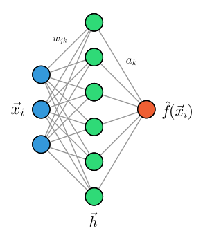

## Multi-Layer-Perzeptron

Die Flexibilität und Expressivität eines Single-Layer-Perzeptrons (SLP), also eines neuronalen Netzwerks mit nur 
einer versteckten Schicht, ist bereits erstaunlich aber dennoch begrenzt. Zwar können wir die Dimensionen der Eingabe, 
der Ausgabe und der versteckten Schicht beliebig wählen, jedoch müssen wir eine sehr große Anzahl an Neuronen in der 
versteckten Schicht verwenden, um eine Funktion beliebig genau approximieren. Dies führt zu einem hohen Rechenaufwand und 
einer schlechten Generalisierung auf unbekannte Daten. Eine vereinfachte schematische Darstellung eines SLP ist 
in der Abbildung unten dargestellt. Dabei ist die Summation der gewichteten Eingaben und die Aktivierungsfunktion 
in einem einzigen Schritt zusammengefasst.

<figure>
    

    
    <figcaption>Schematische Darstellung eines SLP.</figcaption>
    

</figure>

Die Verwendung des Begriffes *Schicht* lässt bereits vermuten, dass wir die Architektur eines neuronalen Netzwerks 
erweitern können, indem wir mehrere Schichten von Neuronen hintereinander schalten. Ein solches Netzwerk wird als 
Multi-Layer-Perzeptron (MLP) bezeichnet und ist in der Abbildung unten dargestellt. 

<figure>
    

    
    <figcaption>Schematische Darstellung eines MLP.</figcaption>
    

</figure>

Ein MLP besteht aus einer Eingabeschicht, welche die Eingabedaten $\vec{x}$ aufnimmt und $L$ versteckten Schichten, 
die jeweils aus $N_l$ Neuronen bestehen. Die einzelnen Schichten (*layers*) sind durch Gewichte $w_{ij}^{(l)}$ 
miteinander verbunden, wobei $l$ den Index der Schicht und $i$ und $j$ die Indizes der Neuronen in den jeweiligen 
Schichten bezeichnet. Da die Neuronen benachbarter Schichten vollständig miteinander verbunden sind, nennt man 
dieses Netzwerk auch *fully connected* oder *dense* Netzwerk. Die letzte Schicht des MLP ist die Ausgabeschicht, 
die die Vorhersage des Modells liefert.