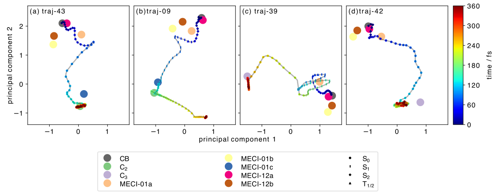
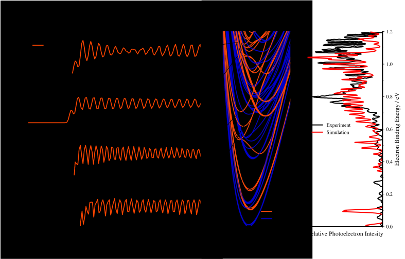

# Zusammenfassung und Ausblick

## Aktueller Stand des maschinellen Lernens in der Chemie

## Aktuelle Forschungsthemen in unserem Arbeitskreis

Im Folgenden möchten wir Ihnen einen Einblick in die aktuellen Forschungsthemen 
am Lehrstuhl für Theoretische Chemie geben. Dazu zählen die Arbeitskreise von 
Prof. Dr. Roland Mitrić und Dr. Merle Röhr. Zudem stellen wir Ihnen kurze 
Codebeispiele vor, die beispielhaft für die Forschungsthemen stehen und in denen 
Sie sicherlich einige der in diesem Kurs erlernten Konzepte wiedererkennen werden.

### Nicht-adiabadische Dynamik mit Trajectory Surface Hopping

Im Rahmen der Trajectory Surface Hopping Methode bewegen sich die Moleküle 
in einem $3N$-dimensionalen Konfigurationsraum, wobei $N$ die Anzahl der Atome
im Molekül ist. Selbst bei kleinen Molekülen ist dieser Konfigurationsraum
für Menschen nur schwer vorstellbar. Allerdings ist ein Großteil dieses 
Konfigurationsraums für die Dynamik
uninteressant, da sie wegen ihrer hohen Energie (z.B. durch sehr große
Bindungsabsände) für das Molekül nicht zugänglich sind. Das erlaubt
uns, Dimensionalitätsreduktionstechniken zu verwenden, um den 
hochdimensionalen Konfigurationsraum auf eine niedrigdimensionale
Darstellung zu projizieren, ohne dabei zu viele Informationen zu verlieren.
Im folgenden Codebeispiel wird die multidimensionale Skalierung (MDS)
verwendet, um eine niedrigdimensionale Darstellung des Konfigurationsraums
zu berechnen. 

```python
def perform_traj_mds(atnos, ref_coords, traj_coords, ndim=2, 
                     npi_pairs=None, dist_pairs=None, max_dist=None):
    nref = len(ref_coords)
    coords = np.concatenate((ref_coords, traj_coords))
    descriptors, weights = get_geom_descriptor(
        atnos, coords, 
        npi_pairs=NPI_PAIRS, dist_pairs=DIST_PAIRS, max_dist=MAX_DIST,
    )
    dissimilarities = get_desc_distmat(descriptors, weights)

    mds = MDS(
        n_components=ndim, dissimilarity='precomputed', random_state=42,
        n_init=32, max_iter=1000, eps=1e-4,
    )
    embedding = mds.fit_transform(dissimilarities)

    return embedding
```

Diese Technik wurde für die Untersuchung der Photodissoziationsdynamik
von Cyclobutanon eingesetzt.[^miao2024] Eine Darstellung von 
4 repräsentativen Trajektorien sind in der folgenden Abbildung zu sehen.



### Fragment-basierte Methoden für die Berechnung von angeregten Zuständen in großen molekularen Aggregaten

Die theoretische Beschreibung von dynamischen Prozessen, wie Exciton-Transfer oder 
Ladungstransfer, in organischen Halbleitern und komplexen molekularen System erfordert 
Methoden, die die Berechnung von großen molekularen Aggregaten ermöglichen, die aus 
tausenden Atomen bestehen. Um diese Problematik anzugehen, entwickelt unsere Gruppe 
neue theoretische Methoden, die solche großen molekularen Systeme beschreiben 
können. Dazu kombinieren wir semiempirische quantenchemische Methoden (DFTB) mit 
einem Fragmentierungsansatz (FMO) in einem neuen theoretischen Formalismus, der 
es erlaubt die angeregten Zustände von großen molekularen Aggregaten zu berechnen 
und die Molekulardynamik dieser angeregten Zustände zu simulieren.[^einsele2023],[^einsele2024]

```rust
// create the A matrix from the orbital energy differences, the Coulomb and the exchange contributions
let h: Array2<f64> = self.fock_and_coulomb() - self.exchange();
// solve the eigenvalue problem A x = w A using the eigenvalue decomposition
let (eigenvalues, eigenvectors) = h.eigh(UPLO::Upper).unwrap();

// Reference to the o-v transition charges.
let q_ov: ArrayView2<f64> = self.properties.q_ov().unwrap();

// The transition charges for all excited states are computed.
let q_trans: Array2<f64> = q_ov.dot(&eigenvectors);

// The Mulliken transition dipole moments are computed.
let tr_dipoles: Array2<f64> = mulliken_dipoles(q_trans.view(), &self.atoms);

// The oscillator strengths are computed.
let f: Array1<f64> = oscillator_strength(eigenvalues.view(), tr_dipoles.view());
```

### Luca Titel

Energietransport in excitonischen Materialien spielt eine große Rolle für die 
Anwendung in vielen optoelektronischen Systemen. Während in der Vergangenheit 
versucht wurden den Energietransport durch strukturelle Veränderung der verwendeten 
Moleküle zu verbessern, zielt meine Forschung darauf ab dies durch Kopplung der 
elektronischen Übergänge an starke elektromagnetische Felder zu erreichen, bspw. 
in Mikrokavitäten. Die Quasiteilchen, die in solchen Systemen entstehen, werden 
Polaritonen genannt. Genauer beschäftige ich mich mit der theoretischen Beschreibung 
von Polaritonen. Dazu müssen viele Konzepte aus dem Studium der theoretischen 
Chemie zum Einsatz gebracht werden und zusätzlich kombiniert werden mit Methoden 
der Quantenelektrodynamik. Um reale Systeme zu berechnen werden die entstehenden 
Gleichungen numerisch gelöst. (Ich muss ab und zu programmieren)

```python
system.build_system()
system.set_operators()
system.set_H() 
e, v = np.linalg.eigh(np.real(system.H))
coeff = np.dot(v.T, np.dot(system.a + system.a_dagger, v))
```

### Nikita titel

Der Forschungsbereich konzentriert sich auf kleine Metallcluster sowohl im Zeit- als 
auch im Energieraum (zeitabhängige und zeitunabhängige Prozesse). Ziel ist es, diese 
kleinen Metallcluster theoretisch so genau wie möglich zu beschreiben. Obwohl diese 
Cluster nur eine geringe Anzahl von Atomen enthalten, ist ihre Untersuchung aufgrund 
der komplizierten elektronischen Natur der d- und f-Schalen der Metalle sehr komplex. 
Diese Cluster sind besonders interessant, weil das Verständnis ihrer katalytischen 
Aktivität stark von theoretischen Studien profitieren könnte, die derzeit nicht in 
ausreichendem Maße verfügbar sind.

Dieses Code-Snippet stammt aus einem Programm, das die eindimensionale Schrödinger-Gleichung numerisch exakt löst. Diese Gleichung ist fundamental in der Quantenmechanik, insbesondere für das Verständnis von Zwei-Atom-Molekülen. 
 
```python
def getHamiltonian(self):
    # Initialisiert eine Hamilton-Matrix mit komplexen Nullen
    self.hamiltonian = np.zeros((dim, dim), dtype=complex)
    
    # Berechnet die Impulswerte pk
    pk = (2. * np.pi / (dim * self.deltax)) * (indrange - dim / 2.)
    
    # Berechnet den kinetischen Term tk
    tk = (pk**2) / (2.0 * self.m)
    
    # Berechnet den Exponentialterm W
    W = np.exp(2 * np.pi * 1.0j * indrange / dim)
    
    # Schleife durch jede Zeile i der Hamilton-Matrix
    for i in range(dim):
        # Berechnet die temporären Werte für die Fourier-Transformation
        tmp = tk * (W**i) * ((-1)**i)
        
        # Führt die Fourier-Transformation durch und aktualisiert die Hamilton-Matrix-Zeile
        self.hamiltonian[i,:] = oneminusone * np.fft.fft(tmp) / dim
```

Dieses Code-Snippet stammt aus einem Programm, das die eindimensionale Schrödinger-Gleichung numerisch exakt löst. Diese Gleichung ist fundamental in der Quantenmechanik, insbesondere für das Verständnis von Zwei-Atom-Molekülen. 
 
Der vorliegende Code hat die Aufgabe, eine Hamilton-Matrix (self.hamiltonian) zu konstruieren und eine Fourier-Transformation des kinetischen Teils durchzuführen, da dieser Operator im Impulsraum multiplikativ ist. Zunächst wird die Dimension des Grids (dim) ermittelt und eine komplexe Nullmatrix für den Hamiltonian (self.hamiltonian) initialisiert. Anschließend werden die Impulswerte (pk) berechnet und daraus der kinetische Term (tk) abgeleitet. Durch eine exponentielle Funktion (W) und eine Schleife über die Matrixzeilen wird der kinetische Term in den Impulsraum transformiert und mittels Fourier-Transformation (np.fft.fft) in die Hamilton-Matrix eingetragen. 

Abbildung: Theoretische Untersuchung von Ce2.
 
Links: Vergleich zwischen dem beobachteten NeNePo-Signal im Experiment und den theoretischen Simulationen (Zeitraum).
 
Mitte: Berechnete potentielle Energiekurven. Die hervorgehobenen Zustände stellen die identifizierten Zustände dar, die für das beobachtete Signal verantwortlich sind.
 
Rechts: Vergleich zwischen dem experimentellen Photoelektronenspektrum von Ce2- und dem simulierten Spektrum (Energieraum).




### Johannes Titel

```python
scaler = StandardScaler()
X = scaler.fit_transform(X)
pca = PCA(n_components=n_components)
pca.fit(X)
transformed_data = pca.transform(X)
explained_variance_ratios = np.array(pca.explained_variance_ratio_)
# Get the principal components
components = np.array(pca.components_)
kmeans = KMeans(n_clusters=n_clusters)
kmeans.fit(transformed_data)
labels = np.array(kmeans.labels_)
centroids = np.array(kmeans.cluster_centers_)
```

---


[^miao2024]: X. Miao, K. Diemer, R. Mitrić, *J. Chem. Phys.* **2024**, *160*, 124309.

[^einsele2023]: R. Einsele, J. Hoche, R. Mitrić, *J. Chem. Phys.* **2023**, *158*, 044121.

[^einsele2024]: R. Einsele, R. Mitrić, *arXiv:2404.14174v1*.