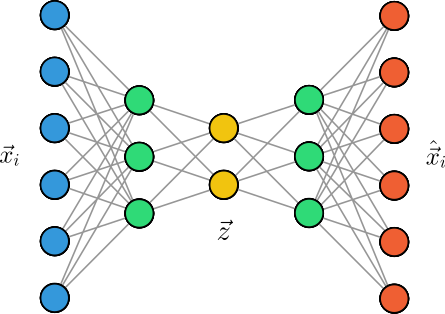
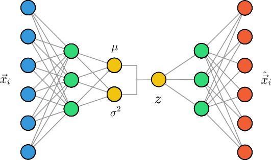
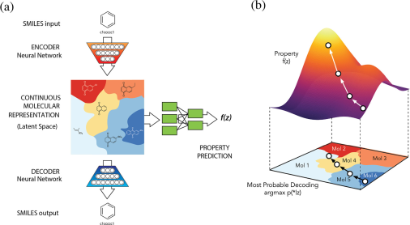
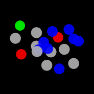
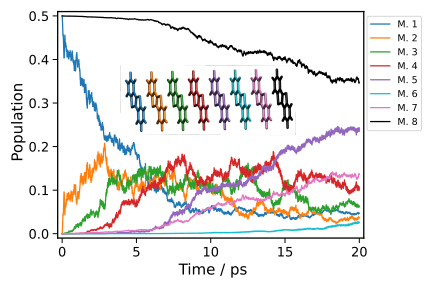
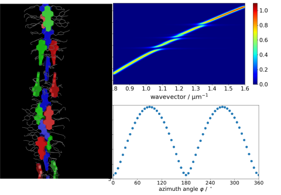
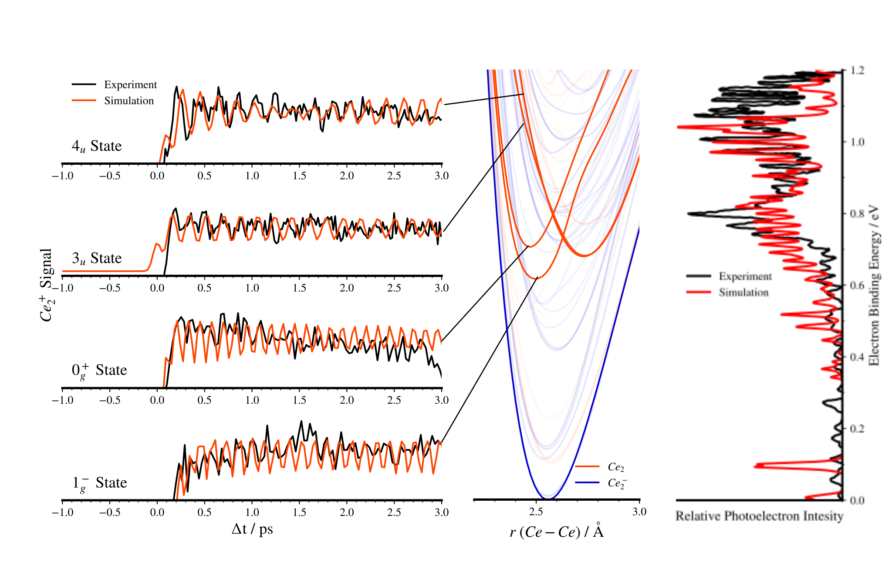
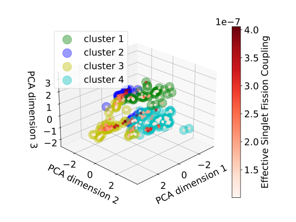

# Zusammenfassung und Ausblick

In diesem Kurs haben Sie neben den Grundlagen des Programmierens mit Python 
auch einige wichtige numerische Methoden, wie die Lösung von 
Differentialgleichungen oder die Fourier-Transformation, kennengelernt, 
sowie einen Einblick in das maschinelle Lernen erhalten.
Dazu zählen Methoden des überwachten und unüberwachten Lernens, sowie 
neuronale Netzwerke, wobei wir uns auf die Anwendung dieser Methoden in der Chemie 
konzentriert haben. Wir möchten dabei betonen, dass 
wir Ihnen in diesem Kurs nur einen kleinen Einblick in die behandelten 
Themen geben konnten. Mit Ihrem erworbenen Wissen und 
Fähigkeiten sind Sie jedoch durchaus in der Lage, auch komplexere 
Probleme zu lösen und eigene Projekte zu realisieren, wozu wir Sie 
ausdrücklich ermutigen. 

In der Chemie spielen maschinelle Lernverfahren eine immer 
wichtigere Rolle, da sie es ermöglichen, komplexe Zusammenhänge in großen 
Datenmengen zu erkennen und zu nutzen. Wir möchten Ihnen daher abschließend 
einen Einblick in den aktuellen Stand des maschinellen Lernens in der Chemie 
geben, sowie einige aktuelle Forschungsthemen aus unserem Arbeitskreis vorstellen.

## Aktueller Stand des maschinellen Lernens in der Chemie

Zunächst möchten wir eines der spannendsten Anwendungsgebiete des maschinellen Lernens 
(in der Chemie und allgemein) motivieren, der Generierung von neuen und unbekannten 
Daten (engl. *generative modeling*). Dies ist abzugrenzen von den bisherigen 
*diskriminativen* Methoden, die darauf abzielen, bekannte Daten zu klassifizieren 
oder zu regressieren. Generative Modelle hingegen erlauben es, neue Daten zu generieren, 
die den bekannten Daten ähneln, aber nicht notwendigerweise identisch sind.

### Variational Autoencoder (VAE)

Da dies ein Problem des unüberwachten Lernens ist, überlegen wir zunächst, wie 
wir neuronale Netzwerke für das unüberwachte Lernen, z.B. die Dimensionsreduktion 
einsetzen können. Erkennen wir die Flexibilität von neuronalen Netzwerken, so 
ist es naheliegend, einfach die Anzahl der Neuronen in der Ausgabeschicht zu 
reduzieren, um eine Dimensionsreduktion zu erreichen. Wir müssen uns jedoch 
bewusst sein, dass wir, um eine möglichst effiziente Dimensionsreduktion zu 
erreichen, eine Objektivfunktion definieren müssen. Eine Möglichkeit besteht darin, 
nach der Dimensionsreduktion die Daten wieder zu rekonstruieren. Solche 
Modelle werden als **Autoencoder** bezeichnet, da sie an ihrer *schmalsten* Stelle 
die wichtigsten Informationen über die Daten automatisch *enkodieren* müssen, um 
sie im Anschluss wieder *dekodieren* zu können (siehe Abbildung).



Die Verlustfunktion eines Autoencoders, die die Differenz zwischen den 
Eingabedaten $\vec{x}$ und den rekonstruierten Daten $\hat{\vec{x}}$
bestimmt, wird als *Rekonstruktionsfehler* bezeichnet:

$$
    \mathcal{L}_{\text{recon}}(\vec{x}, \hat{\vec{x}}) = \frac{1}{2} \sum_{i=1}^{N} \| \vec{x}_i - \hat{\vec{x}}_i \|^2.
$$

Wir können uns die komprierte Darstellung $\vec{z}$ der Daten als einen 
*versteckten Raum* (engl. *latent space*) vorstellen, der durch die 
schmalste Schicht des Autoencoders definiert wird. In der folgenden Abbildung 
ist dies für Bilder des MNIST-Datensatzes dargestellt, wobei wir erkennen, 
dass der Autoencoder die Daten gemäß ihrer Klassen gruppieren kann, obwohl 
er nicht explizit darauf trainiert wurde. 


Wie können wir diese Architektur nun nutzen, um neue Daten zu generieren? 
Ein naiver Ansatz wäre, einfach zufällige Werte für den versteckten Raum 
zu samplen und diese durch den Dekoder zu schicken. Dies führt jedoch 
zu keinen sinnvollen Ergebnissen, da der Autoencoder nicht explizit darauf 
trainiert wurde, dass der versteckte Raum eine sinnvolle Struktur aufweist. 
Wir benötigen also eine Form der Regularisierung, die sicherstellt, dass 
der versteckte Raum koninuierlich ist und das Generieren neuer Daten 
ermöglicht. Eine Möglichkeit besteht darin, die Verteilung der versteckten 
Variablen $p(\vec{z})$ so zu modellieren, dass sie einer bekannten und 
einheitlichen Verteilung, z.B. einer Normalverteilung, entspricht. Dazu 
enkodieren wir die Daten nicht direkt als latente Vektoren $\vec{z}$, sondern 
lernen stattdessen den Mittelwert $\vec{\mu}$ und die Varianz $\vec{\sigma}^2$ der 
Normalverteilung, die die versteckten Variablen beschreibt. Ein neuer 
Datenpunkt wird dann durch Sampling eines zufälligen latenten Vektors 
$\vec{z} \sim \mathcal{N}(\vec{\mu}, \vec{\sigma}^2)$ und Dekodierung durch den 
Dekoder generiert. Dieses Modell 
wird als **Variational Autoencoder** (VAE) bezeichnet (siehe Abbildung).



Die Parameter des VAE (Gewichte und Bias der neuronalen Netze) werden 
dann durch Minimierung der Verlustfunktion

$$
    \mathcal{L}(\vec{x}, \hat{\vec{x}}) = \mathcal{L}_{\text{recon}} + \mathcal{L}_{\text{KL}}.
$$

optimiert, die aus zwei Teilen besteht. Der erste Teil ist der 
Rekonstruktionsfehler, analog zum Autoencoder. Der 
zweite Teil misst die Ähnlichkeit zwischen der Verteilung der versteckten 
Variablen $p(\vec{z})$ und der gewünschten  Normalverteilung, was in der Regel durch die
*Kullback-Leibler-Divergenz* (KL-Divergenz) dargestellt wird.
Dadurch erreichen wir, dass der versteckte Raum eine sinnvolle Struktur 
annimmt, was in der folgenden Abbildung für den MNIST-Datensatz dargestellt ist.


Da die Generierung von schwarz-weißen Bilder von Ziffern ein 
zugegebenermaßen langweiliges Beispiel darstellt, haben wir einen (einfachen) 
VAE auf dem [CelebA-Datensatz](http://mmlab.ie.cuhk.edu.hk/projects/CelebA.html)
trainiert, der ca. 200.000 Bilder von prominenten Persönlichkeiten 
enthält. In der folgenden Abbildung sehen Sie oben einige Beispiele von 
Bildern aus dem Datensatz und die im Trainingsprozess rekonstruierten Bilder. 
Unten sehen Sie einige Beispiele von zufällig generierten Bildern, die 
durch den VAE erzeugt wurden.


VAEs sind eines der ersten generativen Modelle, die neben der Generierung 
von Bildern auch für die Generierung neuer Moleküle eingesetzt wurden. 
Die Struktur des versteckten Raums erlaubt es, eine kontinuierliche 
Repräsentation von Molekülen zu erlernen, die es ermöglicht, neue Moleküle 
zu generieren.[^bombarelli2018] 

<!--  -->

```admonish warning title="Pytorch und automatische Differenzierung"
Auch wenn wir mit unserer eigenen Implementierungen von neuronalen Netzen 
in diesem Kurs theoretisch in der Lage wären, einen (variational) Autoencoder 
zu konstruieren und trainieren, ist dies doch sehr ineffizient und umständlich. 
Das liegt insbesondere daran, dass wir die Gradienten der Verlustfunktionen manuell 
berechnen müssten, was sehr zeitaufwändig ist. 

In der Praxis verwendet man daher spezielle Bibliotheken, wie z.B. 
[Pytorch](https://pytorch.org/), die es erlauben, Gradienten von 
allgemeinen Funktionen automatisch zu berechnen. In Pytorch wird dazu 
ein Rechengraph erstellt, der die Abhängigkeiten der Variablen und 
Funktionen darstellt. Die Bibliothek kann dann automatisch die 
Gradienten von beliebigen Funktionen berechnen, indem sie den 
Rechengraphen rückwärts durchläuft.

Sie können die Implementierung des oben gezeigten Modells in Pytorch 
<a href="./codes/07-summary/vae_celeba.py" download>hier</a> 
herunterladen und auf Ihrem eigenen Rechner ausführen.

**Achtung**: Wir empfehlen Ihnen, Python-Pakete wie Pytorch, die 
viele Abhängigkeiten von anderen Paketen haben, **nicht in Ihrer 
`base`-Umgebung** zu installieren, sondern stattdessen 
[eine separate Umgebung](https://conda.io/projects/conda/en/latest/user-guide/tasks/manage-environments.html#activating-an-environment) 
zu erstellen.
```

### Diffusionsmodelle

Auch wenn VAEs in der Lage sind, versteckte Strukturen in den Daten zu 
lernen und neue Daten zu generieren, sind sie für der Generierung von 
hochqualitativen und realistischen Daten nicht optimal geeignet. Für [sehr 
detailreiche Bilder](https://thispersondoesnotexist.com) eignen sich z.B.
*Generative Adversarial Networks* (GANs), die allerdings auch ihre eigenen 
Schwächen haben. Als besonders vielversprechend haben sich in den letzten 
Jahren **Diffusionsmodelle** (eng. *diffusion models*) herausgestellt, die auf Prinzipien der 
statistischen Physik basieren. Die grundlegende Idee ist ähnlich zu VAEs, 
nämlich eine latente Darstellung der Daten zu nutzen, die einfach zu 
erlernen ist und die es erlaubt, neue Daten zu generieren. Anstatt jedoch die 
Dimensionalität der Daten zu verringern, fügt man in kleinen Schritten 
zufälliges Rauschen $\epsilon_t$ zu den Daten hinzu, 
bis die Struktur der Daten nicht mehr erkennbar 
ist. Für jeden Schritt kann dann ein neuronales Netzwerk $\epsilon_{\theta}(t)$ 
trainiert werden, welches das im *Diffusionsprozess* hinzugefügte Rauschen vorhersagt. 
Die zugrundeliegende Verlustfunktion 

$$
    \mathcal{L} = \mathbb{E}_t [ \| \epsilon_t - \epsilon_{\theta}(t) \|^2 ]
$$

ist dann denkbar einfach, was die Effektivität des Modells unterstreicht. 
Im umgekehrten Diffusionsprozess kann dann das Rauschen schrittweise entfernt werden, um 
eine verbesserte Version der Daten zu erhalten. Neue Daten können generiert werden, 
indem ausgehend von einem zufälligen Rauschen schrittweise das Rauschen 
entfernt wird, bis ein neuer Datenpunkt generiert wurde, der den Trainingsdaten 
ähnelt. Zudem erlauben Sie es, zusätzliche Informationen, wie z.B. 
eine Beschreibung des gewünschten Objekts auf einem Bild, in den Prozess zu integrieren.

Diffusionsmodelle sind heutzutage die Grundlage für die meisten kommerziell oder 
frei verfügbaren Modelle zur Generierung von Bildern, wie z.B. *Stable Diffusion*, 
*DALL-E* oder *Imagen*. In letzter Zeit wurden sie auch für die Generierung 
von Molekülen eingesetzt, wobei sie die Atomtypen und -positionen in einem 
Molekül vorhersagen. Ein solcher Generierungsprozess, der aus einer zufälligen 
Verteilung ein Molekül generiert, ist in der folgenden Animation dargestellt.

<figure>
    <center>
    
    </center>
</figure>


## Aktuelle Forschungsthemen in unserem Arbeitskreis

Im Folgenden möchten wir Ihnen einen Einblick in die aktuellen Forschungsthemen 
am Lehrstuhl für Theoretische Chemie geben. Dazu zählen die Arbeitskreise von 
Prof. Dr. Roland Mitrić und Dr. Merle Röhr. Zudem stellen wir Ihnen kurze 
Codebeispiele vor (Python und andere Programmiersprachen), die beispielhaft 
für die Forschungsthemen stehen und in denen 
Sie sicherlich einige der in diesem Kurs erlernten Konzepte wiedererkennen werden.

### Nicht-adiabadische Dynamik mit Trajectory Surface Hopping

Im Rahmen der Trajectory Surface Hopping Methode bewegen sich die Moleküle 
in einem $3N$-dimensionalen Konfigurationsraum, wobei $N$ die Anzahl der Atome
im Molekül ist. Selbst bei kleinen Molekülen ist dieser Konfigurationsraum
für Menschen nur schwer vorstellbar. Allerdings ist ein Großteil dieses 
Konfigurationsraums für die Dynamik
uninteressant, da sie wegen ihrer hohen Energie (z.B. durch sehr große
Bindungsabsände) für das Molekül nicht zugänglich sind. Das erlaubt
uns, Dimensionalitätsreduktionstechniken zu verwenden, um den 
hochdimensionalen Konfigurationsraum auf eine niedrigdimensionale
Darstellung zu projizieren, ohne dabei zu viele Informationen zu verlieren.
Im folgenden Codebeispiel wird die multidimensionale Skalierung (MDS)
verwendet, um eine niedrigdimensionale Darstellung des Konfigurationsraums
zu berechnen. 

```python
def perform_traj_mds(atnos, ref_coords, traj_coords, ndim=2, 
                     npi_pairs=None, dist_pairs=None, max_dist=None):
    nref = len(ref_coords)
    coords = np.concatenate((ref_coords, traj_coords))
    descriptors, weights = get_geom_descriptor(
        atnos, coords, 
        npi_pairs=NPI_PAIRS, dist_pairs=DIST_PAIRS, max_dist=MAX_DIST,
    )
    dissimilarities = get_desc_distmat(descriptors, weights)

    mds = MDS(
        n_components=ndim, dissimilarity='precomputed', random_state=42,
        n_init=32, max_iter=1000, eps=1e-4,
    )
    embedding = mds.fit_transform(dissimilarities)

    return embedding
```

Diese Technik wurde für die Untersuchung der Photodissoziationsdynamik
von Cyclobutanon eingesetzt.[^miao2024] Eine Darstellung von 
4 repräsentativen Trajektorien sind in der folgenden Abbildung zu sehen.


### Fragment-basierte Methoden für die Berechnung von angeregten Zuständen in großen molekularen Aggregaten

Die theoretische Beschreibung von dynamischen Prozessen, wie Exciton-Transfer 
oder Ladungstransfer, in organischen Halbleitern und komplexen molekularen 
System erfordert Methoden, die die Berechnung von großen molekularen 
Aggregaten ermöglichen, die aus tausenden Atomen bestehen. Die 
"traditionellen" quantenchemische Methoden, wie z.B. Hartree-Fock oder
Dichtefunktionaltheorie, sind aufgrund ihrer starken Skalierung mit der
Systemgröße nicht in der Lage, solche Systeme in angemessener Zeit zu
berechnen. Um diese Problematik anzugehen, entwickelt unsere Gruppe 
neue theoretische Methoden, die solche großen molekularen Systeme beschreiben 
können. Dazu kombinieren wir semiempirische quantenchemische Methoden (DFTB) 
mit einem Fragmentierungsansatz (FMO) in einem neuen theoretischen 
Formalismus, der es erlaubt die angeregten Zustände von großen molekularen 
Aggregaten zu berechnen und die Molekulardynamik dieser angeregten Zustände 
zu simulieren.[^einsele2023]<sup>,</sup>[^einsele2024]

```rust
// create the A matrix from the orbital energy differences, 
// the Coulomb and the exchange contributions
let h: Array2<f64> = self.fock_and_coulomb() - self.exchange();
// solve the eigenvalue problem A x = w A using the eigenvalue decomposition
let (eigenvalues, eigenvectors) = h.eigh(UPLO::Upper).unwrap();
// Reference to the o-v transition charges.
let q_ov: ArrayView2<f64> = self.properties.q_ov().unwrap();
// The transition charges for all excited states are computed.
let q_trans: Array2<f64> = q_ov.dot(&eigenvectors);
// The Mulliken transition dipole moments are computed.
let tr_dipoles: Array2<f64> = mulliken_dipoles(q_trans.view(), &self.atoms);
// The oscillator strengths are computed.
let f: Array1<f64> = oscillator_strength(eigenvalues.view(), tr_dipoles.view());
```



Abbildung der Ladungstransferdynamik in einem Molekularen System aus 8 BTBT Monomeren. 
Die Population der Monomere beschreibt den Anteil der elektronischen Anregung, der 
sich auf den jeweiligen Monomeren befindet. Am Anfang der Dynamik befindet sich das 
System im Ladungstransferzustand zwischen dem ersten und dem letzten Monomer 
(Loch auf Monomer 1 und Elektron auf Monomer 8), weshalb die Population auf den 
Monomeren 50% beträgt. Im weiteren Verlauf der Ladungstransferdynamik bewegt sich 
die Anregung im molekularen Aggregat langsam vom ersten Monomer in Richtung des 
letzten Monomers, weil es sich bei diesem Molekül um einen Lochleiter handelt. 

### Simulation von stark gekoppelten Licht-Materie-Systemen

Energietransport in excitonischen Materialien spielt eine große Rolle für die 
Anwendung in vielen optoelektronischen Systemen. Während in der Vergangenheit 
versucht wurden, den Energietransport durch strukturelle Veränderung der verwendeten 
Moleküle zu verbessern, zielt ein Forschungsschwerpunkt unseres Arbeitskreises 
darauf ab, dies durch Kopplung der 
elektronischen Übergänge an starke elektromagnetische Felder zu erreichen, bspw. 
in Mikrokavitäten. Die Quasiteilchen, die in solchen Systemen entstehen, werden 
Polaritonen genannt. Genauer beschäftigen wir uns mit der theoretischen Beschreibung
von Polaritonen. Dazu müssen viele Konzepte aus dem Studium der theoretischen 
Chemie zum Einsatz gebracht werden und zusätzlich kombiniert werden mit Methoden 
der Quantenelektrodynamik. Um reale Systeme zu berechnen, werden die entstehenden 
Gleichungen numerisch gelöst.

```python
system.build_system()
system.set_operators()
system.set_H() 
e, v = np.linalg.eigh(np.real(system.H))
coeff = np.dot(v.T, np.dot(system.a + system.a_dagger, v))
```


Unten rechts: Abhängigkeit der Licht-Materie-Kopplung von der relativen Orientierung 
zwischen der elektrischen Feldstärke des Oberflächenplasmons und dem 
Übergangsdipolmoment des energetisch tiefsten elektronisch angeregten Zustands 
der Helix. Links: Dreisträngige helikale Struktur des supramolekularen 
Perylenbisimid-Aggregats. Oben rechts: Simulierte Dispersionsrelation der Polaritonen 
bei maximaler Licht-Materie-Kopplung.

### Theoretische Untersuchung von kleinen Metallclustern

Dieser Forschungsbereich konzentriert sich auf kleine Metallcluster 
sowohl im Zeit- als 
auch im Energieraum (zeitabhängige und zeitunabhängige Prozesse). Ziel ist es, diese 
kleinen Metallcluster theoretisch so genau wie möglich zu beschreiben. Obwohl diese 
Cluster nur eine geringe Anzahl von Atomen enthalten, ist ihre Untersuchung aufgrund 
der komplizierten elektronischen Natur der d- und f-Schalen der Metalle sehr komplex. 
Diese Cluster sind besonders interessant, weil das Verständnis ihrer katalytischen 
Aktivität stark von theoretischen Studien profitieren könnte, die derzeit nicht in 
ausreichendem Maße verfügbar sind.

Dieses Code-Snippet stammt aus einem Programm, das die eindimensionale Schrödinger-Gleichung 
numerisch exakt löst. Diese Gleichung ist fundamental in der Quantenmechanik, insbesondere 
für das Verständnis von zweiatomigen Molekülen. 
 
```python
def getHamiltonian(self):
    # Initialisiert eine Hamilton-Matrix mit komplexen Nullen
    self.hamiltonian = np.zeros((dim, dim), dtype=complex)
    
    # Berechnet die Impulswerte pk
    pk = (2. * np.pi / (dim * self.deltax)) * (indrange - dim / 2.)
    
    # Berechnet den kinetischen Term tk
    tk = (pk**2) / (2.0 * self.m)
    
    # Berechnet den Exponentialterm W
    W = np.exp(2 * np.pi * 1.0j * indrange / dim)
    
    # Schleife durch jede Zeile i der Hamilton-Matrix
    for i in range(dim):
        # Berechnet die temporären Werte für die Fourier-Transformation
        tmp = tk * (W**i) * ((-1)**i)
        
        # Führt die Fourier-Transformation durch und aktualisiert die Hamilton-Matrix-Zeile
        self.hamiltonian[i,:] = oneminusone * np.fft.fft(tmp) / dim
```

Der vorliegende Code hat die Aufgabe, eine Hamilton-Matrix (`self.hamiltonian`)
zu konstruieren und eine Fourier-Transformation des kinetischen Teils 
durchzuführen, da dieser Operator im Impulsraum multiplikativ ist. Zunächst 
wird die Dimension des Grids (`dim`) ermittelt und eine komplexe Nullmatrix 
für den Hamiltonian (`self.hamiltonian`) initialisiert. Anschließend werden 
die Impulswerte (`pk`) berechnet und daraus der kinetische Term (`tk`) abgeleitet. 
Durch eine exponentielle Funktion (`W`) und eine Schleife über die Matrixzeilen 
wird der kinetische Term in den Impulsraum transformiert und mittels 
Fourier-Transformation (`np.fft.fft`) in die Hamilton-Matrix eingetragen. 



Abbildung: Theoretische Untersuchung von Ce<sub>2</sub>. 
Links: Vergleich zwischen dem beobachteten NeNePo-Signal im Experiment 
und den theoretischen Simulationen (Zeitraum).
Mitte: Berechnete potentielle Energiekurven. Die hervorgehobenen Zustände 
stellen die identifizierten Zustände dar, die für das beobachtete Signal 
verantwortlich sind.
Rechts: Vergleich zwischen dem experimentellen Photoelektronenspektrum von 
Ce<sub>2</sub> und dem simulierten Spektrum (Energieraum).


### Optimierung von Dimeren für Singlet Fission

In der Arbeitsgruppe Röhr beschäftigen wir uns mit der Optimierung bestimmter 
Eigenschaften molekularer Aggregate. So hängen bestimmte Eigenschaften stark 
von der Anordnung der einzelnen Moleküle ab. Ein besonders interessantes Phänomen, 
mit dem wir uns beschäftigen, ist Singlet Fission. Dabei handelt es sich um 
einen Prozess in bestimmten organischen Molekülen, bei dem ein einzelnes 
angeregtes Singlet Exciton in zwei Triplett-Excitonen zerfällt. Dieser Prozess 
könnte theoretisch den Wirkungsgrad von Solarzellen erhöhen, da ein einzelnes 
Photon zwei Elektronen-Loch-Paare anregen kann. Unser Ziel ist es, eine 
Molekülanordnung zu finden, die diesen Singlet Fission sehr schnell durchführt. 
Solche Molekülanordnungen könnten dann in Solarzellen integriert werden, um 
deren Wirkungsgrad zu erhöhen.

```python
scaler = StandardScaler()
X = scaler.fit_transform(X)
pca = PCA(n_components=n_components)
pca.fit(X)
transformed_data = pca.transform(X)
explained_variance_ratios = np.array(pca.explained_variance_ratio_)
# Get the principal components
components = np.array(pca.components_)
kmeans = KMeans(n_clusters=n_clusters)
kmeans.fit(transformed_data)
labels = np.array(kmeans.labels_)
centroids = np.array(kmeans.cluster_centers_)
```

In diesem Forschungsprojekt wurden zufällige PBI-Dimere konstruiert, diese 
hinsichtlich der sogenannten Singlet Fission-Rate optimiert und aus den 
optimierten Dimerstrukturen unter anderem Translation und Rotation extrahiert. 
Anschließend wurde mittels PCA und K-Means-Clustering nach Gemeinsamkeiten in 
den 500 Strukturen gesucht. Auf diese Weise konnten vier sehr charakteristische 
Gruppen von Dimeren identifiziert werden.[^greiner2024]



### Supramolekulare Aggregate des Lichtsammelkomplexes der grünen Schwefelbakterien

Mein Forschungsbereich konzentriert sich auf die Strukturaufklärung von Aggregaten, die in 
grünen Schwefelbakterien vorkommen. Diese Bakterien sind bemerkenswert für ihre Fähigkeit, 
in extremen Lichtverhältnissen Photosynthese zu betreiben, wobei sie spezielle 
Lichtsammelkomplexe, sogenannte Chlorosomen, nutzen. Diese Chlorosomen bestehen aus dicht 
gepackten Bacteriochlorophyll-Molekülen, die außergewöhnlich effiziente Energietransferprozesse 
aufweisen. Diese Aggregate bestehen oft aus mehreren konzentrischen Ringen, die eine 
zylindrische Form zeigen (siehe Abbildung).


Der Code Ausschnitt zeigt eine Implementierung des Frenkel-Exziton-Hamiltonian, der die 
Wechselwirkungen zwischen den Übergangsdipolmomenten der einzelenen Moleküle im Aggregat 
einbezieht. Damit kann ein Spektrum des Aggregates simuliert werden und dieses mit experimentellen 
Daten verglichen werden.

```python
def getExcitonHamiltonian(self):
        nmol = len(self.allMolecules)
        self.hamiltonian = np.zeros((nmol, nmol))
        for i, m in enumerate(self.allMolecules):
            self.hamiltonian[i, i] = m.siteEnergy
        # convert units! a.u/Angstrom --> eV/a.u
        self.hamiltonian += self.getExcitonCoupling() * toang * toev

    # create exciton states for aggregate
    def getExcitonStates(self):
        print("First step: Calculate hamiltonian.")
        self.getExcitonHamiltonian()
        print("Second step: Solve hamiltonian.")
        self.excitonStateEnergies, self.excitonStateCoefficients = np.linalg.eigh(self.hamiltonian)
        self.getSiteDipoles()
        self.tdMoments = []
        print("Third step: tdMoments.")
        self.tdMoments = np.dot(np.transpose(self.excitonStateCoefficients), self.dipoles)
        np.save("td", self.tdMoments)
        np.save("excitonStates", self.excitonStateEnergies)
```


---

[^bombarelli2018]: R. Bombarelli, et al., *ACS Cent. Sci.* **2018**, *4*, 2, 268–276.

[^miao2024]: X. Miao, K. Diemer, R. Mitrić, *J. Chem. Phys.* **2024**, *160*, 124309.

[^einsele2023]: R. Einsele, J. Hoche, R. Mitrić, *J. Chem. Phys.* **2023**, *158*, 044121.

[^einsele2024]: R. Einsele, R. Mitrić, *J. Comput. Theor. Chem.* **2024**, just accepted.

[^greiner2024]: J. Greiner, A. Singh, M.I.S. Röhr, *Phys. Chem. Chem. Phys.* **2024**, *26*, 19257-19265.

---

### Klausurvorbereitung

Die folgenden Aufgaben sollen Ihnen dabei helfen, sich auf die Klausur vorzubereiten. 
Die Aufgaben sind so gewählt, dass sie den Prüfungsfragen ähneln und Themen aus 
den Übungen und Vorlesungen abdecken.

#### Aufgabe 1: Code-Snippets

{{#include ./psets/exam_preparation.md:aufgabe_1}}

#### Aufgabe 2: Euler-Verfahren

{{#include ./psets/exam_preparation.md:aufgabe_2}}

#### Aufgabe 3: $k$-Nearest Neighbors

{{#include ./psets/exam_preparation.md:aufgabe_3}}
