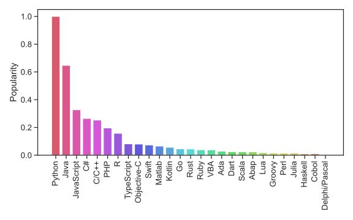

# Warum Python?

**WARNING: Translate and adapt!**

#### Popularity
Python is one of the most widely used programming languages and is particularly beginner-friendly.
The following figure shows the popularity of some programming languages. 

*Popularity of common programming languages. The popularities are taken
from the [PYPL index](https://pypl.github.io/PYPL.html)*

#### Requires often fewer lines of code and less work
Python often requires significantly fewer lines of code to implement 
the same algorithms than compiled languages such as Java or C/C++. 

*Program length, measured in number of noncomment source lines of code 
(LOC).*

Moreover, it is often possible to accomplish the same task in significantly 
less time in a scripting language than it takes using a compiled language. 


#### But Python is slow!?

A common argument that is raised against using Python is that it is a 
comparatively slow language. 
There is some truth to this statement. 
Therefore, we want to understand one of the reasons why this is so 
and then explain why (in most cases) this is not a problem for us. 

##### Python is an interpreted language. 
Python itself is a C program that reads the source code of a text file,
interprets it and executes it. This is in contrast to a compiled
language like C, C++, Rust, etc. where the source code is compiled to machine
code. The compiler has the ability to do lots of optimizations to the
code which leads to a shorter runtime. 
This behavior can be shown by a simple example. Let's assume we have a
na&iuml;ve implementation to sum up all odd numbers up to 100 million:
```python
s = 0
for i in range(100_000_000):
    if i % 2 == 1:
        s += i
```
This code takes about 8 seconds on my computer (M1 mac) to execute. 
Now we can implement the same algorithm in a compiled language to see
the impact of the compiler. The following listing is written in 
a compiled language (Rust),
but the details of this code and the programming language do not matter
at this point: 

```rust,no_run,no_playground
let mut s: usize = 0;
for i in 0..100_000_000 {
    if i % 2 == 1 {
        s += i;
    }
}
```
This code has actually no runtime at all and evaluates instantaneously. 
The compiler is smart enough to understand that everything can be
computed at compile time and just inserts the value for the variable
`s`. This now makes it clear that compiled languages can make use of
methods that interpreted languages lack simply by virtue of their
approach. However, we have seen before that compiled languages usually
require more lines of code and more work. In addition, there are usually
much more concepts to learn. 

##### Python can be very performant 

During this lecture we will often
use Python libraries like NumPy or Scipy for mathematical algorithms and
linear algebra in particular. These packages bring two big advantages.
On the one hand they allow the use of complicated algorithms very easily and
on the other hand these packages are written in compiled languages like
C or Fortran. This way we can benefit from the performance advantages
without having to learn another possibly more complicated language. 

