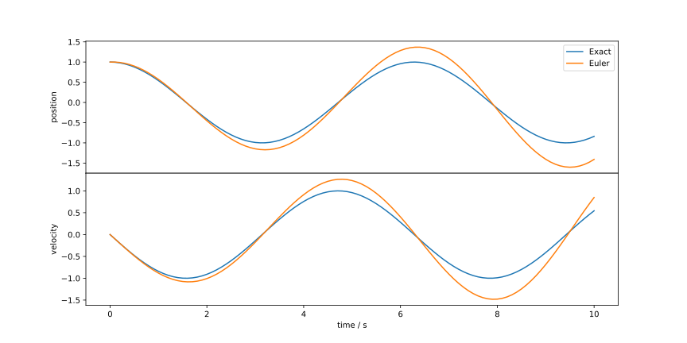
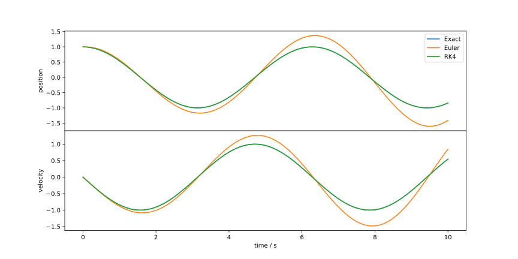
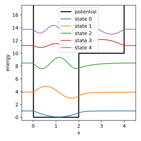
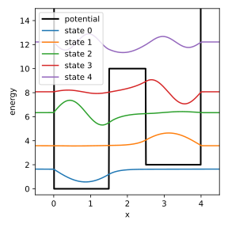
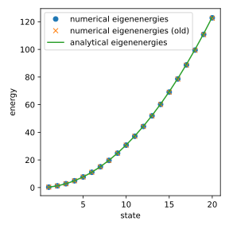

# Problem Set 2

## Problem 1 [Homework]: Classical Harmonic Oscillator I

<!--- ANCHOR: aufgabe_1 --->
The equation of motion of a harmonic oscillator is given by the second-order differential equation
$$
\begin{equation}
    \frac{\du^2 x}{\du t^2} = -\omega^2 x\,,
\end{equation}
$$
where $\omega = \sqrt{k / \mu}$. To solve this equation using the Euler method, we first need to transform it into a system of first-order differential equations.

**(a) Transformation into a system of first-order differential equations**

Show that the above differential equation can be transformed into the system of coupled first-order differential equations
$$
\begin{align}
    \frac{\du x}{\du t} &= v \\
    \frac{\du v}{\du t} &= -\omega^2 x
\end{align}
$$
by using the substitution $v = \frac{\du x}{\du t}$.


**Solution:**

We are given the second-order differential equation:
$$
\frac{\du^2 x}{\du t^2} = -\omega^2 x
$$
We introduce the substitution $v = \frac{\du x}{\du t}$. This is our first first-order differential equation:
$$
\frac{\du x}{\du t} = v
$$
Now, we need to find an expression for $\frac{\du v}{\du t}$. We can differentiate our substitution $v = \frac{\du x}{\du t}$ with respect to $t$:
$$
\frac{\du v}{\du t} = \frac{\du}{\du t} \left( \frac{\du x}{\du t} \right) = \frac{\du^2 x}{\du t^2}
$$
From the original second-order differential equation, we know that $\frac{\du^2 x}{\du t^2} = -\omega^2 x$.
Substituting this into the expression for $\frac{\du v}{\du t}$, we get our second first-order differential equation:
$$
\frac{\du v}{\du t} = -\omega^2 x
$$
Thus, the system of coupled first-order differential equations is:
$$
\begin{align}
    \frac{\du x}{\du t} &= v \\
    \frac{\du v}{\du t} &= -\omega^2 x
\end{align}
$$


**(b) Implementation of the Euler method**

Implement the Euler method to solve the system of first-order differential equations from part (a). Follow the approach from the lecture by implementing the functions `dfdt`, which computes the right-hand side of the differential equations, `euler_step`, which performs one step of the Euler method, and `euler_method`, which executes the Euler method for a given number of steps.

```admonish tip title="Tip"
Similar to the kinetics of the BZ reaction, the solution of the harmonic oscillator has two components, $x(t)$ and $v(t)$, whose derivatives can be stored in an array `[dxdt, dvdt]`.
```

**Solution:**
```python
{{#include ../codes/02-differential_equations/exercise_02.py:exercise_01_b}}
```

**(c) Derivation of the analytical solution**

Show that the analytical solution of the equation of motion of the harmonic oscillator with initial conditions $x(0) = x_0$ and $v(0) = v_0$ is given by
$$
\begin{align}
    x(t) = & \frac{v_0}{\omega} \sin(\omega t) + x_0 \cos(\omega t) \\
    v(t) = & v_0 \cos(\omega t) - x_0 \omega \sin(\omega t)\,.
\end{align}
$$
You can use the Ansatz $x(t) = A \sin(\omega t) + B \cos(\omega t)$.

Plot the analytical solution and the numerical solution of the Euler method for the initial conditions $x_0 = 1$, $v_0 = 0$, $\omega = 1$ with a step size of $\du t = 0.1$ for $t \in [0, 10]$. What do you observe?


**Solution:**

We are given the Ansatz for the solution $x(t)$:
$$
x(t) = A \sin(\omega t) + B \cos(\omega t)
$$
We need to find the velocity $v(t)$ by differentiating $x(t)$ with respect to $t$:
$$
v(t) = \frac{\du x}{\du t} = \frac{\du}{\du t} (A \sin(\omega t) + B \cos(\omega t))
$$
$$
v(t) = A \omega \cos(\omega t) - B \omega \sin(\omega t)
$$
Now we apply the initial conditions: $x(0) = x_0$ and $v(0) = v_0$.

For $x(t)$:
$$
x(0) = A \sin(\omega \cdot 0) + B \cos(\omega \cdot 0)
$$
$$
x_0 = A \sin(0) + B \cos(0)
$$
$$
x_0 = A \cdot 0 + B \cdot 1
$$
$$
x_0 = B
$$
So, we find that $B = x_0$.

For $v(t)$:
$$
v(0) = A \omega \cos(\omega \cdot 0) - B \omega \sin(\omega \cdot 0)
$$
$$
v_0 = A \omega \cos(0) - B \omega \sin(0)
$$
$$
v_0 = A \omega \cdot 1 - B \omega \cdot 0
$$
$$
v_0 = A \omega
$$
So, we find that $A = \frac{v_0}{\omega}$.

Now, substitute the expressions for $A$ and $B$ back into the equations for $x(t)$ and $v(t)$:

For $x(t)$:
$$
x(t) = \left(\frac{v_0}{\omega}\right) \sin(\omega t) + (x_0) \cos(\omega t)
$$
$$
x(t) = \frac{v_0}{\omega} \sin(\omega t) + x_0 \cos(\omega t)
$$
For $v(t)$:
$$
v(t) = \left(\frac{v_0}{\omega}\right) \omega \cos(\omega t) - (x_0) \omega \sin(\omega t)
$$
$$
v(t) = v_0 \cos(\omega t) - x_0 \omega \sin(\omega t)
$$ 


```python
{{#include ../codes/02-differential_equations/exercise_02.py:exercise_01_c}}
```




<!--- ANCHOR_END: aufgabe_1 --->

## Problem 2: Classical Harmonic Oscillator II

The Euler method can be applied to the equation of motion of the harmonic oscillator, but it is not very accurate. We could reduce the step size $\du t$ to improve the accuracy, but we will now test how the classical Runge-Kutta method of order 4 (RK4) compares to the Euler method.

Implement the classical Runge-Kutta method of order 4 using the following Butcher tableau
$$
  \begin{array}{c|cccc}
    0 & 0 & 0 & 0 & 0 \\
    1/2 & 1/2 & 0 & 0 & 0 \\
    1/2 & 0 & 1/2 & 0 & 0 \\
    1 & 0 & 0 & 1 & 0 \\ \hline
      & 1/6 & 1/3 & 1/3 & 1/6
  \end{array}
$$
and solve the system of differential equations of the classical harmonic oscillator from the previous problem with the parameter $\omega = 1$, the initial conditions $x_0 = 1$, $v_0 = 0$, and a step size of $\du t = 0.1$ for $t \in [0, 10]$. Plot the numerical solution and compare it with the solution of the Euler method, as well as the analytical solution.

**Solution:**
```python
{{#include ../codes/02-differential_equations/exercise_02.py:exercise_02}}
```



<!--- ANCHOR_END: aufgabe_2 --->


## Problem 3: Particle in a Box


In the lecture, we applied the finite difference method to solve the
Schrödinger equation for a quantum harmonic oscillator. In this exercise, we will
use it to investigate the particle in a box model, but with a twist.

**(a) Solution of the Schrödinger equation for a particle in a box**

The potential energy of a particle in a box is given by
$$
\begin{equation}
    V(x) = \begin{cases}
        0 & \text{for } 0 < x < L \\
        \infty & \text{otherwise}
    \end{cases}
\end{equation}
$$
where $L$ is the length of the box. 

Apply the finite difference method to solve the time-independent
Schrödinger equation for a particle in a box with $L = 4$.
Use a uniform grid with $N = 512$ points from $x = -0.5$ to $x = 4.5$.

Compare the numerical eigenenergies of the first 20 states with the analytical
eigenenergies.

```admonish tip title="Hint"
Since infinity is not a number, you can set the potential to a very large value,
e.g. $V(x) = 10000$ for $x < 0$ and $x > L$.
```

**Solution:**
```python
{{#include ../codes/02-differential_equations/exercise_02.py:exercise_03_a}}
```


**(b) Particle in a box with a step potential**

Now we will add a step potential to the box. The potential energy is given by
$$
\begin{equation}
    V(x) = \begin{cases}
        0 & \text{for } 0 < x < a \\
        V_a & \text{for } a < x < L \\
        \infty & \text{otherwise}
    \end{cases}\,.
\end{equation}
$$

Apply the finite difference method to solve the time-independent
Schrödinger equation for the potential defined above,
parameterized by $L = 4$, $a = 2$, and $V_a = 10$. 
Use a uniform grid with $N = 512$ points from $x = -0.5$ to $x = 4.5$.

Plot the potential along with the first 5 eigenfunctions
displaced in the vertical direction by their respective eigenenergies.

**Solution:**
```python
{{#include ../codes/02-differential_equations/exercise_02.py:exercise_03_b}}
```




**(c) Particle in a box with a double well potential**

Consider the potential
$$
\begin{equation}
    V(x) = \begin{cases}
        0 & \text{for } 0 < x < a \\
        V_a & \text{for } a < x < b \\
        V_b & \text{for } b < x < L \\
        \infty & \text{otherwise}
    \end{cases}\,.
\end{equation}
$$

Apply the finite difference method to solve the time-independent
Schrödinger equation for the potential defined above,
parameterized by $L = 4$, $a = 1.5$, $b = 2.5$, $V_a = 10$, and $V_b = 2$.
Use a uniform grid with $N = 512$ points from $x = -0.5$ to $x = 4.5$.

Plot the potential along with the first 5 eigenfunctions
displaced in the vertical direction by their respective eigenenergies.

**Solution:**
```python
{{#include ../codes/02-differential_equations/exercise_02.py:exercise_03_c}}
```




**(d) Higher-order finite difference method**

In the lecture, we used a second-order finite difference method to approximate the second derivative of a function at a grid point from its two neighboring grid points. We can improve the accuracy of the approximation by using more grid points around the point of interest. Determining the coefficients of the finite difference approximation results in the following expression for the second derivative:
$$
\begin{equation}
  y''(x) \approx \frac{1}{h^2} \left( 
    - \frac{1}{12} y(x - 2h) 
    + \frac{4}{3} y(x - h) 
    - \frac{5}{2} y(x) 
    + \frac{4}{3} y(x + h) 
    - \frac{1}{12} y(x + 2h)
\right)\,.
\end{equation}
$$

Derive the matrix representation of this finite difference approximation
analogous to Eq. {{eqref: eq:second_finite_difference_symmetric_second_order_matrix}}.
Solve the time-independent Schrödinger equation for a particle in a box 
with the same parameters as in part (a) using this new matrix representation.
Compare the eigenvalues of the first 20 states with the results from part (a) 
and the analytical solution.

**Solution:**
```python
{{#include ../codes/02-differential_equations/exercise_02.py:exercise_03_d}}
```



<!--- ANCHOR_END: aufgabe_3 --->