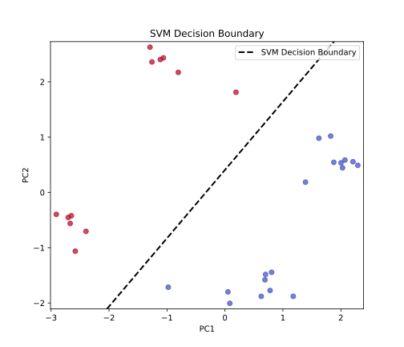

# Problem Set 4

## Problem 1 [Homework]: Cross-Validation

In supervised learning, machine learning models typically perform well on the data they were trained on. However, comparing predictions with actual labels from the training data cannot assess overfitting — whether the model simply memorized the training data. Therefore, available data is typically split into a larger training set and a smaller test set. The model trains only on the training set and is then evaluated on the test set.

For the following exercises, split the feature matrix `X` and target vector `y` into training sets `X_train` and `y_train` and test sets `X_test` and `y_test`. Use 80% of the data for training and 20% for testing. Can you implement a function that does this?

```admonish tip title="Tip" collapsible=true
You can use the [`np.random.permutation`](https://numpy.org/doc/stable/reference/random/generated/numpy.random.permutation.html) function to create a random permutation of the data point indices. Then, use the first 80% of these indices for the training set and the last 20% for the test set.
```

## Problem 2 [Homework]: Ridge Regression on the Aptamer Dataset

In the lecture, we performed linear regression to predict aptamer fluorescence intensity using hand-crafted molecular features such as molecular weight, number of hydrogen donors, and number of aromatic rings. While these features are physically interpretable, they did not yield accurate predictions. In this exercise, we will perform linear regression on the same dataset using Morgan fingerprints instead of hand-crafted features. You can download the dataset <a href="../codes/05-machine_learning/aptamer_fingerprints_regression_data.csv" download>here</a>.

```admonish info title="Note"
To reduce the number of features, we removed all constant columns (all zeros or all ones), as these are not informative for the model.
```

**(a) Linear Regression with Morgan Fingerprints**

Use your object-oriented implementation to perform linear regression on the dataset using Morgan fingerprints as features. What do you observe?

**(b) Moore-Penrose Pseudoinverse**

You will see that `numpy` will likely throw an error of the form `numpy.linalg.LinAlgError: Singular matrix`, indicating that the matrix $\bm{X}^T \bm{X}$ is not invertible. This means the columns of $\bm{X}$ are linearly dependent, which is not surprising, as we have more features than data points. Therefore, there are inifintely many solutions for the weights $\vec{w}$ to minimize the loss function. We have shown, however, that we can obtain the solution with the least norm with help of the Moore-Penrose pseudoinverse $\bm{X}^+$.

Show that the analytical solution for the weights in linear regression 

$$
\vec{w} = (\bm{X}^T \bm{X})^{-1} \bm{X}^T \bm{y}
$$

is equivalent to:

$$
\vec{w} = \bm{X}^+ \bm{y}
$$

Then use `np.linalg.pinv` to compute the pseudoinverse and use it to compute the weights for linear regression. Compute the MAE and plot the predicted vs. actual fluorescence intensity for the training and test data.

```admonish tip title="Tip" collapsible=true
You can show that $(\bm{X}^T \bm{X})^{+} \bm{X}^T = \bm{X}^+$ by checking the Moore-Penrose conditions for the matrix $\bm{B} := (\bm{X}^T \bm{X})^{+} \bm{X}^T$. Note that in the derivation of the optimal weights, we used the fact that the matrix $\bm{X}^T \bm{X}$ is invertible.

Implementation is straightforward — just replace the respective line in the `LinearRegression` class with the pseudoinverse.
```

**(c) Ridge Regression**

The use of the Moore-Penrose pseudoinverse already introduces some sort of regularization to the weight. A similar approach is Ridge regression, which is linear regression with a regularization term added to the loss function:

$$
\mathcal{L} = \frac{1}{2} \sum_{i=1}^{N} (y_i - \hat{f}(\vec{x}_i))^2 + \frac{\lambda}{2} \|\vec{w}\|^2 \,,
$$

where $\lambda$ is the regularization parameter.

First, show that the analytical solution for the optimal weights in Ridge regression is:

$$
\vec{w} = (\bm{X}^T \bm{X} + \lambda \bm{I})^{-1} \bm{X}^T \bm{y}
$$

Then implement Ridge regression as a class, just as you did for linear regression. Again, compute the MAE and plot the predicted vs. actual fluorescence intensity for the training and test data. Also, try different values of $\lambda$. How can you quantify the degree of overfitting?

```admonish tip title="Tip" collapsible=true
To prove the analytical solution for the weights, use the criteria for optimal weights of the loss function and solve for $\vec{w}$. First, express the Ridge regression model for all data points as a matrix-vector equation.

Again, implementation is straightforward — just replace the respective line in the `fit` method.
```

## Problem 3: Support Vector Machines

In the lecture, we implemented and used the Rosenblatt Perceptron to classify RNA aptamers according to their absorption behavoir. Not only did our data have to be linearly separable for the training to converge, we also saw that it did not provide us with a very robust decision boundary.

In this exercise, we will implement Support Vector Machines (SVM) to improve the performance of our classifier. SVMs are based on the idea of finding the best separating hyperplane between two classes by maximizing the smallest signed distance of the hyperplane to the data points, called the separation margin.

**(a) Derivation of the Point-to-Hyperplane Distance Formula**

Let $\vec{w} \in \mathbb{R}^{d+1}$ be given and define the hyperplane 

$$\mathcal{H} := \{ \vec{x} \in \mathbb{R}^{d+1} \,|\, \langle \vec{w}, \vec{x} \rangle = 0 \}\,.
$$

Show that the distance between a point $\vec{x}_0 \in \mathbb{R}^{d+1}$ and the hyperplane $\mathcal{H}$, defined as the minimum distance between the point and any point on the hyperplane:

$$
\mathrm{dist}(\vec{x}_0, \mathcal{H}) = \min \{ \|\vec{x}_0 - \vec{x}\| \,|\, \vec{x} \in \mathcal{H} \}\,,
$$

is given by:

$$
\mathrm{dist}(\vec{x}_0, \mathcal{H}) = \frac{|\langle \vec{w}, \vec{x}_0 \rangle|}{\|\vec{w}\|}\,.
$$

```admonish tip title="Tip" collapsible=true
Define

$$
\vec{x}_p := \vec{x}_0 - \frac{\langle \vec{w}, \vec{x}_0 \rangle}{\|\vec{w}\|^2} \vec{w}$$

and show that $\vec{x}_p \in \mathcal{H}$. Then, show that

$$
\min_{\vec{x} \in \mathcal{H}} \|\vec{x}_0 - \vec{x}\| = \|\vec{x}_0 - \vec{x}_p\| = \frac{|\langle \vec{w}, \vec{x}_0 \rangle|}{\|\vec{w}\|}\,.
$$

Use the binomial formula 

$$
\|\vec{x}_0 - \vec{x}\|^2 = \|\vec{x}_0 - \vec{x}_p\|^2 + 2 \langle \vec{x}_0 - \vec{x}_p, \vec{x}_p - \vec{x} \rangle + \|\vec{x}_p - \vec{x}\|^2 \,.
$$

```


**Solution:**

For the first statement, we show that $\langle \vec{w}, \vec{x}_p \rangle = 0$.

$$
\begin{align*}
\langle \vec{w}, \vec{x}_p \rangle &= \langle \vec{w}, \vec{x}_0 - \frac{\langle \vec{w}, \vec{x}_0 \rangle}{\|\vec{w}\|^2} \vec{w} \rangle \\
&= \langle \vec{w}, \vec{x}_0 \rangle - \frac{\langle \vec{w}, \vec{x}_0 \rangle}{\|\vec{w}\|^2} \langle \vec{w}, \vec{w} \rangle \\
&= \langle \vec{w}, \vec{x}_0 \rangle - \frac{\langle \vec{w}, \vec{x}_0 \rangle}{\|\vec{w}\|^2} \|\vec{w}\|^2 \\
&= 0
\end{align*}
$$

For the second statement, we use the binomial formula to show that $\|\vec{x}_0 - \vec{x}_p\|$ minimizes the distance between $\vec{x}_0$ and all $\vec{x} \in \mathcal{H}$:

$$
\begin{align*}
\|\vec{x}_0 - \vec{x}_p\|^2 &= \|\vec{x}_0 - \vec{x}_p\|^2 + 2 \langle \vec{x}_0 - \vec{x}_p, \vec{x}_p - \vec{x} \rangle + \|\vec{x}_p - \vec{x}\|^2 \\
&= \|\vec{x}_0 - \vec{x}_p\|^2 + 2 \langle \frac{\langle \vec{w}, \vec{x}_0 \rangle}{\|\vec{w}\|^2} \vec{w}, \vec{x}_p - \vec{x} \rangle + \|\vec{x}_p - \vec{x}\|^2 \\
&\geq \|\vec{x}_0 - \vec{x}_p\|^2 + 2 \frac{\langle \vec{w}, \vec{x}_0 \rangle}{\|\vec{w}\|^2} \underbrace{\langle \vec{w}, \vec{x}_p - \vec{x} \rangle}_{= 0} \\
&= \|\vec{x}_0 - \vec{x}_p\|^2 \,,
\end{align*}
$$

which concludes the proof by taking the square root. Therefore, it follows that

$$
\mathrm{dist}(\vec{x}_0, \mathcal{H}) = \|\vec{x}_0 - \vec{x}_p\| = \|\vec{x}_0 - \vec{x}_0 + \frac{\langle \vec{w}, \vec{x}_0 \rangle}{\|\vec{w}\|^2} \vec{w}\| = \frac{|\langle \vec{w}, \vec{x}_0 \rangle|}{\|\vec{w}\|}\,.
$$


**(b) Deriving the SVM Loss Function**

From (a), it follows that the signed distance of a datapoint $(\vec{x}_i, y_i)$ to the hyperplane is given by $\frac{y_i \langle \vec{w}, \vec{x}_i \rangle}{\|\vec{w}\|}$. Therefore, maximizing the separation margin is equivalent to minimizing $\|\vec{w}\|$ once we fix the scale of the numerator to 1. This is known as the *hard margin* SVM loss:

$$
\mathcal{L}_{\vec{w}} = \frac{1}{2} \|\vec{w}\|^2 \quad \text{s.t.} \quad y_i \langle \vec{w}, \vec{x}_i \rangle \geq 1 \quad \forall i = 1, \ldots, N \,.
$$

We can also relax the constraint of all datapoints being correctly classified, by introducing a *slack* variable $\xi_i \geq 0$, such that $y_i \langle \vec{w}, \vec{x}_i \rangle \geq 1 - \xi_i$. Intuitively, we want to minimize the sum of the slack variables, which we can then directly incorporate into the so-called *soft margin* SVM loss:

$$
\mathcal{L}_{\vec{w}} = \frac{1}{N} \sum_{i=1}^{N} \max(0, 1 - y_i \langle \vec{w}, \vec{x}_i \rangle) + \frac{\lambda}{2} \|\vec{w}\|^2 \,.
$$

where $\lambda$ is a regularization parameter. Here, the $\frac{1}{2} \|\vec{w}\|^2$ term maximizes the margin, and the $\sum_{i=1}^{N} \xi_i$ term penalizes points in proportion to their distance shortfall.

To optimize this loss using gradient descent, we need the gradient of this loss with respect to the weights $\vec{w}$. For the second term, this is easy, but for the first term, we can only compute subgradients for terms for which the data point is misclassified. Show that under these conditions, the update rule for a single datapoint is given by:

$$
\vec{w} \leftarrow \vec{w} - \eta \lambda \vec{w} \,.
$$

and for misclassified data points,

$$
\vec{w} \leftarrow \vec{w} - \eta \lambda \vec{w} + \eta y_i \vec{x}_i \,.
$$

where $\eta$ is the learning rate.

**(c) Implementing the SVM**

Implement the SVM by using the loss function and the update rule from above. Use the `Perceptron` class as a template. Then, apply the SVM to the aptamer dataset that we used for classification and plot the decision boundary. 

What happens if you randomly change the sign of the labels of one or two data points? How does $\lambda$ affect the decision boundary?

**Solution:**

Implementing the SVM is straightforward, if we take the `Perceptron` class as a template. The constructor is similar, but we need to add a regularization parameter $\lambda$ and a learning rate $\eta$. 

```python
{{#include ../codes/05-machine_learning/svm.py:svm_init}}
```

The `fit` method is also similar, but as we add a regularization term to the loss function, we need to update the weights accordingly. The weights are not only updated if the data point is misclassified, otherwise training would stop directly when all data points are correctly classified and the margin would be minimal.

```python
{{#include ../codes/05-machine_learning/svm.py:svm_fit}}
```

Data points are classified as `1` if $\langle \vec{w}, \vec{x}_i \rangle > 0$ and as `-1` otherwise. This is equivalent to the `Perceptron` class.

```python
{{#include ../codes/05-machine_learning/svm.py:svm_predict}}
```

Training the SVM on the aptamer dataset and plotting the decision boundary yields the following result:

