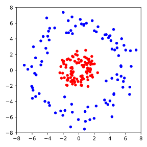

# Problem Set 4

## Problem 1 [Homework]: Cross-Validation

In supervised learning, machine learning models typically perform well on the data they were trained on. However, comparing predictions with actual labels from the training data cannot assess overfitting — whether the model simply memorized the training data. Therefore, available data is typically split into a larger training set and a smaller test set. The model trains only on the training set and is then evaluated on the test set.

For the following exercises, split the feature matrix `X` and target vector `y` into training sets `X_train` and `y_train` and test sets `X_test` and `y_test`. Use 80% of the data for training and 20% for testing. Can you implement a function that does this?

```admonish tip title="Tip" collapsible=true
You can use the [`np.random.permutation`](https://numpy.org/doc/stable/reference/random/generated/numpy.random.permutation.html) function to create a random permutation of the data point indices. Then, use the first 80% of these indices for the training set and the last 20% for the test set.
```

## Problem 2 [Homework]: Ridge Regression on the Aptamer Dataset

In the lecture, we performed linear regression to predict aptamer fluorescence intensity using hand-crafted molecular features such as molecular weight, number of hydrogen donors, and number of aromatic rings. While these features are physically interpretable, they did not yield accurate predictions. In this exercise, we will perform linear regression on the same dataset using Morgan fingerprints instead of hand-crafted features. You can download the dataset <a href="../../codes/05-machine_learning/aptamer_fingerprints_data.csv" download>here</a>.

```admonish info title="Note"
To reduce the number of features, we removed all constant columns (all zeros or all ones), as these are not informative for the model.
```

**(a) Linear Regression with Morgan Fingerprints**

Use your object-oriented implementation to perform linear regression on the dataset using Morgan fingerprints as features. What do you observe?

**(b) Moore-Penrose Pseudoinverse**

You will see that `numpy` will likely throw an error of the form `numpy.linalg.LinAlgError: Singular matrix`, indicating that the matrix $\bm{X}^T \bm{X}$ is not invertible. This means the columns of $\bm{X}$ are linearly dependent. This occurs because the finite dimension (e.g., 2048 bits) means multiple substructures must be encoded in the same bit, which directly induces dependencies between bits. To solve this problem, we can use the Moore-Penrose pseudoinverse $\bm{X}^+$, which you learned about in the SVD lecture.

Show that the analytical solution for the weights in linear regression 

$$
\vec{w} = (\bm{X}^T \bm{X})^{-1} \bm{X}^T \bm{y}
$$

is equivalent to:

$$
\vec{w} = \bm{X}^+ \bm{y}
$$

Then use `np.linalg.pinv` to compute the pseudoinverse and use it to compute the weights for linear regression. Compute the MAE and plot the predicted vs. actual fluorescence intensity for the training and test data.

```admonish tip title="Tip" collapsible=true
You can show that $(\bm{X}^T \bm{X})^{+} \bm{X}^T = \bm{X}^+$ by checking the Moore-Penrose conditions for the matrix $\bm{B} := (\bm{X}^T \bm{X})^{+} \bm{X}^T$. Also, use the fact that the matrix $\bm{X}^T \bm{X}$ is invertible.

Implementation is straightforward — just replace the respective line in the `LinearRegression` class with the pseudoinverse.
```

**(c) Ridge Regression**

To reduce overfitting risk, we can use Ridge regression. Remember that Ridge regression is linear regression with a regularization term added to the loss function:

$$
\mathcal{L} = \frac{1}{2} \sum_{i=1}^{N} (y_i - \hat{f}(\vec{x}_i))^2 + \frac{\lambda}{2} \|\vec{w}\|^2 \,,
$$

where $\lambda$ is the regularization parameter.

First, show that the analytical solution for the optimal weights in Ridge regression is:

$$
\vec{w} = (\bm{X}^T \bm{X} + \lambda \bm{I})^{-1} \bm{X}^T \bm{y}
$$

Then implement Ridge regression as a class, just as you did for linear regression. Again, compute the MAE and plot the predicted vs. actual fluorescence intensity for the training and test data. Also, try different values of $\lambda$. How can you quantify the degree of overfitting?

```admonish tip title="Tip" collapsible=true
To prove the analytical solution for the weights, use the criteria for optimal weights of the loss function and solve for $\vec{w}$. First, express the Ridge regression model for all data points as a matrix-vector equation.

Again, implementation is straightforward — just replace the respective line in the `fit` method.
```

## Problem 3: Support Vector Machines

In the lecture, we implemented and used the Rosenblatt Perceptron to classify RNA aptamers according to their absorption behavoir. Not only did our data have to be linearly separable for the training to converge, we also saw that it did not provide us with a very robust decision boundary.

In this exercise, we will implement Support Vector Machines (SVM) to improve the performance of our classifier. SVMs are based on the idea of finding the best separating hyperplane between two classes by maximizing the distance of the hyperplane to the closest data points from each class.

**(a) Derivation of the Point-to-Hyperplane Distance Formula**

Let $\vec{w} \in \mathbb{R}^{d+1}$ be given and define the hyperplane 

$$\mathcal{H} := \{ \vec{x} \in \mathbb{R}^{d+1} \,|\, \langle \vec{w}, \vec{x} \rangle = 0 \}\,.
$$

Show that the distance between a point $\vec{x}_0 \in \mathbb{R}^{d+1}$ and the hyperplane $\mathcal{H}$, defined as the minimum distance between the point and any point on the hyperplane:

$$
\mathrm{dist}(\vec{x}_0, \mathcal{H}) = \min \{ \|\vec{x}_0 - \vec{x}\| \,|\, \vec{x} \in \mathcal{H} \}\,,
$$

is given by:

$$
\mathrm{dist}(\vec{x}_0, \mathcal{H}) = \frac{|\langle \vec{w}, \vec{x}_0 \rangle|}{\|\vec{w}\|}\,.
$$

```admonish tip title="Tip" collapsible=true
Define

$$
\vec{x}_p := \vec{x}_0 - \frac{\langle \vec{w}, \vec{x}_0 \rangle}{\|\vec{w}\|^2} \vec{w}$$

and show that $\vec{x}_p \in \mathcal{H}$. Then, show that

$$
\min_{\vec{x} \in \mathcal{H}} \|\vec{x}_0 - \vec{x}\| = \|\vec{x}_0 - \vec{x}_p\| = \frac{|\langle \vec{w}, \vec{x}_0 \rangle|}{\|\vec{w}\|}\,.
$$

Use the binomial formula 

$$
\|\vec{x}_0 - \vec{x}\|^2 = \|\vec{x}_0 - \vec{x}_p\|^2 + 2 \langle \vec{x}_0 - \vec{x}_p, \vec{x}_p - \vec{x} \rangle + \|\vec{x}_p - \vec{x}\|^2 \,.
$$

```

<!-- 
**Solution:**

For the first statement, we show that $\langle \vec{w}, \vec{x}_p \rangle = 0$.

$$
\begin{align*}
\langle \vec{w}, \vec{x}_p \rangle &= \langle \vec{w}, \vec{x}_0 - \frac{\langle \vec{w}, \vec{x}_0 \rangle}{\|\vec{w}\|^2} \vec{w} \rangle \\
&= \langle \vec{w}, \vec{x}_0 \rangle - \frac{\langle \vec{w}, \vec{x}_0 \rangle}{\|\vec{w}\|^2} \langle \vec{w}, \vec{w} \rangle \\
&= \langle \vec{w}, \vec{x}_0 \rangle - \frac{\langle \vec{w}, \vec{x}_0 \rangle}{\|\vec{w}\|^2} \|\vec{w}\|^2 \\
&= 0
\end{align*}
$$

For the second statement, we use the binomial formula to show that $\|\vec{x}_0 - \vec{x}_p\|$ minimizes the distance between $\vec{x}_0$ and all $\vec{x} \in \mathcal{H}$:

$$
\begin{align*}
\|\vec{x}_0 - \vec{x}_p\|^2 &= \|\vec{x}_0 - \vec{x}_p\|^2 + 2 \langle \vec{x}_0 - \vec{x}_p, \vec{x}_p - \vec{x} \rangle + \|\vec{x}_p - \vec{x}\|^2 \\
&= \|\vec{x}_0 - \vec{x}_p\|^2 + 2 \langle \frac{\langle \vec{w}, \vec{x}_0 \rangle}{\|\vec{w}\|^2} \vec{w}, \vec{x}_p - \vec{x} \rangle + \|\vec{x}_p - \vec{x}\|^2 \\
&\geq \|\vec{x}_0 - \vec{x}_p\|^2 + 2 \frac{\langle \vec{w}, \vec{x}_0 \rangle}{\|\vec{w}\|^2} \underbrace{\langle \vec{w}, \vec{x}_p - \vec{x} \rangle}_{= 0} \\
&= \|\vec{x}_0 - \vec{x}_p\|^2 \,,
\end{align*}
$$

which concludes the proof by taking the square root. Therefore, it follows that

$$
\mathrm{dist}(\vec{x}_0, \mathcal{H}) = \|\vec{x}_0 - \vec{x}_p\| = \|\vec{x}_0 - \vec{x}_0 + \frac{\langle \vec{w}, \vec{x}_0 \rangle}{\|\vec{w}\|^2} \vec{w}\| = \frac{|\langle \vec{w}, \vec{x}_0 \rangle|}{\|\vec{w}\|}\,.
$$
 -->

<!-- 


**(b) Implementierung der SVM**

Implementieren Sie die SVM durch die Klasse `SupportVectorMachine` anhand der 
Verlustfunktion in Gl. {{eqref: eq:svm_loss}} sowie die Update-Regel danach.
Entnehmen Sie den Konstruktor aus den folgenden Code-Block:
```python
{{#include ../codes/05-machine_learning/exercise_05_2.py:svm_init}}
```
Diese Klasse enthält einige zusätzliche Argumente und Attribute im Vergleich
zur Klasse `Perceptron` aus der Vorlesung. Das Argument `lam` ist $\lambda$
aus Gl. {{eqref: eq:svm_loss}}. Das Attribut `losses` soll der Wert der
Verlustfunktion für jede Epochen speichern, während das Attribut `margins`
einen Maß für den Abstand der Datenpunkte zur Hyperebene, und zwar
$2 / \|\vec{w}\|$, speichern soll. 

*Tipp: Sie müssen nur Kleinigkeiten der Methode `fit` von `Perceptron` 
anpassen. Die Methoden `net_input` und `predict` können Sie unverändert
übernehmen.*

**(c) Anwendung der SVM**

Trainieren Sie eine SVM mit dem gleichen Datensatz wie in der Vorlesung,
also die Gesichter von zwei Personen auf zwei Hauptkomponenten. Verwenden
Sie dabei $\tau = 0.01$ und $\lambda = 10$. Führen Sie das Training für
50 Epochen durch und plotten Sie die Datenpunkte mit der Entscheidungsgrenze,
sowie die Verlustfunktion über die Epochen.

**(d) Kernel-Trick**

Bislang haben wir immer angenommen, dass die Daten linear separierbar sind.
Für Daten, die näherungsweise linear separierbar sind, können wir die 
Verlustfunktion der SVM etwas modifizieren, sodass eine approximative
Trennung möglich ist. Haben wir allerdings Daten mit stark nichtlinearen
Grenzen, wie z.B. in der folgenden Abbildung, so ist die SVM in ihrer
klassischen Form nicht anwendbar.

<p align="center">
  
</p>

In solchen Fällen können wir den sogenannten Kernel-Trick anwenden. Dabei
wird das Standardskalarprodukt $\langle \cdot, \cdot \rangle$ durch 
eine symmetrische Funktion $K(\cdot, \cdot)$ ersetzt, die als Kernfunktion
(engl. *kernel function*) bezeichnet wird. Das führt allerdings zu einer
komplexeren Optimierungsaufgabe, die wir hier nicht behandeln.

In der Tat ist dieser Ansatz aber äquivalent dazu, die Datenpunkte
$\vec{x}_ i \in \mathbb{R}^n$ in einen höherdimensionalen Raum
$\mathbb{R}^m$ einzubetten, sodass die Datenpunkte 
$\phi(\vec{x}_ i) \in \mathbb{R}^m$ linear separierbar sind. 

Wir betrachten die folgende Einbettung:
$$
  \phi: \mathbb{R}^2 \to \mathbb{R}^3\,,\quad
  (x_1, x_2) \mapsto (x_1, x_2, x_1^2 + x_2^2)\,.
$$
Die Ebene $0 = b + x_1^2 + x_2^2$ mit $b \leq 0$ ist die Kreisgleichung
in $\mathbb{R}^2$. Die neue Dimension könnte uns also helfen, die Daten
in der obigen Abbildung zu separieren.

Laden Sie die Daten aus der obigen Abbildung
<a href="../codes/05-machine_learning/circles.csv" download>hier</a>
herunter und verwenden Sie die oben beschriebene Einbettung $\phi$. 
Trainieren Sie die SVM an den eingebetteten Daten mit
$\tau = 0.005$ und $\lambda = 10$ für 200 Epochen. Plotten Sie die Datenpunkte
mit den ursprünglichen Koordinaten in $\mathbb{R}^2$ sowie die Projektion
der Entscheidungsgrenze in $\mathbb{R}^2$. Plotten Sie zudem die 
Entwicklung der Verlustfunktion über die Epochen.


## Aufgabe 3: $k$-Means Clustering


In Analogie zu einer Verlustfunktion im überwachten Lernen, kann für den 
$k$-Means-Algorithmus gezeigt werden, dass er die so genannte *Cluster-Energie*

$$
  E(\mathbf{C}, \mathbf{m}) = \sum_{k=1}^{K} \sum_{\vec{x}_i \in C_k} \|\vec{x}_i - \vec{m}_k\|^2
$$

minimiert. 

**(a) $k$-Means mit variabler Anzahl an Clustern**

Nutzen Sie diese Cluster-Energie, um den $k$-Means-Algorithmus zu modifizieren, 
sodass die Anzahl der Cluster $K$ während des Trainings angepasst wird. Dazu können Sie
z.B. nach jeder Iteration zufällige Cluster aufteilen oder zusammenführen, und diese 
neue Zuweisung der Datenpunkte akzeptieren, wenn die Cluster-Energie reduziert wird. 
Was beobachten Sie?

**(b) Optimale Anzahl an Clustern**

Überlegen Sie, für welche Anzahl an Clustern die Cluster-Energie minimal wird.
Wie nennt man den dabei auftretenden Effekt und wie kann man ihn verhindern?
- ANCHOR_END: aufgabe_3 - 
 -->


