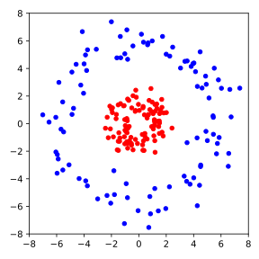

# Übung 5

## Aufgabe 1: Lineare Regression

<!--- ANCHOR: aufgabe_1 --->

In der Vorlesung haben Sie eine multilineare Regression an zwei Features
des Wine Quality Datensatzes durchgeführt. In dieser Aufgabe wollen wir
das Thema näher betrachten.

**(a) Analytische Lösung der Multilinearen Regression**

In Kapitel [5.1](../05-machine_learning/01-supervised_learning.md#regression) 
wurde die analytische Lösung der multilinearen Regression in 
Gl. {{eqref: eq:multilinear_regression_solution}} als
$$
\hat{\theta} = (\bm{X}^T \bm{X})^{-1} \bm{X}^T \vec{y}\,,
$$
gegeben. In Kapitel [4.5](../04-evd_and_svd/05-linear_equations.md) wurde in
Gl. {{eqref: eq:multilinear_regression_pinv}} die Lösung aber als
$$
\hat{\theta} = \bm{X}^+ \vec{y}
$$
angegeben. Zeigen Sie, dass die beiden Lösungen äquivalent sind.

*Hinweis: Sie können $(\bm{X}^T \bm{X})^{+} \bm{X}^T = \bm{X}^+$ zeigen, 
indem Sie die Moore-Penrose-Bedingungen 
(Gl. {{eqref: eq:mp_conditions_general_inverse}} - {{eqref: eq:mp_conditions_symmetry_apat}})
für die Matrix $\bm{B} := (\bm{X}^T \bm{X})^{+} \bm{X}^T$ überprüfen. 
Nutzen Sie zudem die Tatsache, dass die Matrix $\bm{X}^T \bm{X}$ invertierbar ist.*

<!--
Lösung:
```python
{{#include ../codes/05-machine_learning/exercise_05_01.py:a}}
```
-->

**(b) Multilineare Regression am Wein Quality Dataset**

In der Vorlesung haben wir nur die Features `alcohol` und `volatile acidity` 
für die multilineare Regression verwendet. Das war zwar gut für die
spätere Visualisierung, aber das Modell beschreibt den Datensatz nur mit
unzureichender Genauigkeit. Mit mehr Features können wir eine bessere
Vorhersage treffen. Führen Sie eine multilineare Regression an allen
Features des Wine Quality Datensatzes durch. Berechnen Sie anschließend die
mittlere quadratische Abweichung (engl. *Mean Squared Error*, MSE) dieser
Regression sowie der Regression an den beiden Features `alcohol` und
`volatile acidity`. Vergleichen Sie die beiden Ergebnisse.

<!--
Lösung:
```python
{{#include ../codes/05-machine_learning/exercise_05_01.py:b}}
```
-->

**(c) Bestimmtheitsmaß**

Während der MSE uns eine quantitative Aussage über die Qualität der
Regression gibt, ist die Interpretation des MSE nur anhand
der Daten bzw. des Kontexts möglich. Ein alternatives Maß ist das
Bestimmtheitsmaß (engl. *coefficient of determination*), auch
als $R^2$ notiert, dessen Wert zwischen 0 und 1 liegt. Damit ist eine
kontextunabhängige Interpretation möglich. Für die multilineare Regression
ist $R^2$ definiert als
$$
  R^2 = \frac{
    \left[ \sum_{i=1}^{N} (y_i - \bar{y}) (\hat{y}_i - \bar{y}) \right]^2
  }{
    \left[ \sum_{i=1}^{N} (y_i - \bar{y})^2 \right]
    \left[ \sum_{i=1}^{N} (\hat{y}_i - \bar{y})^2 \right]
  }\,,
$$
wobei $y_i$ die tatsächlichen Labels, $\hat{y}_i$ die vorhergesagten Labels
und $\bar{y}$ der Mittelwert der Labels sind. 

Berechnen Sie das Bestimmtheitsmaß für die multilineare Regression an
allen Features des Wine Quality Datensatzes sowie für die Regression
an den beiden Features `alcohol` und `volatile acidity`. Vergleichen Sie
die beiden Ergebnisse.

<!--
Lösung:
```python
{{#include ../codes/05-machine_learning/exercise_05_01.py:c}}
```
-->

<!--- ANCHOR_END: aufgabe_1 --->

## Aufgabe 2: Support Vector Machines

<!--- ANCHOR: aufgabe_2 --->
In der Vorlesung haben wir die Support Vector Machines (SVM) als eine 
robustere Erweiterung des Rosenblatt-Perzeptrons kennengelernt. In dieser
Aufgaben sollen Sie die SVM implementieren und anwenden.

**(a) Herleitung der Gleichung für den Punkt-Hyperebenen-Abstand**

Seien $\vec{w} \in \mathbb{R}^n$ und $b \in \mathbb{R}$ gegeben und definiere
die Hyperebene 
$\mathcal{H} := \{ \vec{x} \in \mathbb{R}^n \,|\, \langle \vec{w}, \vec{x} \rangle + b = 0 \}$.
Zeigen Sie, dass der Abstand zwischen einem Punkt $\vec{x}_0 \in \mathbb{R}^n$
und der Hyperebene $\mathcal{H}$, definiert als
$$
\mathrm{dist}(\vec{x}_0, \mathcal{H}) = \min \{ \|\vec{x}_0 - \vec{x}\| \,|\, \vec{x} \in \mathcal{H} \}\,,
$$
also als der minimale Abstand zwischen dem Punkt und einem Punkt auf der 
Hyperebene, gilt
$$
\mathrm{dist}(\vec{x}_0, \mathcal{H}) = \frac{|\langle \vec{w}, \vec{x}_0 \rangle + b|}{\|\vec{w}\|}\,.
$$

*Tipp: Zeigen Sie, dass 
$\vec{x}_p := \vec{x}_0 - \frac{\langle \vec{w}, \vec{x}_0 \rangle + b}{\|\vec{w}\|^2} \vec{w}$
den Abstand realisiert, d.h. $\vec{x}_p \in \mathcal{H}$ und
$\|\vec{x}_0 - \vec{x}_p\| \leq \|\vec{x}_0 - \vec{x}\|$ für alle
$\vec{x} \in \mathcal{H}$. Die erste Aussage folgt leicht aus der
Definition von $\vec{x}_p$. Für die zweite Aussage können Sie die
binomische Formel
$$
  \|\vec{x}_0 - \vec{x}\|^2 = \|\vec{x}_0 - \vec{x}_p\|^2 
    + \|\vec{x}_p - \vec{x}\|^2 
    + 2 \langle \vec{x} - \vec{x}_p, \vec{x}_p - \vec{x}_0 \rangle
$$
verwenden.*

**(b) Implementierung der SVM**

Implementieren Sie die SVM durch die Klasse `SupportVectorMachine` anhand der 
Verlustfunktion in Gl. {{eqref: eq:svm_loss}} sowie die Update-Regel danach.
Entnehmen Sie den Konstruktor aus den folgenden Code-Block:
```python
{{#include ../codes/05-machine_learning/exercise_05_2.py:svm_init}}
```
Diese Klasse enthält einige zusätzliche Argumente und Attribute im Vergleich
zur Klasse `Perceptron` aus der Vorlesung. Das Argument `lam` ist $\lambda$
aus Gl. {{eqref: eq:svm_loss}}. Das Attribut `losses` soll der Wert der
Verlustfunktion für jede Epochen speichern, während das Attribut `margins`
einen Maß für den Abstand der Datenpunkte zur Hyperebene, und zwar
$2 / \|\vec{w}\|$, speichern soll. 

*Tipp: Sie müssen nur Kleinigkeiten der Methode `fit` von `Perceptron` 
anpassen. Die Methoden `net_input` und `predict` können Sie unverändert
übernehmen.*

**(c) Anwendung der SVM**

Trainieren Sie eine SVM mit dem gleichen Datensatz wie in der Vorlesung,
also die Gesichter von zwei Personen auf zwei Hauptkomponenten. Verwenden
Sie dabei $\tau = 0.01$ und $\lambda = 10$. Führen Sie das Training für
50 Epochen durch und plotten Sie die Datenpunkte mit der Entscheidungsgrenze,
sowie die Verlustfunktion über die Epochen.

**(d) Kernel-Trick**

Bislang haben wir immer angenommen, dass die Daten linear separierbar sind.
Für Daten, die näherungsweise linear separierbar sind, können wir die 
Verlustfunktion der SVM etwas modifizieren, sodass eine approximative
Trennung möglich ist. Haben wir allerdings Daten mit stark nichtlinearen
Grenzen, wie z.B. in der folgenden Abbildung, so ist die SVM in ihrer
klassischen Form nicht anwendbar.

<p align="center">
  
</p>

In solchen Fällen können wir den sogenannten Kernel-Trick anwenden. Dabei
wird das Standardskalarprodukt $\langle \cdot, \cdot \rangle$ durch 
eine symmetrische Funktion $K(\cdot, \cdot)$ ersetzt, die als Kernfunktion
(engl. *kernel function*) bezeichnet wird. Das führt allerdings zu einer
komplexeren Optimierungsaufgabe, die wir hier nicht behandeln.

In der Tat ist dieser Ansatz aber äquivalent dazu, die Datenpunkte
$\vec{x}_ i \in \mathbb{R}^n$ in einen höherdimensionalen Raum
$\mathbb{R}^m$ einzubetten, sodass die Datenpunkte 
$\phi(\vec{x}_ i) \in \mathbb{R}^m$ linear separierbar sind. 

Wir betrachten die folgende Einbettung:
$$
  \phi: \mathbb{R}^2 \to \mathbb{R}^3\,,\quad
  (x_1, x_2) \mapsto (x_1, x_2, x_1^2 + x_2^2)\,.
$$
Die Ebene $0 = b + x_1^2 + x_2^2$ mit $b \leq 0$ ist die Kreisgleichung
in $\mathbb{R}^2$. Die neue Dimension könnte uns also helfen, die Daten
in der obigen Abbildung zu separieren.

Laden Sie die Daten aus der obigen Abbildung
<a href="../codes/05-machine_learning/circles.csv" download>hier</a>
herunter und verwenden Sie die oben beschriebene Einbettung $\phi$. 
Trainieren Sie die SVM an den eingebetteten Daten mit
$\tau = 0.005$ und $\lambda = 10$ für 200 Epochen. Plotten Sie die Datenpunkte
mit den ursprünglichen Koordinaten in $\mathbb{R}^2$ sowie die Projektion
der Entscheidungsgrenze in $\mathbb{R}^2$. Plotten Sie zudem die 
Entwicklung der Verlustfunktion über die Epochen.
<!--- ANCHOR_END: aufgabe_2 --->


## Aufgabe 3: $k$-Means Clustering

<!--- ANCHOR: aufgabe_3 --->
In Analogie zu einer Verlustfunktion im überwachten Lernen, kann für den 
$k$-Means-Algorithmus gezeigt werden, dass er die so genannte *Cluster-Energie*

$$
  E(\mathbf{C}, \mathbf{m}) = \sum_{k=1}^{K} \sum_{\vec{x}_i \in C_k} \|\vec{x}_i - \vec{m}_k\|^2
$$

minimiert. 

**(a) $k$-Means mit variabler Anzahl an Clustern**

Nutzen Sie diese Cluster-Energie, um den $k$-Means-Algorithmus zu modifizieren, 
sodass die Anzahl der Cluster $K$ während des Trainings angepasst wird. Dazu können Sie
z.B. nach jeder Iteration zufällige Cluster aufteilen oder zusammenführen, und diese 
neue Zuweisung der Datenpunkte akzeptieren, wenn die Cluster-Energie reduziert wird. 
Was beobachten Sie?

**(b) Optimale Anzahl an Clustern**

Überlegen Sie, für welche Anzahl an Clustern die Cluster-Energie minimal wird.
Wie nennt man den dabei auftretenden Effekt und wie kann man ihn verhindern?
<!--- ANCHOR_END: aufgabe_3 --->

