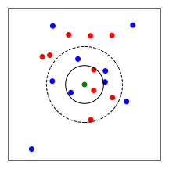

# Klausurvorbereitung

Die folgenden Aufgaben sollen Ihnen dabei helfen, sich auf die Klausur vorzubereiten. 
Die Aufgaben sind so gewählt, dass sie den Prüfungsfragen ähneln und Themen aus 
den Übungen und Vorlesungen abdecken.

## Aufgabe 1: Code-Snippets

Wählen Sie für die folgenden Code-Snippets die erwartete Ausgabe aus.

| a) | b) | c) |
|----|----|----|
| <pre><code>x = [a for a in 'pkc']<br>y = len(x)<br>print(y ** 2)</code></pre>   | <pre><code>x = 99<br>y = x // -10<br>z = int(y) ** 2<br>print(z)</code></pre> | <pre><code>x = [[3]] * 2<br>x[1].append(2)<br>y = np.array(x)<br>print(y)</code></pre> |
| &#9744; <code>3</code>     | &#9744; <code>98.01</code> | &#9744; <code>[[3], [3, 2]]</code> |
| &#9744; <code>6</code>     | &#9744; <code>81</code>    | &#9744; <code>[[6], 2]</code> |
| &#9744; <code>9</code>     | &#9744; <code>-81</code>   | &#9744; <code>[[3], 2]</code> |
| &#9744; <code>Error</code> | &#9744; <code>100</code>   | &#9744; <code>Error</code> |

## Aufgabe 2: Euler-Verfahren

In der folgenden Implementierung des Euler-Verfahrens haben sich **fünf Fehler** 
eingeschlichen. Finden Sie die Fehler und korrigieren Sie diese.

```python
{{#include ../codes/07-summary/exam_preparation.py:euler_errors}}
```

<!-- 
1: return y_n + h * dydx(x_n, y_n)
2: x0 + np.arange(0, nsteps + 1) * h
3: y = np.zeros(nsteps + 1)
4: y[0] = y0 missing
5: y[i + 1] = euler_step(x[i], y[i], h, dydx)
 -->

## Aufgabe 3: $k$-Nearest Neighbors

Der $k$-Nearest Neighbors (KNN) Algorithmus ist ein einfacher Algorithmus,
den wir hier für Klassifikationsprobleme implementieren, der aber auch für 
Regressionsprobleme verwendet werden kann. Er ist ein 
parameterfreier Algorithmus, das bedeutet, dass er keine Trainingsphase hat. 

Für einen gegebenen Punkt $\vec{x}_i$ sagt der KNN-Algorithmus die Klasse $y_i$ 
voraus, indem die $k$ 
nächsten Nachbarn von $\vec{x}_i$ im Trainingsdatensatz bestimmt werden. 
Die Klasse von $\vec{x}_i$ ist dann diejenige Klasse, die am häufigsten unter den $k$ 
nächsten Nachbarn vorkommt. Dies ist im folgenden Bild veranschaulicht, wobei 
für $k = 3$ die Klasse $y_i =$ *rot* ist.



Vervollständigen Sie die Methode `predict` der Klasse `kNN_Classifier` in der folgenden 
Implementierung.

```python
{{#include ../codes/07-summary/exam_preparation.py:knn_incomplete}}
```

Das Model soll wie folgt verwendet werden:

```python
{{#include ../codes/07-summary/exam_preparation.py:knn_example}}
```
