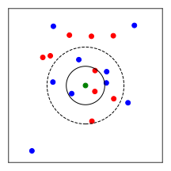

# Klausurvorbereitung

Die folgenden Aufgaben sollen Ihnen dabei helfen, sich auf die Klausur vorzubereiten. 
Die Aufgaben sind so gewählt, dass sie den Prüfungsfragen ähneln und Themen aus 
den Übungen und Vorlesungen abdecken.
Die eigentliche Klausur wird jedoch etwas länger sein und mehr Aufgaben enthalten.

## Aufgabe 1: Kurze Aufgaben zum Aufwärmen

<!--- ANCHOR: aufgabe_1 --->
Kreuzen Sie die zu erwartende Ausgabe der folgenden Code-Blöcke an, 
wobei jeweils nur eine Antwortmöglichkeit richtig ist.

<div style="max-width: 300px; margin: 1em auto; 
    padding: 1em; border: 1px solid #ccc; border-radius: 4px; text-align: left;"

**(a)**

```python
x = [1 , 2 , 3 , 4 , 5 , 6]
y = x[::-2]
print(y)
```

<label><input type="radio" name="1a">`[6, 4, 2]`</label>

<label><input type="radio" name="1a">`[6, 5, 4]`</label>

<label><input type="radio" name="1a">`[6, 3, 1]`</label>

<label><input type="radio" name="1a">Error</label>

</div>

<div style="max-width: 300px; margin: 1em auto; 
    padding: 1em; border: 1px solid #ccc; border-radius: 4px; text-align: left;"

**(b)**

```python
x = [1, 2, 3]
y = [4, 5, 6]
z = [a + b for a, b in zip (x, y)]
print(z)
```

<label><input type="radio" name="1b">`[1, 2, 3, 4, 5, 6]`</label>

<label><input type="radio" name="1b">`[5, 7, 9]`</label>

<label><input type="radio" name="1b">`[4, 5, 6]`</label>

<label><input type="radio" name="1b">Error</label>

</div>

<div style="max-width: 300px; margin: 1em auto; 
    padding: 1em; border: 1px solid #ccc; border-radius: 4px; text-align: left;"

**(c)**

```python
import numpy as np
x = np.array([1, 2, 3])
y = np.array([4, 5, 6])
z = np.dot(x, y)
print(z)
```

<label><input type="radio" name="1c">`32`</label>

<label><input type="radio" name="1c">`77`</label>

<label><input type="radio" name="1c">`36`</label>

<label><input type="radio" name="1c">Error</label>

</div>

<!--- ANCHOR_END: aufgabe_1 --->

## Aufgabe 2: Gradientenverfahren

<!--- ANCHOR: aufgabe_2 --->
Ein Student soll das Gradientenverfahren implementieren und damit ein 
**lokales** Minimum eines Doppelmuldenpotentials finden. Ihm wurde die 
Iterationsgleichung des Gradientenverfahrens
$$
    x_{n+1} = x_n - \tau \nabla f(x_n)
$$
ausgehend vom Startpunkt $x_0$ mit der Schrittlänge $\tau$, 
sowie die Definition des zu untersuchenden Doppelmuldenpotentials
$$
    f(x) = x^6 -2x^2 - \frac{1}{4} x
$$
gegeben (vgl. Abb. \ref{fig:double_well}). Da er aber die Vorlesung 
nur selten besuchte, ist sein Code fehlerhaft. 

Finden und korrigieren Sie alle **5 fehlerhaften Zeilen**
(Sowohl Syntaxfehler als auch inhaltliche Fehler) im folgenden Code-Block.

```python
def double_well_gradient(x):  # x: float
    grad = 6 * x**5 - 2 * x - 0.25
    return grad

def gradient_descent(func_grad, x0, tau=0.01, maxgrad=1e-6, maxiter=500)
    x = 0
    converged = False
    
    for _ in range(0, maxiter):
        grad = func_grad(x)
        x = x - tau * grad
        if grad < maxgrad:
            converged = True
            break
    
        return x, converged

x_opt, converged = gradient_descent(double_well_gradient, -1.2)
print("Ein lokales Minimum liegt bei x = " , x_opt)  # x_opt = -0.8872
```

<!--- ANCHOR_END: aufgabe_2 --->

## Aufgabe 3: $k$-Nearest Neighbors

<!--- ANCHOR: aufgabe_3 --->
Der $k$-Nearest Neighbors (kNN) Algorithmus ist ein einfacher Algorithmus 
für Klassifikationsprobleme, der aber auch für 
Regressionsprobleme verwendet werden kann. Er ist ein 
parameterfreier Algorithmus, das bedeutet, dass er keine Trainingsphase hat. 

Für einen gegebenen Punkt $\vec{x}_i$ sagt der kNN-Algorithmus die Klasse $y_i$ 
voraus, indem die $k \in \mathbb{N}$ nächsten Nachbarn von $\vec{x}_i$ im 
Trainingsdatensatz basierend auf ihrer euklidischen Distanz zu $\vec{x}_i$ bestimmt werden.
Die Klasse $y_i$ von $\vec{x}_i$ ist dann diejenige Klasse, die unter den $k$ 
nächsten Nachbarn am häufigsten vorkommt. Dies ist im folgenden Bild für zwei Klassen 
veranschaulicht, wobei für $k = 3$ (innerer schwarzer Kreis) die Klasse $y_i$ 
des grünen Punktes als *rot* vorhergesagt wird.

<figure align="center">
    
</figure>

**(a)** 
Welche Werte für $k$ sind mehr oder weniger sinnvoll, wenn die Anzahl der Klassen 
zwei ist? Begründen Sie Ihre Antwort.

**(b)**
Vervollständigen Sie die Methode `predict` der Klasse `kNNClassifier` 
in der folgenden Implementierung.

```python
{{#include ../codes/07-summary/exam_preparation.py:knn_incomplete}}
```

Das Model soll wie folgt verwendet werden:

```python
{{#include ../codes/07-summary/exam_preparation.py:knn_example}}
```

**(c)**
Ist eine lineare Separationsgrenze zwischen den Klassen notwendig, 
um den kNN-Algorithmus einzusetzen? Begründen Sie Ihre Antwort
mit einer Skizze eines Beispieldatensatzes aus zwei Klassen
und einem zu klassifizierenden Punkt.

Der kNN-Algorithmus wählt nur die $k$ nächsten Nachbarn aus,
und lässt diese eine Abstimmung über die Klasse des neuen Punktes treffen.
Dabei hat jeder Nachbar eine Stimme. Man könnte aber auch
meinen, dass die näheren Nachbarn mehr Gewicht haben sollten
als die weiter entfernten Nachbarn.
Das führt zum distanzgewichteten kNN-Algorithmus.
Hierbei wird die Stimme des $j$-ten Nachbarn z.B. mit dem Faktor
$$
    w_j = \exp\left(-\frac{d(\vec{x}_i, \vec{x}_j)^2}{2 \sigma^2}\right)
$$
gewichtet, wobei $d(\vec{x}_i, \vec{x}_j)$ die euklidische Distanz zwischen 
dem zu klassifizierenden Punkt $\vec{x}_i$ und dem $j$-ten Nachbarn $\vec{x}_j$ ist,
und $\sigma$ genau so wie $k$ bei der Konstruktion des Modells festzulegen ist.

**(d)**
Vervollständigen Sie die Methode `predict` der Klasse `kNNWeightedClassifier`
in der folgenden Implementierung.

```python
{{#include ../codes/07-summary/exam_preparation.py:knn_weighted_incomplete}}
```
Der Aufruf der `predict`-Methode soll identisch sein wie bei der Klasse `kNNClassifier`.


<!-- 
Lösung:
```
{{#include ../codes/07-summary/exam_preparation.py:knn_complete}}
```
 -->

<!--- ANCHOR_END: aufgabe_3 --->
